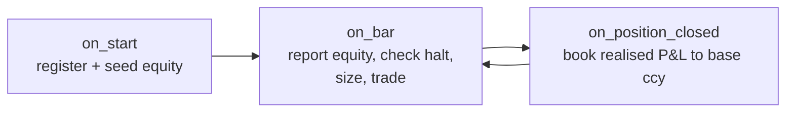

# B. Integration-contract reference card

The one page to keep open while writing a live strategy. Every claim here is
explained in [The strategy class & the integration contract](../part4-research-to-prod/strategy-class-contract.md);
this is the card, not the lecture. The contract is deliberately tiny (**three
lifecycle touches and a handful of call signatures**) because a small contract
is one you can audit in a glance and one that's hard to half-implement.

!!! tip "How to read this card"
    All numbers are **illustrative**. Anything that constitutes edge (lookbacks,
    thresholds, vol targets, tier boundaries) is shown as a named constant
    (`VOL_TARGET`, `MAX_LEVERAGE`, `BARS_PER_YEAR[...]`), not a deployable value;
    don't infer the live values from the examples. Instrument and account
    identifiers are generic too (`a USD-quoted equity UCITS ETF`, `an account id
    of the form DUxxxxxxx`). Copy the *shape*; supply your own values.

---

## The three-touch contract



| Hook | Must do | Why |
|---|---|---|
| `on_start` | `register_strategy(prm_id, initial_equity)`; build a `StrategyEquityTracker`; warm up from disk; subscribe bars; re-adopt any broker positions | The risk layer needs one true per-strategy equity stream from bar zero |
| `on_bar` | `report_equity_and_check(...)` **first**; flatten+return if halted; size via the canonical call; `allocator.tick(now=<bar date>)` | The kill switch is only re-checked when a strategy reports, so report every bar, before any order |
| `on_position_closed` | `tracker.on_position_closed(realised_pnl, fx_to_base)`; reset local state | Realised P&L must be converted to base currency or the equity stream lies |

---

## `on_start`: register, seed, adopt

```python
def on_start(self) -> None:
    # 1. One registration, exactly once, with the seed capital for THIS sleeve.
    self._prm_id = f"my_strategy_{self.config.target_symbol}"
    portfolio_risk_manager.register_strategy(self._prm_id, self.config.initial_equity)

    # 2. The per-strategy equity ledger. base_ccy is explicit, never inferred.
    self._equity_tracker = StrategyEquityTracker(
        prm_id=self._prm_id,
        initial_equity=self.config.initial_equity,
        base_ccy=self.config.base_ccy,          # e.g. "USD"
    )

    # 3. FAIL-FAST currency guard: refuse to start if a leg is quoted in a
    #    currency != base_ccy while no FX rate is wired. This catches the
    #    silent "fx=1.0 with quote!=base" mis-size BEFORE any capital moves.
    if self.config.target_quote_ccy != self.config.base_ccy and self._fx_rate is None:
        raise ValueError(
            f"{self._prm_id}: quote {self.config.target_quote_ccy} != base "
            f"{self.config.base_ccy} but no fx rate supplied - refusing to start."
        )

    # 4. Warm up indicators from disk, subscribe live bars.
    self._warmup_from_parquet()
    self.subscribe_bars(self._bar_type)

    # 5. Adopt EXTERNAL broker positions so a restart doesn't double up.
    self._rehydrate_position_from_broker()
```

!!! danger "War-story: the restart that doubled the position"
    A long-only sleeve restarted mid-hold. It had no memory of the open
    position the broker still carried, so it treated itself as flat, saw its
    entry condition, and **bought a second time**: twice the intended size,
    silently, on live capital. The fix is step 5: on `on_start`, query the
    broker for positions tagged EXTERNAL and rehydrate local state
    (`_current_pos`, bars-held) so the strategy resumes mid-trade instead of
    re-entering. Treat every `on_start` as a *possible mid-trade resume*, never
    a guaranteed clean slate; full mechanism in
    [The strategy class & the integration contract](../part4-research-to-prod/strategy-class-contract.md).

---

## `on_bar`: report first, then trade

```python
def on_bar(self, bar) -> None:
    # ALWAYS the first line of every trading on_bar. Returns (equity, halted).
    equity, halted = report_equity_and_check(
        self,
        prm_id=self._prm_id,
        bar=bar,                       # bar.ts_event drives the PRM's day grid
        tracker=self._equity_tracker,  # preferred: true per-strategy equity
    )
    if halted:
        self.close_all_positions(self.instrument_id)   # flatten...
        return                                          # ...and submit NO orders

    # Keep the inverse-vol allocator on a wall-clock cadence. Pass an explicit
    # `now` - NEVER let it default to tick time, or rebalance dates drift.
    portfolio_allocator.tick(now=pd.Timestamp(bar.ts_event, unit="ns", tz="UTC").date())

    # ... compute signal, then size and trade (next section) ...
```

!!! warning "The halt check is load-bearing"
    The in-process kill switch only re-evaluates when a strategy calls
    `report_equity_and_check`. If your `on_bar` throws *before* that line, or
    skips it on a "no-signal" bar, the kill switch silently stops re-checking
    for that sleeve. Rule: **`report_equity_and_check` is the first statement of
    every trading `on_bar`, unconditionally**, even on bars where you do
    nothing else. The out-of-process arbiter and heartbeat watchdog
    (see [Layered safety](../part5-portfolio-risk/layered-safety.md)) exist
    precisely because in-process checks can be skipped this way; they are a
    backstop, not a substitute.

---

## The canonical sizing call

Size is `equity → vol-target notional → cap → allocator weight → risk throttle
→ integer units`. Every layer multiplies in; nothing is reimplemented locally.

```python
def _compute_size(self, price: float) -> int:
    equity = self._equity_tracker.current_equity()              # true sleeve equity

    # 1. Instrument-vol targeting. VOL_TARGET is a named constant - supply your
    #    own (a single-digit-to-low-double-digit annualised %); never read the
    #    deployed value off this card.
    rets = pd.Series(self._closes[-VOL_LOOKBACK:]).pct_change().dropna()
    rm_lambda = (EWMA_SPAN - 1.0) / (EWMA_SPAN + 1.0)
    ann_vol = ewm_vol_last(rets, lam=rm_lambda,
                           periods_per_year=BARS_PER_YEAR["D"])  # 252, stated

    notional = equity * (VOL_TARGET / ann_vol)
    notional = min(notional, equity * MAX_LEVERAGE)             # hard cap

    # 2. Portfolio layers: inverse-vol weight (× correlation dial) and the
    #    composite risk throttle. scale_factor is a MIN of all governors.
    alloc = portfolio_allocator.get_weight(self._prm_id)
    notional *= alloc * portfolio_risk_manager.scale_factor

    # 3. Units - currency-aware. Raises if quote!=base and no fx rate given.
    return convert_notional_to_units(
        notional_base=notional,
        price=price,
        quote_ccy=self.config.target_quote_ccy,
        base_ccy=self.config.base_ccy,
        fx_rate_quote_to_base=self._fx_rate,   # None is fine ONLY when quote==base
    )
```

Two vol layers stack **by design**: the allocator works on equity-curve
volatility, the strategy on instrument volatility
(see [Allocator & the correlation dial](../part5-portfolio-risk/allocator-correlation-dial.md)).
`scale_factor` is a `min(...)` of every governor (drawdown heat, vol, regime,
drift), never a product, so one drawdown event doesn't de-risk five times
(see [Portfolio risk manager](../part5-portfolio-risk/portfolio-risk-manager.md)).

---

## `on_position_closed`: book P&L in base currency

```python
def on_position_closed(self, event) -> None:
    # realised_pnl is in the instrument's QUOTE ccy; fx_to_base converts it.
    # For a USD-quoted instrument in a USD-base book, fx_to_base = 1.0 - legitimately.
    self._equity_tracker.on_position_closed(
        realized_pnl=float(event.realized_pnl),
        fx_to_base=self._fx_rate or 1.0,
    )
    self._current_pos = 0          # reset local state
    self._bars_held = 0
```

!!! warning "War-story: the leg mis-sized by a third on a currency assumption"
    A non-base-quoted pair sized as `notional / price` (implicit `fx=1.0`) came
    out about a third too large, no exception thrown. Hence the two guards baked
    into the signatures on this card: `convert_notional_to_units` **raises** when
    `quote_ccy != base_ccy` with no rate, and the `on_start` guard catches the
    literal-`fx=1.0`-with-mismatched-quote case the converter can't. Detail in
    [Per-strategy equity & FX](../part5-portfolio-risk/per-strategy-equity-fx.md).

---

## Call-signature quick reference

```python
# Equity ledger (one per strategy, built in on_start)
StrategyEquityTracker(prm_id: str, initial_equity: float, base_ccy: str = "USD")
tracker.current_equity() -> float                      # seed + realised + MTM
tracker.on_position_closed(realized_pnl: float, fx_to_base: float = 1.0) -> None
tracker.set_mtm(mtm_base: float) -> None               # optional intra-bar MTM

# The per-bar risk touch (first line of every trading on_bar)
report_equity_and_check(strategy, prm_id: str, bar, *,
                        tracker: StrategyEquityTracker | None = None,
                        fallback_account_ccy: str = "USD") -> tuple[float, bool]
#   -> (equity, halted).  Calls portfolio_risk_manager.update internally.

# Currency-aware sizing - RAISES if quote!=base and fx rate missing
convert_notional_to_units(notional_base: float, price: float, *,
                          quote_ccy: str = "USD", base_ccy: str = "USD",
                          fx_rate_quote_to_base: float | None = None) -> int

# Deterministic account balance - returns None on no-match (never ccys[0])
get_base_balance(account, base_ccy: str = "USD") -> float | None

# Risk-layer singletons (process-wide; never instantiate your own)
portfolio_risk_manager.register_strategy(prm_id: str, initial_equity: float)
portfolio_risk_manager.scale_factor          # composite MIN throttle, [0, ~2]
portfolio_risk_manager.halt_all              # sticky kill-switch flag
portfolio_allocator.get_weight(prm_id: str) -> float   # inverse-vol × dial
portfolio_allocator.tick(now=<date>)         # wall-clock rebalance; pass `now`
```

!!! note "`current_equity` = seed + realised + MTM"
    `current_equity() = initial_equity + realized_pnl_base + mtm_base`. Most
    sleeves don't mark open positions intra-bar, so in practice it's
    `seed + realised`. That's fine: the contract is that *each strategy feeds a
    distinct, true equity curve* to the risk layer, not that every sleeve marks
    to market. The defect this replaced was every strategy feeding the *same*
    whole-account NLV, which collapsed the inverse-vol allocator and the
    correlation gate to noise.

---

## Every live strategy MUST…

A hostile reviewer should be able to verify each of these in one read.

- [ ] **Register exactly once.** `register_strategy(prm_id, initial_equity)` in
      `on_start`, never in `on_bar`. A duplicate registration corrupts the
      seed-equity split.
- [ ] **Own one `StrategyEquityTracker`** built in `on_start` with an explicit
      `base_ccy`, and feed *its* `current_equity()`, not whole-account NLV.
- [ ] **Call `report_equity_and_check` first, every bar,** before computing a
      signal or submitting an order.
- [ ] **Check `halted` and flatten+return** before any order submission. The
      halt is sticky and fail-closed; respect it.
- [ ] **Never read `account.balance_total(list(balances.keys())[0])`**: that
      non-deterministic currency pick is the anti-pattern the helpers replace.
      Use `get_base_balance(account, base_ccy)`.
- [ ] **Size through the canonical chain:** vol-target → `MAX_LEVERAGE` cap →
      `allocator.get_weight` → `scale_factor` → integer units. No private
      `_weights` / `_strategies` access.
- [ ] **Convert units currency-aware** via `convert_notional_to_units`; pass a
      real `fx_rate_quote_to_base` whenever `quote_ccy != base_ccy`. Never
      hand-code `notional / price` for a non-base-quoted instrument.
- [ ] **Guard FX in `on_start`:** fail-fast if a leg's quote ccy differs from
      `base_ccy` and no rate is wired. (Catches the one mis-size the converter
      can't.)
- [ ] **Book realised P&L to base ccy** in `on_position_closed` with the
      correct `fx_to_base` (`1.0` only when the instrument is base-quoted).
- [ ] **Tick the allocator with an explicit `now=<bar date>`,** so the
      ~monthly rebalance cadence is driven by wall-clock, not tick time.
- [ ] **Re-adopt EXTERNAL broker positions** in `on_start` so a restart resumes
      mid-trade instead of re-entering.
- [ ] **Use the shared metrics module** for every Sharpe / vol / z-score:
      `periods_per_year` is required, no default
      (see [A backtest you can trust](../part2-research/backtest-you-can-trust.md)).

---

## Anti-patterns (instant rejection in review)

| Anti-pattern | Why it's a bug | Use instead |
|---|---|---|
| `balance_total(list(balances.keys())[0])` | Non-deterministic currency across restarts; same value to every sleeve | `get_base_balance(account, base_ccy)` |
| `units = int(notional / price)` for a non-base-quoted leg | Mis-sizes by the FX ratio, silently | `convert_notional_to_units(..., fx_rate_quote_to_base=rate)` |
| Skipping `report_equity_and_check` on no-signal bars | Kill switch stops re-checking that sleeve | Call it first, unconditionally |
| `register_strategy` inside `on_bar` | Re-seeds / corrupts equity split | Register once in `on_start` |
| `allocator.tick()` with no `now` | Rebalance dates drift off tick time | `tick(now=<bar date>)` |
| Instantiating your own PRM / allocator | Breaks the process-wide singleton invariant | Import the shared singletons |
| `fx_to_base` defaulted to `1.0` for a non-base instrument | Realised P&L booked in the wrong currency | Pass the real rate |

---

This card is the operational distilment of three chapters: the lifecycle in
[The strategy class & the integration contract](../part4-research-to-prod/strategy-class-contract.md),
the equity/FX plumbing in
[Per-strategy equity & FX](../part5-portfolio-risk/per-strategy-equity-fx.md),
and the governors in
[Portfolio risk manager](../part5-portfolio-risk/portfolio-risk-manager.md).
Before going live, walk the
[Research pre-flight checklist](preflight-checklist.md) and the
[Live runbook](../part6-deploy-ops/live-runbook.md); unfamiliar terms are in the
[Glossary](glossary.md).
