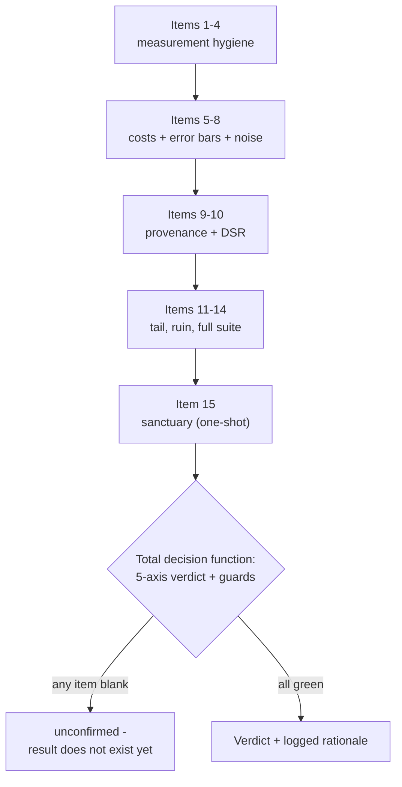

# C. Research pre-flight checklist

Part II spent eight chapters arguing that a backtest is a measurement, that the measurement lies in predictable directions, and that every lie flatters the strategy. This appendix collapses all of that into one thing you can run down before any number leaves the research bench: a **pre-flight checklist**. It is deliberately reference-style: terse, numbered, each item with a one-line *how to verify*, so it can sit on a second monitor while you read a colleague's writeup, or be pasted into a pull-request template, or become the literal sections of an audit log.

The rule that makes the list worth obeying: **a backtest is `unconfirmed` until every item is green, and any single un-checked item caps the verdict.** This is not a scoring rubric where four of five is a pass. The lies compound, and the most dangerous of them (a mislabelled walk-forward, a tail simulated on the strategy's own P&L) produce numbers that sail through every *other* gate. So treat a blank checkbox the way you'd treat a failed test: the result does not exist yet.

!!! tip "How to use this page"
    Two passes. **Author pass:** before you write up a result, walk all 15 items and make each verifiable from your own artefacts; if you can't point at the line of code or the logged number that satisfies an item, it isn't satisfied. **Reviewer pass:** demand the same evidence from someone else's result, in this order, cheapest gate first (items 1 to 8 are seconds of reading; 9 to 14 are minutes-to-hours of compute; item 15, the sanctuary, is spent once and last). The full reasoning behind each item lives in its linked chapter; this page is the index, not the argument.

---

## A. Measurement hygiene: *is the number even arithmetically honest?*

These four catch the [five lies](../part2-research/backtest-you-can-trust.md) that corrupt a *single* number before any of the heavier machinery runs. Get one wrong and everything downstream inherits the inflation.

### 1. The bar timeframe and annualisation factor are stated explicitly

The first line of the report names the P&L frequency (`D`, `H1`, `M5`, …) and the `periods_per_year` used to annualise. There is no default.

!!! check "How to verify"
    Read the top of the report for the timeframe; confirm the annualisation factor matches it (`H1` → `252*24`, not `252`). A wrong factor moves Sharpe by `sqrt(ratio)`; treating hourly as daily inflates it ~4.9×. If the frequency isn't stated, **stop**: you cannot check item 1, so nothing below is trustworthy. *(→ [A backtest you can trust §Lie 1](../part2-research/backtest-you-can-trust.md))*

### 2. No flat bars were filtered before annualising (no survivor math)

The Sharpe (and Sortino, Calmar, CVaR) were computed on the *full* bar series, including the zero-return bars when the strategy was flat.

!!! check "How to verify"
    Grep the pipeline for `returns[returns != 0]`, `dropna()`-then-annualise, or any `!= 0.0` mask ahead of a Sharpe call. Dropping the flat bars of a strategy in the market a fraction `a` of the time inflates Sharpe by `1/sqrt(a)`; a one-day-in-four strategy gets a free 2×. Per-trade stats are a *different* helper fed a per-trade series, never a zero-filtered bar series. *(→ [A backtest you can trust §Lie 2](../part2-research/backtest-you-can-trust.md))*

### 3. Shift discipline: every signal earns the *next* bar's return

A position decided at the close of bar *t* is multiplied by the return from *t*→*t+1*, never the return into *t*. Decision and the return it earns live in disjoint windows, decision first.

!!! check "How to verify"
    Find every place a signal/position series multiplies a return series and confirm a `.shift(1)` (or equivalent lag) sits between them. The smoking gun is `ret.where(cols == momentum.idxmax(axis=1))` or any `position * same_bar_return`; guilty until proven the position was knowable strictly before the return window opened. Autocorrelated signals manufacture a *plausible* fake curve here, which is the worst kind. *(→ [A backtest you can trust §Lie 3](../part2-research/backtest-you-can-trust.md))*

### 4. Normalisation is causal or IS-frozen, never full-series

Any z-score, scaler, or fitted transform uses only data available at each bar (rolling/expanding) or freezes its statistics on the in-sample window and applies them unchanged out-of-sample.

!!! check "How to verify"
    Grep for `(x - x.mean()) / x.std()` over a whole series, or any `.fit()` on the union of IS+OOS. The byte-identity test settles it: append OOS bars from a wildly different distribution: the IS slice's transformed values must not change. If appending the future moves the past, it leaks. The safest codebase simply doesn't *offer* a full-series z-score. *(→ [A backtest you can trust §Lie 4](../part2-research/backtest-you-can-trust.md) · [Walk-forward §normalisation boundary](../part2-research/walk-forward.md))*

---

## B. Costs & error bars: *is the edge real after frictions and noise?*

### 5. Transaction costs are charged once, per transition, on the right side

Spread/commission/slippage is applied on each position *change*, not each bar held; financing/borrow on overnight carry; nothing double-counted by both a per-bar and a per-trade charge.

!!! check "How to verify"
    Confirm cost is a function of `position.diff()` (transitions), not of `position` (exposure). Re-run with costs zeroed and with costs doubled: a real edge survives realistic costs and degrades gracefully; an edge that evaporates between 0× and 1× was friction-thin and is a reject. Long-only DFB/financing on leveraged or overnight sleeves is the cost people forget. *(→ [Broker realities](../part4-research-to-prod/broker-realities.md) · [Live = research](../part4-research-to-prod/live-equals-research.md))*

### 6. A bootstrap confidence interval exists, and the gate is on the lower bound

The headline Sharpe is reported as a 95% interval, and the deployment rule is `CI_lo > 0`. A point estimate alone is rejected.

!!! check "How to verify"
    Look for `[lo, hi]` next to the Sharpe and confirm the verdict keys off `lo`, not the point. A 1.1 Sharpe with interval `[-0.2, 2.4]` is a coin flip with a good story; `CI_lo ≤ 0` ⇒ `unconfirmed`, full stop. This is the one axis that can veto a strategy on its own. *(→ [A backtest you can trust §Lie 5](../part2-research/backtest-you-can-trust.md) · [Walk-forward §the gate](../part2-research/walk-forward.md))*

### 7. The bootstrap is serially-aware (block / stationary), not IID

The CI uses a stationary block bootstrap with a block length matched to the strategy's autocorrelation, *not* the naive bar-by-bar IID resample.

!!! check "How to verify"
    Confirm a `block_size` (or stationary scheme) was passed; reject the IID default for any trend, carry, or cross-asset strategy. IID resampling destroys the autocorrelation those strategies live on, which *narrows* the interval and biases the **lower bound upward**: optimism applied to the exact number you gate on in item 6. *(→ [A backtest you can trust §war-story: the bootstrap that lied about itself](../part2-research/backtest-you-can-trust.md))*

### 8. Noise-robustness: the edge survives input-price perturbation

Small noise injected into the input prices doesn't collapse the result; the strategy passes on both the mean and the worst-case perturbed run.

!!! check "How to verify"
    Confirm a noise-injection axis was run and report both the mean and worst-case degradation. A real edge bends; a curve-fit shatters. Pair this with the *plateau* check in item 10: both are structural tests that an edge survives small perturbations of the world or the parameters. *(→ [Failure-mode catalogue](../part2-research/failure-mode-catalogue.md) · [Sanctuary & decision matrix §the noise axis](../part2-research/sanctuary-decision-matrix.md))*

---

## C. Provenance & the search: *was the number earned out-of-sample, or mined?*

### 9. The headline metric is computed on a *provably* out-of-sample series

Either parameters were selected per-fold on IS data only, or they were pre-registered in a commit that *strictly post-dates* nothing it tested. OOS is a property of provenance, not of partitioning.

!!! check "How to verify"
    Ask the one question: were the parameters fixed *before* the window they're scored on was examined? Per-fold selection on `is_df` with `oos_df` never touching selection ✅; a committed pre-registration whose result commit strictly post-dates it, with the gate-defining block byte-identical ✅; sweeping the whole series then drawing folds around the winner ❌: that's a **stability scan**, labelled as such, and it cannot deploy. *(→ [Walk-forward §OOS is provenance](../part2-research/walk-forward.md))*

### 10. Multi-cell sweeps are deflated (DSR) at the *honest* trial count, and the winner is a plateau

Any sweep beyond a handful of cells reports `dsr_prob ≥ 0.95` computed at `N` = the candidate *pool* (not survivors), and the winning cell sits in a flat region of the grid, not a lone spike.

!!! check "How to verify"
    Confirm `e_max_SR` (the noise ceiling) is printed beside the winner: "best cell SR 0.9, `e_max_SR` 0.85" means you found nothing. Check `N` counts abandoned grids, hand-tweaks, and the *full* screener universe (a screener's `N` is the pool, not the podium). Then perturb the winning cell by one grid step: if neighbours' Sharpe spread is wide, it's a fitted spike; abort. Survivors-only `N` or variance must be *flagged optimistic*. *(→ [Beating your own optimizer](../part2-research/deflated-sharpe.md))*

---

## D. Survival: *can a plausible bad path kill the account at the size you'd deploy?*

### 11. The Monte Carlo resamples the **underlying**, then re-runs the strategy

The drawdown distribution comes from bootstrapping the *underlying's* returns, `cumprod`-ing to a synthetic price, and re-running the full strategy on each path, not from resampling the strategy's realised P&L.

!!! check "How to verify"
    Trace the MC: it must call `strategy_fn(synthetic_price)`, never resample `strategy_returns` directly. Resampling the *effect* (realised P&L) bounds the worst synthetic path by the worst *historical* one; it cannot manufacture a drawdown the strategy never produced. For cross-asset legs, confirm `shared_block` so cross-correlation survives. *(→ [Tail risk & risk of ruin §simulate the cause](../part2-research/tail-risk-and-ruin.md))*

!!! warning "War-story: the tail that resampled its own luck"
    An early Titan Monte Carlo bootstrapped the *strategy's realised P&L* and read a reassuringly shallow `P(MaxDD)` off it. The number was structurally incapable of telling the truth: shuffling the bars the strategy had already survived can only reorder drawdowns it already produced, never invent the deeper one a fresh price path would. Rebuilt to resample the *underlying's* returns and re-run the strategy on each synthetic price, the tail widened, on some strategies by close to an order of magnitude. The rule it bought: **simulate the cause, not the effect.** A drawdown gate fed the strategy's own P&L is grading the strategy on a world it has already beaten.

### 12. The drawdown gate fits the strategy type, and `P(MaxDD>X)` is under threshold

Market-neutral/tactical strategies use the absolute `P(MaxDD > X)` gate; long-only / ballast sleeves use a *relative* (vs buy-and-hold on the same synthetic path) gate.

!!! check "How to verify"
    For a long-only sleeve, confirm an *absolute* MaxDD gate isn't being applied: the underlying itself would fail it, so the gate would be testing the market, not the strategy. The economically correct question for ballast is "does it draw down *less than* buy-and-hold?" Confirm `n_paths` is large enough that the small `p` you gate on isn't decided by one or two tail events; cross-check seeds. *(→ [Tail risk & risk of ruin §reading P(MaxDD)](../part2-research/tail-risk-and-ruin.md))*

### 13. Risk of ruin is evaluated at the **deployed weight** against the **kill threshold**

`P(kill)` is forward-simulated over the *labelled* deployment horizon, at the fraction of full size you'd actually run, against the portfolio's actual kill level, with the simulation parameters bound to the pass tolerances.

!!! check "How to verify"
    Confirm three numbers are *named*: deployment weight, kill threshold, horizon. A scary standalone drawdown can be safe at a small weight; a mild one lethal as the whole book. Check the gate object **raises** if the assessment's horizon/kill don't match the gate's (a free-floating threshold grades the wrong exam). Confirm drawdown uses `cumprod(1+r)` (geometric), not `cumsum` (additive), and that the function was fed *simple* returns, not log. For a multi-strategy book, the joint-ruin run must also be *stressed* (correlations forced toward 1): diversification evaporates in the crash. *(→ [Tail risk & risk of ruin §from drawdown to ruin](../part2-research/tail-risk-and-ruin.md) · [Position sizing: Kelly & vol-targeting](../part5-portfolio-risk/position-sizing-kelly.md))*

### 14. The full metric suite is reported, and Calmar (geometric), not Sharpe, gates promotion

Sortino, Calmar (over **geometric** CAGR), MaxDD depth/duration, and CVaR/CDaR all appear; the promotion decision keys on *Calmar lift*, with Sharpe lift only a no-regression check.

!!! check "How to verify"
    Confirm Calmar uses geometric CAGR (`eq_final ** (ppy/n) − 1`), not arithmetic mean × `ppy`: the arithmetic form overstates compounded return by ~`vol²/2` per year and flips decisions on volatile strategies. A 1.4-Sharpe strategy with a year-long double-digit trough fails on Calmar, and rightly: drawdown is what gets a strategy switched off mid-trough. Read CVaR (bad bars) and CDaR (deep holes) as a pair. Every one of these obeys items 1 to 4; a look-ahead Calmar is as worthless as a look-ahead Sharpe. *(→ [Beyond Sharpe: the metric suite](../part2-research/metric-suite.md))*

---

## E. The vault: *spent once, last, and it can veto*

### 15. A sanctuary window was held out, untouched, and spent exactly once

The most recent stretch (a calendar year is a sane default) was carved off *before* any fold was constructed, never seen by the research loop, and evaluated once as the final step; a sanctuary *loss* is disqualifying, not a re-tuning signal.

!!! check "How to verify"
    Confirm the logged `sanctuary_start` timestamp predates fold construction and never moved between runs (a drifting boundary has been peeked at). Confirm the candidate was *frozen*, no knobs touched, before the sanctuary was spent. A held-out loss caps the verdict at `SUSPECT` regardless of how clean the other axes are; it is **not fungible** with a hygiene-axis miss. And check the lucky-flag divergence test: a held-out window in the top 5% of historical windows is regime luck, and downgrades the verdict one level. *(→ [The sanctuary window & decision matrix](../part2-research/sanctuary-decision-matrix.md))*

---

## The verdict is a function, not a vibe

Items 1 to 15 are the *inputs*. The output is not a meeting; it's a total, deterministic mapping from this evidence to one verdict, logged with a rationale string, so the same evidence always yields the same answer and `UNDETERMINED` is impossible to return. Five of those items map directly onto the decision-matrix axes (`CI_lo` → item 6/7; `DSR` → item 10; Monte-Carlo drawdown → items 11/12; sanctuary → item 15; noise → item 8); the rest are the hygiene that makes those five axes *mean* something. Two axes can veto on their own: a `worst` on the sanctuary or on `CI_lo` caps the verdict at `SUSPECT` no matter how clean the card.

!!! danger "The checklist exists because the dangerous lies pass every *other* gate"
    The reason this list is a hard sequence and not a suggestion: the worst errors don't announce themselves. A mislabelled walk-forward (item 9) produces a CI that is genuinely tight and genuinely positive (it passes item 6 cleanly) because the returns really happened under parameters that really fit; only provenance exposes it. A tail simulated on the strategy's own P&L (item 11) produces a `P(MaxDD)` that looks safe and gates green, because it can't manufacture a drawdown the strategy never survived. Sized on either, real capital goes live against an edge that exists only in hindsight, and the first unseen regime takes it apart. Run the list in order; do not let a green light on one item buy confidence in an item you skipped.

## Takeaways

- **A backtest is `unconfirmed` until all 15 items are green.** This is a gate sequence, not a 14-of-15 rubric: the lies compound and the dangerous ones pass every other check.
- **The five lies (items 1 to 4) come first and cheapest.** Wrong units, survivor math, peeking, full-series normalisation: seconds of reading, and a fail here invalidates everything below it.
- **Gate on the lower bound, with a serially-aware bootstrap** (items 6 to 7); **deflate the search at the honest `N`** (item 10); both correct different optimism: error on one number vs error on *selecting* it.
- **Survival is the verdict, not Sharpe** (items 11 to 14): bootstrap the *cause*, evaluate ruin at *deployed weight* against the *kill threshold*, and gate promotion on *geometric Calmar lift*, not Sharpe.
- **The sanctuary is spent once, last, and can veto** (item 15). A held-out loss bins the candidate; it is not feedback for the lab.
- **The output is a function, not a judgement call.** Honest inputs in, reproducible verdict out, rationale logged.

---

This page is the index to Part II's discipline. The argument behind every item lives in its chapter: start with [A backtest you can trust](../part2-research/backtest-you-can-trust.md) and read through [The sanctuary window & decision matrix](../part2-research/sanctuary-decision-matrix.md); the bugs that bought each threshold are collected in [The failure-mode catalogue](../part2-research/failure-mode-catalogue.md). When a candidate clears all 15, [The strategy-class contract](../part4-research-to-prod/strategy-class-contract.md) governs how it crosses into production without quietly changing what was validated, and [The preflight to live capital](../part6-deploy-ops/paper-to-live.md) carries the same suspicion-over-celebration discipline into the paper-to-live promotion.
