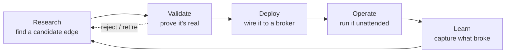

# Building a Production Quant Trading Stack

*A practitioner's guide to the unglamorous 90% (validation, risk, plumbing, and operations) that decides whether a trading idea survives contact with a live market.*

**By Dr. Rayan Azhari** &nbsp;·&nbsp; [Source &amp; framework on GitHub](https://github.com/rayan-azhari/titan-quant) &nbsp;·&nbsp; [About &amp; licence](about.md) (free to read, all rights reserved)

---

Most writing about quant trading is about **finding edges**. This book is about everything that happens *after* you think you've found one: proving it's real, wiring it to a broker without lying to yourself, sizing it so a bad month doesn't end you, and running it as a process that survives restarts, data outages, and your own future mistakes.

It is built around a single real system (a multi-strategy, broker-connected book we'll call **Titan**) used as the running case study. Titan is opinionated and battle-scarred: it has shipped look-ahead bugs, mis-sized a leg by a third on a currency assumption, crash-looped on its own data-quality gate, and had an entire quarter of "validated" results deleted because the methodology underneath them couldn't be trusted. Those scars are the point. You'll learn more from *why* each guardrail exists than from any clean architecture diagram.

!!! note "What this book is, and isn't"
    It **is** a guide to the engineering and methodology of a production systematic-trading stack: research validation, portfolio construction, risk management, deployment, and operations. It **is not** a source of alpha. Specific parameters, instrument lists, and live performance are deliberately omitted or replaced with clearly-labelled illustrative values: the value here is the *process*, which is exactly what's safe to share. It is educational material, **not investment advice**.

## Who this is for

A working engineer or quant-curious developer who can read Python and knows what a Sharpe ratio is, but hasn't yet built the full pipeline from "interesting backtest" to "thing that trades unattended." If you've ever had a strategy look amazing in a notebook and then quietly bleed in production, this book is the missing middle.

## The one idea, if you read nothing else

> **Suspicion over celebration.** When a result looks too good, the correct first reaction is not excitement; it's *"where's the leak?"* Out-of-sample tests, deflated statistics, held-out windows, and parity checks all exist to answer one question: is this real, or am I fooling myself? Every chapter is, in some sense, a different way of not fooling yourself.

## The lifecycle this book follows

The whole book is organised around one loop. A strategy is never "done"; it moves around this cycle continuously, and most of the engineering exists to make each arrow trustworthy.

## How it's organised

| Part | You'll learn to… |
|---|---|
| **I, Foundations & Architecture** | Lay out a system whose structure *prevents* whole classes of bugs. |
| **II, Research & Validation** | Run a backtest you can actually trust, and decide go/no-go with a function, not a feeling. |
| **III, Data Engineering** | Source and store data, and gate the system against silently-regressed data. |
| **IV, From Research to Production** | Turn a validated idea into a live strategy that provably computes the same thing the backtest did. |
| **V, Portfolio & Risk** | Combine strategies, size positions, and build the layer that keeps a bad day from being a fatal one. |
| **VI, Deployment & Operations** | Containerise the stack and run it: deploy, redeploy, monitor, halt, recover. |
| **VII, Reflections** | What's still unfinished, what we'd do differently, and where to read next. |

You can read it front-to-back as a build log, or jump to a part as a reference. Start anywhere, but if you only read one chapter, read [**A backtest you can trust**](part2-research/backtest-you-can-trust.md). It contains the discipline the rest of the book depends on.

---

!!! tip "Conventions"
    Code blocks are sanitised, runnable-shaped *patterns*, not copy-paste alpha. Callouts flag the things that bite: **`!!! warning`** for anything that can corrupt a result or a risk calculation, **`!!! danger`** for anything that touches live capital. Numbers in examples are illustrative unless explicitly stated otherwise.
