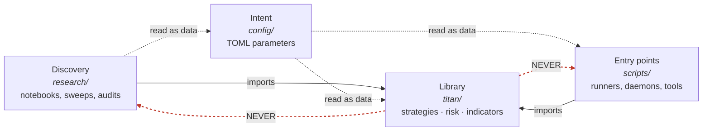

# 2. Architecture & the one-way dependency rule

A trading system is not one program. It is at least four, with very different lifespans and very different blast radii. There is the throwaway notebook where you discover an edge. There is the file that says, in plain text, *what you intend to deploy*. There is the tested library that actually does the trading. And there is the thin script that wires the library to a broker and turns it on.

Most systems begin without these seams. Someone discovers a signal in a notebook, the notebook grows a broker connection, the broker connection grows a position-sizer, and one Tuesday the notebook is live with real money, carrying every exploratory shortcut and every hard-coded threshold straight into production. The first chapter, [Why systems fail](why-systems-fail.md), is largely a tour of what happens next.

This chapter is about the one structural decision that prevents most of it: a **layered architecture where dependencies flow in exactly one direction.** Discovery code may depend on the library; the library may never depend on discovery code. Entry points may depend on the library; the library may never contain an entry point. That single arrow, drawn once and enforced forever, is what makes look-ahead, coupling, and "it works on my machine" *visible* instead of latent.

## The principle: layers, and an arrow that only points one way

Sort everything you write into four layers by *how long it lives* and *what it is allowed to assume*.

| Layer | Lifespan | Job | May import |
|---|---|---|---|
| **Discovery** | Disposable | Find an edge; iterate fast; be wrong cheaply | The library |
| **Intent** | Versioned config | State *what* runs and with which parameters | Nothing (it's data) |
| **Library** | The asset | The tested, importable implementation | Only itself + third-party deps |
| **Entry points** | Operational glue | Wire the library to a broker/clock and start it | The library + config |

The rule is that **the library sits in the middle and depends on nothing above it.** Discovery and entry points both point *inward*, at the library. The library never points back out. Drawn as a graph, the whole system has to be acyclic with the library as a sink:



Why is the *direction* load-bearing, and not just the existence of folders? Three reasons, and each one is a class of bug it prevents.

**1. It localises blast radius.** A dependency arrow is a contract: "if you change me, you might break the things that point at me." Because the library points at nothing above it, you can rewrite a research notebook, delete a sweep, or rename a config key without any risk of breaking the code that trades. The expensive, well-tested asset is downstream of nothing volatile. Invert one arrow, let the library `import` a research helper, and now an exploratory file is on the critical path to live capital. The most reckless code in the repo is suddenly load-bearing.

**2. It makes look-ahead structurally harder to ship.** This is the subtle one. Discovery code is *allowed* to see the whole dataset at once: that is what makes it fast and what makes it dangerous. A z-score over the full series, a "winner" chosen with the same bar it earns, a normalisation fit on data that includes the future: these are the [five lies](../part2-research/backtest-you-can-trust.md) of an untrustworthy backtest, and they all share one tell. **They assume access to information the live system will not have.** The library lives in the world of *one bar at a time, decisions before returns.* When the boundary is one-directional, look-ahead can't quietly leak from the permissive layer into the strict one, because the strict layer cannot import from the permissive one. The compiler, or the import, is doing your code review.

**3. It separates *intent* from *implementation*.** The parameters that constitute your edge, the lookbacks, thresholds, the instrument list, belong in versioned config, read as *data*, never baked into the code as literals. A reviewer can diff `config/` and see exactly what changed about a deployment without reading a line of Python. The library asks "what am I told to do?"; the config answers; the entry point delivers the answer.

!!! tip "The layer test: 'what is allowed to assume what?'"
    When you're unsure where a file belongs, don't ask "what does it do"; ask **"what is it allowed to assume?"** Code that may assume it sees the future is discovery. Code that may assume a broker connection exists is an entry point. Code that may assume *neither*, only its inputs and its own tests, is the library. Anything that wants to assume *both* is two files wearing a trenchcoat.

## The Titan example: `research → config → titan → scripts`

Titan implements exactly these four layers as four top-level directories, and the dependency arrow runs strictly left to right.

```text
research/   discovery   - sweeps, audits, one-off explorations (disposable)
config/     intent      - *.toml: which strategies, which parameters (data)
titan/      library     - the packaged, tested implementation (the asset)
scripts/    entry points - runners, daemons, operational CLIs (glue)
```

The split is not cosmetic; it is encoded where it can be enforced.

**Only the library is packaged.** `pyproject.toml` declares `packages = ["titan"]`. `research/` and `scripts/` are *not* installable artifacts; they are siblings on the path, not part of the shipped library. The thing you `pip install` and import is precisely the layer that is allowed to touch capital.

**The two outer layers are held to a different bar.** The linter config is blunt about the asymmetry:

```toml
[tool.ruff.lint.per-file-ignores]
# Standalone scripts: allow sys.path shims + long lines, skip docstrings
"scripts/*"     = ["E402", "E501", "D"]
# Research: relaxed (line length, semicolons, terse var names)
"research/**/*" = ["E501", "E702", "E741", "D", "E402"]
```

`titan/` gets none of these passes. Discovery and glue are allowed to be a little sloppy because they're disposable; the library is held to the strict standard because it's the asset. The ruleset *names* the layers and treats them differently; the architecture is literally in the lint config.

**Intent flows in as data, not code.** The process-wide risk manager doesn't hard-code its limits; it reads them from `config/risk.toml` at construction:

```python
# titan/risk/portfolio_risk_manager.py  (sanitised)
import tomllib
from pathlib import Path

risk_toml = Path(__file__).resolve().parents[2] / "config" / "risk.toml"
if risk_toml.exists():
    with open(risk_toml, "rb") as f:
        cfg = tomllib.load(f)            # parameters arrive as data
    portfolio_risk_manager.load_config(cfg["portfolio"])
```

The drawdown kill-switch threshold, the volatility target, the correlation dial's bounds: all of it lives in a file you can diff, review, and roll back, separate from the FSM that *acts* on it. Changing the deployed risk posture is a config edit plus a restart, not a code change. (For why those numbers are redacted here and what they govern, see [the portfolio risk manager](../part5-portfolio-risk/portfolio-risk-manager.md).)

**The entry point is where, and only where, the world gets wired up.** `scripts/run_portfolio.py` is a real entry point in the textbook sense: it has a `main()`, an `argparse` parser, an `if __name__ == "__main__":` guard, and it is the single place that constructs the broker-connected `TradingNode`. Nothing in `titan/` does that. The library defines *strategies and risk logic*; the script *selects a bundle, builds the node, and presses go.* That is the difference between a library and a program, and Titan keeps it physical: an entry point is a file in `scripts/`, never a function in `titan/`.

!!! note "Why entry points must never live in the library"
    The moment an importable module has top-level "connect and trade" side effects, every test, every research script, and every other importer that so much as `import`s the package risks reaching out to a broker. Entry points must be *inert until called* and must live where nothing imports them. In Titan, importing `titan` builds the risk-manager singleton from config but opens **zero** broker connections; you have to run a `scripts/` file to talk to IBKR. Import-time purity in the library is what lets the test suite, and a thousand research scripts, import it freely.

The payoff shows up at every layer boundary. A researcher in `research/` imports `titan` to reuse the *exact* sizing and metrics code the live system uses, so the backtest and the deployment share an implementation rather than two subtly different copies (the whole subject of [Live = research](../part4-research-to-prod/live-equals-research.md)). The core of the library, risk, indicators, costs, data validation, FX/equity plumbing, imports nothing from `research/` or `scripts/` at all. We checked: the `titan/risk/`, `titan/utils/`, `titan/indicators/`, `titan/costs/`, and `titan/data/` packages have zero back-edges to the outer layers. The arrow holds where it matters most.

## When the arrow bends: the honest wrinkle

Here is the part most architecture chapters omit. Titan's arrow is not perfectly clean, and pretending otherwise would teach you the wrong lesson.

A handful of *strategy* modules inside the library import from `research/` (the
module name below is illustrative: a generic stand-in for a real strategy):

```python
# titan/strategies/<strategy>/strategy.py
from research.<strategy>.signal import StrategyConfig    # library -> research (!)
```

About a dozen `titan/strategies/*` files do some version of this, pulling a config dataclass or a signal function out of the research package that first validated it. This is a genuine back-edge: a library module depending on a discovery module, the exact arrow the rule forbids. And it carries a real operational cost: the disposable layer has acquired a small claim on the critical path, precisely the failure mode the rule exists to prevent, in miniature. The war-story below is what that cost looks like at deploy time.

!!! warning "War-story: the back-edge that pulled the research tree into the live image"
    A strategy was promoted to live by having its library wrapper `import` the original signal function straight from the research package, instead of *moving* that function down into the library. It worked, and it passed review, because the import resolved and the tests were green. The cost surfaced at deploy time: the production image would no longer build from `titan/` alone; it had to bundle the entire `research/` tree, and a build-time import check on those classes meant an unrelated edit to an exploratory research file could now break the production build. The shape of the bug is *coupling that points the wrong way*: the asset taking a dependency on the disposable. The fix is mechanical: promote the needed code *down* into `titan/`, leave a thin compatibility shim in research if you must, and let the back-edge die. The rule that bought: **promotion means moving code across the boundary, not importing across it.** An `import research` inside `titan/strategies/` is a TODO, not a design.

The lesson is not "the rule is impractical." It's the opposite: the rule's *value* is exactly that it makes this kind of debt **legible**. One `grep` for `from research` inside `titan/` produces a precise, countable list of the architecture's compromises. You can put a number on your coupling and watch it trend. A system without the rule has the same coupling; it just has no way to *see* it, because everything imports everything and no arrow was ever supposed to point any particular way.

!!! danger "Three folders that all describe the live strategy, and only one is true"
    A subtler boundary failure is *intent* fragmenting across files that disagree. In Titan, the running strategy bundle is named in three places: the `Dockerfile`'s baked default, the Compose file's fallback, and an environment file, and they name **three different bundles.** Only the environment file's value actually wins at runtime. Anyone reading just the Dockerfile, or just the Compose file, will confidently misidentify what is live; and on a system that moves real money, "I thought we were running X" is how you fail to flatten the thing that's actually open. The rule it bought: **intent must have exactly one source of truth, and the resolution order must be documented at the point of ambiguity.** Defaults scattered across layers are not redundancy; they are three chances to be wrong. We return to this in [the live runbook](../part6-deploy-ops/live-runbook.md).

## How the boundary makes coupling and look-ahead visible

The reason to pay the ceremony cost of four directories is that the boundary turns invisible problems into greppable ones.

- **Look-ahead.** Discovery code can fit a normaliser on the whole series; the library can't import that code, so the leak cannot ride an import into production. If a strategy *needs* a normalisation, it has to be (re)implemented causally in `titan/`, and now it's reviewable as a library change, with tests, instead of inherited silently from a notebook. The boundary doesn't *detect* look-ahead, but it removes the easiest path for it to travel.
- **Coupling.** Every illegal dependency is a single grep. `from research` inside `titan/` is your coupling debt, enumerated. `from scripts` inside `titan/` should always be empty (it is); a library that imports an entry point has inverted itself completely.
- **Intent drift.** Because parameters live in `config/` as data, a deployment change is a config diff. Edge-bearing numbers never hide as literals three call-frames deep in the library, where no reviewer would think to look.

!!! example "A 30-second architecture audit"
    You can sanity-check a layered system's boundaries with four greps, no deep reading required:

    ```bash
    grep -rl "from scripts"  titan/     # library importing an entry point: must be EMPTY
    grep -rl "from research" titan/     # library coupling to discovery: minimize, track the count
    grep -rl "from titan"    research/  # discovery reusing the asset: GOOD, expect many
    grep -rl "from titan"    scripts/   # entry points composing the asset: GOOD, expect many
    ```

    The first should be empty. The second is your debt ledger: a small number you can drive toward zero. The third and fourth should be *large*, because reuse-inward is the whole point: research and ops both compose the same tested library rather than re-deriving it. If the third or fourth come back empty, you have copy-paste, not architecture: two implementations of your edge that will drift apart until live ≠ research.

## Takeaways

- **Four layers, one arrow.** Discovery → intent → library → entry points. Dependencies point *inward* at the library; the library depends on nothing above it. Keep the graph acyclic with the library as the sink.
- **Entry points never live in the library.** Anything that connects to a broker or "starts" belongs in `scripts/`, inert until called. Importing the library must open zero connections, or your test suite and your research can't safely import it.
- **Intent is data, not code.** Edge-bearing parameters live in versioned `config/`, read at runtime. A deployment change should be a reviewable config diff, never a literal buried in the library.
- **The boundary makes problems greppable.** One grep finds every illegal dependency; the per-file lint asymmetry encodes which layer is the asset. The rule's real value is that it turns invisible coupling and look-ahead paths into a countable ledger.
- **Promotion means moving code *down*, not importing *up*.** An `import research` inside `titan/` is debt to be paid off, not a design to be defended; and the cost (here, dragging the whole research tree into the production image) is exactly why.

---

With the layers and the arrow in place, the next two chapters fill them in: [Stack choices that won't fight you](stack-choices.md) covers the tools each layer wants, and [Project layout & the integration contract](project-layout.md) makes the boundary concrete: the directory map and the contract every strategy signs with the risk layer so that "compose the library" actually composes cleanly.
