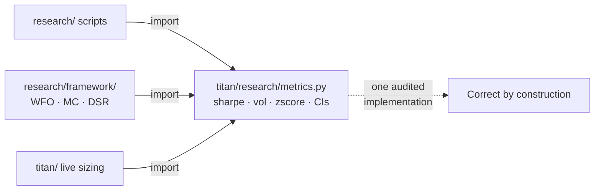

# 4. Project layout & non-negotiables

Most trading-system bugs are not clever. They are a `float` where a `Decimal` belonged, a Sharpe reimplemented in a notebook with the wrong annualisation factor, a research script that quietly imported from the live runner, or a backtest that gives a different answer every time you run it. None of these is a hard problem. All of them are *recurring* problems; they come back, in a new file, every few weeks, until you make them structurally impossible.

This chapter is about that structure: the repository skeleton, and the handful of rules every line of code obeys. The layout decides what can import what (and therefore which dependency cycles can ever form). The non-negotiables, financial types, full typing, absolute imports, fixed seeds, one shared metrics module, each kill a specific *class* of bug, not a single instance. The point is never the rule itself; it's the bug class the rule retires for good.

## The principle: make the wrong thing hard to write

A coding standard you have to *remember* is a coding standard you will eventually forget: under deadline, at 2 a.m., during the trade that matters. The rules that survive are the ones the tooling enforces or the directory structure forbids. So the test for every convention in this chapter is: **does it convert "remember to be careful" into "you literally cannot do it the unsafe way"?**

That principle has three levers, in order of strength:

1. **Make it impossible.** The dangerous operation does not exist in the codebase (no full-series z-score; no money in `float`).
2. **Make it fail loudly.** A required argument with no default; a linter that rejects the import; a type checker that catches the wrong shape before it runs.
3. **Make it conspicuous.** A directory boundary that means a bad import shows up in review as an obviously-wrong line.

Everything below is an application of those three levers.

## The repository skeleton

A quant repo has four kinds of code, and they must not blur into each other:

- **Research**: exploratory, allowed to be messy, allowed to be wrong, *never* imported by anything live.
- **Library**: the audited core: strategy logic, indicators, risk, the shared metrics. Importable everywhere.
- **Config**: the parameters that research discovered, captured as data (TOML), not code.
- **Entry points**: the scripts that actually run things: live runners, validators, the kill switch.

Titan lays these out as top-level directories with one rule that does almost all the work:

```text
directives/   Specs and methodology docs (read first)
titan/        Audited library - strategies, adapters, indicators, risk, metrics
  research/metrics.py     The shared math module (the subject of half this book)
  research/framework/     The unified backtest framework (WFO, MC, DSR, decision)
  risk/                   PortfolioRiskManager, Allocator, StrategyEquityTracker
research/     Exploratory research - signal defs, regime detectors, audits
config/       TOML parameters (what research found; re-tuned per audit)
data/         Historical Parquet (gitignored; regenerated by scripts)
scripts/      Entry points - run_live_*, kill switch, watchdogs, validators
tests/        The safety net
```

!!! tip "Code flows one direction"
    `research/` **discovers** → `config/` **captures** → `titan/` **implements** → `scripts/` **executes**. The two hard rules that fall out of it: **never import from `scripts/` inside `titan/`**, and **never put an entry point inside `titan/`.** A library that imports its own runner has a cycle waiting to happen and a test suite that can't isolate the unit under test. If you ever find yourself reaching back up the arrow (a library module importing a script, or a strategy importing a research notebook), the design is telling you the boundary is in the wrong place.

The reason `research/` is quarantined from `titan/` is not snobbery about code quality. It's that research code is *allowed to be wrong*; that's its job, to try things that don't work. The moment live code can import it, "allowed to be wrong" becomes "shipped to production." The directory boundary is what lets research stay fast and loose without that looseness ever reaching capital.

## Non-negotiable 1: money is never a `float`

Floating point is base-2; money is base-10. `0.1 + 0.2` is not `0.3` in IEEE-754, and the error is not academic: it compounds through position sizing, accumulates across fills, and eventually a quantity that should be a clean integer of shares is `99.99999999998`, which the broker rejects, or worse, silently rounds in a direction you didn't choose. Prices have a tick size and quantities have a lot size; both are *exact* decimal grids, and `float` cannot sit on a decimal grid.

The rule: **anything that is money, a price, a quantity, or a tradable size is `Decimal` or the broker's native typed object, never a raw `float`.** Titan runs on NautilusTrader, whose `Price` and `Quantity` types carry their own precision and are constructed from `Decimal`:

```python
from decimal import Decimal

from nautilus_trader.model.objects import Price, Quantity

# A price snapped to the instrument's tick grid at its declared precision:
sl = Price(Decimal(sl_price), precision=instrument.price_precision)
qty = Quantity(Decimal(shares), precision=instrument.size_precision)
```

`float` is fine, preferred, even, for the *statistical* layer: returns, Sharpe, vol, z-scores. Those are dimensionless ratios where base-2 rounding at the 15th digit is irrelevant. The discipline is a boundary, not a blanket ban: **the moment a number becomes an order, it must be a typed money object.** A clean place to enforce that is the conversion at the edge of the strategy: the one function that turns "I want to risk 1% of equity" into a `Quantity` is the only place `float` is allowed to touch a size, and it converts on the way out.

!!! danger "War-story: the leg sized a third too large on a currency assumption"
    A leg quoted in one currency, sized from an account based in another, went on about a third too large because the FX conversion was a plain untyped `float` multiply with the wrong leg: no crash, just a quietly wrong position no test caught. A typed `Money(amount, currency)` makes a cross-currency multiply a *type error* instead of a silent off-by-a-third; the full sizing autopsy is in [Per-strategy equity & FX](../part5-portfolio-risk/per-strategy-equity-fx.md).

## Non-negotiable 2: full typing and absolute imports

Two rules that look like style and are really about isolation.

**Full type hints, checked.** Every function signature is annotated; the return type is explicit. Type hints are not documentation that rots; with a checker in CI they are a test that runs on every line. Most of the bugs they catch are dull: a function that returns `pd.Series` handed to one expecting `float`, a `None` that slips through an `Optional` you forgot to handle. Dull is the point: those are exactly the bugs that survive code review because they read as plausible. The metrics module models the standard well:

```python
def sharpe(
    returns: pd.Series | np.ndarray | Iterable[float],
    periods_per_year: int,
    *,
    ddof: int = 1,
) -> float: ...
```

The signature tells you everything: what it accepts, that the annualisation factor is *required* (more on that below), and that it returns a scalar. A reviewer verifies correctness from the signature without reading the body.

**Absolute imports only.** `from titan.research.metrics import sharpe`, never `from ..metrics import sharpe`. Relative imports break the instant a file moves, hide the dependency direction (a `..` tells you nothing about which layer you're reaching into), and make it possible to construct a deep relative path that quietly crosses a boundary the directory layout was supposed to enforce. An absolute import is self-documenting: `from titan...` is library, `from research...` is exploratory, and a `from research...` line inside `titan/` is a glaring red flag in review. The import path *is* the architecture diagram, restated on every line.

!!! tip "Let the linter own the boring rules"
    Titan's `pyproject.toml` runs Ruff with the import (`I`), pyflakes (`F`), pycodestyle (`E`/`W`), and docstring (`D`) rule sets, line length capped, on a pinned Python target. Unused imports (`F401`), unsorted imports (`I`), undefined names: all caught before a human looks. The per-directory ignore table is itself a policy statement: research and scripts get relaxed line-length and docstring rules (they're allowed to be scrappy), while `titan/` is held to the strict set. The *layout* and the *lint config* encode the same hierarchy of care.

## Non-negotiable 3, reproducibility: a fixed seed, always

A backtest that gives a different answer every run is not a measurement; it's a slot machine. Any procedure with randomness (a bootstrap confidence interval, a Monte Carlo path simulation, a model fit, a train/test shuffle) must take an explicit seed and default it to a fixed value, so the same inputs produce the same outputs forever.

```python
def bootstrap_sharpe_ci(
    returns, periods_per_year, n_resamples=1000, confidence=0.95,
    *, seed: int = 42, block_size: int | None = None,
) -> tuple[float, float]:
    rng = np.random.default_rng(seed)   # explicit generator, fixed seed
    ...
```

Two non-obvious reasons this matters more than it looks:

- **Audits must be replayable.** When a strategy is rejected because its bootstrapped 95% lower bound came in below zero, that verdict has to be reproducible to the digit, or it's just an opinion. A fixed seed turns "we ran it and it failed" into "anyone who runs this exact code gets this exact number."
- **It separates real instability from RNG noise.** If a result swings when you change *only* the seed, the result is fragile and the seed was hiding it. You *want* to vary the seed deliberately, across a grid, to measure that fragility. But that's a different experiment from your headline run, and it only works if the default is pinned, so a seed change is a *choice* you made, never an accident.

!!! warning "War-story: the global RNG that made an audit un-reproducible"
    A simulation seeded the process-global random generator once at import, then several modules each drew from it. Run them in a different order, or import one extra module, and the draws shifted, so the same backtest produced subtly different confidence intervals on different machines. A strategy could pass the `CI_lo > 0` gate on the researcher's laptop and fail in CI, with no code change between them. The bug wasn't the seed value; it was *sharing one mutable global generator across modules*. The fix: every stochastic function constructs its **own** `np.random.default_rng(seed)` from an explicit argument and never touches the global state. Local generator, explicit seed, default pinned: and the result is the same on every machine, every run, in any import order.

## Non-negotiable 4, one shared metrics module

This is the rule the rest of the book leans on hardest, so it gets its own section. **Every** Sharpe, Sortino, Calmar, volatility, drawdown, and z-score in the codebase routes through a single module. Not "should." Does. The alternative, each researcher writing `def _sharpe(r): return r.mean()/r.std()*np.sqrt(252)` at the top of their notebook, was tried, and it failed in the most instructive way possible.

!!! warning "War-story: the same bug, copy-pasted into six files"
    An audit of Titan found the *identical* Sharpe miscalculation independently reimplemented in at least six places. Several research evaluators filtered out flat (`return == 0`) bars before annualising with `sqrt(252)`, which inflates the Sharpe by roughly `sqrt(1/P)` for a strategy that only trades `P` of the time, a free multiple for any selective strategy. One portfolio metric inlined `sqrt(252)` onto what were sometimes *hourly* bar returns, mis-annualising by `sqrt(24)`. And the same `sqrt(252)`-on-intraday error appeared on the **live** side, in the sizing code of multiple strategies, where it understated annualised vol and therefore systematically *over-sized* every position. The bug wasn't any one researcher's mistake. It was the *absence of a single place to be correct*: every fresh reimplementation was a fresh chance to get it wrong, forever.

The cure is a module designed so the wrong thing is hard or impossible to call. Three concrete design choices show how the levers from the top of this chapter cash out:

| Lever | In the metrics module | Bug class it retires |
|---|---|---|
| **Make it fail loudly** | `periods_per_year` is a *required* argument on every Sharpe/vol call, with no default | Wrong-frequency annualisation (the `sqrt(24)` and `sqrt(252)`-on-hourly errors) |
| **Make it impossible** | No Sharpe filters `returns != 0` internally; per-trade stats live in a *separate* `trade_sharpe` | The selectivity-inflation bug, retired by construction |
| **Make it impossible** | Only *causal* (`rolling_zscore`, `expanding_zscore`) and IS-frozen z-scores exist; the full-series version is simply absent | Look-ahead-by-construction normalisation |

The required `periods_per_year` argument is the cleanest example of the philosophy. It looks like a papercut: why can't it just default to 252? Because a default is a place a wrong assumption hides. Forcing every caller to *state the frequency at the call site* means a reviewer can verify the annualisation in one glance, and it makes a mid-pipeline resample (the classic "this H1 strategy is secretly daily" trap) impossible to leave implicit. A tiny bit of ceremony at the call site, in exchange for a class of bugs that can no longer recur. That trade is the whole book in miniature.

There's a softer benefit too: edge cases are handled *once*, correctly. The shared functions return `0.0` or `NaN` on empty, constant, or too-short series rather than raising, so a guardrail metric never crashes a batch run; it just declines to flatter you. Get that right in one place and every one of the hundreds of call sites inherits it.



The mechanics of *why* each metric rule prevents its bug, the units, the survivor math, the shift discipline, the future-normalised feature, the error bars, are the subject of [**A backtest you can trust**](../part2-research/backtest-you-can-trust.md), and the full battery beyond Sharpe (Sortino, Calmar, CVaR/CDaR, risk of ruin) gets [**its own chapter**](../part2-research/metric-suite.md). What matters *here* is the structural decision: there is exactly one module, every Sharpe / Calmar / drawdown / vol in research *and* in live sizing routes through it, and using anything else is the bug.

## Takeaways

- **The layout enforces the architecture.** Four kinds of code (research, library, config, entry points) with a one-directional flow: discover → capture → implement → execute. Never import upstream; never put a runner in the library.
- **Money is never a `float`.** Prices, quantities, and sizes are `Decimal` or typed broker objects that carry precision and currency, so a cross-currency or off-tick error becomes a type error, not a silent mis-size. `float` stays in the statistical layer where base-2 rounding is harmless.
- **Type everything; import absolutely.** Checked type hints are tests that run on every line; absolute imports restate the dependency direction on every line and make a boundary violation glaring. Let the linter own the boring rules.
- **Pin the seed.** Every stochastic procedure takes an explicit seed, defaults it to a fixed value, and constructs its *own* generator, so audits replay to the digit and seed-sweeps measure real fragility instead of hiding it.
- **One shared metrics module, or the same bug six times.** Centralise the math so the unsafe version can't be written: a required `periods_per_year`, no internal zero-filtering, no full-series z-score. The safest API is one where the dangerous operation simply does not exist.

Every rule here is an instance of the same move: convert "be careful" into "can't do it wrong." The next chapter, [**A backtest you can trust**](../part2-research/backtest-you-can-trust.md), takes the shared-metrics module apart function by function and shows exactly which lie each design choice prevents; and why every lie, left unchecked, flatters the strategy. The cross-currency mis-size that opened this chapter's first war-story comes back in [**Per-strategy equity & FX**](../part5-portfolio-risk/per-strategy-equity-fx.md) and the [**portfolio risk manager**](../part5-portfolio-risk/portfolio-risk-manager.md), where the one audited place to do currency-aware sizing actually lives.
