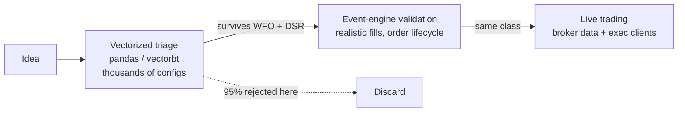

# 3. Stack choices & why

Every line of a quant stack is a bet on a trade-off, and the expensive bets are the ones you never noticed you were making. Pick a backtester for its speed and you may have quietly chosen a fill model that will never match your broker. Roll your own execution loop because the frameworks "felt heavy" and you have signed up to re-implement order-state reconciliation, the part that actually loses money when it's wrong. The technology choices in this chapter are not about features. They are about which failures you are willing to own and which you want the tooling to make impossible.

This chapter walks the choices behind Titan, a managed event-driven execution engine, a separate vectorised research layer, a pinned lockfile, and a container as the deployment boundary, and the reasoning that should drive *your* version of each. We name specific tools (NautilusTrader, vectorbt, `uv`, Docker) because concrete examples teach better than abstractions, but the lesson is the trade-off, not the brand.

## The principle: buy the engine, build the edge

A trading stack has two halves with opposite economics.

The **edge**, your signals, your sizing, your risk policy, is where differentiation lives and where you must own every line. Nobody else can write it, and a subtle bug there silently corrupts your P&L.

The **plumbing** (order routing, fill simulation, position and cash accounting, reconnection, event scheduling) is undifferentiated and brutally hard to get right. It has no alpha in it. It is pure downside: invisible when correct, catastrophic when wrong, and the bugs surface only in live trading where they cost real money. This is exactly the code to *not* write yourself.

!!! tip "The build/buy heuristic for a quant stack"
    Build what encodes your edge. Buy (or adopt) what merely has to be *correct*, especially anything that talks to the broker or accounts for cash and positions. A managed engine has absorbed thousands of edge-case bug reports you would otherwise discover one margin call at a time.

The single most consequential decision is whether your **backtest and your live system run the same code**. If they don't, you are validating one program and deploying a different one, and the gap between them is precisely where look-ahead, fill-model fantasy, and timezone bugs hide. The whole of [Live equals research](../part4-research-to-prod/live-equals-research.md) is about defending that equality; the architecture choice here is what makes it *achievable* in the first place.

## Choice 1: A managed event-driven engine vs DIY

A backtest can be written two ways, and the difference is not stylistic.

A **vectorised** backtest computes the entire signal and P&L series at once with array operations: `returns = asset_returns * position.shift(1)`. It is fast, seconds for years of data, which is what you want when sweeping parameters. But it models a frictionless world. There is no order that can be rejected, no partial fill, no bracket whose take-profit leg gets refused by the broker, no moment where your position and the broker's position disagree. It assumes you transact at the price you saw.

An **event-driven** engine processes one event at a time (bar, tick, order-accepted, fill, position-changed) exactly as they arrive in live trading. It is slower, but it models the things that actually break: an order sits in `SUBMITTED` until the venue accepts it; a fill arrives late; a reconnect finds a position you didn't know you held. Critically, a mature event engine lets the **same strategy class** drive both a historical backtest and a live session: you swap the data and execution clients, not the logic.

| Dimension | Vectorised backtest | Event-driven engine |
|---|---|---|
| Speed | Very fast (whole-series array math) | Slower (event-by-event) |
| Fill realism | Idealised: you get the price you saw | Models acceptance, rejection, partials, latency |
| Order lifecycle | None: position is just a number | Full state machine (submitted → accepted → filled) |
| Backtest ↔ live parity | None: live is a *rewrite* | Same strategy code drives both |
| Best for | Parameter sweeps, idea triage | Final validation and production |

The DIY temptation is real: an event loop "is just a `for` over bars." It is not. The hard part is the order-state machine and the accounting: reconnection that re-adopts external positions, cash ledgers that survive partial fills, idempotent handling of duplicate broker events. Get the accounting subtly wrong and your *backtest* still looks fine while your *live* book drifts. We chose to adopt that machinery rather than maintain it.

!!! example "Titan: one strategy class, two runtimes"
    Titan runs its production strategies on a managed event-driven engine (NautilusTrader). A `Strategy` subclass implements `on_start`, `on_bar`, and `on_position_closed`; the engine feeds it historical bars in a backtest and live broker bars in production through the *same* handlers. The strategy never knows which world it's in. The risk layer, the sizing, the entry logic, all written once, exercised in both. That parity is the point of adopting the engine; without it, "we tested this" and "we deployed this" describe two different programs.

There is a second, subtler win. A managed engine forces a **strategy-class contract**: a fixed shape every strategy must satisfy (lifecycle hooks, a sizing call, a risk check before any order). That contract is what lets a whole portfolio of strategies share one risk manager and one allocator, the entire subject of Part V. A DIY loop tends to grow per-strategy special cases until no two strategies can be reasoned about together. The contract is documented in [The strategy-class contract](../part4-research-to-prod/strategy-class-contract.md).

## Choice 2: Where vectorised research stops and the engine begins

Adopting an event engine does *not* mean you run every experiment through it. You shouldn't. The two tools have different jobs, and the skill is knowing the handoff.

Titan keeps both, deliberately:

- **Research / triage layer**: `pandas`, `numpy`, `numba`, and vectorised backtesters (`vectorbt`, `backtesting`). This is where ideas are born and most of them die. You want to test thousands of parameter combinations in minutes, compute information coefficients across dozens of instruments, and throw out the 95% that don't survive. Fill realism doesn't matter yet, because a strategy that fails in a frictionless world will only fail harder with costs.
- **Validation / execution layer**: the event-driven engine. Once an idea survives triage, walk-forward, and deflation, it graduates to the engine, where realistic order handling either confirms the edge or reveals that it lived entirely in the idealised fills.

!!! warning "War-story: the edge that lived in the fills"
    A candidate strategy looked excellent in its vectorised backtest: a clean equity curve, a Sharpe well past every gate. When it moved to the event-driven layer with realistic order handling, much of the return evaporated. The vectorised version had been transacting at prices the strategy could never actually have gotten: it sized off a bar's close and implicitly *filled* at that same close, with no spread, no slippage, no rejected leg. The shape of the bug is generic and worth naming: **a vectorised backtest's "fill" is an assumption, not an execution.** The fix wasn't a parameter change; it was treating the vectorised result as a *triage* signal only, never a deployment verdict. Anything headed for capital must clear the engine that models how orders actually behave.

The boundary is a discipline, not a suggestion. Vectorised math is for *finding* candidates; the event engine is for *trusting* them; never let a fast, flattering, frictionless number stand in for a deployment decision. The measurement disciplines that make either number honest in the first place are in [A backtest you can trust](../part2-research/backtest-you-can-trust.md).

## Choice 3: Broker and data realities constrain the stack

Your strategy logic does not get a vote on what your broker will actually let you trade. The catalogue, the data subscription, and the account jurisdiction are hard constraints that ripple all the way back into research, and ignoring them is how a "validated" strategy turns out to be un-deployable.

Three constraints bite repeatedly:

- **Tradability ≠ availability of data.** You can often *stream* an instrument's market data while being *forbidden to trade it*. A signal can legitimately be computed from an instrument you can never hold.
- **Jurisdiction rewrites your universe.** Regulatory rules can block a whole class of instruments for an account, forcing substitutes that correlate with, but are not identical to, what you researched.
- **Currency is not cosmetic.** An instrument quoted in a different currency than your strategy's accounting base means every notional has to cross an FX rate. Get that conversion wrong and your *sizing* is wrong, silently.

!!! example "Titan: PRIIPs forces a data-only signal and a substitute leg"
    Titan's account jurisdiction blocks *trading* certain US-listed ETFs, even though their market data still streams. So a cross-asset sleeve computes its signal from an instrument it cannot hold (data-only) and trades a UCITS substitute instead. The substitute had to be chosen not just for correlation but for *currency*: a USD-quoted line was selected over an otherwise-equivalent local-currency line specifically so the strategy's accounting base and the instrument's quote currency match, keeping the FX conversion factor at exactly 1.0. The broker's rulebook, not the alpha, dictated the instrument list.

!!! danger "War-story: a leg mis-sized by a third on a currency assumption"
    A sizing path divided a base-currency notional by a price quoted in a *different* currency left at an implicit 1.0 -- no exception, just a position mis-sized by the FX ratio (about a third, illustrative) on every trade, poisoning every downstream risk number. Broker realities are a correctness property of your sizing math, not a deployment afterthought -- full autopsy in [Per-strategy equity & FX](../part5-portfolio-risk/per-strategy-equity-fx.md).

The deeper lesson: do the broker due diligence *before* you fall in love with a backtest, because the catalogue and the cost model can invalidate it. A demo account is not a reliable proxy for the live catalogue or live financing costs; verify against the real account dashboard. The full treatment of these traps is in [Broker realities](../part4-research-to-prod/broker-realities.md); how the FX conversion feeds into sizing is in [Position sizing: Kelly & vol-targeting](../part5-portfolio-risk/position-sizing-kelly.md), and how it feeds back into accounting in [Per-strategy equity & FX](../part5-portfolio-risk/per-strategy-equity-fx.md).

## Choice 4: Pinned lockfile: reproducibility is a risk control

A backtest is a measurement (see [A backtest you can trust](../part2-research/backtest-you-can-trust.md)), and a measurement you cannot reproduce is an anecdote. If `pip install` today resolves different versions than it did last month, then "the backtest passed" is a claim about a software environment that no longer exists; and the environment your container builds for production may differ again.

The fix is a **lockfile**: pin the *exact* resolved version (and hash) of every transitive dependency, commit it, and build from it everywhere. `pyproject.toml` declares loose intent (`pandas>=2.2`); the lockfile records the precise graph that intent resolved to.

!!! tip "Loose constraints in the manifest, exact versions in the lockfile"
    Two files, two jobs. `pyproject.toml` says what you *want* (`numpy>=1.26`). The lockfile says what you *got*, byte-for-byte. The first is for humans choosing dependencies; the second is for machines reproducing an environment. Commit both.

!!! example "Titan: `uv.lock` + `--frozen` as a build-time tripwire"
    Titan pins everything in `uv.lock` and the container builds with `uv sync --frozen --no-dev`. The `--frozen` flag is the load-bearing part: it tells the resolver *"do not update anything: install exactly the lockfile, or fail."* If `pyproject.toml` and the lockfile have drifted out of sync, the build *fails* rather than silently resolving fresh versions. That turns dependency drift from a Heisenbug ("it worked on my machine, it backtests differently in the container") into a loud, build-time error you fix before deploy. The Docker layer that copies `pyproject.toml` and `uv.lock` then runs the sync is cached on those two files, so the (slow) dependency install only re-runs when dependencies actually change.

This matters most for numerical libraries. A minor version bump in a math library can change the last bits of a floating-point result, which changes a z-score, which changes whether a signal crossed a threshold, which changes a trade. A pinned lockfile lets you say "this exact strategy, on this exact code, on this exact dependency graph": the only statement a risk reviewer should accept.

## Choice 5: The container as the deployment boundary

The final choice is *where research stops and operations begin*. Drawing that line fuzzily (deploying by `git pull` onto a long-lived VM and running scripts by hand) guarantees that production slowly diverges from anything you tested. Some package got upgraded for one experiment; a stray environment variable lingers; the data on disk is a month stale. The "production environment" becomes a unique snowflake nobody can reproduce.

A **container** makes the boundary explicit and reproducible. The image is a frozen artifact: pinned base OS, pinned dependencies (via the lockfile), application code, and a defined entrypoint. What you build is bit-for-bit what runs. The boundary also clarifies *what belongs in the image versus outside it*:

- **Baked into the image** (changes ⇒ rebuild): dependencies, library and strategy code, the entrypoint.
- **Mounted at runtime** (changes ⇒ no rebuild): configuration, market-data files, model artifacts, and any *mutable shared state*, such as halt flags, logs, and heartbeats, that must survive a restart.

!!! example "Titan: a multi-service compose stack with a clean state channel"
    Titan ships as a small `docker compose` stack: a broker-gateway container, the portfolio runner that hosts the engine and all strategies, and a sidecar that computes a risk band. Code and pinned deps are baked into the runner image; `config/`, `data/`, and `models/` are bind-mounted read-mostly so a config edit needs only a restart, not a rebuild. Crucially, all *mutable* shared state, including the persisted kill-switch halt file, logs, and the bar-feed heartbeat, lives on a named volume shared between services. That separation is deliberate: the **kill-switch halt must survive a container restart**, so it cannot live inside the ephemeral image. The deployment boundary is also a *safety* boundary.

!!! danger "War-story: the recreate that typed empty credentials for hours"
    Configuration precedence is part of the deployment boundary, and getting it wrong is a live-capital problem. In one incident a container recreate pulled broker credentials from the wrong source: an `environment:` block that substituted from an unset shell variable *overrode* the real values in the dedicated secrets file. The gateway sat for hours typing empty credentials into the login dialog; the API port never opened, and the dependent trading node never started. The bug shape is generic: **two config sources, unclear precedence, and a silent empty-string default that looks like "unset" but behaves like "wrong."** The rules it bought: secrets flow from exactly one source, never re-declared where a shell default can clobber them; and a config that resolves to empty should *fail loudly*, never quietly proceed. Make the deployment boundary boring and explicit, because the alternative is debugging an empty login dialog at 2 a.m.

Containerisation is the subject of [Containerizing the stack](../part6-deploy-ops/containerizing.md), and the operational discipline around it in [The live runbook](../part6-deploy-ops/live-runbook.md).

## Putting the choices together

| Layer | Titan's choice | What it buys | What it costs |
|---|---|---|---|
| Execution engine | Managed event-driven (adopted, not built) | Backtest ↔ live parity; realistic order lifecycle | Slower than vectorised; a framework to learn |
| Research tooling | Vectorised (pandas / vectorbt / numba) | Fast triage of thousands of ideas | Idealised fills, never a deployment verdict |
| Handoff | Triage in vectors, *trust* only after the engine | The frictionless number can't reach capital | Discipline; two layers to maintain |
| Dependencies | Pinned lockfile, `--frozen` build | Reproducible backtests; drift fails the build | A lockfile to keep in sync |
| Deployment | Container + compose, state on a volume | Frozen, reproducible prod; safety state survives restarts | Container literacy; explicit config hygiene |

None of these is the "right" choice in the abstract. Each is right *given a constraint*: that backtest and live must be the same program; that most ideas must be killed cheaply before the expensive test; that a measurement must be reproducible; that production must not be a snowflake. Name your constraints first, and the stack choices mostly follow.

## Takeaways

- **Buy the plumbing, build the edge.** Order lifecycle and cash accounting are undifferentiated, hard, and pure downside; adopt a tested engine. Your signals and risk policy are where you own every line.
- **The non-negotiable property is backtest ↔ live parity**: the same strategy class driving both runtimes. An engine that delivers it is worth its overhead; a DIY loop that quietly breaks it is the most expensive shortcut in the stack.
- **Keep vectorised research, but fence it.** Use it to triage thousands of ideas fast; never let its frictionless fills stand in for a deployment verdict. The edge that only exists in idealised fills is no edge.
- **Broker reality is a correctness constraint, not an afterthought.** Tradability, jurisdiction, and quote currency reshape your universe and your sizing math; verify them against the live account before trusting any backtest.
- **A pinned lockfile turns "works on my machine" into a build-time tripwire.** Loose constraints in the manifest, exact versions in the lockfile, `--frozen` on the build.
- **Make the container the deployment boundary**: frozen code and deps baked in, config and *survivable safety state* mounted out. The boundary is also a safety boundary: the kill switch must outlive a restart.

---

With the stack decided, the next question is how to organise the code *inside* it so that the research-to-production flow stays one-directional and look-ahead stays visible. That's [The project layout](project-layout.md), which lays out the `research → config → library → scripts` flow this chapter's parity guarantee depends on.
