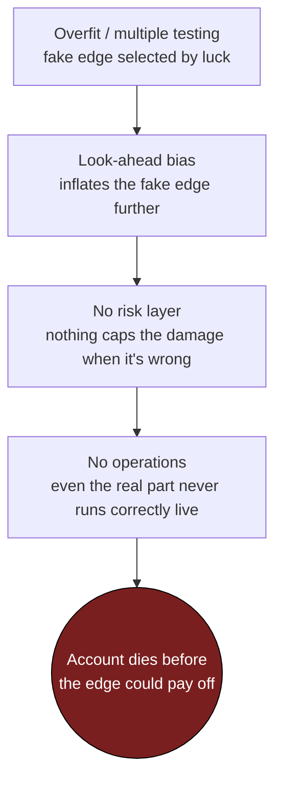

# 1. Why most retail quant systems fail

Most retail quant systems do not fail in the market. They fail before they ever risk a dollar, in the backtest, in the way the numbers were computed, in the missing layer nobody built. The market just sends the invoice later.

This is the uncomfortable thing to internalise before anything else in this book: a strategy that "works" on your laptop is the *default* outcome, not the achievement. Give a motivated developer a few months, a data feed, and an optimiser, and they will produce a beautiful equity curve almost every time. The equity curve is cheap. What's expensive (and rare) is knowing whether it means anything, and surviving the gap between the curve and the live account.

We have built that gap into a system we call **Titan** (a NautilusTrader-based, multi-strategy stack trading through a retail broker), and we have fallen into all four of the holes below at least once. This chapter is the map of those holes. Each later part of the book is the rope ladder out of one of them.

## The four ways a system dies

There are really only four failure modes that account for almost every dead retail quant system. They compound, and they share one nasty property: **each one makes the strategy look *better* than it is.** That asymmetry is the spine of the whole book: errors in this domain are not random noise around the truth, they are biased toward optimism, because the optimistic mistakes are the ones that survive your attention and get funded.

| # | Failure mode | What it feels like | Where it actually bites |
|---|---|---|---|
| 1 | **Overfitting & multiple testing** | "I found a Sharpe of 2." | The edge was selected by luck across many trials; it evaporates live. |
| 2 | **Look-ahead bias** | "The backtest is flawless." | The strategy quietly used information it could not have had in time. |
| 3 | **No risk layer / no survival math** | "Great returns, why hedge?" | One drawdown or one sizing error ends the account before the edge pays off. |
| 4 | **No operations** | "It runs on my machine." | The order rejects, the container dies, the cost model lied; and nobody notices. |

Let's take them in order, with a concrete (sanitised) Titan example for each, and the rule each one bought.

## Failure mode 1: Overfitting and the multiple-testing trap

The principle: **if you try enough strategies, parameters, or instruments, one of them will look brilliant by pure chance; and your search process guarantees you will pick exactly that one.** This is not a subtle statistical footnote; it is the single largest source of fake edge in retail quant. The more cells in your grid, the higher the *expected maximum* Sharpe even when every strategy is genuinely worthless. A backtest reported as a point estimate, without accounting for how many things you tried to find it, is not evidence. It's the winner of a lottery you forgot you were running.

There are two tells, and Titan gates on both:

- **Plateau, not spike.** A real edge is robust to small parameter changes: a lookback of `L` and `L±1` should give similar results. If the Sharpe collapses the moment you nudge a parameter, you have found a knife-edge in the noise, not a plateau in the signal.
- **The lower bound, not the point estimate.** A bootstrap confidence interval on the Sharpe tells you how bad the strategy could plausibly be. If the 95% lower bound is at or below zero, it's a coin flip with a good story: `unconfirmed`, full stop, regardless of how shiny the point estimate is.

!!! warning "War-story: the +2.0 Sharpe that was a single regime"
    A trend-following ensemble produced a backtest Sharpe near **+2.0** on a narrow, recent window: a few years on one asset class. It even *passed* the plateau check on that window: nudging the parameters barely moved the result. It looked like a genuine, robust edge.

    Then we re-ran the identical specification on a much broader universe and a ~20-year history. The Sharpe **flipped negative.** The "+2.0" was not a trend edge at all; it was one favourable sub-regime, sampled with too few independent folds for the confidence interval to notice. The lower bound on the narrow window had been hovering just below zero the whole time, the framework was already refusing to promote it, but the point estimate was seductive enough that, without the gate, we'd have deployed it.

    The rule it bought: **a high Sharpe on a narrow universe and short window must be re-validated on a broader, longer sample before promotion.** Tightening the confidence interval with more data is *necessary but not sufficient*; a sign reversal on broader data is decisive evidence the edge was a regime artefact.

The deeper trap is in the *counting*. When you deflate a Sharpe for multiple testing, the number of trials `N` is the size of the *whole search pool*, not the handful of survivors you're proud of. Survivors-only understates the variance of your search and makes the deflated number look better than it is. The honest `N`, the full pool, is exactly the one that kills marginal strategies. That's the point.

→ **The fix lives in [Beating your own optimiser](../part2-research/deflated-sharpe.md)**: the Deflated Sharpe Ratio, plateau-vs-spike testing, and why `N` is the pool and not the podium.

## Failure mode 2: Look-ahead bias, the silent default

The principle: **a backtest that uses information from the future is not a backtest, it's a memory of the answer.** And look-ahead is the *default* state of careless code, not an exotic edge case. You have to actively work to keep it out; it sneaks back in every time you write a line that touches a return.

The canonical shape: a position is *decided* using bar `t`, then "earns" bar `t`'s return. A decision and the return it earns must live in disjoint time windows, decision first. In code, the only safe pattern lags the decision before it multiplies a return:

```python
# A position decided at the close of t can only earn t -> t+1:
strat_returns = asset_returns * position.shift(1).fillna(0.0)
```

The unsafe version (`position * same_bar_return`, with no shift) reads like perfectly ordinary pandas, which is exactly why it survives code review. Because most signals are autocorrelated, it manufactures a *plausible* fake equity curve. That's the worst kind: an obviously broken curve gets caught, a beautiful one gets deployed.

!!! danger "War-story: four leaks in one codebase, and a regime model that read the future"
    One audit of a regime-driven codebase found the same-bar leak, a signal multiplied by a contemporaneous return, in **four separate places**, none flagged in review; collectively they turned a flat strategy stellar (full dissection in [A backtest you can trust](../part2-research/backtest-you-can-trust.md)).

    The subtler cousin showed up later in a regime model. We labelled market regimes with a hidden Markov model and gated the strategy on the regime. The training was clean: no parameter leakage. But the *decoding* used the standard Viterbi algorithm, which is forward-*backward*: the regime it assigns to bar `t` depends on observations both before **and after** `t`. A causality smoke test (corrupt the future, assert the past is unchanged) caught it instantly: corrupting prices *after* date `T` changed the gate *before* `T`. The fix was to replace the smoother with a strictly causal forward filter that only ever looks at data up to `t`.

    The rules these bought: **any series that multiplies a return must be `.shift(1)`'d unless you can prove the position was knowable strictly before the return's window opened: guilty until proven innocent.** And **state-space models in a backtest must use the filter, never the smoother.**

Look-ahead has more disguises than the same-bar collect. Normalising a feature with the full series' mean and standard deviation leaks the future into every historical bar. Forward-filling a higher-timeframe signal onto lower-timeframe bars back-dates information that hadn't arrived. The defence is structural, and it's a recurring theme of this book: **make the dangerous operation impossible to call.** Titan's metrics module simply does not offer a full-series z-score, only causal and in-sample-frozen versions exist, and every cross-timeframe merge routes through a primitive that shifts before it fills, wrapped in a causality assertion.

→ **The fix lives in [A backtest you can trust](../part2-research/backtest-you-can-trust.md)**: shift discipline, causal normalisation, the corrupt-the-future smoke test, and centralising metrics so the unsafe call can't be written.

## Failure mode 3: No risk layer, no survival math

The principle: **a strategy's expected return is irrelevant if a drawdown kills you before the expectation arrives.** Most retail systems optimise the wrong object entirely. They maximise Sharpe, return per unit of volatility, and report it as if it were the verdict. But Sharpe is blind to the two things that actually end accounts: the *path* of the drawdown, and the *tail* of the loss.

This is where the metric suite earns its keep. Sharpe treats an upside spike and a downside crater identically. It says nothing about how deep the worst peak-to-trough trench is, or how long you sit underwater. And it averages over the very tail that ruins you. The numbers that speak to *survival* are different ones:

- **Sortino**: penalises downside deviation only.
- **Calmar**: CAGR over max drawdown, return *per unit of pain*.
- **CVaR / CDaR**: the average loss in the worst slice, not a single quantile.
- **Risk of ruin** and **Kelly / fractional Kelly**: the probability of hitting zero at your deployed size, and the sizing that keeps that probability acceptable.

!!! warning "War-story: the 1.4-Sharpe strategy nobody could hold"
    A candidate posted a Sharpe near 1.4 and cleared every statistical gate, yet traced a peak-to-trough drawdown deep enough, and long enough, that no committee would have funded it through the trough. It bought the rule that **Calmar lift, not Sharpe lift, is the primary promotion metric**; full autopsy in [Beyond Sharpe: the metric suite](../part2-research/metric-suite.md).

The risk layer is not just a metric; it's *machinery* that has to behave correctly under stress, and that machinery has its own bugs.

!!! danger "War-story: the defensive switch that was disabled for the entire crisis"
    A defensive strategy was supposed to rotate out of a risk asset into a safe one when the risk asset's trailing return weakened, a "don't switch unless the challenger beats the incumbent by a buffer" rule. The bug: it compared the challenger against a **frozen snapshot** of the incumbent's return taken at the last switch, instead of the incumbent's *current* value at each decision.

    On real data, the snapshot latched a strongly positive return from late in a bull market. Through the following crisis, the safe asset's actual return never re-cleared that stale high-water mark, so the defensive switch *never fired*. The strategy rode the risk asset all the way down through the worst of the drawdown. The protective logic existed, passed its unit tests, and was effectively turned off precisely when it mattered.

    The rule: **a stateful buffer must compare against the incumbent's CURRENT value, never a snapshot: cache only the *identity* of the incumbent, look up its return fresh every bar.** And the regression test that proves it: build a synthetic bull-to-bear path and assert the switch actually fires.

There's a final, structural lesson here about *how you measure* tail risk. A naive Monte Carlo gate, "reject if P(drawdown > some threshold `D`) is too high" (say `D` deep in the double digits, illustrative), is wrong for a long-only equity strategy, because block-bootstrapping 20 years of real crisis bars makes the *underlying itself* fail that gate. The right question is **relative**: does the strategy's risk layer reduce drawdown *versus simply holding the underlying*, on the same path? An absolute gate rejects every honest defensive strategy; a relative gate gives the true verdict.

→ **The fix lives in [The portfolio risk manager](../part5-portfolio-risk/portfolio-risk-manager.md)** (and its neighbours on sizing and tail risk): a real risk layer, survival math at deployed size, and gates that ask the economically correct question.

## Failure mode 4: No operations

The principle: **a backtest is research; live trading is a process, and the process fails in ways the research never models.** This mode gets the least respect and causes the most quiet damage, because it doesn't corrupt a number on a slide. It rejects an order, drops a fill, mis-sizes a leg, or silently overwrites your data, and your research never gets a chance to be right or wrong.

The gap between "the backtest is green" and "the system is live and correct" is mostly unglamorous plumbing: order types the broker actually accepts, cost models that match real fills, data pipelines that don't clobber themselves, and deployment that's reproducible rather than "it works on my laptop."

!!! danger "War-story: the order that rejected itself, silently, every time"
    A live strategy submitted bracket orders (entry plus take-profit plus stop-loss). Every single trade failed, silently. Two operational bugs stacked. First, a parameter was passed under the wrong name; the order-construction call raised a `TypeError` and the trade never left the building. Second, the take-profit limit leg was being submitted *post-only*, which the broker rejected, and that rejection **cascaded to reject the entry order too.**

    Nothing in the research caught this, because research doesn't talk to a broker's order-acceptance rules. The system *appeared* to be running. It was placing zero trades. The fix was specific and unglamorous (the correct parameter name, and `post_only=False` on the take-profit leg), and it could only ever have been found by running against a real (or realistic) broker connection and *verifying fills*, not by re-reading the strategy.

The operational failure mode also poisons research in a way that's easy to miss: **your cost model is part of your edge calculation, and it's almost always too optimistic.** A flat "X basis points per turnover" model under-prices reality whenever notional is small, the broker charges a per-fill commission *floor*, a continuous-futures leg pays for mandatory quarterly rolls, or a vol-target overlay generates many small daily tweaks. The shape of the bug (illustrative magnitudes): a config carried a single low per-turnover rate, while a cost audit against real fills found round-trip costs several times higher, because the model ignored the per-fill commission floor at small notional and applied one rate to legs that should have had several. An edge of a few tens of basis points can be entirely consumed by that gap, so a cost model is a research artefact that must be *calibrated against actual fills*, not assumed.

And then there are the data hazards. A downloader that writes `SYMBOL_TF.parquet` will happily overwrite a long-history file with a shorter one from a different source. Two vendors timestamp daily bars at different times of day, so a naive merge produces an all-NaN column and a regime gate that *never fires*, and nothing crashes to tell you. These are operations problems, and they are why deployment, containerization, and a disciplined paper-to-live path are a full part of this book and not an afterthought.

→ **The fix lives in [Containerising the stack](../part6-deploy-ops/containerizing.md)** (and the live-runbook and paper-to-live chapters): reproducible deployment, realistic cost models, data-overwrite guards, and verifying live behaviour against research instead of assuming it.

## How the four compound

These failure modes are not independent; they feed each other, and a Mermaid sketch makes the cascade visible:



A strategy can clear every statistical gate and still die operationally; it can be operationally flawless and still deploy a look-ahead phantom. The defence has to be layered, because the failures are.

## Where each fix lives in this book

This chapter is a promissory note. Every failure mode above is paid off in detail later:

| Failure mode | The discipline that fixes it | Chapter |
|---|---|---|
| Overfitting & multiple testing | Deflated Sharpe, plateau-vs-spike, full-pool `N` | [Beating your own optimiser](../part2-research/deflated-sharpe.md) |
| Look-ahead bias | Shift discipline, causal normalisation, corrupt-the-future test | [A backtest you can trust](../part2-research/backtest-you-can-trust.md) |
| No risk layer / no survival math | Calmar-first promotion, relative MC, ruin & Kelly | [The portfolio risk manager](../part5-portfolio-risk/portfolio-risk-manager.md) |
| No operations | Reproducible deploy, real cost models, data guards | [Containerising the stack](../part6-deploy-ops/containerizing.md) |

The single mental model to carry forward: **every number you produce is biased toward optimism until you've proven otherwise.** Suspicion over celebration. A green backtest is a claim to be stress-tested, never a result to be banked.

## Takeaways

- Retail quant systems mostly die *before* the market: in the search, the math, the missing layer, or the plumbing. The four modes compound and each one **flatters** the strategy.
- **Overfitting** is the default when you search hard; gate on the *plateau* and the *lower bound*, and count the *full* trial pool.
- **Look-ahead** is the default of careless code; lag every decision before it earns a return, normalise causally, and make the unsafe operation impossible to call.
- **No risk layer** kills accounts that had a real edge; optimise Calmar and survival, not just Sharpe, and verify the protective logic actually fires.
- **No operations** wastes good research on rejected orders, wrong cost models, and silent data corruption; treat deployment as a first-class engineering problem.
- Carry one rule above all: *every number is optimistic until proven otherwise.*

---

The rest of Part I builds the foundation that makes those fixes possible: [The architecture of a survivable stack](architecture.md), [Stack choices](stack-choices.md), and [Project layout](project-layout.md). Then Part II turns the research itself into something you can trust, starting with [the typology of strategies](../part2-research/typology.md) and [a backtest you can trust](../part2-research/backtest-you-can-trust.md).
