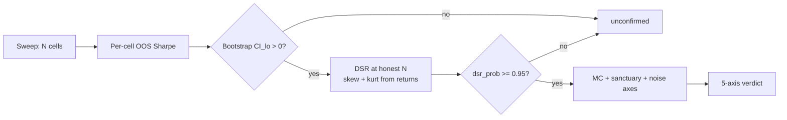

# 9. Beating your own optimiser

You ran a parameter sweep. A hundred-and-something combinations of lookback, threshold, and stop. One of them posted a Sharpe of 1.3, and now you want to deploy it. Here is the uncomfortable question this chapter answers: **how much of that 1.3 did you earn, and how much did you simply *find* by looking at enough cells?**

The answer is almost never "all of it." Searching a grid is not a neutral act of measurement. Every cell you try is another draw from a distribution, and the maximum of many draws drifts up even when none of the draws has any edge at all. The best cell in a sweep is *selected for being lucky*: that is the literal definition of "best." So the headline Sharpe you report is biased high by an amount that grows with the number of things you tried, and that bias has a name and a correction: the **Deflated Sharpe Ratio** (Bailey & López de Prado, 2014).

This chapter is the multiple-testing layer of Part II. [A backtest you can trust](backtest-you-can-trust.md) made a *single* Sharpe honest: right units, no peeking, error bars. [Walk-forward](walk-forward.md) made sure you weren't scoring on data you fit. DSR closes the last optimism leak: the one that comes not from any single backtest being wrong, but from *picking the winner out of many right ones.*

## The principle: the max of N draws is not the mean

Suppose every parameter cell in your grid is genuinely worthless: true Sharpe zero, every one. Run the backtest on each and you still get a *distribution* of estimated Sharpes, because each is computed on a finite, noisy sample. Some land at −0.4, some at +0.5, and, purely from sampling variance, one lands highest. Report that one and you've manufactured a positive number from nothing.

The size of the manufactured number depends on two things, and only two:

1. **How many cells you tried (`N`).** More draws, higher max. This is the part everyone underestimates.
2. **How spread-out the cells' Sharpes are (the cross-trial Sharpe standard deviation, `σ_SR`).** Wider spread, higher max.

Bailey & López de Prado give the expected maximum Sharpe *under the null of zero true edge* in closed form:

$$
\mathbb{E}[\max SR_N] \approx \sigma_{SR}\Big[(1-\gamma)\,\Phi^{-1}\!\big(1-\tfrac{1}{N}\big) + \gamma\,\Phi^{-1}\!\big(1-\tfrac{1}{N e}\big)\Big]
$$

where `γ` is the Euler-Mascheroni constant and `Φ⁻¹` is the inverse normal CDF. You don't need to love the algebra; you need the shape of it. The bracketed term is a slowly-growing function of `N`, call it the **noise ceiling multiplier**. Multiply it by your sweep's actual Sharpe spread `σ_SR` and you get the Sharpe you'd expect to see *from the best cell of a totally dead grid*.

Here is that multiplier, computed straight from Titan's `deflated_sharpe`:

| Cells tried `N` | Noise-ceiling multiplier | `E[max SR]` if `σ_SR ≈ 0.30` (illustrative) |
|---:|---:|---:|
| 6   | 1.30 | ≈ 0.39 |
| 20  | 1.90 | ≈ 0.57 |
| 120 | 2.59 | ≈ 0.78 |
| 240 | 2.82 | ≈ 0.85 |
| 500 | 3.05 | ≈ 0.92 |

Read the `N = 120` row. With a perfectly ordinary cross-trial spread, the *expected* best-of-grid Sharpe is around **0.8, from variance alone, with zero real edge anywhere in the grid.** That is the whole intuition of this chapter in one number. If your 120-cell sweep produced a winner at 0.9, you have found essentially nothing; you've found the noise ceiling with a thin coat of paint. A naive bootstrap CI won't save you here either: it asks "is *this one* series significant?" and never knows it was the survivor of a beauty contest.

!!! note "The fifth lie's bigger sibling"
    [The backtest chapter](backtest-you-can-trust.md) ended on *"a Sharpe is an estimate, not a fact"* and prescribed a bootstrap confidence interval. DSR is the version of that lesson for a *family* of estimates. The bootstrap CI controls the error on one number; DSR controls the error on the *selection* of that number from many. You need **both**, and that ordering matters: DSR is applied *in addition to*, never *instead of*, the CI gate.

## How DSR deflates

The Deflated Sharpe Ratio converts the gap between your observed Sharpe and the noise ceiling into a probability:

> **`DSR = P(true Sharpe > 0)`**, after accounting for `N` trials and the return distribution's shape.

Three inputs go in, and getting any of them wrong corrupts the answer:

- **The gap.** `SR_hat − E[max SR_N]`. If your winner doesn't clear the noise ceiling, the gap is negative and the deflated probability collapses toward zero. This is the multiple-testing penalty made concrete.
- **The trial count `N`.** Drives the ceiling. Honest counting is the entire game (next section).
- **The return distribution's skew and kurtosis.** The Sharpe estimator's *own* sampling error is wider for skewed, fat-tailed returns. A strategy whose edge is "win small often, lose big rarely" (negative skew, high kurtosis) has a noisier Sharpe than its point estimate suggests, so the same observed Sharpe earns a *lower* deflated probability. Titan's implementation reads these moments from the actual return series rather than assuming normality:

```python
from titan.research.framework.dsr import deflated_sharpe, sr_var_from_sweep

# σ_SR² estimated across the FULL sweep, not the survivors (see below).
sr_var = sr_var_from_sweep(all_cell_sharpes)

res = deflated_sharpe(
    sr_hat=canonical_sharpe,          # the cell you actually want to deploy
    sr_var_across_trials=sr_var,      # spread of Sharpes across all N cells
    returns=canonical_oos_returns,    # this cell's OOS series -> skew + kurt
    n_trials=N,                       # the HONEST trial count
)
print(res.dsr_prob, res.e_max_sr)     # gate: dsr_prob >= 0.95
```

The result object carries its own diagnostics, `e_max_sr`, the skew/kurt it used, the variance-stabilised gap `z`, and a `survivors_only` flag, so a reviewer can see *why* a cell passed or failed, not just the verdict. The deployment gate is `dsr_prob >= 0.95`.

!!! tip "Report `e_max_SR` next to every sweep winner"
    The single most clarifying habit: print the noise ceiling beside the headline number. "Best cell SR = 0.9, `e_max_SR` = 0.85" tells the whole story at a glance: the winner is *barely* above what an empty grid would have produced. A reader who only sees "0.9" thinks you have a strategy. A reader who sees both knows you have a coin flip.

## Counting `N` honestly is the hard part

The formula is mechanical. The judgement is in `N`, and it is almost always *larger* than the number you instinctively report.

| What you tried | Naive `N` | Honest `N` |
|---|---:|---:|
| A 5×4×6 grid, ran once | 120 | 120 |
| "I only swept 6 cells", after 4 earlier exploratory grids you abandoned | 6 | the cumulative total across all the grids you looked at |
| Screened a universe of ~500 instruments, kept the handful that looked good | a handful | ≈ 500 |
| Tweaked the stop "by hand a few times" until it looked right | 1 | every variant your eyes evaluated |

The rule Titan enforces: **`N` is the size of the candidate pool you selected from, not the number of survivors.** If a strategy passed through a several-hundred-name screener, `N` is the whole pool (even if you only carried a handful of names forward) because the selection pressure was applied across every name. Using the survivor count understates the ceiling and inflates `dsr_prob`. Worse, the *variance* term has the same trap: estimate `σ_SR` from the survivors only and you get a too-small spread (survivors are, by construction, the cells that clustered high), which *also* biases the probability optimistic. The framework lets you do it when full-pool data is unavailable, but it forces you to admit it:

```python
# Only have the survivors' Sharpes? You may pass them, but the result
# is FLAGGED optimistic -- the true ceiling is higher than this.
res = deflated_sharpe(..., survivors_only=True)
assert res.survivors_only  # documented as a LOWER BOUND on the penalty
```

The deepest version of honest counting is **pre-registration**: write down the grid and the trial count *before* you run it, commit it to git, and let the audit read `N` from that committed manifest. Titan's audit wrapper refuses to run against an uncommitted pre-reg precisely so that `N` cannot be quietly shrunk after the winner is known. That machinery lives in [the sanctuary & decision matrix chapter](sanctuary-decision-matrix.md); here the point is narrower: **the trial count is an input to a significance test, so inventing it after the fact is the same sin as p-hacking.**

!!! danger "War-story: the screener winner that was indistinguishable from noise"
    A breakout strategy was run across a large universe (a few hundred instruments) and the handful that survived posted eye-catching annualised Sharpes, some in the high single digits on short, sparse samples. The instinct was to deploy the survivors. Then we ran DSR at the *true* trial count (the full screener pool, not the survivors) and the picture inverted. Because the per-instrument samples were short and the cross-trial Sharpe spread was large, the noise ceiling `e_max_SR` came out *enormous*, well above every survivor's observed Sharpe. Even using the deliberately *optimistic* survivors-only variance, **every surviving cell failed the DSR gate.** The "winners" were exactly what a dead universe of that size and sample length produces by chance. Two compounding mistakes had hidden it: scoring sparse-trade strategies on a per-bar Sharpe annualised by a huge factor (which inflated the raw numbers), and never deflating by the real `N`. The rule it bought: **a screener's `N` is the pool, not the podium; and a sweep with more than a handful of cells is unconfirmed until DSR is run at that `N`, on top of the bootstrap CI.**

## Where DSR sits in the gate

DSR is not a standalone verdict. In Titan it is one of five axes in the decision matrix, alongside the bootstrap CI lower bound, a Monte-Carlo drawdown test, a held-out sanctuary year, and a noise-robustness check. A cell must clear `dsr_prob >= 0.95` to score "best" on its axis; below ~0.5 it scores "worst." No single axis deploys a strategy, but a failing DSR caps the verdict hard.



The ordering is deliberate and cheap. CI and DSR are seconds of compute; the Monte-Carlo and sanctuary axes are minutes-to-hours. So the sweep gate runs **CI_lo, then DSR, first**, and a strategy that can't clear the noise ceiling never reaches the expensive machinery. Many decayed published edges die right here, in under a minute, because their best-of-grid cell sits below `e_max_SR`.

!!! warning "War-story: the plateau that was a single lucky spike"
    A defensive overlay was being tuned by sweeping its kill-and-re-entry thresholds. One specific cell posted a beautiful drawdown profile: `P(MaxDD > 50%)` of half a percent in Monte Carlo. The team nearly committed it. But the neighbouring cells told a different story: nudge the kill threshold one step and the same metric jumped to 25 to 30%. The "safe" cell wasn't a robust region of the parameter space; it was a **single spike surrounded by cliffs**, the textbook signature of fitting noise, not signal. We added a *plateau* pre-flight that runs before the audit: take the winner and its grid neighbours, and if their relative Sharpe spread is too wide, abort; there is no robust region to deploy. DSR is the quantitative form of this concern (the max of `N` draws); the plateau check is its structural form (a real edge survives small parameter perturbations, a fitted one doesn't). The rule: **a sweep winner must be a plateau, not a peak; and it must clear DSR at the full `N` before any compute is spent past the gate.** A lone lucky spike fails both tests, and it should.

## DSR is a *selection* control, not a quality stamp

One caveat, because it is the way DSR gets over-trusted. A high `dsr_prob` says "this Sharpe is unlikely to be a multiple-testing artifact." It does **not** say the strategy is deployable, or even good. A signal can clear DSR and still die at the next gate, most commonly when realistic costs eat the edge, or when the held-out sanctuary year diverges from the WFO. DSR also can't see selection it wasn't told about: the abandoned grids, the eyeballed stop tweaks, the four earlier experiments you don't count. **It deflates the trials you declare. Declaring them honestly is on you.**

And like every number in Part II, the inputs to DSR obey the same measurement rules. A `dsr_prob` computed on a look-ahead equity curve, or on a per-bar Sharpe that should have been per-trade, is exactly as worthless as the Sharpe that fed it. DSR is a correction *on top of* a trustworthy Sharpe, never a substitute for one. The full battery of livability metrics (Sortino, Calmar, CVaR/CDaR, and a formal risk of ruin at deployed size) is the subject of [the metric suite](metric-suite.md) and [position sizing](../part5-portfolio-risk/position-sizing-kelly.md); DSR just makes sure the Sharpe you carry into them was *earned*, not *mined*.

## Takeaways

- **Searching a grid inflates your best result.** The maximum of `N` noisy estimates drifts up even when every cell has zero true edge; the more cells, the higher the drift.
- **Deflate it.** The Deflated Sharpe Ratio subtracts the expected null max (driven by `N` and the cross-trial Sharpe spread) and returns `P(true Sharpe > 0)`. Gate at `dsr_prob >= 0.95`. Any sweep beyond a handful of cells needs it.
- **Count `N` honestly.** It's the candidate *pool*, not the survivors; it includes abandoned grids and hand-tweaks; pre-register it so it can't shrink after the winner is known. Survivors-only variance and `N` both bias the probability optimistic; flag them when you must use them.
- **Use the actual distribution's skew and kurtosis.** Fat-tailed, skewed returns make the Sharpe noisier than a normal assumption implies; DSR should penalise them, and Titan's does.
- **DSR sits on top of the bootstrap CI, not instead of it**: CI controls the error on one estimate, DSR controls the error from selecting it. Run both, cheaply, before any expensive gate.
- **A high `dsr_prob` is a selection clearance, not a deployment stamp.** Costs, drawdown paths, and the sanctuary year still get a vote.

---

DSR closes the multiple-testing leak in a *single* candidate's evaluation. Two chapters take the rigour further: [Tail risk & risk of ruin](tail-risk-and-ruin.md) turns drawdown geometry into a survival probability at deployed size, and the [Sanctuary decision matrix](sanctuary-decision-matrix.md) shows how DSR becomes one binding axis among five, including the pre-registration discipline that keeps `N` honest in the first place.
