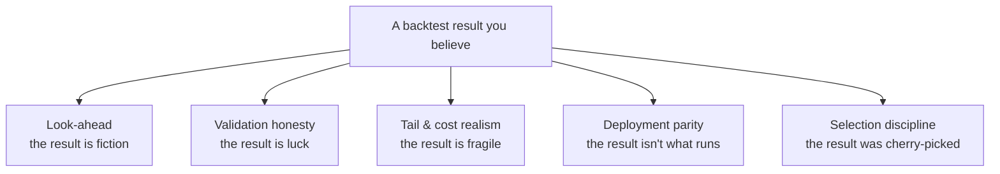

# 12. War-stories: the failure-mode catalogue

Every rule in this book was bought with a bug. The disciplines in the preceding chapters (shift the signal, gate on the lower bound, deflate for the sweep) did not arrive as wisdom; they arrived as post-mortems. This chapter is the ledger: it collects the failures, sanitised, and for each one names the consequence and the rule it forced into the framework.

The reason to keep a catalogue rather than a tidy list of best practices is that **the same bug class recurs forever** if you only fix instances. A researcher who never saw the same-bar leak will write it again next quarter, in different pandas, and it will look like ordinary code. Best practices are advice; a catalogued failure mode is a gate. And note who caught these: mostly not the author. You do not find your own look-ahead bug by re-reading the code that contains it; you find it with an independent path that disagrees.

We group the catalogue into five families, because the root causes cluster:

---

## Family 1. Look-ahead: the result is fiction

These are the bugs where the backtest measured something that could not have been traded. They are the most dangerous family because the equity curves they produce are not merely good, they are *plausible*: a same-bar leak on an autocorrelated signal manufactures exactly the smooth, persistent P&L a real edge would.

!!! danger "War-story: the signal that earned the bar it was looking at"
    A regime-rotation strategy chose its position at the close of bar *t* using a momentum rank computed from data including bar *t*, then collected bar *t*'s return on that position. Decision and reward lived in the *same* time window. Because momentum is serially correlated, the leak didn't add noise; it added a beautiful, fake trend. An audit found the identical pattern in **four separate places** in one codebase, each a signal series multiplied by a contemporaneous return, none caught in review because each read as routine pandas (`ret.where(cols == winner)`).

    **Consequence.** The stitched out-of-sample inflation was strongly instrument-dependent, small and negative on a noisy series, materially positive on a trending one (illustrative: order of a few percent per year), enough to flip a flat strategy to a deployable one. **The rule it bought (A1/A2):** any series that multiplies a return must be `.shift(1)`'d first, unless you can *prove* the position was knowable strictly before the return's window opened. Treat same-bar `position * return` as guilty until proven innocent, and verify with a value-corruption causality test, not by eye; the shift discipline is worked end-to-end in [A backtest you can trust](backtest-you-can-trust.md).

The subtler cousin of same-bar collect is the *bounded* leak. That same audit found the inflation depends on **position persistence**: a strategy that holds until its prediction flips has few transition bars, so the leak is small; a fresh-decision-every-bar strategy can collapse when fixed. The lesson is not "the leak is sometimes harmless" (fix it regardless) but *quantify it before you assume it dominates*, because the size of the bias tells you whether there was ever an edge underneath.

A second look-ahead shape hides in feature construction. A z-score over the *whole* series (`(x - x.mean()) / x.std()`) lets every historical bar "know" statistics from bars that hadn't happened yet; it never touches a return directly, which is why it survives review. The fix is causal or in-sample-frozen normalisation, and the deeper pattern is to make the dangerous version *absent from the API*: Titan's metrics module offers no full-series z-score, so it cannot be called by accident. Cross-timeframe aggregation is the same trap in a different coat: forward-filling a higher-timeframe signal onto past lower-timeframe bars once turned a true-zero-edge strategy into a phantom with a Sharpe near +2 (illustrative), all of which evaporated once the fill was made causal. The discipline: `.shift(1)` *then* reindex-with-ffill, wrapped in a causality assertion.

| Look-ahead bug | What it looks like | The rule it bought |
|---|---|---|
| Same-bar collect (A1/A2) | `position * return` with no lag | Lag any series before it multiplies a return; value-corruption causality test in CI |
| Future-normalised feature | `(x - x.mean()) / x.std()` over all time | Only causal / IS-frozen normalisation exists in the API |
| Cross-TF ffill | higher-TF signal ffilled onto past bars | `.shift(1)` then reindex; wrap in `assert_causal` |

!!! warning "War-story: when 'is it a data bug?' is the right first question"
    A cross-sectional momentum audit came back uniformly negative, contradicting a published edge. Before blaming the strategy, we asked the cheaper question: *is the data wrong?* It was: the download kept price-only `close` and dropped total-return `adj_close`, systematically under-ranking dividend payers. We re-downloaded with total returns and re-ran; the result got *more* negative, not less. **The rule it bought (A3 + the falsification discipline):** total-return vs price-only must be explicit in every cost-model and return signature, and for any surprising RETIRE you write two or three data-construction hypotheses and test the cheapest first. Here the fix confirmed the verdict, but had it flipped the sign, we'd have caught a false retirement. The fifteen "wasted" minutes are the insurance that makes a negative result trustworthy.

---

## Family 2. Validation honesty: the result is luck

The look-ahead family is about whether the number is *real*. This family is about whether a real number is *durable*: whether it survives being one of many tries, a thin sample, or a single lucky regime.

The headline failure is the **co-committed pre-registration**. A scripted git scan of one program found that almost every pre-registration file was first committed *in the same commit as its own verdict*: no timestamp evidence that the canonical cell, the fold count, or the thresholds were fixed before the run. That doesn't make the verdicts wrong; it makes the entire deflation defence (multiple-testing correction, cross-selection penalty) **unverifiable**, in both the RETIRE and DEPLOY directions. A pre-registration you can edit after seeing the result is a diary, not a contract.

!!! warning "War-story: the deflation that deflated nothing"
    A *deploying* audit fed its Deflated-Sharpe calculation a hand-picked four-cell "plateau" as both the trial count `N` and the variance-across-trials. The full sweep had been far larger; the deflation was computed as if only four hypotheses had ever been tried, and the optimism went **unflagged** because the survivors-only mode defaulted to silent. The strategy carried real weight in the live book.

    **Consequence.** Too-weak deflation on a strategy certifying capital. **The rule it bought (A5):** for any sweep with more than a handful of cells, the DSR's `N` and trial-variance come from the *full screener pool*, not the survivors; survivors-only mode must self-flag as optimistic; and across a research program you need a family-wise / FDR control, because fifty independent audits each tested against a fresh 0.95 gate will eventually deploy a luck-survivor.

Two quieter failures sit underneath. First, the **lower bound that lied**: an IID bootstrap resamples bars independently, destroying the serial correlation that trend and carry strategies live on, which narrows the interval and biases the *lower bound upward*, the exact number you gate on. A stationary block bootstrap fixes it. Second, **the sanctuary that couldn't rescue, and the matrix that let it try**: holding out the most recent twelve months is mandatory because that year is often anomalously strong, but a positive sanctuary can never lift a strategy whose walk-forward lower bound is negative. A *count-of-best-axes* decision matrix has no hard veto: a catastrophic hold-out Sharpe of −0.5 scored identically to a mediocre axis, so a strategy that *lost money on the hold-out year* still earned a non-RETIRE tier. The rule (A4 + the veto): out-of-sample requires per-fold selection or genuine pre-registration, and any "worst" on the sanctuary or CI-lower-bound axis caps the verdict regardless of the other axes.

!!! note "Negative results are output, not waste"
    A failed audit is data. One research cycle produced dozens of nulls: IC censuses with zero survivors, strategies retired at the plateau gate, confluence tests where gating *destroyed* the signal, each logged with its failure *mechanism* and the decision rule applied. **The rule it bought (V3.6):** document the dead end so the next researcher (or you, in six months) doesn't re-run it without fresh pre-registration. A catalogue of what *doesn't* work is as load-bearing as the list of what does. Whole families of pre-2014 published edges now get framed as *falsification tests*, not replication targets, precisely because the catalogue made the decay pattern visible.

---

## Family 3. Tail and cost realism: the result is fragile

A Sharpe can be real, durable, and still describe a strategy you cannot survive. This family is about the numbers that decide *livability*: drawdown geometry, tail loss, and the costs that quietly eat the edge.

A Sharpe past every statistical gate still hid a double-digit, year-plus drawdown no committee would hold: it bought **Calmar lift (not Sharpe lift) as the primary promotion metric**; full telling in [the metric suite](metric-suite.md) and [tail risk & ruin](tail-risk-and-ruin.md).

The cost side is its own graveyard. A pure `bps_per_turnover` model under-prices reality the moment notional is small, the broker charges a per-fill commission floor, or a vol-target overlay produces many tiny daily rebalances. A live cost audit on a real paper account found the *true* drag was several times the modelled drag (illustrative: a low-double-digit bps/yr estimate that grew to roughly five times that once the gaps were closed): the model had missed the commission floor, mis-calibrated the ETF leg, and counted sub-threshold rebalances the live class would have skipped. It didn't flip the verdict, but it turned a comfortable margin into a thin one. Continuous futures legs are worse: an always-on position pays nothing in most models for mandatory quarterly rolls (on the order of tens of bps/yr per instrument), and research exits at the clean close while live stops gap through it.

A tail gate resampled the strategy's own returns instead of the underlyings, re-confirming the realised path; **(A6) Monte Carlo perturbs inputs, not outputs**, and long-only sleeves need a relative (vs buy-and-hold) MaxDD gate; full mechanism in [tail risk & risk of ruin](tail-risk-and-ruin.md).

A close relative of the MC bug is the **overlay applied to the wrong layer**. It is tempting to model a position-scaling overlay (vol-targeting, a Kelly haircut, a regime gate) by computing the base strategy's returns and then *post-multiplying* by a scale series. That is wrong whenever scaling changes turnover, costs, or the interaction with stops, which it almost always does. A 0.5× scale isn't half the return; it's a different trade with different fills.

!!! tip "Position scaling changes the engine, not the output"
    **The rule (A7):** a scaling overlay must be wired *into* the backtest engine so it changes the positions the engine actually trades (and therefore the costs, the fills, and the drawdown path), not bolted on as a multiplier after the P&L is computed. The same discipline catches a related class of fragility: bare-threshold regime gates (`signal >= K`) flip on noise near the boundary and fail an input-noise robustness test. Prefer percentile gates, ensembles, or continuous (sigmoid) scaling, and remember that input-noise robustness and parameter-plateau robustness are *different* tests; a strategy can pass one and fail the other.

---

## Family 4. Deployment parity: the result isn't what runs

The most expensive gap in a quant stack is not in the research; it is between research and the live code. You can pass every gate in Part II and still lose money because the thing that trades is not the thing you validated.

!!! danger "War-story: the strategy guide that didn't match the deployed config"
    A live strategy's user guide documented one set of parameters; the deployed configuration ran another, unreconciled after a tuning pass. The guide, the document an operator reaches for at 2 a.m. during an incident, described a system that wasn't running. **The rule it bought (A9):** the strategy guide must match the deployed config *parameter-for-parameter*, verified, not trusted. A guide that disagrees with the live `.toml` is worse than no guide; it actively misleads the person trying to fix a live position.

The deeper parity problem is that "validated" often means "validated *something*." An external audit found a live equity sleeve built on best-of-N *current* index constituents, the exact survivorship-plus-selection construction a previous strategy had been *retired* for, in production with docstring Sharpes the audit itself called "implausibly high." The validation existed; it just didn't validate the thing that shipped.

!!! warning "War-story: 'validated against X' with no artifact"
    A claim that a strategy had been "validated against" a reference appeared in a docstring with no checked-in artifact and no reproducible test behind it. Nothing to re-run, nothing to diff, nothing to fail in CI. The claim was load-bearing for a deployment decision and unfalsifiable.

    **Consequence.** A deployment justified by a sentence rather than a test. **The rule it bought (A8):** "validated against X" requires a checked-in artifact plus a reproducible test that regenerates it. If you cannot point to a file and a command that re-derives the comparison, the validation does not exist. Same instinct as the frozen-ML-artefact rule: a model file is a *build artefact* of its feature pipeline: embed the feature names, assert compatibility on load, and put a one-row prediction in CI, or the only warning you get is a crash on the first live bar.

The parity test itself has a precise shape, and getting it wrong gives false comfort. It is not enough to check that the live signal *exists*; you must check that the live `on_bar` signal at *t* equals the vectorised research signal at *t*, computed by an **independent reference** down the **full chain** (data load, feature build, signal, sizing), with a **causality test** confirming the live path can't see the future either. A parity test that re-uses the research code as its own reference proves only that the code equals itself.

!!! danger "War-story: the leveraged instrument sized as if it weren't"
    A live strategy class sized its position in instrument units without accounting for an instrument that carried **native leverage**: the contract already embedded a multiplier the research-side sizing had folded in differently. The live class needed to *scale by tier* to match the validated exposure; it didn't, so the live position didn't match the size the research had risk-checked.

    **Consequence.** Live exposure diverging from validated exposure on a leveraged instrument, the most dangerous place for a sizing error, because leverage scales the loss and the ruin probability by the same factor. **The rule it bought (A10/A11):** parity tests run end-to-end through the full chain with an independent reference and an explicit causality test, and the live class must scale by tier whenever the instrument has native leverage. Sizing is not a detail you eyeball; it is a contract the parity test enforces.

For the full treatment, the contract a strategy class must satisfy and the replay harness that certifies the live path against the proven-causal research path, see [Live equals research](../part4-research-to-prod/live-equals-research.md) and [The strategy-class contract](../part4-research-to-prod/strategy-class-contract.md).

---

## Family 5. Selection discipline: the result was cherry-picked

The final family is about the choices you make *around* the backtest: which parameter, which instrument, which control is doing the real work. These are bugs of an honest researcher's optimism rather than a coding mistake, which makes them the hardest to see.

A canonical cell posted a strong Sharpe while a one-step neighbour in the same grid dropped by half: a lucky coordinate, not an edge. **The rules it bought (V3.1 + V3.2): pre-commit the selection rule and select the plateau, not the peak**, run cheaply before any Monte Carlo. This is the qualitative twin of [Beating your own optimiser](deflated-sharpe.md), the quantitative form of the same concern.

The single-instrument version is the **unrecorded search**. When a legacy config names one instrument from a class of plausible candidates (trend on this ticker, carry on that pair), the chosen instrument is almost certainly the survivor of a search nobody wrote down, and its in-sample Sharpe overstates the true cross-sectional edge by an unknown order statistic. The rule: always run a multi-instrument robustness panel, because a single named instrument is a confession of selection bias until proven otherwise.

A V3.4 ablation (turning each component off one at a time) caught a "ballast" piece, a defensive switch assumed to be along for the ride, actually carrying the edge: **prove which components matter with an ablation rather than assuming, and because its value is in the left tail, judge ballast on `p_kill_trip`, not a return metric** (see [tail risk & risk of ruin](tail-risk-and-ruin.md)). The same lens reframed our drawdown breakers: they are *failsafes, not primary controls* (V3.5). A breaker stacked on a vol-targeted strategy fires rarely and occasionally clips a recovery: useful as a last line, harmful as the main risk system. The primary control is the continuous size haircut; the breaker is the seatbelt, not the steering.

Together this family is the difference between *we chose this* and *this is what survived our suspicion*: a pre-committed selection rule (V3.1), a plateau over a peak (V3.2), a recorded instrument search, an ablation to find the load-bearing parts (V3.4), failsafes kept in their place (V3.5), and every dead end documented (V3.6).

---

## How the catalogue becomes a gate

A war-story you only tell at the bar changes nothing. The point of cataloguing each failure is to convert it into something that can't recur silently. The conversions take three forms, in order of strength:

| Form | Strength | Example |
|---|---|---|
| A prose lesson with a mechanism | weak: relies on memory | "remember the carry premium is `yield × time-in-market / vol`, not `yield / vol`" |
| A safe-by-construction API | strong: the wrong call doesn't exist | no full-series z-score; `periods_per_year` has no default |
| An automated CI gate | strongest: the bug fails the build | AST check rejecting `sqrt(252)`; value-corruption causality test |

The honest assessment, delivered by an external auditor, is that most lessons in a young program are still *prose*, the weakest form. The work of maturing a stack is dragging each catalogued failure up that table: from "we know not to do that" to "you literally cannot do that." Every bug here that became an absent API call or a CI gate cannot reappear; every one still living as a paragraph in a directive is waiting to be rediscovered by whoever didn't read it.

---

## Takeaways

- **Bugs cluster into five families:** look-ahead (fiction), validation honesty (luck), tail/cost realism (fragile), deployment parity (not what runs), selection discipline (cherry-picked). Diagnose by family, not by symptom.
- **Every error here flattered the strategy.** That asymmetry is why suspicion beats celebration: optimistic versions are the ones that survive your attention and reach production.
- **You don't catch your own leak by re-reading your code**; you catch it with an independent path that disagrees. Internal re-derivations and external adversarial audits found most of these, not the authors.
- **Parity is where research meets capital.** A guide that doesn't match the config, a "validation" with no artifact, a leveraged instrument sized as if it weren't: these lose money even when the research was perfect.
- **A catalogued failure is only as good as its enforcement.** Prose relies on memory; a safe-by-construction API or a CI gate cannot be skipped. Drag every lesson up that table.

---

The next part turns the strongest of these rules into machinery: [The strategy-class contract](../part4-research-to-prod/strategy-class-contract.md) defines what a strategy must satisfy to deploy at all, and [Live equals research](../part4-research-to-prod/live-equals-research.md) builds the parity harness that makes the deployment-parity family impossible to ship. For the statistical machinery behind Families 2 and 3, see [Walk-forward that's actually out-of-sample](walk-forward.md), [Beating your own optimiser](deflated-sharpe.md), and [Tail risk & risk of ruin](tail-risk-and-ruin.md).
