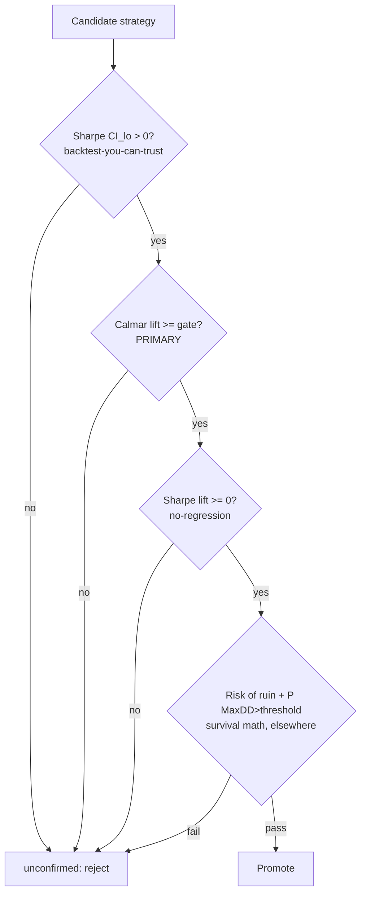

# 7. Beyond Sharpe: the metric suite

A Sharpe ratio answers one question, *return per unit of volatility*, and answers it well. The trouble is that it's the only question most pipelines ever ask, and it is silent on the questions that actually decide whether you can hold a strategy through a bad year: How deep does it dig? How long does it stay underwater? When it loses, does it lose a little or does it lose everything? A strategy can ace the Sharpe gate and still be one you'd switch off at the worst possible moment, locking in the loss the average smoothed over.

[A backtest you can trust](backtest-you-can-trust.md) made the Sharpe number *honest*. This chapter makes it *sufficient*, by surrounding it with the four metrics that catch what it misses: Sortino for asymmetry, Calmar (over geometric CAGR) for drawdown geometry, and CVaR/CDaR for the tail that ends you. Then it states the rule those metrics bought, **Calmar lift, not Sharpe lift, gates promotion**, and ends with the warning that ties the whole part together: every one of these numbers obeys the same five measurement lies.

## The principle: one number cannot describe a path

Two strategies can have an identical Sharpe and feel nothing alike to hold. Sharpe is a property of the *return distribution* (mean over standard deviation) and it throws away the *order* of the returns. But order is exactly what a human (and a risk committee, and a margin engine) experiences. A strategy that earns its return as a smooth ramp and one that earns the same return via a 40% crater followed by a heroic recovery have the same mean and the same volatility. They do not have the same Calmar, the same time-to-recovery, or the same probability of getting switched off at the bottom.

So the discipline is to report a **vector**, not a scalar. Each component answers a different question, and a strategy has to clear all of them, because they fail independently. Here is the suite Titan computes for every candidate, and the question each one is the *right* tool for:

| Metric | Answers | Why Sharpe can't | Family |
|---|---|---|---|
| **Sharpe** | Return per unit of total volatility | n/a (the baseline) | Risk-adjusted return |
| **Sortino** | Return per unit of *downside* volatility | Sharpe penalises upside spikes identically to crashes | Risk-adjusted return |
| **Calmar** | Return per unit of *worst drawdown* | Sharpe ignores the path entirely | Drawdown geometry |
| **Max drawdown** | The single worst peak-to-trough | A distribution average hides the worst point | Drawdown geometry |
| **CVaR** (Expected Shortfall) | *Average* loss in the worst α-tail of bars | Sharpe under-weights a fat left tail | Tail risk |
| **CDaR** | *Average* depth of the worst α-tail of drawdowns | MaxDD reports only one point on the curve | Tail risk |

!!! note "Where each metric lives in the book"
    This chapter owns the *return-and-drawdown* battery. Turning the tail into a **survival probability at deployed size** (risk of ruin, and the Monte-Carlo `P(MaxDD > x%)` constraint) is the job of [Tail risk & risk of ruin](tail-risk-and-ruin.md). Turning a Sharpe/Kelly estimate into a *position size* you can survive is [Position sizing: Kelly & vol-targeting](../part5-portfolio-risk/position-sizing-kelly.md). Read this one for the diagnostics; those two for the decisions they feed.

## Sortino: stop punishing the good surprises

Sharpe divides excess return by the standard deviation of *all* returns. Standard deviation is symmetric: a +5% day and a −5% day move it by the same amount. But you do not feel them the same way, and you should not penalise them the same way. A strategy whose volatility comes from occasional sharp *gains* is being unfairly marked down by Sharpe for the crime of making money in lumps.

Sortino fixes this by replacing the denominator with **downside deviation**, the standard deviation computed only over returns below a target (usually zero):

```python
def sortino(returns, periods_per_year, *, target=0.0, ddof=1):
    s = _as_series(returns).dropna()
    if len(s) < 20:
        return 0.0
    downside = s[s < target]            # only the bad bars enter the denominator
    if len(downside) < 5:
        return 0.0
    dsd = downside.std(ddof=ddof)
    if dsd < 1e-12:
        return 0.0
    return (s.mean() - target) / dsd * math.sqrt(periods_per_year)
```

Two design choices in that snippet are worth lifting out, because they recur across the suite:

- **It requires `periods_per_year`.** No default. Sortino is annualised by the same `sqrt(periods_per_year)` factor as Sharpe, and it is just as wrong if you hand H1 returns the daily factor. Lie #1 from the previous chapter applies verbatim.
- **It refuses to lie on thin data.** Fewer than 20 samples, or fewer than 5 downside bars, returns `0.0` rather than a flattering ratio computed from three bad days. A near-empty denominator is how Sortino blows up to a meaningless 14.0 and someone deploys it.

The Sortino/Sharpe *gap* is itself a diagnostic. If Sortino is much higher than Sharpe, the strategy's volatility is mostly upside, which is good. If they're close, volatility is symmetric. If Sortino is *lower*, your "risk" is disproportionately to the downside: a quiet warning that the smooth Sharpe is hiding a left-skewed return stream.

## Calmar and the geometric CAGR you must not skip

Calmar is return divided by the worst drawdown: `CAGR / |MaxDD|`. It is the most honest single-number summary of *livability*, because the denominator is the exact quantity that gets a strategy killed mid-trough. A Sharpe of 1.4 tells you nothing about whether you'll have to sit through a 35% hole to collect it. Calmar puts that hole in the denominator.

There is one trap in computing it, and Titan got bitten by it badly enough that the framework now has two separate implementations on purpose.

!!! warning "Arithmetic mean is not your compounded return"
    The convenience Calmar in the shared metrics module uses an **arithmetic** annualised return (`mean(returns) * periods_per_year`), which is fine for quick diagnostics. It is **wrong** for the number that gates promotion. Arithmetic mean overstates what you actually compound by roughly `vol² / 2` per year (the volatility drag). For a strategy with non-trivial volatility over a multi-year window, that overstatement is large enough to flip a promotion decision. The fix is a **geometric CAGR**: build the equity curve, then take its true annualised growth rate.

```python
def compute_cagr(returns, periods_per_year):
    s = pd.Series(returns).dropna()
    n = len(s)
    if n < MIN_BARS_FOR_CALMAR:
        return 0.0
    eq_final = float((1.0 + s).prod())   # the equity curve's terminal value
    if eq_final <= 0.0:
        return -1.0                      # total wipe-out: treat as catastrophic
    return eq_final ** (periods_per_year / n) - 1.0   # GEOMETRIC, compounds correctly
```

The geometric form asks "what constant annual rate would have produced this terminal equity?", the rate you would actually have earned. The arithmetic mean asks "what's the average bar?" and silently ignores that a −50% bar needs a +100% bar to undo it. The two diverge in exactly the direction that flatters a volatile strategy, which is why Titan reserves the geometric CAGR for the promotion Calmar and never the other way around.

Note the `eq_final <= 0.0` branch: a strategy that wipes out the account returns CAGR `−1.0`, not a `NaN` or a divide-by-zero. The metric is built so the catastrophic case produces a *catastrophic number*, not an exception that gets swallowed in a batch run.

!!! warning "War-story: the 1.4-Sharpe strategy nobody could hold"
    A candidate posted a Sharpe around **1.4**, clean past every gate in the previous chapter, with a serially-aware bootstrap lower bound comfortably above zero. On the Sharpe axis it was a clear promote. Then we looked at the *path*. Its peak-to-trough drawdown ran deep into the double digits and stayed underwater for **well over a year** before recovering. The Sharpe never showed it, because Sharpe averages over the path and the path was the problem.

    The arithmetic vs geometric trap made it worse: the convenience Calmar, fed an arithmetic annual return, still looked respectable, because the arithmetic mean papered over the volatility drag that the long trough represented. Only the **geometric** CAGR over `|MaxDD|` told the truth: a Calmar low enough that no human or risk committee would have kept funding the strategy through the hole. It would have been switched off at the bottom, converting a paper drawdown into a realised loss.

    The rule this bought: **Calmar lift (computed on geometric CAGR) is the primary promotion metric.** Sharpe is retained only as a secondary no-regression check. A strategy that improves portfolio return-per-volatility but worsens return-per-drawdown is not an improvement; it is a future kill-switch event with good marketing.

## CVaR and CDaR: average the tail, don't sample it

Value-at-Risk asks "what's the loss at the 5th percentile?", a single threshold. The problem is that VaR tells you nothing about what's *beyond* the threshold. A −3% 5%-VaR is the same whether the worst-5% bars average −3.1% or −30%. The tail past the cutoff is exactly where ruin lives, and VaR is blind to it by construction.

**CVaR** (Conditional VaR, a.k.a. Expected Shortfall) fixes this by averaging the *whole* bad tail instead of reading a single point on it:

```python
def cvar(returns, *, alpha=0.05):
    s = _as_series(returns).dropna()
    n = len(s)
    if n < 20:
        return 0.0
    k = max(1, int(np.ceil(n * alpha)))   # how many bars are "the worst alpha"
    worst = np.sort(s.to_numpy())[:k]      # the k most-negative returns
    return float(worst.mean())            # their AVERAGE, not their threshold
```

`cvar(returns, alpha=0.05)` is the mean of the worst 5% of bars. It is *coherent* (it respects diversification in a way VaR does not) and it is the number that actually answers "when it goes wrong, how wrong, on average?"

**CDaR** (Conditional Drawdown-at-Risk) is the same idea applied to the drawdown curve instead of the bar returns. MaxDD is a single point, the deepest hole. But a strategy that visits −15% *once* and a strategy that visits −12% to −15% a *dozen times* have nearly identical MaxDD and wildly different lived experience. CDaR averages the worst α-fraction of drawdown depths, so the "many medium holes" pattern that MaxDD hides shows up:

```python
def cdar(returns, *, alpha=0.05):
    s = _as_series(returns).fillna(0.0)
    eq = pd.concat([pd.Series([1.0]), (1.0 + s).cumprod().reset_index(drop=True)])
    dd = (eq - eq.cummax()) / eq.cummax()  # the full drawdown path
    k = max(1, int(np.ceil(len(s) * alpha)))
    worst = np.sort(dd.to_numpy())[:k]     # the deepest alpha-fraction of the path
    return float(worst.mean())
```

Note the equity curve is anchored at `1.0` *before* the first bar, the same convention as `max_drawdown`. A first-bar loss is a real drawdown from the starting peak, not a zero because "the peak was never below 1.0." Skip that anchor and you under-report exactly the early drawdowns a new live strategy is most likely to hit.

!!! tip "Read CVaR and CDaR as a pair, not in isolation"
    CVaR is about the *bars* (how bad is a bad day on average); CDaR is about the *path* (how deep are the deep holes on average). A strategy can have a tame CVaR (no individual day is catastrophic) and an ugly CDaR, because it bleeds in long correlated runs. That combination is the signature of a slow-grind drawdown, the kind that's hardest to hold and easiest to switch off at the worst time. Use the α you actually fear; 5% is a starting convention, not a law.

## The promotion gate: Calmar lift is the verdict

Here is where the suite stops being diagnostic and starts deciding capital. In Titan, a new strategy is never promoted on its standalone metrics. It is promoted on whether it makes the *existing portfolio* better, measured primarily by **Calmar lift**, the change in the combined book's return-per-drawdown.

```python
def evaluate_promotion(proposed_returns, current_returns, periods_per_year, *,
                       calmar_lift_gate=0.10, sharpe_lift_gate=0.0):
    proposed_calmar = compute_calmar(proposed_returns, periods_per_year)  # geometric CAGR
    current_calmar  = compute_calmar(current_returns,  periods_per_year)
    proposed_sharpe = sharpe(proposed_returns, periods_per_year=periods_per_year)
    current_sharpe  = sharpe(current_returns,  periods_per_year=periods_per_year)

    cal_lift = proposed_calmar.calmar - current_calmar.calmar
    shp_lift = proposed_sharpe - current_sharpe

    passes_cal = cal_lift >= calmar_lift_gate   # PRIMARY: must improve drawdown-adj return
    passes_shp = shp_lift >= sharpe_lift_gate   # SECONDARY: must not regress Sharpe
    # .passes = passes_cal AND passes_shp
```

The asymmetry is the whole point. Calmar lift is the *primary* gate, with a real positive threshold (`+0.10` here is illustrative; pick the lift you actually require). Sharpe lift is *secondary*, gated only at `>= 0`, a no-regression check, not a promotion driver. A candidate that raises Sharpe but flattens Calmar fails. A candidate that raises Calmar without hurting Sharpe passes. We deliberately put the burden of proof on the metric that maps to *getting switched off*, not the one that maps to *looking smooth*.

And, this is critical, these two conditions are **not the whole gate.** They are the framework-level slice. Full promotion eligibility additionally requires the joint **risk-of-ruin** bound and a Monte-Carlo `P(MaxDD > threshold)` constraint cleared elsewhere; the orchestrator combines all four. The metric suite proposes; survival math disposes. We come back to those two survival constraints in [Tail risk & risk of ruin](tail-risk-and-ruin.md), and to how the whole promote/reject decision is structured in [The sanctuary decision matrix](sanctuary-decision-matrix.md).



## All of these obey the same five lies

The disciplines from [the previous chapter](backtest-you-can-trust.md) were not "Sharpe rules." They were *measurement* rules, and every metric in this chapter inherits them. A Calmar computed on a look-ahead equity curve is exactly as worthless as a look-ahead Sharpe; arguably more dangerous, because "we also checked drawdown" buys false confidence.

| The lie | How it corrupts the *suite* (not just Sharpe) |
|---|---|
| **Wrong units** | Sortino and Calmar are annualised by `sqrt(periods_per_year)` and `periods_per_year` respectively. Hand them an hourly series with the daily factor and every ratio is off by the same `~4.9×`. |
| **Survivor math** | Drop the flat bars and you shrink the denominator of Sortino and inflate CAGR; drawdown depth changes too, because you deleted the calm recovery days. |
| **Peeking** | A `position * same-bar-return` leak manufactures a smooth, plausible equity curve. Calmar, CDaR, CVaR are all computed *from that curve*; they will happily report a beautiful, fake drawdown profile. |
| **Future-normalised** | A full-series z-score feeding the signal poisons every downstream metric identically. The damage is in the returns; the suite just measures it. |
| **No error bars** | A point-estimate Calmar of, say, 2.1 from one history is no more a fact than a point Sharpe. The framework bootstraps a Calmar CI for exactly this reason. |

That last row deserves its own emphasis, because the Calmar bootstrap has a known limitation Titan documents in the source rather than hiding, one of several catalogued in the [failure-mode catalogue](failure-mode-catalogue.md).

!!! warning "War-story: the IID Calmar CI that under-states its own error"
    Titan's `bootstrap_calmar_ci` uses an **IID (block-of-1) bootstrap**: it resamples individual bars independently. That destroys serial correlation, which means for trend and carry strategies it *narrows* the confidence interval and biases the lower bound *upward*, the same optimism the [Sharpe bootstrap audit](backtest-you-can-trust.md) flagged. The honest move is to document the limitation at the point of use and route the *decision* through the serially-aware path: the joint MC ruin/drawdown gate runs a **block** Monte-Carlo that preserves dependence. The IID Calmar CI is acceptable for the cheap "does Calmar lift include zero?" screen; it is **not** the number you'd gate ruin on. The fix wasn't to delete the IID version; it was to write down, in the docstring, exactly which question it's allowed to answer.

## Takeaways

- **Sharpe is necessary, never sufficient.** It describes a distribution; you live a path. Report a vector (Sortino, Calmar, MaxDD, CVaR, CDaR) and require a candidate to clear all of them, because they fail independently.
- **Sortino** rewards strategies whose volatility is upside; a Sortino *below* Sharpe is a quiet left-skew warning.
- **Use geometric CAGR for Calmar.** The arithmetic mean overstates compounded return by ~`vol²/2` per year and flips promotion decisions on volatile strategies. Titan keeps a fast arithmetic Calmar for diagnostics and a geometric one for the gate.
- **CVaR/CDaR average the tail, they don't sample it.** VaR/MaxDD report one point; the average of the worst α-slice is the number that speaks to survival. Read CVaR (bad bars) and CDaR (deep holes) as a pair.
- **Calmar lift gates promotion; Sharpe lift is only a no-regression check.** The primary gate maps to *getting switched off mid-trough*; and even passing it is not the whole story: ruin and `P(MaxDD)` survival math run downstream.
- **Every metric obeys the same five lies.** A look-ahead Calmar is as worthless as a look-ahead Sharpe. Centralise the suite in one audited module so the unsafe version can't be written, and document, at the point of use, which question each estimator is allowed to answer.

---

The suite tells you how bad a strategy *could* be. The next step is turning that into a survival probability at the size you actually intend to trade: [Tail risk & risk of ruin](tail-risk-and-ruin.md) converts CVaR/CDaR and the drawdown geometry into a formal risk of ruin, and [The sanctuary decision matrix](sanctuary-decision-matrix.md) shows how all of these gates combine into a single promote/reject verdict you can defend.
