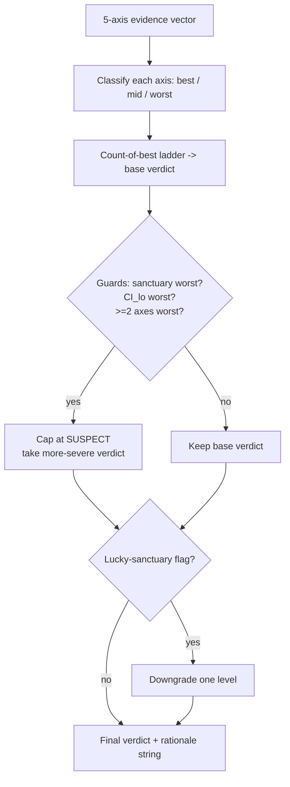

# 11. The sanctuary window & the decision matrix

You have walked the data forward, deflated for the optimiser's tries, and stressed the path with Monte Carlo. Every gate is green. Now someone has to say a single word out loud, *deploy* or *don't*, and stake real money on it. This is the moment most research processes quietly fall apart, because the decision is made by a person, in a good mood, looking at a number they spent three weeks producing.

This chapter is about two disciplines that take that decision out of the researcher's hands. The first is a **sanctuary**: a held-out window the research loop is structurally forbidden from seeing, spent once, at the very end. The second is a **decision function**: a total mapping from evidence to a verdict, so the go/no-go is computed, logged, and reproducible, not argued. Together they answer the question every prior chapter set up but none of them closed: *given all this evidence, do we ship it?*

## The principle: a held-out window beats one more fold

Walk-forward analysis (see [Walk-forward that's actually out-of-sample](walk-forward.md)) is the workhorse of honest backtesting. But it has a leak that no amount of fold discipline can plug: **you, the researcher, see the out-of-sample results.** You run the WFO, the OOS Sharpe disappoints, you change the lookback, you re-run. Each iteration uses OOS performance as a training signal, for *you*. After fifty iterations the "out-of-sample" window has been fit as thoroughly as the in-sample one, just by a slower optimiser with a worse loss function (your judgement). [Beating your own optimiser](deflated-sharpe.md) corrects the *count* of explicit trials; it can't correct the trials you ran with your eyes.

The fix is not statistical, it is procedural. Carve off the most recent stretch of history (a year of calendar time is a reasonable default, long enough to span a regime or two) *before any fold is constructed*, and put it in a vault. The research loop never touches it. Every parameter sweep, every CV fold, every "let me just try one more thing" happens on the **visible** portion. When a candidate is finally finished, frozen, no more knobs, you spend the sanctuary exactly once, as a final-validation pass.

!!! note "Why once, and why last"
    The sanctuary is a one-shot instrument. The moment you look at it, react to it, and re-tune, it stops being held out; it becomes another fold, and you are back where you started. The discipline only works if "spend the sanctuary" is the *last* step before the verdict, and if a failed sanctuary sends the candidate to the bin, not back to the lab. If you cannot resist re-tuning, the sanctuary has no statistical meaning; it is theatre.

A held-out window beats one more CV fold for a reason worth internalising: a CV fold tests *whether the model generalises across resamples of the data you've been staring at*. A sanctuary tests *whether the edge survives into time you could never react to*. The first measures overfitting to a sample; the second, overfitting to a process, which includes you. Live trading is exactly that: data you cannot react to before it prints. The sanctuary is the closest thing to a dry run of deployment that history allows.

## The Titan example: slicing the vault

Titan's sanctuary slice is deliberately boring. Calendar-time, by the last timestamp in the frame, done before anything else (the `months` default below is illustrative, a year, and is the kind of value a strategy class can override in its pre-registration, not a tuned edge parameter):

```python
@dataclass(frozen=True)
class SanctuarySlice:
    visible: pd.DataFrame          # everything the research loop may see
    sanctuary: pd.DataFrame        # the vault - spent once, at the end
    sanctuary_start: pd.Timestamp  # boundary timestamp, logged for audit
    sanctuary_end: pd.Timestamp
    months_held_out: int

def slice_sanctuary(df, months: int = 12) -> SanctuarySlice:
    end = df.index[-1]
    sanctuary_start = end - pd.DateOffset(months=months)
    visible   = df[df.index <  sanctuary_start]
    sanctuary = df[df.index >= sanctuary_start]
    ...
```

Two design choices carry weight. It slices by **calendar months**, not bar count: twelve months is twelve months whether the asset trades hourly or daily, so the held-out *regime exposure* is comparable across strategy classes. And it records the exact `sanctuary_start` timestamp on the result, so an auditor can later confirm that the visible/sanctuary boundary was fixed before fold construction and never moved. A boundary that drifts between runs is a boundary that has been peeked at.

## The lucky-flag divergence test

A passing sanctuary is necessary but not sufficient, because of a subtler trap: the held-out window might have been an *easy* twelve months. A trend strategy validated over a year that happened to trend beautifully has told you it works in trending regimes, which you already knew, not that it works. The sanctuary's positive Sharpe could be regime luck wearing the costume of out-of-sample evidence.

So Titan asks a second question: **is the sanctuary's Sharpe unusual relative to history?** Build the distribution of every same-length rolling-window Sharpe over the visible portion, then locate the sanctuary in that distribution.

```python
arr = np.asarray(historical_window_sharpes)   # rolling 12-mo Sharpes, visible portion
sh_sanc = sharpe(sanctuary_returns, periods_per_year=ppy)
pct = float((arr < sh_sanc).mean())           # percentile of the held-out window

return DivergenceTest(
    sanctuary_sharpe=sh_sanc,
    percentile=pct,
    lucky_flag=pct >= 0.95,    # top 5% of historical windows -> regime-specific
    unlucky_flag=pct <= 0.05,  # bottom 5% -> adverse regime, NOT a veto
)
```

The asymmetry between the two flags is the point, and it follows directly from *suspicion over celebration*:

- **`lucky_flag`** (top 5%) is bad news. If the held-out year ranks among the best twelve-month windows the strategy ever had, its OOS "validation" is likely measuring a favourable regime, not a durable edge. This *downgrades* the verdict.
- **`unlucky_flag`** (bottom 5%) is *not* a veto. A strategy that survived its worst regime in the sanctuary, with the long-run edge still intact in the visible history, may be more trustworthy, not less. It is information for the human, not an automatic kill.

A single twelve-month window is one draw, and one draw can be lucky or unlucky by pure regime. So Titan also runs a multi-window version: hold out the *K* most-recent disjoint windows, divergence-test each against *its own* preceding history, and take a majority vote.

```python
result = multi_window_sanctuary_test(
    strategy_returns, periods_per_year=ppy,
    n_windows=3, months=12,
    block_size=block,   # stationary bootstrap -> honest pooled CI
)
# result.lucky_flag fires only if a MAJORITY of windows landed in the top 5%
# result.sharpe_ci_lo is the bootstrap lower bound on the POOLED held-out Sharpe
```

This turns an *n* = 1 luck check into a *K*-of-*K* vote, and the bootstrapped CI on the pooled sanctuary Sharpe (use the stationary block bootstrap; see [A backtest you can trust](backtest-you-can-trust.md) on why the IID version lies) tells you how firmly the held-out edge clears zero. The aggregate `lucky_flag` is what feeds the decision function as a downgrade.

!!! tip "Sharpe is the gate, not the whole read on the sanctuary"
    We gate the held-out window on Sharpe because it is the axis the matrix scores, but Sharpe alone hides the path. When you spend the sanctuary, look at the held-out window's **max drawdown and recovery time (Calmar)**, its **Sortino** (did the disappointment come from downside, or from missed upside?), and its **worst-slice tail (CVaR)**: the same battery from [Beyond Sharpe: the metric suite](metric-suite.md). A sanctuary that clears the Sharpe gate but carves a drawdown deeper than the strategy class tolerates is still a problem the single number won't surface.

!!! warning "War-story: the candidate that passed every gate, then the sanctuary collapsed it"
    A cross-asset signal cleared the whole battery on the visible history: the bootstrap CI lower bound on stitched OOS Sharpe was comfortably positive, the deflated-Sharpe probability was high, and the Monte Carlo drawdown distribution was inside the class threshold. By every number we had, it was a deploy. Then we spent the sanctuary. The held-out year did not just disappoint; it *lost money*, and the divergence test put the strategy's strong visible-history windows in the top tail: the "edge" had been concentrated in a regime that the held-out year simply didn't repeat. Had the sanctuary been just one more CV fold we'd have re-tuned around it and shipped. Because it was a one-shot vault, the loss was disqualifying. The rule it bought: **an out-of-sample hold-out loss is not fungible with a hygiene-axis miss.** A strategy that lost money on data it never saw coming cannot be a DEPLOY, no matter how clean the rest of the card. We encoded that as a hard guard, below.

## Making the verdict a function, not a judgement call

Here is the load-bearing idea of the chapter. The output of all this evidence-gathering should not be a meeting. It should be a **function**, total, deterministic, and logged, that maps an evidence vector to one of a small set of verdicts. Total means it is defined for *every* possible input; there is no combination of evidence that produces a shrug. The word `UNDETERMINED` should be impossible to return, because "we couldn't decide" is exactly the gap where a researcher's optimism leaks back in.

Titan's `decide()` takes five axes of evidence and returns one of five verdicts.

| Axis | What it measures | "best" means | Source chapter |
|------|------------------|--------------|----------------|
| **CI_lo** | 95% bootstrap lower bound on stitched OOS Sharpe | lower bound > 0 | [Backtest you can trust](backtest-you-can-trust.md) |
| **DSR** | Deflated-Sharpe probability (corrected for trials) | prob ≥ ~0.95 (illustrative) | [Beating your own optimiser](deflated-sharpe.md) |
| **MC** | P(MaxDD > class threshold) from block Monte Carlo | P ≤ the class pass-threshold | [Tail risk & risk of ruin](tail-risk-and-ruin.md) |
| **Sanctuary** | Realised Sharpe on the held-out window | Sharpe > 0 | this chapter |
| **Noise** | Degradation under input-price noise injection | passes mean *and* worst-case | [Failure-mode catalogue](failure-mode-catalogue.md) |

Each axis is classified into three levels, `best`, `mid`, `worst`, by thresholds that live in one place (`GateThresholds`) and can be overridden per strategy class via a pre-registration directive, never edited ad hoc after seeing a result. The verdict then comes from a count-of-best ladder:

```python
verdict_by_n = {
    5: Verdict.DEPLOY,                  # all five axes at best
    4: Verdict.CONDITIONAL_WATCHPOINT,  # one weak axis
    3: Verdict.TIER_UNCONFIRMED,        # promising, not proven
    2: Verdict.SUSPECT,
    1: Verdict.RETIRE,
    0: Verdict.RETIRE,
}
base = verdict_by_n[n_best]
```

!!! note "Why five verdicts, not two"
    A binary deploy/reject throws away information. `CONDITIONAL_WATCHPOINT` says *ship it, but instrument the one weak axis and watch it in production*. `TIER_UNCONFIRMED` says *the edge is plausible but unproven: paper-trade it, don't fund it*. `SUSPECT` and `RETIRE` separate *needs work* from *bin it*. These map onto operational actions (see [Paper-to-live promotion](../part6-deploy-ops/paper-to-live.md)), which a yes/no can't. The values are illustrative labels; what matters is that each is a distinct, pre-agreed action.

### The ladder isn't enough: guards

A pure count-of-best has a flaw the audit caught: it cannot tell a *catastrophe* from a *mediocrity*. A strategy that lost money on the sanctuary scores the same "not best" on that axis as one that was merely not-best on the noise hygiene check. Counting treats them as fungible. They are not. So two guards sit on top of the ladder and take the **more conservative** of the ladder verdict and a cap:

```python
veto_reasons = []
if n_worst >= 2:                       # multiple catastrophic axes
    veto_reasons.append(">=2 axes worst")
if sanc == "worst":                    # lost money on the held-out year
    veto_reasons.append("sanctuary worst (OOS hold-out loss)")
if ci == "worst":                      # edge CI strongly negative
    veto_reasons.append("CI_lo worst")
verdict = _more_severe(base, Verdict.SUSPECT) if veto_reasons else base
```

The two dealbreaker axes, sanctuary and CI_lo, are the dominant *out-of-sample edge* signals. A `worst` on either caps the verdict at `SUSPECT` regardless of how clean the other four are. A single `worst` on the noise axis, by contrast, is deliberately *not* a dealbreaker: a four-best card with a noise miss stays `CONDITIONAL_WATCHPOINT`, because noise fragility is a hygiene concern, not evidence the edge is fake. The guards encode a value judgement (*which failures are which kind*) once, in code, instead of re-litigating it per candidate.

Finally, the lucky-sanctuary downgrade. If the multi-window divergence test returned a majority `lucky_flag`, the OOS validation is regime-specific, so it does not earn full credit: apply a one-level downgrade on top of the ladder and guards:

```python
if lucky_flag:                         # majority of held-out windows in top 5%
    verdict = _downgrade_one(verdict)  # DEPLOY -> CONDITIONAL_WATCHPOINT, ...
```

A would-be `DEPLOY` whose held-out year was suspiciously good becomes `CONDITIONAL_WATCHPOINT`: ship it, but treat the validation as provisional and watch it. The whole pipeline, from evidence to verdict:



### Why a *total* function matters

Two properties make this worth the ceremony. First, **explainability**: `decide()` returns not just a verdict but a rationale string, which axes passed, which failed, whether a guard fired, whether the lucky downgrade applied, written straight into the audit log. Six months later, when someone asks why a strategy was retired, the answer is a record, not a memory. Second, **reproducibility**: the same evidence vector always yields the same verdict: no Friday-afternoon DEPLOY that would have been a Monday-morning SUSPECT. The function is the contract; the human's job is to produce honest inputs, not to overrule the output.

!!! danger "War-story: the verdict that needed a human override, and the human was wrong"
    Before the matrix was total, the framework could return `UNDETERMINED` when the axes disagreed, kicking the decision to a person. On one borderline candidate, the in-sample numbers were seductive and the disagreement was on a single axis. The reviewer "used judgement," read the disagreement as noise, and waved it through to a small live allocation. The axis it had quietly failed was the one that mattered, and the position bled until a routine review caught it. The lesson was not "trust people less"; it was that **`UNDETERMINED` is a design defect, not a state of the world.** Every evidence vector must map to an action. We deleted the escape hatch: the matrix became total by construction, disagreement became a *defined* low verdict (`SUSPECT` or `TIER_UNCONFIRMED`, paper-only), and the human lost the ability to override the function with a hunch. The override that touched live capital was the bug; removing the override was the fix.

## Takeaways

- **A sanctuary is a held-out window the research loop never sees, spent once, last.** It beats one more CV fold because it tests overfitting to your *process*, including your own re-tuning, not just to a sample. The discipline only works if a failed sanctuary bins the candidate instead of feeding back into the lab.
- **A good sanctuary Sharpe can still be regime luck.** The divergence test ranks the held-out window against the historical distribution; a top-5% `lucky_flag` downgrades the verdict, while a bottom-5% `unlucky_flag` is information, not a veto. One window is one draw: use a *K*-window majority vote and a stationary-bootstrap CI on the pooled held-out Sharpe.
- **Make the go/no-go a total function, not a meeting.** Five axes (CI_lo, DSR, Monte Carlo drawdown, sanctuary, noise) → five verdicts. `UNDETERMINED` must be impossible; "we couldn't decide" is where optimism leaks back in.
- **Counting passes isn't enough: encode which failures are catastrophic.** An out-of-sample hold-out loss or a strongly-negative edge CI caps the verdict regardless of the rest; a hygiene miss does not. Put that value judgement in code once, not in every review.
- **The function's output is auditable and reproducible.** A rationale string and a fixed mapping mean the same evidence always yields the same verdict, with a logged reason: no mood-dependent deploys.

---

A clean verdict is still only a research verdict. The next chapter, [The failure-mode catalogue](failure-mode-catalogue.md), collects the bugs that taught every gate in Part II its threshold; and when a candidate does clear the matrix, [The strategy-class contract](../part4-research-to-prod/strategy-class-contract.md) governs how it crosses from research into production without quietly changing what was validated.
