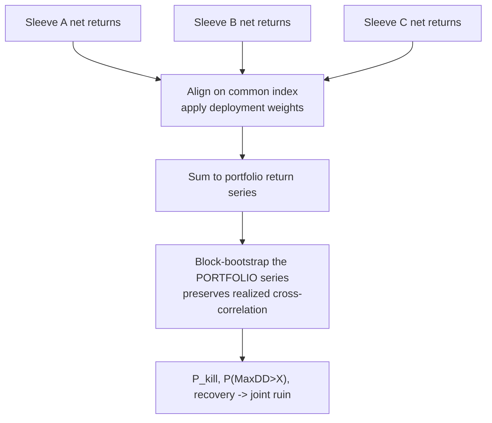

# 10. Tail risk & risk of ruin

A Sharpe ratio tells you whether a strategy is good on an average day. It is silent on the only question that ends a trading business: *can a plausible bad year kill the account?* Survival is not the average outcome. It lives in the left tail, the worst path the world could have dealt you, not the median one, and the tail is exactly where most backtest machinery is weakest, because there are so few extreme observations to learn from.

This chapter is about turning vague tail fear into a number you can gate on. We do it in two moves. First, simulate worst-case paths *honestly*, which, as we'll see, almost nobody does, because the obvious way to bootstrap a strategy quietly deletes most of its tail risk. Second, translate the resulting drawdown distribution into a **risk of ruin**: the probability that a strategy, deployed at a specific weight, trips a portfolio kill switch over a real horizon. And because you never run one strategy alone, we extend it to **joint ruin** across everything deployed at once, including the case where your diversification evaporates precisely when you need it.

## The principle: simulate the cause, not the effect

You want the distribution of a strategy's max drawdown across the many histories the world *could* have produced, not just the one it did. The standard tool is a block bootstrap: resample the time series in chunks (to preserve serial correlation), recompute the metric on each resample, and read the percentiles. The question is *what series you resample.* There are three choices, and they are not close to equivalent.

| Approach | What you resample | What it preserves | Tail honesty |
|---|---|---|---|
| **Strategy-return bootstrap** | the strategy's realised P&L series | the historical strategy distribution | **Badly understated** |
| **Price bootstrap** | the underlying price levels directly | almost nothing useful | Noise |
| **Underlying-return bootstrap** | the underlying's *returns*, then re-run the strategy | the data-generating process | **Honest** |

The trap is the first one, and it is seductive because it's cheap: you already have the strategy's return series from the backtest, so why not just resample *that?* Because the strategy's realised returns are an *effect*. They are what happened after the strategy's logic (entries, exits, stops, position sizing, regime gates) interacted with one particular price path. Resample the effect and you are sampling from a distribution your strategy already survived. The blocks you draw are blocks the strategy already navigated; its stops already fired, its filters already sidestepped the worst entries. You learn how variable the *outcome* was, not how variable the *world* is.

The honest approach resamples the **cause**: bootstrap the underlying instrument's returns, `cumprod` them back into a synthetic price path, and **re-run the full strategy on each synthetic path.** Now the strategy meets price sequences it never saw, including bad ones where a stop gets gapped through, a filter lets a loser in, or a trend reverses one bar after entry. The drawdown distribution you get out is the distribution of what the strategy *would do under stress*, not a reshuffling of how it already performed.

!!! warning "War-story: the tail that was many times too thin"
    An external audit caught Titan's first Monte Carlo doing the cheap thing: it bootstrapped the **strategy's** return series. Across the strategies on the bench, the resulting `P(MaxDD > threshold)` was understating true tail risk by a large multiple, comfortably an order of magnitude on some strategies (the exact factors are strategy-specific and not published here). The mechanism is exactly the "effect, not cause" error above: resampling realised P&L cannot manufacture a drawdown the strategy never produced, so the worst synthetic path is bounded by the worst *historical* path. The rebuild-and-re-run version can hand the strategy a never-before-seen sequence that walks straight through its stops. The fix changed one thing and everything downstream: **resample the underlying returns at shared block indices, `cumprod` to a synthetic price, and re-run `strategy_fn` on it.** Every drawdown gate that had been "passing" was re-derived; some strategies that looked tail-safe were not. (This is the canonical telling of catalogue entry A6 in the [failure-mode catalogue](failure-mode-catalogue.md).)

## The Titan example: rebuild the path, then re-run the strategy

Titan's Monte Carlo (`titan/research/framework/mc.py`) is built around that one discipline. The core of a path is three lines: resample block indices, rebuild a price, run the strategy.

```python
def _rebuild_path(log_returns, indices, initial_price):
    resampled = log_returns[indices]                       # (1)!
    return initial_price * np.exp(np.cumsum(resampled))    # (2)!

# ... per path:
indices       = _resample_indices(n_bars, block_size, rng)  # (3)!
synth_price   = _rebuild_path(primary_log_returns, indices, p0)
df            = pd.DataFrame({"close": synth_price}, index=...)
strat_returns = strategy_fn(df)                  # (4)!
mdd           = max_drawdown(strat_returns)      # measured on the strategy, on a new world
```

1. We resample the **underlying's** log returns, the cause, not the strategy's P&L.
2. `cumprod` (here as `exp(cumsum)` of log returns) rebuilds a synthetic *price path*, which is what a strategy actually consumes.
3. Block resampling preserves serial structure; an IID shuffle would destroy the autocorrelation that trend and carry strategies trade on (see the bootstrap war-story in [A backtest you can trust](backtest-you-can-trust.md)).
4. The strategy runs on the synthetic price exactly as it would in the backtest (same entries, stops, filters), so its drawdown reflects how it behaves in a world it has not seen.

Three bootstrap flavours are offered, and the choice matters for multi-asset strategies:

- **`block`**: fixed-length blocks from one series; extras resampled independently.
- **`shared_block`**: two or more series drawn at the *same* block indices, so a bond/equity pair keeps its cross-correlation through the resample. Essential for cross-asset strategies; resample the legs independently and you'd invent diversification that isn't there.
- **`stationary`**: Politis & Romano (1994) with geometric (random) block lengths and circular wrap. Fixed blocks have hard boundaries that under-represent *clustered* drawdowns, the multi-week grind that actually hurts, so the stationary scheme is the conservative default when the deploy decision hinges on the tail.

### Reading `P(MaxDD > threshold)`

The headline output is `p_maxdd_gt_threshold`: the fraction of synthetic paths whose max drawdown exceeded a stated level. You gate on it directly: *the probability of a worse-than-X drawdown must stay under some small p.* It is a far more honest number than a single backtest MaxDD, because the backtest gives you one draw and this gives you the distribution.

But one subtlety, learned the hard way, deserves its own gate:

!!! note "Absolute MaxDD gates are wrong for long-only sleeves"
    For a long-only equity or "ballast" strategy, the block bootstrap shuffles real crisis bars into most synthetic paths, so the **underlying itself** fails an absolute `P(MaxDD > X%)` gate, which means the gate is testing the market, not the strategy. The economically correct question is *relative*: "does the strategy draw down **less than buy-and-hold on the same synthetic path?**" Titan's `run_relative_block_mc` runs both the strategy and a benchmark on each path and gates on the *ratio* of their drawdowns (median ratio below 1, and the strategy no-worse on a majority of paths). Use the absolute gate for market-neutral and tactical strategies; use the relative gate for anything whose thesis is "I add defensive value over the underlying."

## From drawdown to ruin: a survival probability at deployed size

`P(MaxDD > X)` is a tail-risk *proxy*. It is computed at full strategy size and says nothing about the two facts that actually decide survival: **how much capital you deploy into the strategy**, and **the level at which the portfolio's kill switch fires.** A strategy with a scary standalone drawdown can be perfectly safe at a small weight; a mild one can be lethal if it's the whole book and the kill switch sits just below its typical trough. Risk of ruin closes that gap.

Titan's `assess_strategy_ruin` (`titan/research/framework/ruin.py`) takes the strategy's **net OOS returns**, a **deployment weight**, and a **portfolio kill threshold**, then forward-simulates over a real horizon. The values below are *illustrative*: the live horizon, kill level, and deploy weights are doctrine settings and are not published here:

```python
res = assess_strategy_ruin(
    strategy_returns=stitched_oos_returns,   # net of cost, OOS
    deployment_weight=W,                       # fraction of full size (illustrative)
    portfolio_kill_threshold=K,                # kill switch at K% NAV DD (illustrative)
    horizon_bars=H,                            # the horizon you actually deploy over
    block_size=B,                              # ~1 month, preserves clustering
    n_paths=1000,
    seed=42,
)
```

Each path is a block bootstrap of the strategy's returns out to the horizon; the returns are scaled by `deployment_weight`; the path's max drawdown is compared to the kill threshold. The probability that the scaled drawdown crosses the kill line is `p_kill_trip`: your **risk of ruin over that horizon at that weight.** The assessment also reports `median_recovery_bars` (a deep drawdown you recover from in a month is not the same animal as one that takes two years) and a separate `p_dd_50pct_strategy`, a catastrophic-strategy guard measured at *full* size, independent of how cautiously you deploy.

Two design decisions in that module are worth lifting out, because they are the kind of thing that silently corrupts a risk number.

!!! warning "War-story: additive drawdown on a fractional threshold"
    An audit found the ruin module computing drawdown with `np.cumsum` (*additive*) and then comparing that cumulative-return delta against fractional thresholds like `-0.15`. Drawdown is a fraction of *equity*, which compounds geometrically; an additive proxy is not a fraction of anything and is internally inconsistent with the rest of the framework's `max_drawdown`. The fix prepends a starting equity of `1.0` and uses `np.cumprod(1 + r)`, so a first-bar loss is a real drawdown from par. The deeper lesson: a risk number computed with the wrong arithmetic is *worse* than no number, because it carries a false precision into a deploy decision. And there's a sharp edge for the caller: the function expects **simple** returns; hand it log returns and it is silently mis-scaled.

The second decision is about pairing parameters with thresholds so doctrine can't drift.

!!! danger "War-story: the gate that drifted out from under the threshold"
    The first ruin gate hard-coded its pass thresholds (a short horizon, a kill level, a `P(kill)` tolerance). When doctrine moved to a tougher standard, a much longer horizon with stricter `P(DD)` and `P(MaxDD)` ceilings, every *caller* still simulated under the old, short horizon while *claiming* to apply the new gate. The numbers looked compliant; they were answering a short-horizon question with a long-horizon label. The fix bundles the simulation parameters and the pass tolerances into one `RuinGate` object, and `passes_gate()` **raises** if the assessment's horizon or kill level doesn't match the gate's. You cannot evaluate a long-horizon gate against a short-horizon simulation anymore; the API refuses. (The specific horizons and ceilings are illustrative; the lesson is the binding.) When a risk threshold is a magic number floating free of the simulation that produced it, it *will* eventually describe a different experiment than the one you ran.

The pattern is worth stating as a rule, because it generalises past risk of ruin: **bind every threshold to the experiment that produced it.** A pass/fail tolerance that lives in a different object from the simulation parameters is one refactor away from grading the wrong exam.

## Joint ruin: you never deploy one strategy

A portfolio's risk of ruin is not the sum of its sleeves' individual risks; it's smaller when sleeves diversify, larger when they don't. `assess_joint_ruin` aligns every deployed strategy on a common index, applies each one's deployment weight, sums to a single portfolio return series, and block-bootstraps **that**. Bootstrapping the summed series (rather than each sleeve independently) is the point: it preserves the *historically realised* contemporaneous co-movement between sleeves, so the joint drawdown reflects the diversification you actually had.



There is a deliberate hole in that picture, and naming it is more important than the method.

!!! danger "Diversification evaporates in the crash"
    Summing-then-bootstrapping preserves only the **calm-sample** correlation structure. It certifies the book as safe on a diversification benefit that historically held, and historical correlations are exactly what collapse toward 1 in a real crisis, when everything sells off together. So the base joint-ruin number is *optimistic about the tail by construction.* Titan's answer is `assess_joint_ruin_stressed`: with some probability a bootstrap block is replaced by a **crisis block** in which every sleeve is forced to co-move at a high pairwise correlation via a one-factor model, with the common factor centred on a negative drift (a coordinated drawdown). These are **stress assumptions, not estimates** (the operator's deliberate "what if correlation goes to 1 in a crash" scenario), and the stressed run should report a *higher* ruin probability than the calm one. If a portfolio only survives under calm correlations, it does not survive.

### Ballast can be load-bearing for survival

One result from running these tools repeatedly reframes how we think about the boring sleeves. A defensive allocation (bonds, a low-vol line, anything that drifts up while the risk sleeves crater) contributes almost nothing to headline Sharpe. By the *return* metrics it looks like dead weight you could prune for a punchier number. But when you re-run joint ruin with that sleeve removed, `p_kill_trip` jumps: the ballast was holding the portfolio's drawdown below the kill threshold in precisely the crisis paths where the risk sleeves all drew down together.

!!! warning "War-story: pruning the ballast that was holding the floor"
    A portfolio-trim pass dropped a low-return defensive sleeve because it dragged the aggregate Sharpe and "wasn't earning its slot." Joint-ruin re-assessment told a different story: removing it pushed `P(kill)` over the horizon up by a large multiple, because the sleeve's negative crisis correlation was the thing keeping coordinated-drawdown paths off the kill line. The lesson is a metric mismatch: **you cannot evaluate ballast on a return metric.** Its job is to bend the *left tail*, so judge it on `p_kill_trip` and the stressed joint MaxDD, where it earns its slot many times over. We keep ballast in the book on a survival argument, not a return argument, and we never let a Sharpe-trim pass touch it without re-running ruin. (This is the canonical telling of the "ballast that was load-bearing" entry in the [failure-mode catalogue](failure-mode-catalogue.md), which there is reached from a different angle, an ablation under selection discipline.)

## Choosing horizon, block size, and sample length

These simulations have failure modes of their own. The honest constraint is that you cannot bootstrap a 10-year tail from two years of data and pretend the result is robust; each block gets re-used many times, so the tail estimate is *bootstrap-bound*, not data-rich. Titan's ruin module emits a warning when the horizon dwarfs the sample for exactly this reason. Pick parameters with the data-generating process in mind:

| Parameter | Rule of thumb | Why |
|---|---|---|
| **Block size** | Long enough to span the strategy's autocorrelation (≈ one month of bars for a multi-week edge) | Too short destroys serial structure; too long leaves too few distinct blocks |
| **Horizon** | The decision horizon you actually deploy over | A 1-year `P(kill)` and a 10-year `P(kill)` are different questions; label which one |
| **Sample length** | Comfortably longer than the horizon (prefer ≥ several years) | A horizon `> 4×` the sample means blocks are re-used so heavily the tail is an artifact |
| **`n_paths`** | Enough that the small `p` you gate on is stable across seeds | Gating on a `1e-3` probability with 1,000 paths is reading ~1 event; cross-check seeds |

That last row deserves emphasis: if your gate is "`P(kill) ≤ 1e-3`," a 1,000-path run is estimating that probability from roughly a single tail event. Re-run with several seeds, and treat any gate decided by one or two paths as a coin flip, not a measurement. When the horizon is long relative to the sample, pair the bootstrap with an analytic first-passage cross-check rather than trusting the simulation alone.

## Takeaways

- **Bootstrap the cause, not the effect.** Resample the *underlying's* returns, `cumprod` to a synthetic price, and re-run the strategy on it. Resampling the strategy's realised P&L understated Titan's tail risk by a large multiple (on some strategies an order of magnitude) because it can only reshuffle drawdowns the strategy already survived.
- **Preserve structure.** Block (or stationary) bootstrap to keep serial correlation; `shared_block` to keep cross-asset correlation. IID shuffles flatter trend, carry, and any cross-asset thesis.
- **Use the right MaxDD gate.** Absolute `P(MaxDD > X)` for market-neutral/tactical strategies; a *relative* (vs buy-and-hold) gate for long-only and ballast sleeves, where the underlying itself fails the absolute version.
- **Risk of ruin is the real verdict.** Translate the drawdown distribution into `P(kill)` at a *specific deployment weight* against a *specific kill threshold*, over a *labelled horizon*, and bind those parameters to the gate so doctrine can't drift out from under the threshold.
- **Joint ruin, then stress it.** Assess the whole book together, then re-run with crisis blocks that force correlations toward 1, because real-crisis diversification is exactly what calm-sample correlations cannot see.
- **Judge ballast on the tail.** Defensive sleeves contribute little to Sharpe and a lot to survival; evaluate them on `p_kill_trip` and stressed MaxDD, never on a return metric, or you'll prune the thing holding the floor.

---

This chapter turned tail fear into a survival probability. The next steps put that probability to work: [The sanctuary window & the decision matrix](sanctuary-decision-matrix.md) shows how ruin sits alongside walk-forward and deflation in the deploy/reject decision; [Position sizing: Kelly & vol-targeting](../part5-portfolio-risk/position-sizing-kelly.md) sets the deployment weight that risk of ruin is evaluated *at*; and [Layered safety](../part5-portfolio-risk/layered-safety.md) builds the live kill switch whose threshold this chapter has been simulating against. The full ledger of bugs that bought these rules lives in the [failure-mode catalogue](failure-mode-catalogue.md).
