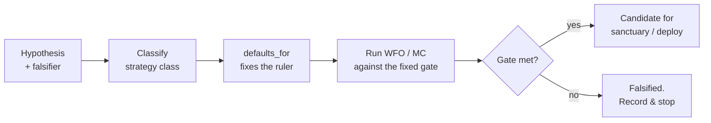

# 5. Thinking in edges: typology & hypotheses

Most strategies are not killed by a bad idea. They are killed by a good idea tested with the wrong ruler. A breakout strategy that trades nine times a year, measured with a per-bar Sharpe over thousands of flat bars, looks like noise. A trend strategy validated on six months of out-of-sample data dies (or survives) on a single regime that happened to fall in the window. In both cases the *edge* was never the question. The *validation regime* was wrong for the class of thing being validated, and the verdict was therefore meaningless before the first number printed.

This chapter is about the work that happens *before* a backtest: deciding what kind of edge you are claiming, writing it down as something that can be proven false, and pre-committing to how you will judge it. Do this and the rest of Part II ([a backtest you can trust](backtest-you-can-trust.md), [walk-forward](walk-forward.md), [deflation](deflated-sharpe.md)) has a fixed target to aim at. Skip it and every downstream test inherits a moving goalpost that you, the hopeful author, will move toward "pass" without ever noticing.

## The principle: classify before you measure

A trading edge is a hypothesis about *why* a market is mispriced and *how often* that mispricing pays. Those two facts, the mechanism and the cadence, determine almost everything about how the strategy should be measured. Get the cadence wrong and your headline number is off by a multiplicative constant. Get the mechanism wrong and you validate it on a window that can't possibly contain the regime it depends on.

So the first artefact in any research project is not code. It is a **classification**. You assign the candidate to a *strategy class*, and the class carries a pre-decided validation regime: which Sharpe convention is the gate, how the walk-forward is shaped, how the Monte Carlo stress is built, and what drawdown is structural rather than a failure. The point is to bind those decisions *before* you have seen any results, so you cannot tune the ruler to flatter the measurement.

This inverts the natural order of research, which is exactly why it works. Left to instinct, you run the backtest, see a Sharpe, *then* decide whether to annualise per-bar or per-trade, whether six months of OOS is "enough," whether a 30% drawdown is "acceptable for this kind of thing." Every one of those after-the-fact choices is a degree of freedom you will, unconsciously, spend on optimism. Classification spends them in advance, when you have no result to be optimistic about.

### Per-bar vs per-trade: the cadence trap

The clearest example is the Sharpe convention. There are three honest ways to annualise a strategy's return-per-risk, and they are *not* interchangeable:

| Convention | What it measures | When it's right |
|---|---|---|
| **per-bar** | return per price bar, scaled by bars/year | Continuously-in-market strategies; signal updates every bar |
| **per-day-MTM** | daily mark-to-market return, scaled by 252 | Position strategies held across many bars; what a daily NAV would show |
| **per-trade** | return per round-trip trade, scaled by trades/year | **Sparse** strategies: few, discrete entries with flat time between |

The trap is the sparse strategy. Consider a breakout that is in the market a small fraction of the time. Measure it per-bar and you are dividing a handful of trade returns by the standard deviation of *thousands* of mostly-zero bars. Two pathologies follow at once. If you (wrongly) keep the zeros, the volatility is dominated by flat bars and the number is meaningless. If you (wrongly) drop the zeros and still annualise with the full per-bar factor, you inflate the Sharpe by `1/sqrt(fraction-in-market)`: the survivor-math lie from [the next chapter](backtest-you-can-trust.md). The honest measurement for a sparse strategy is **per-trade**: take the round-trip P&L of each discrete trade, compute Sharpe over *those*, and annualise by the number of trades per year. The cadence of the measurement matches the cadence of the edge.

!!! tip "Cadence is a property of the edge, not a knob"
    Ask one question of any candidate: *how often does this thing actually decide?* A trend follower decides every day (per-day-MTM). A microstructure mean-reverter decides every bar it's awake (per-bar). A breakout decides only when a range breaks (per-trade). The answer is fixed by the strategy's logic, so the Sharpe convention should be fixed too: written down before the backtest, not chosen after.

## The Titan example: a typology table that ships defaults

Titan encodes this discipline as a literal lookup table. Each candidate is assigned one of a closed set of **strategy classes**, and a class maps to a frozen bundle of defaults: Sharpe convention, walk-forward shape, Monte Carlo design. The enum is the commitment; the lookup is the enforcement.

```python
class StrategyClass(Enum):
    INTRADAY_MICROSTRUCTURE        # H1+, sparse-ish, mean-rev / range
    INTRADAY_BREAKOUT              # M5/M15, ORB-style, very sparse
    DAILY_TREND                    # persistent, long-biased
    DAILY_MEAN_REVERSION           # oscillator-based
    DAILY_MEAN_REVERSION_VOL_CARRY # short-vol / VRP harvest
    CROSS_ASSET_MOMENTUM           # always-on, signal from another asset
    PAIRS                          # market-neutral spread
    ML_CLASSIFIER                  # predicts a label, holds until flip
    META_LABELING                  # a primary signal + an ML accept/reject filter
    CARRY                          # slow FX carry
```

Each class resolves through one function to its defaults:

```python
def defaults_for(cls: StrategyClass) -> StrategyClassDefaults:
    """Look up the framework defaults for a strategy class. Raises if missing."""
    if cls not in DEFAULTS:
        raise KeyError(f"No defaults for {cls.value}. Add a row via a "
                       f"pre-registration directive before using this class.")
    return DEFAULTS[cls]
```

The bundle it returns carries three decisions a researcher would otherwise make *after* seeing results:

```python
@dataclass(frozen=True)
class StrategyClassDefaults:
    sharpe: SharpeReporting   # which Sharpe is the gate, which is diagnostic
    wfo:    WfoConfig         # IS/OOS window lengths, fold count, expanding vs rolling
    mc:     McConfig          # block size, paths, the structural-drawdown threshold
```

Two design choices in that code do real work. First, `defaults_for` **raises** on an unknown class: you cannot validate a strategy that hasn't been classified, and you cannot invent a class on the fly. Adding a class requires a written directive that appends *both* the enum member *and* its defaults row; there are no silent additions. Second, every config is a `frozen=True` dataclass, so the defaults can't be mutated in a notebook halfway through an analysis. The ruler is immutable for the duration of the measurement.

### How the class changes the ruler

The same candidate idea, filed under two different classes, is judged by two genuinely different regimes. A few illustrative rows (the exact values are tuned per directive; treat the numbers as *shapes*, not deployable settings):

| Class | Primary Sharpe | WFO window shape | Structural MaxDD it tolerates |
|---|---|---|---|
| `INTRADAY_BREAKOUT` | **per-trade** | short IS, expanding | tighter: breakouts shouldn't bleed |
| `DAILY_TREND` | per-day-MTM | multi-year IS, expanding | wide: trend pays for the drawdown |
| `CROSS_ASSET_MOMENTUM` | per-day-MTM | shorter IS, **rolling**, overlap allowed | moderate |
| `DAILY_MEAN_REVERSION_VOL_CARRY` | per-day-MTM | multi-year IS, expanding | **very wide**: short-vol's tail is the edge |
| `CARRY` | per-day-MTM | **longest** IS, expanding | moderate |

Read across that table and the logic is visible. Trend and carry need *long* in-sample windows because their edge only shows up across multiple regimes: a two-year window can miss the very trend or rate cycle the strategy harvests, so the framework demands more history before it will believe a result. Cross-asset momentum uses a *rolling* window with overlap because the relationship it trades (one asset's signal, another's return) drifts, and an expanding window would let ancient, dead correlations dominate. And the drawdown thresholds differ by an order of magnitude on purpose: a breakout that sits in a deep drawdown is broken, whereas a short-volatility carry strategy that *never* takes a large drawdown is almost certainly mis-measured, because absorbing rare, violent losses is precisely how it earns its premium.

!!! note "The drawdown threshold encodes a belief about the tail"
    Titan's vol-carry class carries a deliberately wide structural-drawdown tolerance: large peak-to-trough losses are treated as the *cost of the premium*, not as evidence of failure. That number is not generosity; it's a pre-commitment to *not* kill a short-vol strategy at the bottom of the exact drawdown it was always going to have. The inverse error, using that wide tolerance for a class whose deep drawdowns really are failures, is exactly why the threshold is bound to the class, not chosen per-run. And it is a *MaxDD* gate precisely because Sharpe is blind here: two classes with the same Sharpe can have wildly different drawdown geometry and tail shape, which is why the typology also pre-commits the **Calmar** (return-per-drawdown) and **CVaR/CDaR** (tail-loss) lenses each class is judged on. See [beyond Sharpe: the metric suite](metric-suite.md) for the battery, and [tail risk & risk of ruin](tail-risk-and-ruin.md) for how the threshold becomes a survival probability.

## Falsifiable first: write the obituary before the birth

Classification fixes the ruler. A **hypothesis** fixes the question. Before any backtest, write one sentence of the form:

> *This edge exists because `<mechanism>`; it should produce `<measurable effect>` under `<conditions>`; and it would be falsified by `<specific observable>`.*

The non-negotiable clause is the last one. A hypothesis you cannot imagine *failing* is not a hypothesis, it's a hope, and hope has a 100% in-sample hit rate. "Momentum works" is unfalsifiable. "A short-term momentum signal on this asset class produces a positive per-day-MTM Sharpe whose bootstrap lower bound clears zero out-of-sample, and is falsified if the lower bound is ≤ 0 across the pre-committed folds" is a claim: it names the metric, the regime, and the death condition, all *before* the data is touched.

This matters because the alternative is the most expensive failure mode in quant research: searching until something passes, then inventing the mechanism afterward. With a pre-written falsification criterion, a failing result is *information*: the hypothesis is dead, you learned something, move on. Without one, a failing result is just a prompt to try another parameter, and you have begun, quietly, to overfit the test set with your own attention. The deflation machinery in [beating your own optimiser](deflated-sharpe.md) exists to correct for exactly this multiple-comparisons drift; pre-registration is the cheaper, upstream defence.

!!! example "A hypothesis with teeth (illustrative)"
    *Mechanism:* credit-market stress leads broad equity by a short lag (credit investors react first). *Effect:* a signal derived from a high-yield credit proxy should predict a related equity sleeve's forward return, yielding a positive per-day-MTM Sharpe whose **bootstrap 95% lower bound is above zero** across pre-committed rolling folds. *Falsified if:* the lower bound is ≤ 0, or the effect only appears with a same-bar (non-lagged) signal, which would mean we're reading the present, not predicting the future. Note what this commits to *before* the run: the class (cross-asset momentum), the metric (per-day-MTM, lower bound), the fold shape (rolling), and a leak-detector built into the falsification clause. The mechanism is textbook; the *deployed* instruments, lookback, and live numbers are not on this page; a hypothesis with teeth doesn't require publishing the edge.

## Pre-registration as a commitment device

Put the two together (classification and hypothesis) into a short document written *before the experiment*, and you have a pre-registration. Borrowed from clinical trials, where it exists to stop researchers from quietly re-defining the primary endpoint after seeing the data, it does the same job here. The pre-registration names, in advance:

- the **strategy class**, and therefore the Sharpe convention, WFO shape, and MC design that follow from it;
- the **hypothesis** and its falsification criterion;
- the **deployment gate** (e.g. bootstrap lower bound > 0 across the pre-committed folds);
- the **universe and window**: the instruments and the date range you will test on, fixed before you peek.



The value of writing it down is *psychological*, and that is not a weakness. It is a precommitment against your own future self, who will be staring at a Sharpe of 1.4 and looking for a reason to keep it. If the pre-registration said "rolling folds, per-day-MTM, lower bound > 0," you cannot later switch to per-trade-on-the-active-bars-only because it reads better. The document is the auditor that the excited version of you cannot bribe.

!!! warning "War-story: the breakout that was graded on the wrong curve"
    A sparse intraday breakout was first evaluated with a per-bar Sharpe over its full bar history: thousands of mostly-flat bars between a handful of trades. The number was unremarkable, and the idea was nearly shelved. Re-filed under the breakout class, it was measured per-*trade* (round-trip P&L, annualised at trades-per-year), the convention the class mandates, and the picture was completely different, because the per-bar version had been diluting a real per-trade edge into a sea of zeros. The lesson is not "per-trade is better." It's that *the convention is a property of the class, and choosing it after the fact, in either direction, corrupts the verdict.* The fix was structural: bind the Sharpe convention to the class at classification time, so it can never be a post-hoc choice.

!!! danger "War-story: the validation window that couldn't contain the edge"
    A trend-following candidate was validated on a short out-of-sample window that happened to be a directionless, choppy regime: the one environment in which trend following is *supposed* to lose. It failed the gate and was discarded. It was, plausibly, a real edge tested where it structurally could not show up. The mirror-image error is worse and touches live capital: validating a slow trend or carry strategy on a *too-short* window that happens to contain one favourable regime, passing it, sizing it for real money, and then meeting the absent regimes live. The rule the typology bakes in: **slow, regime-dependent classes (trend, carry) require long in-sample windows by default**; the framework refuses to certify them on a window too short to contain the regimes their edge depends on. The window length is not a tuning parameter; it's a consequence of the class.

## Takeaways

- **Classify before you measure.** The strategy class, not the result, should fix the Sharpe convention, the walk-forward shape, and the structural-drawdown tolerance. Decide the ruler before you can see what you're measuring.
- **Cadence picks the Sharpe.** Continuous strategies are per-bar or per-day-MTM; *sparse* strategies (breakouts, meta-labelled trades) are **per-trade**. Measuring a sparse edge per-bar either drowns it in zeros or inflates it by `1/sqrt(fraction-in-market)`.
- **The window must be able to contain the edge.** Trend and carry need long in-sample windows because their edge only appears across regimes; cross-asset relationships drift, so they get rolling windows. The window is a consequence of the class, never a knob.
- **The drawdown threshold encodes a belief.** A wide structural-MaxDD tolerance is correct for short-vol carry and dangerous everywhere else, which is exactly why it's bound to the class, not chosen per run.
- **Write the falsifier first.** A hypothesis you can't imagine failing is a hope. Name the death condition, and the deployment gate, before the data is touched, so a failing run is information instead of a prompt to overfit.
- **Pre-registration is a commitment device.** It binds these choices in writing against the optimistic future-you who will want to move the goalposts toward "pass."

---

With the edge classified, the hypothesis falsifiable, and the ruler pre-committed, the next chapter makes that ruler trustworthy: [**a backtest you can trust**](backtest-you-can-trust.md) closes the five ways a measurement lies before any heavier machinery runs. From there, [**walk-forward**](walk-forward.md) shapes the out-of-sample experiment your class demands, and [**beating your own optimiser**](deflated-sharpe.md) corrects for the searching you did to find the edge in the first place. The class you assign here also becomes a runtime contract later: see [**the strategy-class contract**](../part4-research-to-prod/strategy-class-contract.md).
