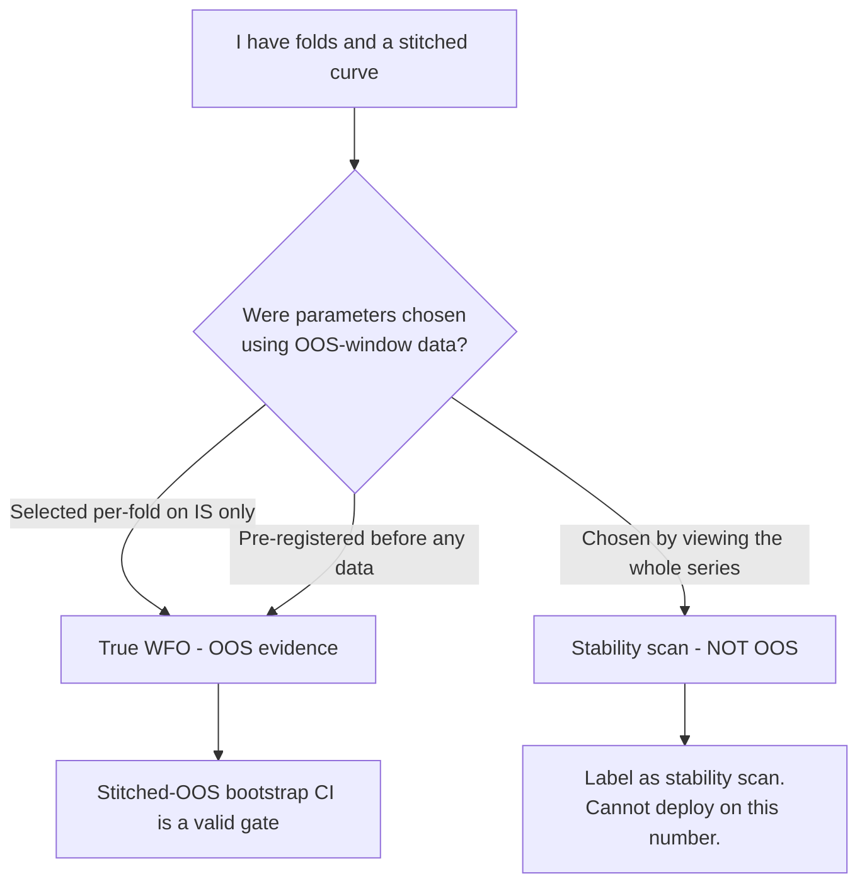

# 8. Walk-forward that's actually out-of-sample

A walk-forward optimisation (WFO) is supposed to be the experiment that earns a strategy its deployment ticket: train on the past, test on the future you couldn't see, slide the window, repeat. Done right, it's the closest a backtest comes to honesty. Done wrong (and the wrong way is *easier* and *prettier*), it's a stability scan wearing the costume of an out-of-sample test, and it will hand you a glowing curve built entirely on data the parameters already saw.

The trap is not subtle once you name it, but it is almost invisible in practice, because both procedures produce the same artefact: folds, a stitched equity curve, a confidence interval. The difference is *when* the parameters were chosen relative to the data. Get that wrong and every downstream gate (the bootstrap CI, the deflated Sharpe, the Monte Carlo) inherits a number that was never out-of-sample to begin with. This chapter is about the one question that decides whether your WFO means anything: **were the parameters chosen without looking at the data they're now being tested on?**

## The principle: OOS is a property of *provenance*, not of *partitioning*

Splitting your data into in-sample (IS) and out-of-sample (OOS) windows feels like it makes the OOS window out-of-sample. It does not. A held-out window is only genuinely out-of-sample if the thing you're testing on it, the parameter set, was fixed *before* anyone looked at that window. Partitioning is necessary; it is nowhere near sufficient.

There are exactly two ways to make a walk-forward legitimately out-of-sample:

1. **Per-fold parameter selection.** Inside each fold, you fit/choose parameters using *only* that fold's IS window, then apply them, unchanged, to that fold's OOS window. The OOS bars never touch the selection. Slide the window and re-select from scratch. Each OOS segment is a genuine prediction.
2. **Pre-registration.** You write the exact parameters (or the exact grid and the exact rule for picking the winner) into a directive, commit it, and *then* run the data. The whole series can be a single OOS test because the choice was provably made blind.

If you did **neither** (if you eyeballed the full series, picked the lookback that looked best across the whole history, and *then* drew fold boundaries around it), you have run a **stability scan**, not a walk-forward. A stability scan is a useful thing: it tells you whether one fixed configuration holds up across sub-periods. But it carries zero out-of-sample evidence, because the configuration was chosen with knowledge of every sub-period it's now being "validated" on. The cardinal sin is presenting the second as the first.

!!! note "Stability scan is not an insult"
    A stability scan answers a real question (*"is this one config robust across regimes?"*), and it's cheaper than a true WFO. The rule isn't *don't run stability scans*; it's *don't call them out-of-sample, and don't let their numbers through a deployment gate.* Label honestly and they're a legitimate part of the toolkit.



## How Titan builds folds

Titan standardises fold construction in one module so every strategy class is tested the same way and cross-comparison is sound. A `WfoConfig` (per strategy class) declares the window geometry; `build_folds` turns it into concrete index boundaries; `iter_folds` yields `(fold, is_df, oos_df)` slices. Two modes cover the cases:

| Mode | IS window | OOS placement | Used for |
|---|---|---|---|
| `expanding` | Anchored at the start, grows each fold | Non-overlapping, sequential | Slow daily strategies (trend, cross-asset momentum) |
| `rolling` | Fixed length, slides forward | Stride = OOS length (or half, if overlap allowed) | Faster / data-rich classes (ML, mean-reversion) |

The `Fold` object carries both integer positions *and* wall-clock timestamps, so an audit log can state exactly which calendar window each fold trained and tested on:

```python
@dataclass(frozen=True)
class Fold:
    fold_id: int
    is_start: int
    is_end_excl: int        # exclusive
    oos_start: int          # == is_end_excl: OOS begins where IS ends
    oos_end_excl: int
    is_start_ts: pd.Timestamp   # wall-clock, for the audit log
    oos_end_ts: pd.Timestamp
```

Two design choices in `build_folds` are worth calling out because they're easy to get wrong:

- **OOS starts exactly where IS ends** (`oos_start == is_end_excl`). There is no gap and no overlap by default. A gap throws away data; an overlap leaks the same bars into both windows of adjacent folds.
- **Fold count auto-scales to the available history.** A fixed fold count (say, five) is fine for short series but leaves most of a long history untested: your "OOS" ends up covering a small fraction of the data. The `auto_fold_count` logic derives the number of folds from the visible window so the stitched OOS spans (close to) the whole series, capped at a ceiling. The configured `fold_count` becomes a *floor*, not a fixed value.

!!! tip "Make 'how much was actually OOS' a reported number"
    Under conservative WFO defaults, the stitched OOS can cover only a few years of a decade of data. Titan's dashboard plots the *full* strategy history for visual sense-checking but draws the headline metrics **only** from the stitched OOS, with the OOS folds highlighted as bands. If a reviewer can't see what fraction of the history the gate number actually rests on, the number is doing work it hasn't earned.

## The normalisation boundary: freeze IS stats, don't peek across the split

Even a structurally correct WFO leaks if you normalise features across the IS/OOS boundary. Standardising a feature with statistics computed over the *whole* fold, IS plus OOS, quietly feeds the future into the past: every IS bar's z-score now "knows" the OOS mean and standard deviation. The fold partitioning is intact; the leak is in the feature pipeline.

The fix is to **freeze the normalisation statistics on the IS window** and apply them, unchanged, to the OOS window. Titan's metrics module exposes exactly this and deliberately offers no full-series alternative:

```python
def is_frozen_zscore(x, is_end_idx: int, *, ddof: int = 1) -> pd.Series:
    """Z-score using mean/std computed only on x[:is_end_idx].
    The whole series is then z-scored with those frozen IS stats,
    so OOS bars see no OOS statistics."""
```

The guarantee is testable, and Titan tests it: append OOS bars drawn from a wildly different distribution, and the IS slice's z-scores must be *byte-identical* to what they were before the append. If appending the future changes the past, you have a leak. The same discipline applies to anything fit on a fold, whether a scaler, a regression, or an ML model: fit on `is_df`, transform `oos_df`, never the reverse, never the union.

```python
for fold, is_df, oos_df in iter_folds(visible, cfg, bars_per_year=bpy):
    model = fit(is_df)                 # calibrate on IS only
    oos_returns = predict(model, oos_df)   # apply, unchanged, to OOS
    parts.append(oos_returns)
stitched_oos = pd.concat(parts)        # one OOS path across all folds
```

That `stitched_oos` series, the concatenation of every fold's OOS returns, is the only return series that carries out-of-sample evidence. Everything that decides capital is computed on it.

## The gate: the stitched-OOS bootstrap CI, and nothing prettier

Once you have a legitimate stitched-OOS series, the deployment question is *not* "is the point Sharpe high?" A single number from one history is a point estimate with error bars you haven't drawn. The gate is the **95% bootstrap confidence interval on the stitched-OOS Sharpe**, and specifically its **lower bound**:

> If the 95% lower bound of the stitched-OOS Sharpe is ≤ 0, the strategy is `unconfirmed` and cannot enter the default deployment registry, regardless of the point estimate.

This is the one axis in Titan's decision matrix that can *veto* a strategy on its own: a "worst" reading on CI_lo (the interval consistent with a clearly-negative edge) caps the verdict at SUSPECT no matter how the other axes score. The lower bound is the honest answer to *"how bad could this plausibly be out-of-sample?"*, and it is computed on the stitched OOS, never the in-sample fit, never the full-series fit.

The CI is the *veto*, not the verdict. A Sharpe whose lower bound clears zero has earned the right to be evaluated, not the right to be deployed. Everything that decides whether a surviving edge is *livable* is also computed on the stitched OOS and obeys the same provenance rule: drawdown geometry (**Calmar** and max-drawdown depth/duration), downside-only risk (**Sortino**), and the tail that ends an account (**CVaR / CDaR**, and a formal **risk of ruin** at deployed size). A walk-forward that's genuinely out-of-sample but only ever reports one Sharpe is still under-reporting; the OOS path is the input to the whole battery in [Beyond Sharpe: the metric suite](metric-suite.md).

Two refinements matter:

- **Use a serially-aware bootstrap.** The naive IID bootstrap resamples individual bars, which destroys the autocorrelation trend and carry strategies live on, narrows the interval, and biases the lower bound *upward*: exactly the optimism the gate exists to catch. Use a stationary block bootstrap with a block length matched to the strategy's persistence. (This is its own war-story in [A backtest you can trust](backtest-you-can-trust.md).)
- **Deflate for the search.** The stitched-OOS CI answers "is this configuration's OOS edge real?" It does *not* correct for the fact that you tried many configurations and kept the best. That correction, the deflated Sharpe at the *registered* number of trials, is [Beating your own optimizer](deflated-sharpe.md). The two gates are complementary: CI_lo on the survivor, DSR over the whole sweep.

!!! warning "War-story: the glowing WFO whose parameters had seen the whole series"
    A strategy arrived with a beautiful walk-forward writeup: folds drawn neatly, a stitched equity curve sloping up and to the right, a stitched-OOS Sharpe well clear of every threshold. It looked like textbook out-of-sample validation. It wasn't. The lookback and entry threshold had been chosen *first*, by sweeping the **entire** price series and picking the cell with the best full-history Sharpe, and the folds were drawn around those already-chosen parameters *afterward*. Every "OOS" window was being tested with parameters that had been optimised on data including that very window. It was a stability scan of a curve-fit, painted to look like a walk-forward. The number was real arithmetic on fake provenance: the OOS bars had no information the parameters hadn't already exploited. The lesson, call it **WFO honesty**, became a hard rule: *a walk-forward is out-of-sample only if (a) parameters are selected per-fold on IS data, or (b) they were pre-registered in a committed directive before any data was examined. Otherwise it is a stability scan and must be labelled as one.* "Looks out-of-sample" is not a category; provenance is.

!!! danger "Why this one is dangerous, not just wrong"
    A mislabelled WFO doesn't just produce an inflated number; it produces an *inflated number that passes every honest gate downstream.* The bootstrap CI on a curve-fit-then-fold series is genuinely tight and genuinely positive, because the returns it's resampling really did happen under parameters that really did fit. Sized on that confidence, real capital goes live against an edge that exists only in hindsight, and the first regime it hasn't seen takes it apart. The gate isn't "compute a CI"; it's "compute a CI **on a series whose provenance you can prove**."

## Pre-registration: making "we chose blind" verifiable

Per-fold selection is the cleaner route, but some strategies have a single intended configuration you want to validate on the whole series at once. That's legitimate, *if* the choice was genuinely blind. The problem is that "we picked the parameters before we looked" is unfalsifiable after the fact. An audit of Titan's own directives found that 27 of 29 pre-registrations had been committed in the *same* commit as their result, so there was no timestamp evidence the gate-defining choices were made before the data was examined. The deflation defence was, technically, unverifiable.

Titan's fix is to make pre-registration cryptographically anchored. The gate-defining fields (strategy class, universe, the grid, the trial count `N`, the canonical cell, the decision rule) go in a machine-readable block inside the directive. A SHA-256 over the *canonical* form of just those fields is the registration hash: prose edits don't change it, but a post-hoc tweak to `N` or a threshold does. CI then verifies two things:

```python
def verify_ordering(*, same_commit, prereg_committed_at,
                    result_committed_at, hash_recorded, hash_now):
    # Fails if pre-reg and result share a commit (no blind-selection evidence),
    # if the result doesn't strictly post-date the pre-reg,
    # or if the gate-defining block changed since registration.
```

- The result commit must **strictly post-date** the pre-registration commit (and not share it; same commit means no proof of ordering).
- The gate-defining block must be **byte-identical** between registration and result (no quiet edit to `N` or the winning cell after seeing the outcome).

This is the discipline that lets a *single* OOS pass count as out-of-sample: not because the data was partitioned, but because the choice is provably older than the data look. Legacy prose-only directives are grandfathered out of the gate; new ones opt in by including the block.

!!! example "Two honest WFOs, one dishonest one"
    - **Honest A (per-fold):** each fold re-selects its lookback from a grid using only its IS window; the OOS segments are stitched; the gate runs on the stitched series. Provenance: the OOS never touched selection. ✅
    - **Honest B (pre-registered):** the directive commits one parameter set and a decision rule; the data is run *after*; CI confirms the result post-dates the registration and the block is unchanged. ✅
    - **Dishonest:** the whole series is swept, the best cell is kept, folds are drawn afterward, and it's reported as "WFO Sharpe X." Same folds, same arithmetic, no provenance. ❌ This is the war-story above.

## Picking honest defaults per strategy class

Fold geometry is itself a researcher degree of freedom: too many short folds and the IS windows are too small to fit anything stable; too few long folds and the OOS barely exists. Titan removes that freedom from the per-experiment author by setting it *per strategy class* and committing it as a framework default (illustrative values; the real ones live in the typology and aren't edge-bearing):

| Class (illustrative) | IS min | OOS / fold | Mode |
|---|---|---|---|
| Daily trend / cross-asset | several years | ~1 year | expanding |
| Bond-equity / mean-reversion | a couple of years | ~half a year | rolling, overlap allowed |
| ML classifier | a couple of years | ~half a year | rolling, overlap allowed |

The point isn't the specific numbers; it's that the geometry is *pinned before the experiment runs*, so an author can't (consciously or not) tune the fold structure until the OOS looks good. That tuning is just curve-fitting moved up one level of abstraction, and it's exactly as invalidating. For label-overlapping problems (multi-bar ML labels), Titan also offers purged + embargoed combinatorial cross-validation, which produces a *distribution* of OOS paths rather than one, more robust, and the input to the probability-of-backtest-overfitting estimate. But the honesty rule is identical: the OOS, however you slice it, must not have informed the parameters.

## Takeaways

- **OOS is provenance, not partitioning.** A held-out window is out-of-sample only if the parameters were fixed before that window was examined. Folds alone prove nothing.
- **Two legitimate routes:** per-fold selection on IS data, or pre-registration committed before the data was run. Anything else is a **stability scan**: useful, but it carries no OOS evidence and must be labelled honestly.
- **Freeze normalisation at the IS/OOS boundary.** Use IS-frozen statistics (and IS-fit models) on the OOS window; offer no full-series version that can leak the future by accident.
- **Gate on the stitched-OOS bootstrap CI lower bound**, computed with a serially-aware bootstrap. `CI_lo ≤ 0` ⇒ unconfirmed. It is the one axis that can veto on its own.
- **Make blindness verifiable.** Hash the gate-defining fields and require the result to strictly post-date the registration; "we chose before we looked" must be falsifiable, or it isn't a defence.
- A mislabelled WFO is dangerous precisely because its number passes every downstream gate: the gate must run on a series whose provenance you can *prove*, not merely on a series shaped like an OOS test.

---

A walk-forward tells you whether *one* configuration's OOS edge is real. It says nothing about the fact that you tried many configurations and kept the luckiest survivor, and the more you tried, the better your best result looks by pure chance. Correcting for that search is the next chapter: [**Beating your own optimizer**](deflated-sharpe.md). From there, [**Tail risk & risk of ruin**](tail-risk-and-ruin.md) turns the surviving edge into a survival probability at deployed size.
