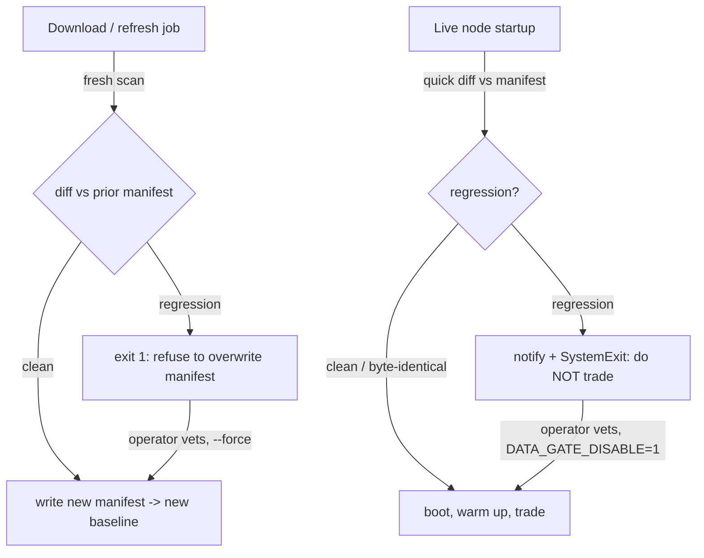

# 14. The data-quality gate

A live trading node boots, reads its history, warms up its indicators, and starts placing orders, all in the first few seconds, before a human is watching. Whatever the data said at that moment becomes the ground truth for every decision the strategy makes that session. So the most dangerous failure in a data pipeline is not the loud one. It's the *quiet* one: a refresh that returns slightly less data than yesterday, the node accepting it without complaint, and a strategy trading on a silently truncated view of the world.

This chapter is about a single, blunt defence against that class of failure: a **manifest** that records what known-good data looked like, and a **gate** that refuses to start the live node if the data on disk has *regressed* from it. The previous chapter ([Sourcing & storage](sourcing-storage.md)) was about getting data in and laying it out honestly. This one is about keeping it honest over time, and failing closed when it isn't.

## The principle: data drifts down, silently, and the cost is asymmetric

Market data is not a fixed asset. You refresh it. Every refresh is a small bet that the new pull is at least as good as the old one: same start date or earlier, same end date or later, same provider, at least as many rows. Most of the time that bet pays. But the downside when it doesn't is brutally asymmetric, for the same reason backtest errors are asymmetric (see [A backtest you can trust](../part2-research/backtest-you-can-trust.md)): **the failures that flatter or quietly corrupt are the ones that survive your attention.**

Consider the ways a routine refresh can hand you *worse* data without raising an error:

- **A shorter history window.** A vendor caps free-tier history, or a download script's date range was changed, and the new file starts in 2010 where the old one started in 2003. The file is valid parquet. It just lost a decade of regime.
- **A truncated tail.** A download is interrupted, or the API returns a partial page, and the most recent week never lands. The file reads fine; it's just missing the bars your indicators most need.
- **A silent overwrite from the wrong source.** One provider's job clobbers another's file at the same path. Same filename, plausible contents, different provenance, and possibly a different adjustment convention, which is a corruption you cannot see by eye.
- **A vanished file.** A rename or a cleanup script removes a series a live strategy depends on.

None of these throws. The file system is happy. Pandas is happy. The strategy is happy; it just trades on a view of history that is strictly worse than the one you validated against. The only way to catch this is to **remember what good looked like** and compare.

!!! tip "Growth is fine; contraction is the signal"
    The gate's entire job is to distinguish *growth* from *contraction*. More rows, an earlier start, a later end, a brand-new series: all fine, never blocked. The gate fires only on a known-good series getting **smaller, shorter, or swapped**. That asymmetry is deliberate: you almost never accidentally *gain* good data, but you can very easily lose it.

## The manifest: a fingerprint of known-good data

The mechanism is a JSON manifest that records, per file, the handful of properties that define "as good as before." In Titan that manifest is regenerated by a scan of the data directory, and each entry carries:

| Field | What it guards against |
|---|---|
| `bars` (row count) | A drop = data was lost or a download returned fewer bars |
| `first_bar` | A later start = early history disappeared |
| `last_bar` | An earlier end = recent bars vanished (a truncated pull) |
| `source` (provenance) | A provider flip = a silent cross-source overwrite |
| `sha256` (content hash) | Any byte change, including same-*size* overwrites |

The row count and the two span dates are the obvious ones. The content hash is the subtle one, and it earned its place the hard way. A file can be silently overwritten with content of *identical byte size*: a same-shape file from a different source, or a re-fetch with a different adjustment convention. Size, row count, and span all stay put; only the SHA-256 moves. The hash is the only field that catches a swap that preserves every other property.

!!! warning "War-story: the overwrite no coarse check could see"
    The hash field exists because of a near-miss we caught by luck, not by design. One download job clobbered another's file for a single series at the same path. Row count and date span came out effectively unchanged, so every coarse check passed clean; the only visible difference, spotted in a manual file-size glance long after the fact, was a handful of kilobytes, because the new pull carried a different adjustment convention than the old one. Same shape, same span, different *content*. Had the two conventions disagreed on, say, dividend adjustment, every backtest on that series would have been quietly wrong and nothing in the pipeline would have said so. (When provenance is recorded, the `source_flip` check catches a *cross-provider* swap, but not a same-source re-fetch with a changed convention, and not a swap at all when provenance is absent.) The lesson bought the rule: **fingerprint the bytes, not just the shape.** A content hash is the only field that survives a same-shape, same-span overwrite: the corruption you cannot see by eye and a row count will never reveal.

```python
# A manifest entry is just a fingerprint - sanitised shape:
{
    "symbol": "SYMBOL",            # e.g. a USD-quoted Treasury UCITS ETF
    "timeframe": "D",
    "file": "SYMBOL_D.parquet",
    "bars": 5_281,                 # row count (illustrative)
    "first_bar": "2003-01-02 ...",
    "last_bar":  "2026-06-05 ...",
    "source": "vendor-a",          # from data/provenance.json, if recorded
    "sha256": "…",                 # streamed in 1 MiB chunks, never all in RAM
}
```

Provenance lives in a separate `provenance.json` written by the download scripts, mapping each filename to where it came from. If it's absent, the source-flip check simply stays dormant; the row/span/hash checks work regardless. That's a recurring design choice: **a missing optional input degrades the gate gracefully, it never crashes it.**

## The diff: what counts as a regression

Comparing two manifests is pure, deterministic, and exhaustively unit-testable: no network, no clock, no global state. For each file present in the *prior* manifest, the diff emits a regression if and only if the current scan shows one of these contractions:

```python
def diff_entry(prior: dict, current: dict) -> list[Regression]:
    regs = []
    if current["bars"] < prior["bars"]:                 # row_drop
        regs.append(...)
    if current_start > prior_start:                     # span_shrink_start
        regs.append(...)                                # early history lost
    if current_end < prior_end:                         # span_shrink_end
        regs.append(...)                                # recent bars lost
    if prior_src and cur_src and prior_src != cur_src:  # source_flip
        regs.append(...)
    return regs                                          # empty == clean
```

Two cases sit outside `diff_entry`: a file that was in the prior manifest and is now gone is a `missing_file` regression, and a file that is present but no longer readable is `unreadable`. New files in the current scan are never regressions; additions are always allowed.

Note one deliberate non-rule: **a SHA change on its own is not a regression.** A legitimate refresh that grows the data changes the hash; blocking on every hash change would make the gate fire on success and train operators to ignore it. The hash is a *trigger to look closer*, not a verdict, which is exactly how the live gate uses it next.

## The gate, in two places, with two speeds

The same diff logic runs at two moments, tuned differently for each.



**At refresh time**, the build script does a full scan and diffs it against the last manifest before overwriting. If the new scan regresses known-good data, it refuses to write and exits non-zero, so a download that shrinks a file fails *loudly*, at the moment a human (or a CI log) is closest to the cause:

```bash
uv run python scripts/build_data_manifest.py          # gate + write
uv run python scripts/build_data_manifest.py --check   # gate only, no write
uv run python scripts/build_data_manifest.py --force    # write despite regression
```

**At live startup**, before the broker is queried and before the trading node is built, the portfolio runner re-runs the diff against the on-disk data. This path is *hash-fast*: it hashes each file the manifest knows about, and only re-reads the (expensive) parquet to check rows and spans when the hash has changed. A byte-identical data directory costs a SHA sweep, not hundreds of parquet reads: cheap enough to run on every boot.

```python
def quick_diff_against_disk(data_dir, prior, *, restrict_to=None):
    if not prior:
        return []                       # first run can't regress
    for fname, p_entry in entries_by_file(prior).items():
        path = data_dir / fname
        if not path.exists():
            regs.append(Regression(MISSING_FILE, fname, "…")); continue
        if sha256_of_file(path) == p_entry.get("sha256"):
            continue                    # byte-identical -> no parquet read
        c_entry = build_entry(path)     # changed -> pay for the deep check
        ...
        regs.extend(diff_entry(p_entry, c_entry))
    return regs
```

If that startup diff finds a regression, the node does not negotiate. It logs a `critical`, fires an operator notification, and raises `SystemExit` **before touching the account**. Crucially, this ordering matters: the gate runs ahead of the broker query, so a data problem never results in a half-built node holding a connection. The process dies fast, the watchdog sees the quick death, and a human gets paged. *We do not trade on regressed data.* That is the whole posture: **fail closed.**

!!! danger "War-story: the refresh that crash-looped the live node"
    A routine overnight refresh pulled a **shorter history window** for one series than the manifest had recorded: fewer rows, a later start date. The build-time gate did its job and refused to re-baseline the manifest. But the truncated parquet was already on disk. When the live node booted, the startup gate compared disk against the (still-correct) manifest, found the row-count drop and span shrink, and did exactly what it was designed to do: it raised `SystemExit` and refused to start. The container died. The orchestrator restarted it. It read the same bad data, hit the same gate, and died again: a **crash-loop**, by design, because the alternative was trading on amputated history.

    The fix was not to weaken the gate. It was to **restore the full history** (re-run the download against the correct date range), confirm the row count and span were back to known-good, and then re-baseline the manifest intentionally. The crash-loop was the system working: it converted a silent data corruption into a loud, un-ignorable, *capital-safe* outage. An outage you can see beats a position you can't explain.

## Re-baselining on purpose vs failing closed

A gate that only ever says "no" is a gate operators learn to disable. The escape hatch has to exist, but it has to be a *deliberate, logged, two-handed* action, never the default.

Both halves of the gate carry an explicit override:

- The refresh path takes `--force`: write the new manifest even though it regresses. You use this when the contraction is *intentional and vetted*: a vendor genuinely retired old history, or you deliberately trimmed a series. `--force` makes the new (smaller) state the baseline going forward.
- The live path reads an environment flag (`DATA_GATE_DISABLE=1`) that lets a node boot despite a regression. It logs loudly when it does, so the override is never invisible in the post-mortem.

The discipline is the order of operations, and it is one-directional:

!!! warning "Re-baseline only after you understand the shrink, never to make the alarm stop"
    The wrong move under pressure is to `--force` the manifest (or set `DATA_GATE_DISABLE=1`) *to get the node running again*, before you know why the data shrank. That doesn't fix the problem; it **promotes the corruption to the new ground truth** and silences the only alarm that would catch it next time. The right order is always: (1) investigate the contraction, (2) restore good data if the shrink was accidental, (3) re-baseline only if the shrink was genuinely intended. Failing closed is the default; re-baselining is a decision you make with both eyes open, and it should leave a paper trail.

The same logic that lets growth through is what makes intentional shrinkage safe: once you `--force` a smaller baseline, the gate happily accepts it and guards the *new* known-good state. The gate has no opinion about what the data *should* be, only that it must not get quietly worse than the last thing you blessed.

## A note on what the gate does *not* do

This gate guards against *contraction of known-good data*. It is not a substitute for content validation. It will not catch a bad price *value* inside an otherwise full-length, same-source file: a spike, a zero, a stale-forward-fill, a mis-adjusted split. Those are the province of point-in-time content checks and the kind of bar-level sanity rules that belong upstream. Nor does it judge *freshness* on its own: Titan runs a separate, softer check that warns when a strategy's warmup data is days stale (a cron that quietly stopped firing), which is advisory rather than blocking. Keep the responsibilities separate:

- **Freshness check** → *advisory*: "this series is N days old, your cron may have died." Warns, does not halt.
- **Quality gate** → *blocking*: "this series is smaller/shorter/swapped vs known-good." Halts.

Conflating the two produces either a gate too trigger-happy to live with (blocking on every late cron) or one too permissive to trust (warning on a 10-year history loss). Two jobs, two severities.

## Takeaways

- **Data drifts down silently, and the cost is asymmetric.** A refresh can hand you a shorter window, a truncated tail, or a wrong-source overwrite without throwing. Remember what good looked like, and compare every time.
- **A manifest is a fingerprint, not a backup.** Row count, first/last bar, source, and a content hash are enough to detect every contraction that matters, including a same-size silent overwrite, which only the hash catches.
- **Block on contraction, allow growth.** The gate's only verdict is "did known-good data get smaller, shorter, or swapped?" Additions and growth pass freely, so the alarm only fires when something is actually wrong.
- **Fail closed, before the broker.** Run the gate at startup ahead of any account contact; on a regression, notify and exit rather than trade on a degraded view. A visible crash-loop beats an invisible bad position.
- **Re-baseline as a deliberate act, never to silence the alarm.** `--force` / disable flags exist for *vetted, intentional* shrinkage. Investigate first, restore if accidental, re-baseline only if intended, and always leave a log.
- **Keep freshness (advisory) and quality (blocking) separate.** One warns about stale crons; the other halts on lost history. Different jobs, different severities.

---

The data side of the house is now defended: the previous chapter ([Sourcing & storage](sourcing-storage.md)) laid the data out and recorded its provenance, and this gate keeps it from silently regressing under live capital. How this `SystemExit`-on-regression behaviour plays with the container watchdog, and what an operator actually does when the node crash-loops on a data problem at 3 a.m., is the subject of [The live runbook](../part6-deploy-ops/live-runbook.md).
