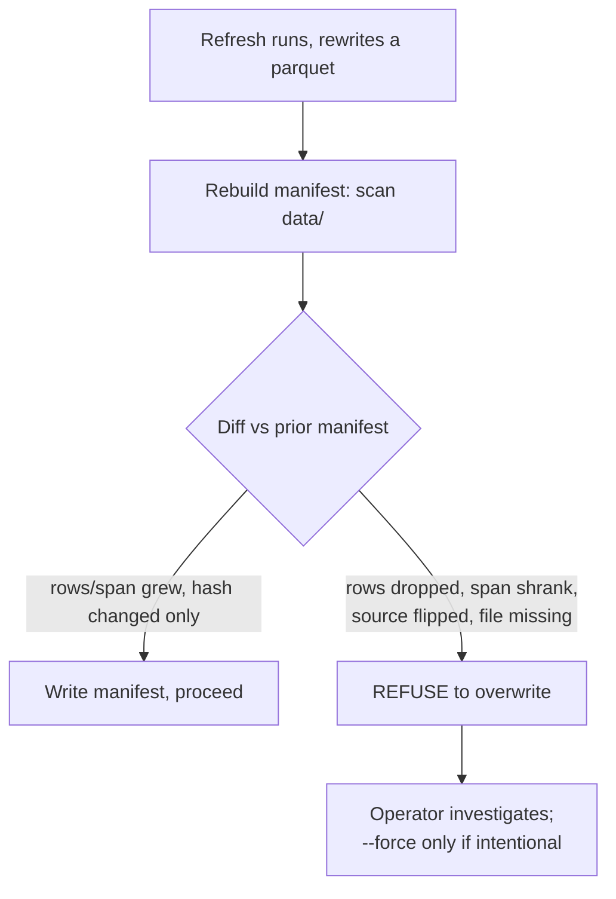

# 13. Sourcing & storage

Every backtest you trust in [Part II](../part2-research/backtest-you-can-trust.md) rests on a pile of files you mostly never look at. That is the danger. The measurement disciplines, units, causality, error bars, assume the *input* is what you think it is: the right instrument, the right series, the same series next week. None of that is guaranteed. Data arrives from vendors who silently revise it, gets refreshed by scripts that quietly overwrite it, and comes in two flavours, price-only and total-return, that look identical in a chart and differ by percent-per-year in a cost model.

This chapter is about the layer beneath the research: how market data is *fetched*, *laid out on disk*, and *kept honest over time*. Get it wrong and you don't get a crash. You get a backtest that's correct in every line of code and wrong in its premise: the most expensive kind, because nothing flags it.

The principle is simple and unglamorous: **treat data as a versioned artefact with provenance and a regression gate, not as a folder of files you re-download when you feel like it.** A series should know where it came from, you should be able to tell whether it changed, and a change that *loses* information should be blocked by default. Everything below is mechanism for those three sentences.

## A flat, parsable layout beats a clever one

Start with the filesystem, because the filesystem is an API. Titan stores every series as a single Parquet file with a name that encodes everything a loader needs:

```
data/
  SPY_D.parquet          # symbol SPY,      timeframe Daily
  EUR_USD_H1.parquet     # symbol EUR_USD,  timeframe Hourly
  AUD_JPY_H4.parquet     # symbol AUD_JPY,  timeframe 4-hour
  AUD_JPY_W.parquet      # symbol AUD_JPY,  timeframe Weekly
  provenance.json        # per-file: source, query ticker, adjustment, roll
  manifest.json          # per-file: bars, span, sha256, source  (the gate)
```

The convention is `{SYMBOL}_{TIMEFRAME}.parquet`. The symbol can itself contain an underscore (`EUR_USD`), so the parser splits on the **last** underscore; the timeframe suffix is always the final token:

```python
stem = path.stem                 # "EUR_USD_H1"
symbol, timeframe = stem.rsplit("_", 1)   # ("EUR_USD", "H1")
```

Why Parquet, why one file per series, why a naming scheme instead of a database? Because the access pattern is "load one symbol at one timeframe, fully, into a DataFrame." Parquet is columnar, compressed, and typed: a daily series of decades is tens of kilobytes and loads in milliseconds. One file per series means a refresh of `SPY_D` cannot corrupt `EUR_USD_H1`; the blast radius of any write is one symbol-timeframe. And a parsable name means the loader, the manifest builder, and a human `ls` all agree on what each file *is* without opening it. The timeframe suffixes are a fixed, small vocabulary (`D`, `W`, `H4`, `H1`, `M5`, `M15`, `M30`) and that vocabulary is load-bearing: it's exactly the set that maps to an annualisation factor, which is [Lie #1 from the backtest chapter](../part2-research/backtest-you-can-trust.md). The filename *is* the units.

!!! tip "The on-disk schema is a contract"
    Pick conventions and enforce them everywhere: UTC `DatetimeIndex` named `timestamp`, lowercase `open/high/low/close/volume`, floats, sorted ascending, no duplicate timestamps. Titan's writers normalise all of this at download time so the readers never have to guess. The cost is a few lines in each `download_*.py`; the payoff is that *every* downstream script can assume the shape and crash loudly if it's violated, instead of computing a plausible-but-wrong number on a misaligned frame.

## Provenance: a series must say where it came from

A Parquet file is just numbers. It does not record that `SPY_D` came from a free vendor's auto-adjusted feed while `AUD_JPY_H1` came from your broker's midpoint, or that one is total-return and the other is a price. That metadata is not a nice-to-have: it's the difference between a correct cost model and a corrupt one, and between catching a silent vendor swap and shipping it. So Titan keeps a sidecar, `data/provenance.json`, written by the download scripts and keyed by filename:

```json
{
  "SPY_D.parquet": {
    "source": "vendor-a",
    "query_ticker": "SPY",
    "interval": "D",
    "adjust": "auto_adjust_tr",
    "roll_rule": null,
    "downloaded_utc": "2026-06-06T16:42:45+00:00"
  }
}
```

Each record answers the questions that decide whether two series are comparable:

- **`source`**: which provider. The thing that flips when an automated refresh quietly reaches a different feed.
- **`query_ticker`**: the *vendor's* symbol, which often differs from your local name. A USD-quoted UCITS ETF might be queried as `XXXX.L` on one vendor and saved locally under a clean name your strategy code expects. Recording the query ticker means you can reproduce the exact pull.
- **`adjust`**: the adjustment regime. `auto_adjust_tr` means dividends and splits are folded into the price (total-return). This single field is the entire subject of the last section of this chapter, and getting it wrong corrupts every cost calculation downstream.
- **`roll_rule`**: for a continuous futures series, *how* contracts were stitched (which is its own chapter's worth of subtlety). `null` for a spot ETF or cash FX, which have no roll.
- **`downloaded_utc`**: when, so "is this stale?" has an answer.

The write side is a single merge-don't-replace helper, called by every downloader after it saves a file:

```python
def record_provenance(data_dir: Path, updates: dict[str, dict]) -> dict:
    """Merge {filename: {source, query_ticker, adjust, roll_rule, ...}} into
    data/provenance.json. MERGE, not replace, so recording one file never
    drops another's record."""
    current = _load_existing(data_dir)
    current.update(updates)          # (1)!
    _atomic_write(data_dir, current)
    return current
```

1. Merge semantics matter. A naive `json.dump(new_records)` would silently erase the provenance of every file the current run *didn't* touch, turning a one-symbol refresh into a quiet wipe of the catalogue.

The read side is deliberately forgiving. A missing `provenance.json` returns an empty mapping rather than raising, so a fresh checkout still works and the provenance-dependent checks simply stay dormant until provenance exists. The discipline is opt-in for the *codebase* but mandatory for *anything you'd deploy on*, which is exactly the right gradient.

## The manifest: making "did the data change?" answerable

Provenance records intent. The **manifest** records reality, and turns it into a gate. `data/manifest.json` is a machine-readable catalogue built by scanning `data/`, but it carries two fields the catalogue alone wouldn't:

```python
{
  "symbol": "SPY", "timeframe": "D", "file": "SPY_D.parquet",
  "bars": 8_291, "first_bar": "1993-01-29", "last_bar": "2026-06-05",
  "columns": ["open", "high", "low", "close", "volume"],
  "sha256": "9f86d0…",        # (1)! content hash - catches a silent overwrite
  "source": "vendor-a",        # (2)! pulled from provenance - catches a feed swap
}
```

1. A content hash detects a change *even when the byte size is unchanged*. Size is not a fingerprint; a same-length overwrite passes a size check and fails a hash.
2. Mirrored from provenance so the manifest can detect a *source flip*: the file is still there, still the right length, but now comes from a different provider.

On every rebuild, the new scan is diffed against the prior manifest, and the build **refuses to overwrite** if known-good data *contracted*. The vocabulary of regressions is precise:

| Regression | What it means | The incident it guards |
|---|---|---|
| `row_drop` | fewer bars than before | a partial / failed download returned a short series |
| `span_shrink_start` | early history disappeared | a shallow start-date truncated deep history |
| `span_shrink_end` | recent bars vanished | a truncated or stale pull |
| `source_flip` | the provider changed | an automated refresh reached a different feed |
| `missing_file` | a previously-present file is gone | a delete that should have been a refresh |

The asymmetry is the whole design. *Growth* (more rows, an earlier start, a later end, a brand-new file) is always fine and never blocks. Only *contraction* of data you previously had is a regression. A legitimate refresh that adds today's bar and rewrites the file (new hash, same span, same source) sails through; a refresh that quietly drops a decade gets stopped:



The gate runs in two places: at **download time** (a bad refresh fails loudly, right where you can fix it) and at **live startup** (a strategy refuses to trade on data that silently regressed). The startup check is cheap on purpose: it hashes each known file and only re-reads the Parquet when the hash changed, so an unchanged data directory costs a hash sweep, not hundreds of full reads. We dig into the startup variant and how it composes with the rest of the boot sequence in [the data-quality gate chapter](data-quality-gate.md).

!!! danger "War-story: the refresh that silently rewrote a series"
    A volatility-index series, `VIX_D`, had been sourced from one vendor. A separate, well-meaning data job, wired to the broker for *other* instruments, reached the same local filename and overwrote it with the broker's version of the index. Same filename. Same column names. Plausible-looking numbers. Nothing crashed. It was caught only because someone happened to eyeball the *file size* and it looked off.

    That near-miss bought two of the fields above. **`sha256`**: because a future overwrite might not change the size, and size is not a fingerprint. **`source`** in the manifest: because the file that came back was the right *shape* and the wrong *origin*, and only a recorded provenance source can flag "this is now a different feed." A regime layer fed by a quietly-swapped index would have re-classified market state on subtly different data, with no error anywhere. The lesson generalises past this one file: **a refresh is a write, and every write to a deployed input must be diffed against what it replaces.** This story is about *detecting* the swap on disk; for what the same regression does to a live node at boot, a deliberate crash-loop rather than a silent trade, see [the data-quality gate](data-quality-gate.md).

!!! warning "War-story: the shallow start date that ate a decade"
    A refresh script for a long-history series was, at one point, invoked with a recent `--start` to "just get the last few years." The vendor happily returned only that window, the script overwrote the full-history file with the truncated one, and a strategy that relied on a multi-decade lookback was suddenly training on a fraction of its data: a `span_shrink_start` regression that, pre-gate, would have passed silently because the file still loaded and still had thousands of rows.

    The fix has two parts. First, refresh scripts pull **full history from inception** by default, not a rolling window; vendors return each ticker from its own first listing, so an over-early start date never fabricates data, it just guarantees you don't truncate. Second, the manifest gate *blocks* the `span_shrink_start`, so even if someone passes a shallow start by hand, the overwrite is refused. Belt and suspenders, because this is an input thousands of downstream numbers depend on. (If the truncated file lands on disk anyway, the boot-time half of the same gate refuses to start the live node, the crash-loop case in [the data-quality gate](data-quality-gate.md).)

## Survivorship and point-in-time universes

Everything so far concerns a *single* series. The subtler corruption lives in the *universe*: the set of instruments a cross-sectional strategy ranks or selects from. If that set is built from instruments that exist *today*, your backtest only ever traded the companies that survived to the present. The ones that went to zero, got delisted, or were acquired are simply absent. This is **survivorship bias**, and it is brutal precisely because it's invisible: the data that would tell you about the failures is the data that isn't there.

A momentum or quality strategy backtested on today's index constituents is, by construction, a strategy that always avoided the losers, because the losers were deleted from the universe before the test began. The reported edge can be entirely an artefact of *which names you were allowed to hold*, not of the signal.

The fix is a **point-in-time (PIT) universe**: at each historical date, you must know which instruments were in the universe *on that date*, including ones that no longer exist. Titan builds a delisted-inclusive equity panel for exactly this, and its provenance record reads like a checklist of the things that go wrong (counts below are **illustrative**: the real numbers depend on the index and date range):

```python
"clean_equity_panel": {
  "source": "vendor PIT fundamentals (TR-adjusted close) + ticker table + PIT membership",
  "n_tickers":  1000,   # illustrative
  "n_delisted":  300,   # illustrative - a large fraction are now-dead names
  "survivorship": "delisted-inclusive; membership lagged 1mo; NO forward-fill past delist",
  "tr_column": "<adjusted-close column>",
  "entry_lag_months": 1,
}
```

Read the `survivorship` field slowly, because each clause prevents a specific lie:

- **`delisted-inclusive`**: the now-delisted names are *in* the panel. In a broad single-name index panel that's a large fraction, often a quarter to a third, of all names that were *ever* members. Drop them and you've baked in survivorship.
- **`membership lagged 1mo`**: index membership is applied with a one-month lag. The day a name is *announced* for inclusion is not the day you could have traded it as a member; using same-day membership is a flavour of look-ahead.
- **`NO forward-fill past delist`**: when a name delists, its price series *ends*. It is not carried forward at its last value (which would let a dead stock "hold" a position forever) and not silently dropped from history (which would erase the loss). A delist is an event the backtest must feel.

The panel ships as a few aligned Parquet files: a total-return close matrix, a dollar-volume matrix, and a boolean **membership mask** that is `True` exactly when a name was an investable member. The mask is how a strategy says "rank only the names alive and eligible *as of this bar*," and it's what makes a cross-sectional signal survivorship-free. (Titan's correlation-based risk dial, covered in [the allocator chapter](../part5-portfolio-risk/allocator-correlation-dial.md), computes its market-correlation estimate over the *alive* top-liquidity names precisely so the risk signal itself isn't survivorship-biased.)

!!! warning "Survivorship hides in the universe, not the prices"
    You can have perfectly clean, total-return, point-in-time *prices* and still run a survivorship-biased backtest if the *set of symbols* you load is today's index. The bias is a property of the **universe construction**, separate from the quality of any single series. The test: can your backtest, at a date five years ago, hold a company that has since delisted? If the symbol isn't even in your data folder, the answer is no, and your edge is suspect. This is one of the entries in the [failure-mode catalogue](../part2-research/failure-mode-catalogue.md) for a reason.

## Total-return vs price-only, and why confusing them corrupts cost models

The last trap is the quietest, because the two series it concerns look *almost the same* on a chart. A **price-only** series is the traded price: opens, closes, highs, lows. A **total-return** (or *adjusted*) series folds reinvested dividends and split adjustments back into the price, so its returns represent what a holder actually earned. For a dividend-paying instrument the two diverge by roughly the dividend yield per year: a few percent annually, compounding into a large gap over a decade.

Most free vendors hand you the **adjusted** series by default (Titan records this as `adjust: "auto_adjust_tr"`). That's usually what you *want* for measuring an edge; total return is the honest return of holding the thing. The corruption comes from *mixing regimes* without knowing it:

- **You compute an edge on total-return data, then model financing/borrow cost as if you held the price-only instrument.** A total-return ETF series already *includes* the dividend; if your cost model also adds a dividend-equivalent (or subtracts a borrow cost calibrated to a price-only series), you've double-counted by the yield. Across a holding strategy, that's percent-per-year of phantom cost or phantom return, comparable in size to the entire edge you're measuring.
- **You compare two instruments where one is adjusted and one isn't.** A pairs or cross-asset signal built on a total-return bond proxy against a price-only equity proxy is measuring a dividend-yield difference, not a relationship. The signal can look real and be pure accounting.
- **The same local filename gets refreshed from a source with a *different* adjustment convention.** Now your series is total-return before some date and price-only after: a discontinuity at the changeover that no chart will show you, because both halves are smooth.

Why is this so dangerous in a *cost* model specifically? Carry, financing, and borrow are quoted as percent-per-year; a total-return-vs-price mismatch is *also* percent-per-year; the two are the same order of magnitude. A confusion that's a rounding error for a fast intraday strategy becomes decisive for a holding strategy, exactly the kind whose edge is small enough that a few percent a year flips the verdict. We treat the financing side of this in [broker realities](../part4-research-to-prod/broker-realities.md), where the cost-aware walk-forward made the difference between "deploy" and "reject."

!!! warning "War-story: the adjustment mismatch that flattered a cost model"
    A holding strategy on a dividend-paying instrument was validated against a financing-cost model. The price series was the vendor's *total-return* feed: dividends already reinvested into the price. The cost model, ported from an earlier study, charged a long-financing rate *and* implicitly assumed the dividend would offset part of it, calibrated against a *price-only* mental model of the instrument. Net effect: the dividend was counted twice, once inside the series, once as an offset in the cost model, and the strategy's net-of-cost return was inflated by close to the instrument's yield, a few percent a year. On a holding strategy with a modest gross edge, that was the entire margin between passing the deployment gate and failing it.

    The fix was to make `adjust` a **first-class, recorded field** (it's in every provenance record) and to require that any cost model state, explicitly, which adjustment regime its inputs are in: total-return series get a cost model with no separate dividend term; price-only series carry the dividend explicitly. The general rule: **a return series and the cost model applied to it must agree on the adjustment convention, and that agreement must be written down, not assumed.** When a number is percent-per-year, an unrecorded percent-per-year assumption is an unbounded error.

!!! tip "Name the metric that catches it"
    A total-return-vs-price confusion shifts the *mean* of the return series: it adds or removes a roughly constant drift. That barely moves a [Sharpe](../part2-research/backtest-you-can-trust.md) (numerator and denominator both shift), which is why it survives a Sharpe check. It moves **CAGR**, **Calmar**, and net-of-cost P&L a lot. So when validating a holding strategy, gate on the path-and-cost metrics from [the metric suite](../part2-research/metric-suite.md), geometric CAGR and Calmar, not just the volatility-normalised ratio, and reconcile the gross-to-net bridge line by line.

## Takeaways

- **The filename is the schema.** `{SYMBOL}_{TIMEFRAME}.parquet` makes the units (and the annualisation factor) explicit, keeps the blast radius of any write to one series, and lets every tool agree on what a file is without opening it.
- **Provenance is data about the data, and it's load-bearing.** Record `source`, `query_ticker`, `adjust`, `roll_rule`, and `downloaded_utc` per file. The `adjust` field alone is the difference between a correct and a corrupt cost model.
- **A refresh is a write; gate every write.** Hash file contents (size is not a fingerprint), diff against the prior manifest, and **block contraction**: row drops, span shrinks, source flips, missing files. Growth is always fine. Run the gate at download time *and* at live startup.
- **Survivorship lives in the universe, not the prices.** Build point-in-time, delisted-inclusive universes with a lagged membership mask and no forward-fill past delist. The test: can your backtest hold a name that has since died?
- **A return series and its cost model must agree on adjustment.** Total-return vs price-only differ by percent-per-year, the same magnitude as financing and carry, so a silent mismatch is decisive for exactly the slow, small-edge strategies you most want to get right. It hides from Sharpe; catch it with CAGR and Calmar.

---

Clean, provenanced, gated data is the *input*. The next chapter, [the data-quality gate](data-quality-gate.md), turns the manifest from a catalogue into a boot-time interlock, the thing that stops a strategy from trading on data that quietly went bad between yesterday's refresh and this morning's startup.
