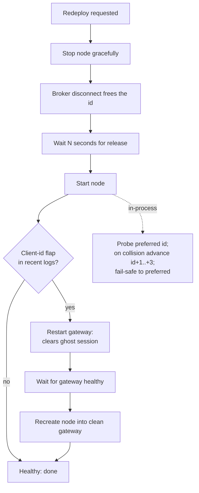

# 17. Broker realities

A strategy that passes every gate in Part II, clean walk-forward, deflated, tail-aware, survives the sanctuary, and is wired to the live path so faithfully that [research equals live](live-equals-research.md), can still make exactly zero dollars. Not because the edge was fake. Because the order never filled, or filled at the wrong size, or the instrument that backtested beautifully turned out to be untradable on the account you actually hold.

This is the chapter about the layer nobody validates and everybody discovers in production: the broker. The signal is the interesting part; the broker is where the interesting part goes to die quietly. Every story here is a real bug from Titan, and every one of them is invisible in a backtest, because a backtest assumes the order is a function call that returns a fill. It isn't. It's a request to a third party who has its own rules, its own rejection codes, its own idea of what currency your money is in, and its own opinion about whether you're even allowed to buy the thing.

## The principle: the broker is an adversary with a rulebook

Treat the broker the way you treat a backtest: *suspicion over celebration*. Assume every order can be rejected, every instrument can be unavailable, every reconnect can collide, and every price can be quoted in a currency you didn't expect. The rules are knowable but not guessable; they live in error codes and account entitlements, not in documentation you read once.

Four failure families cover the overwhelming majority of "it worked in the backtest" production incidents:

| Family | What breaks | The tell |
|---|---|---|
| **Order construction** | A leg with a bad parameter is rejected; the rejection cascades | `ORDER REJECTED` immediately after submit, often on the *wrong* leg |
| **Session identity** | A reconnect collides with the prior session's connection slot | "client id already in use" right after a redeploy |
| **Instrument availability** | An instrument *resolves* (data streams) but is *untradable* (regulatory block) | Data fine, orders rejected on entitlement grounds |
| **Currency / sizing** | A notional is divided by a price in the wrong currency | Position sized off by a constant ratio, no error raised |

The unifying lesson: **a fill is a negotiation, not a guarantee.** The rest of this chapter is the negotiation tactics that survived contact with a real broker (Interactive Brokers, in Titan's case, but the failure *shapes* generalise to any venue).

## Order construction: one bad parameter, two rejected orders

Most order APIs let you submit a *bracket*: an entry plus an attached take-profit (TP) and stop-loss (SL) as a linked group. The group is the convenience and the trap. If any leg is malformed, the broker can reject the *whole group*, and, critically, the rejection it reports may name the leg you didn't touch.

### The Titan example: a bracket helper with three required corrections

Titan's bracket call against IB needed three non-obvious settings to stop being rejected. Each was learned by reading rejection logs, not docs.

```python
bracket = self.order_factory.bracket(
    instrument_id=instrument_id,
    order_side=side,
    quantity=qty,
    sl_trigger_price=Price(sl_price, precision=precision),
    tp_price=Price(tp_price, precision=precision),
    entry_order_type=OrderType.MARKET,
    time_in_force=TimeInForce.DAY,   # (1)! entry TIF - NOT a differently-named arg
    tp_post_only=False,              # (2)! must be False or IB rejects the TP leg
    tp_time_in_force=TimeInForce.GTC,
    sl_time_in_force=TimeInForce.GTC,
)
self.submit_order_list(bracket)      # (3)! submit the group, not a single order
```

1. The entry order's time-in-force is the *shared* `time_in_force` argument. Passing a plausible-but-wrong name like `entry_time_in_force` raises `TypeError`: the bracket is never built, the trade never happens, and if the exception is swallowed it fails *silently* on every signal.
2. The factory defaults the TP limit leg to post-only. IB rejects a post-only limit inside a bracket group. That single default, left alone, rejects every bracket you ever submit.
3. A bracket is a *list*. Submitting it through the single-order path drops the attached legs.

The broker-agnostic lessons under the IB specifics:

- **The default is not the safe value.** Order-factory defaults are tuned for some venue's happy path, not yours. Audit every default against your broker's rejection codes.
- **Market orders and "good-til-cancelled" often don't mix.** Many venues only accept `DAY` for a market order and reserve `GTC`/`GTD` for resting limit and stop legs. Some security types add their own constraints; IB rejects fill-or-kill on FX spot outright. Know the valid *(order type × time-in-force × security type)* combinations for each instrument class you trade.

!!! warning "War-story: the TP leg that rejected the entry"
    A bracket order was rejected on every single signal. The log pointed at the **entry** order (`reason='... rejected due to the rejection of the order with ClientOrderId(...) in the list'`), so the first day of debugging chased the entry. The entry was fine. The real culprit was the *take-profit* limit leg, which inherited the factory's `tp_post_only=True` default; IB refuses a post-only limit inside an OTO/OCO group, and the rejection *cascaded* to the linked entry. The visible failure and the actual cause were different orders. The fix was one keyword (`tp_post_only=False`); the lesson was bigger: **in a linked order group, read the rejection of every leg, because a child leg's rejection can be reported against the parent.** No position was ever opened until this was found: a "working" strategy with a flat equity curve for an entirely mechanical reason.

!!! danger "War-story: the silent `TypeError` that ate every trade"
    A bracket was built with `entry_time_in_force=...`, a parameter that does not exist on the factory. It raised `TypeError` *before* the order list was ever constructed. Because the construction sat inside a broad try/except in the signal handler, the exception was logged at debug and the bar moved on. Conditions fired, the strategy "ran," and nothing traded for days. The rule it bought: **never wrap order construction in a swallowing try/except; let a malformed order crash loudly in paper, and alert on it in live.** A strategy that silently submits nothing is indistinguishable, on a dashboard, from one with no signals, which is the worst place for a bug to hide.

## Session identity: the client-id "flap" on redeploy

To connect to a broker socket you usually claim a *session slot*; IB calls it a client id. Only one connection may hold a given id at a time. This is fine until you redeploy: the new process tries to connect *before* the broker has noticed the old process is gone, and the broker refuses the id as already in use. The connection oscillates, a **flap**, and the node never comes up.

The naive redeploy (`force-recreate` the container in one shot) triggers exactly this, because the new container reconnects within seconds while the gateway still holds the prior session.

### The Titan example: graceful stop, wait, and a free-id fallback

Titan solves this at two layers: a deploy script that sequences the handoff, and an in-process probe that routes around a still-held id. Belt and braces.



The deploy script's logic, sanitised:

```bash
# Graceful stop: the long stop_grace_period lets the broker disconnect
# and FREE the client id before we reconnect.
docker compose stop "$SVC"

echo "Waiting ${WAIT_RELEASE}s for the gateway to release the client id…"
sleep "$WAIT_RELEASE"

docker compose up -d "$SVC"

# Watch for a flap; if it appears, restart the gateway to clear the
# stuck "ghost" session, wait for healthy, then recreate the node.
if flapping; then
    docker compose restart "$GW"
    # … wait for gateway healthy …
    docker compose up -d --force-recreate --no-deps "$SVC"
fi
```

And the in-process safety net, so the node survives even a botched manual restart:

```python
def _find_free_client_id(preferred: int, host: str, port: int, span: int = 3) -> int:
    """Probe preferred..preferred+span; advance past a collision; fail-safe.

    On broker 'client id already in use' (IB error 326), try the next id.
    On ANY probe failure, return `preferred` rather than refusing to boot -
    a wrong-but-present id is recoverable; a node that won't start is not.
    """
    for cid in range(preferred, preferred + span + 1):
        if _id_is_free(host, port, cid):   # throwaway probe connection
            return cid
    return preferred
```

The broker-agnostic lessons:

- **Disconnect is asynchronous.** The broker frees your slot *after* it notices you left, not the instant your process dies. A graceful stop plus a release wait is the cheapest fix; a hard kill plus instant reconnect is the reliable way to flap.
- **Have a fallback id, and fail *open* on the probe.** If you can't confirm the preferred id is free, boot anyway on a best-effort id. A node that refuses to start because of an ambiguous probe is a self-inflicted outage.
- **Detect the flap explicitly.** Grep your own recent logs for the collision string after a deploy and escalate (restart the gateway) automatically. Don't make a human notice.

!!! danger "War-story: the ghost session that wouldn't let go"
    A one-shot `force-recreate` redeploy put the node into a reconnect loop: every few seconds, *"Unable to connect as the client id is already in use,"* then retry, then the same. The gateway was holding a **ghost session**: the prior connection that the broker hadn't reaped. Nothing the node did could reclaim the id; it was held by a connection that no longer had a process behind it. While it flapped, the book was **unsupervised**: no strategy running, no kill switch evaluating, open positions exposed with nobody watching. The fix was operational, not clever: stop gracefully so the broker's own disconnect frees the id; wait for the release; and if a flap is still detected, restart the *gateway* to evict the ghost before recreating the node. The rule: **a redeploy is a handoff, not a restart; sequence the release of the old session before you claim it with the new one.**

## Instrument availability: resolves ≠ tradable

This is the one that surprises people the most, because the instrument *works*, right up until you send an order. A symbol can resolve to a valid contract, stream market data into your warm-up and your signal, look completely healthy on every dashboard, and still be **untradable on your account** for regulatory or entitlement reasons. Data permission and trade permission are different permissions.

The most common version in 2026: an account domiciled under EU/UK rules cannot *trade* many US-listed ETFs, because those ETFs don't publish a PRIIPs Key Information Document (KID). The data still flows. The order is rejected on entitlement grounds. If your signal is computed from the same instrument you trade, you won't notice in research; research never asks the broker for permission.

### The Titan example: trade the substitute, keep the original as a data-only signal

Several Titan sleeves use a US-listed ETF as a *signal* and need *exposure* to a related asset. Under PRIIPs the US line is data-only on the live account, so the architecture splits the two roles cleanly:

- **Signal instrument**: the US-listed line. Data streams fine; it never receives an order. It exists purely to feed the indicator.
- **Traded instrument**: a UCITS-wrapped substitute (e.g. a *USD-quoted Treasury UCITS ETF* on a European exchange standing in for a US Treasury ETF) that *is* PRIIPs-tradable on the account.

```python
# Roles are explicit in config: one instrument feeds the signal,
# a different (tradable) one receives the orders.
signal_instrument_id = "UST.USX"     # US-listed Treasury ETF: DATA ONLY  (1)!
traded_instrument_id = "USTU.EUX"    # USD Treasury UCITS: PRIIPs-tradable
```

1. Identifiers here are **placeholders** (`<symbol>.<venue>`-shaped); the live shortlist is redacted. The point is the *pattern*: the thing you trade and the thing you signal on need not be the same instrument, and on a regulated account they often *cannot* be. Read these as "a US-listed Treasury ETF feeding the signal, a USD-quoted Treasury UCITS line receiving the orders."

When you make this swap, two correctness properties move to the front:

- **Correlation of the substitute to the original.** A UCITS substitute is only valid if it tracks the asset you validated. Confirm a high price correlation between substitute and original over a long history before swapping; otherwise you've quietly changed the strategy. (Titan checks this explicitly: as a rule of thumb a substitute that tracks at corr ≳ 0.99 over the full history is a clean swap, one near 0.9 is a *different bet* wearing the same costume. The thresholds here are illustrative.)
- **The substitute's currency.** This is where instrument availability hands off to the next failure family. A US line you trade in USD might be substituted by a GBP-pence line on a London exchange, and now your USD-quoted sizing math is wrong. Titan deliberately picks the *USD-quoted* line of a substitute where one exists, precisely to keep the quote currency equal to the strategy's accounting currency and avoid an FX conversion entirely.

!!! warning "War-story: the bond leg that resolved, streamed, and refused every order"
    A regime-gated sleeve held a bond ballast leg priced off a US-listed Treasury ETF. The contract **resolved**. Bars **streamed**: warm-up filled, the signal computed, the dashboard was green. Then the first rebalance fired an order and IB rejected it: under UK PRIIPs/KID rules the US-listed ETF was **not tradable** on the account, even though its data was fully entitled. Nothing in research or in the data feed had hinted at it. The fix: keep the US line as a **data-only signal** and route the actual order to a USD-quoted Treasury **UCITS** substitute that *is* PRIIPs-tradable. The rule it bought: **resolution and data entitlement do not imply trade entitlement; verify an instrument is tradable on the *specific account* by attempting a (paper) order, not by checking that it streams.** A green data feed is the most convincing way to be blocked.

## Currency and sizing: the silent-1.0 trap

You have a notional in your accounting currency, say USD, and you want a number of units. The naive conversion is `units = notional / price`. That is correct *only when the price is quoted in your accounting currency.* The moment the instrument's quote currency differs, this silently produces garbage, and, because it's just arithmetic, **nothing raises an exception.**

The classic case is an FX cross. A `XXX/JPY` pair is quoted in JPY per 1 unit of the base currency. A USD notional divided by a JPY-per-unit price is dimensionally meaningless; and it doesn't error, it just sizes you wrong by the FX ratio. A non-USD-quoted equity line (the GBP-pence ETF from the section above) does the same thing more subtly: it's off by a constant of roughly the exchange rate, every single trade, forever.

### The Titan example: a converter that refuses to assume 1.0

Titan funnels every notional→units conversion through one helper whose entire job is to make the dangerous path *impossible to take by accident*.

```python
def convert_notional_to_units(
    notional_base: float,
    price: float,
    *,
    quote_ccy: str = "USD",
    base_ccy: str = "USD",
    fx_rate_quote_to_base: float | None = None,
) -> int:
    if price <= 0 or notional_base <= 0:
        return 0

    if quote_ccy == base_ccy:
        return int(notional_base / price)          # same-ccy: the trivial path

    if fx_rate_quote_to_base is None or fx_rate_quote_to_base <= 0:
        raise ValueError(                          # (1)! refuse to guess
            f"quote_ccy={quote_ccy!r} != base_ccy={base_ccy!r}; "
            f"fx_rate_quote_to_base is required - never assume 1.0."
        )

    notional_quote = notional_base / fx_rate_quote_to_base
    return int(notional_quote / price)
```

1. This is the heart of it. When the currencies differ and no rate is supplied, the function **raises** rather than quietly running `notional / 1.0`. The dangerous default, assume parity, is not available; the caller must *state* the rate, exactly as the metrics module in [a backtest you can trust](../part2-research/backtest-you-can-trust.md) refuses to compute a Sharpe without being told the frequency. The safest API is one where the wrong thing can't be expressed.

There is a residual hole the converter alone can't close: a caller can *legitimately* pass `fx_rate_quote_to_base=1.0` while `quote_ccy != base_ccy`, a hardcoded parity that the function happily accepts and then mis-sizes against. Titan plugs this at the *strategy* layer with a start-up guard that fail-fasts if any traded sleeve's quote currency differs from the accounting currency while its FX rate is the default 1.0. Two layers, because the silent-1.0 trap is the kind of bug that produces a plausible-looking position and a wrong-by-a-constant P&L that survives a casual glance.

The broker-agnostic lessons:

- **Quote currency is part of the instrument contract, not a detail.** Carry it explicitly through sizing. Don't infer it from the symbol at the call site.
- **Never default an FX rate to 1.0.** Make "no rate supplied" an error when currencies differ. A missing rate is a bug; a guessed rate is a *worse* bug, because it doesn't announce itself.
- **Pick the quote currency that matches your accounting currency where you have the choice.** The cleanest FX bug is the one you designed away by trading the USD line instead of the pence line.

!!! warning "War-story: the bond leg mis-sized by a third on a currency assumption"
    Two sizing defects shipped together in Titan's live-risk wiring: strategies read whole-account NLV in a non-deterministic currency, and an FX sleeve divided a USD notional by a cross-quoted price, mis-sizing by the FX ratio with no exception. Both fixes (a currency-explicit `get_base_balance` and a converter that *raises* on a missing cross-rate) and the allocator-collapse consequence are dissected in [Per-strategy equity & FX](../part5-portfolio-risk/per-strategy-equity-fx.md).

## Why this layer deserves its own discipline

None of these bugs is intellectually hard. They are hard to *find*, because they live in the seam between your code and a system you don't control, and because three of the four fail *silently*: no exception, just a flat curve, a wrong size, or an unsupervised gap. They share the texture of the [whole book](../part2-research/failure-mode-catalogue.md): the dangerous version looks plausible, and the fix is usually to make the unsafe operation impossible to express rather than to "be careful."

So the broker layer earns the same three habits the research layer did. **State the units**: the currency of every notional, the time-in-force of every leg. **Make the dangerous default absent**: no silent 1.0, no swallowed `TypeError`, no hard-kill redeploy. **Verify against the real thing, not the model**: a paper order proves tradability that a streaming feed never can.

## Takeaways

- **A fill is a negotiation, not a function call.** Every order can be rejected; design for the rejection, and read the rejection of *every* leg in a linked group; a child's rejection can be reported against the parent.
- **Audit order-factory defaults against your broker's rejection codes.** Post-only flags, market-order time-in-force, and per-security-type rules reject "valid-looking" orders. Never swallow the exception from a malformed order; let it crash loudly in paper.
- **A redeploy is a session handoff.** Stop gracefully so the broker frees your connection slot, wait for the release, detect the flap, and keep an in-process free-id fallback that fails *open*.
- **Resolution and data entitlement do not imply trade entitlement.** Under PRIIPs/KID, US-listed ETFs stream but won't trade on EU/UK accounts; substitute a UCITS line, confirm it tracks the original, and prefer the line whose currency matches your accounting currency. Prove tradability with a paper order.
- **Never assume an FX rate of 1.0.** Route sizing through a converter that *raises* when the quote currency differs and no rate is supplied, and guard at the strategy layer against a hardcoded parity. A wrong-by-a-constant size is the bug that survives a casual review.

---

This chapter handled the broker's idea of currency at the *order* level. The portfolio's idea of currency, per-strategy equity tracking, a deterministic accounting base, and the FX plumbing that keeps every sleeve's equity comparable, is the first thing Part V builds, in [Per-strategy equity & FX](../part5-portfolio-risk/per-strategy-equity-fx.md). From there the book turns from "did the order fill correctly" to "how much should the order have been in the first place," in [Position sizing: Kelly & vol-targeting](../part5-portfolio-risk/position-sizing-kelly.md).
