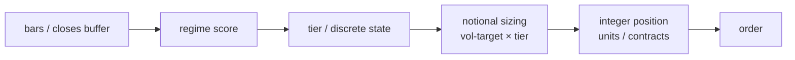

# 16. Making live == research

You spent Part II proving a strategy has an edge: walk-forward, deflation, Monte Carlo, a bootstrap lower bound above zero. Every one of those tests measured a *research artifact*: a function that maps a price history to a return series, run over a backtest in a notebook. Then you write a second piece of code, the live strategy class, that listens to bars from a broker feed and emits orders. And here is the quiet catastrophe at the heart of every production stack: **nothing forces those two pieces of code to compute the same thing.**

They almost always start identical. They almost always drift. The research code gets a vectorised speed-up; the live code gets a "small" approximation to fit the event loop; someone changes a lookback in one place and not the other. None of it shows up in a backtest, because the backtest never runs the live class. It shows up as a P&L curve that doesn't match the one you validated, and by the time you notice, the divergence has been spending real money for weeks.

This chapter is about closing that gap with two cheap, mechanical tests: a **parity test** that proves the live class computes the same signal as an *independent* research reference, and a **causality test** that proves the live class can't see the future. Get these right and "the backtest was a lie" becomes a category of bug you've structurally retired.


## The principle: the deployed thing must be the validated thing

A backtest certifies a *function*. Live trading runs a *different* function: same intent, different code, different data shape (a panel of history vs. a streaming buffer), different control flow (vectorised vs. one-bar-at-a-time). Validation only transfers from the first to the second if you can show they agree. Restated as a rule we hold non-negotiable:

> **No strategy goes live until a test proves its live signal path equals an independent research reference, bar-for-bar, across the full decision chain; and a separate test proves that path is causal.**

Two words in there carry all the weight.

**"Independent"** means the parity reference is *not the live class*. The single most seductive way to write a parity test is to call the live class twice and check it agrees with itself. That test passes forever and proves nothing; it can't catch a bug that lives in the live class, which is the only place a parity bug *can* live. The reference must be the research code that produced the validated track record (or a clean re-derivation of it). When they disagree, the disagreement *is* the finding.

**"Full chain"** means you don't just check the headline number. A live strategy is a pipeline:



A parity test that stops at the regime score can be green while the tier mapping, the sizing, or the integer rounding silently disagrees with research. Each arrow is a place to drift. The test must walk the whole pipeline, **regime score → tier → notional → integer position**, because the bug is wherever you stopped checking.

### Parity: pin the live path to an independent reference

The shape of a good parity test is always the same. Build a deterministic synthetic history (a seeded random walk, no parquet, no data pipeline, fast in CI). Run it through the research reference. Run the *same input* through the live class, bypassing the broker event loop. Assert agreement, bit-exact where the math is identical, within a stated tolerance only where the two implementations legitimately differ.

Here is the pattern Titan uses, sanitised. The live class delegates the *hard* math to the same research function the backtest used, so parity holds **by construction**, and the test exists to prove that delegation never quietly gets replaced by an approximation:

```python
def test_live_class_matches_independent_reference():
    closes = build_synthetic_universe(n=500, seed=42)   # deterministic

    # Reference path: the vectorised research simulation, last row.
    reference = simulate_strategy(closes, ref_cfg)       # (1)!
    ref_last = reference.iloc[-1]

    # Live path: instantiate the class WITHOUT the broker runtime, pre-load
    # its internal buffer, and ask it for the signal at "now".
    live = make_live_strategy(closes, live_cfg)          # (2)!
    targets = live._compute_targets_now()

    # FULL CHAIN, not just the headline:
    assert targets.winner        == ref_last["winner"]              # signal
    assert targets.regime_state  == ref_last["regime_state"]        # tier
    assert targets.notional      == pytest.approx(                  # sizing
        ref_last["weight"] * ref_last["vol_scale"] * equity, rel=1e-9)
    assert targets.position_units == ref_last["position_units"]     # integer
```

1.  The reference is the **research** code that produced the validated curve, *not* the live class. This is the whole point.
2.  `make_live_strategy` uses `__new__` to skip `__init__` (which needs a broker fixture) and sets the buffer directly, so we test the real `_compute_targets_now()` logic with no runtime.

Two design choices make this honest. First, **bypass the event loop, keep the logic.** We instantiate the live class with `__new__`, assign its internal close buffer, and call the real signal method. We are testing the production code path, not a reimplementation of it, but without standing up a broker. Second, **the tolerance tells a story.** Where both paths run the identical function, demand `check_exact=True` / `rel=1e-9`: any difference is a bug. Where they legitimately differ, say a rolling percentile rank computed over a buffer vs. a panel, state the tolerance *and why it's safe*: "the two windowings differ by O(1/window) on the rank, which is far below the smallest tier-threshold gap, so the operational decision is identical."

Cover the discrete boundaries explicitly. A regime-to-tier mapping with hysteresis is a step function; floating-point noise near a threshold is exactly where live and research split. So sweep a grid of `(score, current_state)` pairs through *both* the live and research tier functions and assert they never disagree, and deliberately include the points *on* and *one ulp either side of* each boundary, where the same arithmetic can round two ways (the classic `0.1 + 0.2 == 0.30000000000000004`):

```python
# THR_LO, THR_HI, BUF are placeholders for the real (redacted) tier
# thresholds and hysteresis buffer - substitute your own. The point is the
# grid: hit each boundary, then nudge by ±epsilon to expose float fragility.
EPS = 1e-9
boundaries = (THR_LO, THR_LO + BUF, THR_HI, THR_HI + BUF)
grid = (0.0, *boundaries, *(b + EPS for b in boundaries),
        *(b - EPS for b in boundaries), 1.0)

for score in grid:
    for current in (0.0, 1.0, 2.0):     # the achievable discrete states
        assert live_tier(score, current, ...) == research_tier(score, current, ...)
```

And pin the degenerate inputs: a `NaN` score during warmup must *hold the current state*, never flip the book to cash. These are one-line tests that catch the bugs that cost the most.

!!! danger "War-story: the live class that approximated the math (A11)"
    A tiered strategy was validated in research as a regime detector whose **position size scaled with the tier**: cash in the worst regime, a base size in the middle, a multiple of base in the best. The edge *was* the tiering: concentrating exposure when the regime was favourable and standing down when it wasn't.

    The live class shipped with a quietly different sizer: it computed the tier correctly, logged it correctly, then sized to a **constant notional regardless of tier**. The tier flowed into the logs and into nothing else. The thing that traded was a flat, always-on version of a strategy whose entire validated edge came from *not* being flat. The backtest's Calmar and its drawdown geometry, the path a human actually has to hold, described a strategy that wasn't running.

    The parity test at the time stopped at the regime score, which matched perfectly, so it stayed green. The fix (audit finding **A11**) was to extend parity through the **full chain**: assert the live *notional* and the live *integer position* equal `reference_weight × tier × vol_scale × equity`, rounded the same way. A constant-weight live class now fails the test loudly, in CI, before it can touch capital. The rule it bought: **a parity test that stops before the integer position is not a parity test; it's a regime-score test wearing a parity test's name.**

!!! warning "War-story: the parity test that compared the class to itself (A10)"
    Earlier still, a strategy *had* a parity test, and it was green, and it was worthless. It instantiated the live class, ran it forward, then instantiated the live class *again* and checked the two runs agreed. Of course they did; it was the same code computing the same thing twice. The test was measuring determinism, not parity. It could not, even in principle, have caught the constant-weight bug above, because the bug lived in the live class and the test only ever consulted the live class.

    The audit finding (**A10**) made the requirement explicit: **a parity test must compare the live computation against an *independent* research reference**, the function that produced the validated track record, or a clean re-derivation of it, never the live class against itself. You do not catch your own leak by re-reading your own code; you catch it with a second, independent path that disagrees. Rewritten to call the research simulation as the oracle, the same test would have failed the day the live sizer was approximated.

These two stories are the same lesson from two angles. A10 is about *what you compare against* (an independent oracle, not a mirror). A11 is about *how much you compare* (the whole chain, not the easy first hop). A parity test that gets either wrong is a green light with the bulb removed. Both sit in Family 4 of [the failure-mode catalogue](../part2-research/failure-mode-catalogue.md); this chapter is their canonical mechanism: the catalogue carries the one-line index entries.

### Causality: corrupt the future, demand the past doesn't move

Parity proves live and research compute the *same* function. It does **not** prove that function is legitimate. Both could share a look-ahead bug: research vectorises `signal[t]` from data through `t`, live faithfully reproduces it, and the parity test happily certifies a strategy that peeks. (The mechanics of look-ahead, same-bar collect, future-normalised features, are dissected in [A backtest you can trust](../part2-research/backtest-you-can-trust.md); here we prove the *live class* is clean.)

The test for legitimacy is the **corrupt-the-future** test, and it is brutally simple. Compute the output at bar *t*. Then replace every bar *after t* with garbage, multiply them by 100, or 1000, anything absurd, and recompute. If the output at *t* is **bit-exact unchanged**, the signal at *t* depended only on data up to *t*. If it moved, you have a leak, and you've found it without inspecting a single line of logic.

```python
def assert_causal(fn, src, *, n_trials=5, seed=42):
    """Future bars × 100; the past output must be bit-exact unchanged."""
    baseline = fn(src.copy()).copy()
    rng = np.random.default_rng(seed)
    for _ in range(n_trials):
        cut = int(rng.integers(len(src) // 2, len(src)))     # random cut point
        corrupted = src.copy()
        corrupted.iloc[cut:] *= 100.0                          # poison the future
        past_after = fn(corrupted)[:cut]
        pd.testing.assert_series_equal(
            baseline[:cut], past_after, check_exact=True,       # bit-exact
        )
```

Three details make it teeth-bearing rather than ceremonial. **Multiple random cut points** (not one fixed split): a leak that only bites near a particular bar still gets caught. **Bit-exact comparison** (`check_exact=True`), not `approx`: a causal function is *identical*, not *close*; any tolerance hides a small leak. And a **negative control**, a deliberately leaky function (one that uses `close.shift(-1)`) that the harness must *fail*, because a causality test that never fails is indistinguishable from one that's broken:

```python
def test_harness_catches_a_leak():
    def leaky(src):                       # uses TOMORROW's close
        return (src["close"].shift(-1) / src["close"] - 1).fillna(0.0)
    with pytest.raises(AssertionError):
        assert_causal(leaky, build_src())
```

Run causality on the *live* class's signal method, not only on the research function. Truncate the buffer to bar *t*, ask the class for its targets, then corrupt the post-*t* bars, truncate again, ask again, and assert the targets are identical. That proves the production code path, buffer management, warmup gating, and all, never reaches forward in time.

!!! tip "Make causality a repo-wide gate, not a per-strategy chore"
    The cheapest way to keep this honest is one parametrised harness that runs the corrupt-the-future test over *every* registered strategy's returns function. New sleeve, new row in the registry; the gate runs automatically because CI runs the whole suite. A strategy that can't pass `assert_causal` simply can't merge; and because the harness carries its own negative control, you know the gate has teeth on the day a real leak arrives.

## How Titan wires it together

The two tests slot into the deployment gate the same way the metrics module slots into research: as something you *cannot skip*, not something you *remember to do*.

- **Parity by construction, parity by test.** The live class delegates the validated math to the same research function the backtest called, so it's parity-true by construction, and a test asserts that delegation holds, bit-exact, across signal → tier → notional → integer position. If someone "optimises" the live path into an approximation, the test goes red.
- **Bypass the runtime, exercise the logic.** Tests build the live class with `__new__`, pre-load its buffer, and call its real signal method. No broker, no event loop; just the production code path, not a stand-in.
- **Causality on the live signal, repo-wide.** One harness corrupts the future across all sleeves; each strategy's live `_compute_targets_now()` (and its research returns function) must hold its past bit-exact. A negative control proves the harness can fail.
- **Both are merge gates.** Parity and causality live in `tests/`, CI runs `tests/`, so a strategy that drifts or peeks cannot reach the deploy branch. This is the enforcement arm of [the strategy-class contract](strategy-class-contract.md): the contract says *what* the live class must implement; these tests prove it implements the *validated* thing.

!!! example "What the full-chain assertion buys you"
    The single most valuable line in the parity suite is the one that checks the **integer position**, not the signal. Signals match easily; they're the same formula. The drift hides downstream: a tier that doesn't reach the sizer, a vol-scale applied in research but not live, a rounding convention that floors where research truncates, a leveraged instrument sized as if it weren't (see [per-strategy equity & FX sizing](../part5-portfolio-risk/per-strategy-equity-fx.md) for the currency and contract-multiplier traps). Asserting the *final integer order quantity* equals `reference_weight × tier × vol_scale × equity / price`, rounded identically, is the one check that proves the thing trading is the thing you validated.

## Takeaways

- **Live and research are two functions; nothing makes them equal but a test.** They start identical and drift, silently, and always in a direction the backtest can't see.
- **Parity must compare against an independent reference (A10).** A test that runs the live class against itself proves determinism, not parity, and can never catch a bug in the live class, which is the only place a parity bug lives.
- **Parity must cover the full chain (A11):** regime score → tier → notional → **integer position**. Stop early and you ship a flat version of a tiered strategy with the validated edge missing. Assert the final order quantity, not just the signal.
- **Causality is a separate question.** Parity can certify two paths that *share* a look-ahead. The corrupt-the-future test (multiply the future, demand the past stays bit-exact, at several random cut points, with a negative control) proves the live signal can't peek.
- **Make both merge gates.** Pin the wrong call out of existence: a strategy that drifts from research or reaches into the future should fail CI, not surprise you in the P&L.

---

This chapter proved the live class computes the *validated* thing, causally. But "the same math" still has to survive contact with a real broker (fills, spreads, financing, rejected legs) which is where research and live diverge for reasons the parity test can't see. That's [Broker realities](broker-realities.md). And once the signal is trustworthy, the question becomes how much capital to put behind it: [Position sizing: Kelly & vol-targeting](../part5-portfolio-risk/position-sizing-kelly.md).
