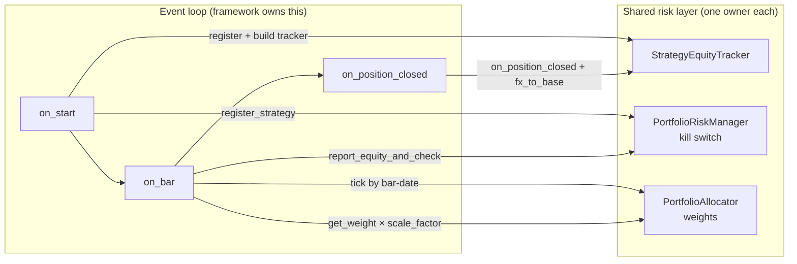

# 15. The strategy class & the integration contract

A research backtest is one function: bars in, an equity curve out. A *live* strategy is a long-running object that wakes on every bar, talks to a broker, talks to a shared risk layer, and survives a 3 a.m. container restart without doubling its position. The gap between those two things is where most of the damage in a production stack happens: not in the alpha, in the *plumbing around* the alpha.

This chapter is about the plumbing, and specifically about the smallest possible interface that keeps a fleet of strategies honest with the risk layer. The principle: **a live strategy should be a thin shell around a backtested signal, and the seam between it and the shared portfolio machinery should be so small you can audit it in one glance.** When that seam is fat, when every strategy invents its own way to size positions, read account equity, or check the kill switch, you don't have one risk system, you have *N* slightly-different risk systems, and the differences are exactly where the bugs live.

We'll define the contract generically, show how Titan implements it as a three-touch lifecycle, walk the canonical sizing call, and then tell the war-stories of the seam leaking: equity, currency, and restart.

## The principle: lifecycle hooks + a narrow contract

Every event-driven trading framework (NautilusTrader, Backtrader, Zipline, QuantConnect, your own asyncio loop) gives you the same shape: an object with **lifecycle callbacks**. You get told when the strategy starts, when a bar arrives, when an order fills, when a position closes. The framework owns the loop; you fill in the hooks.

That's the easy part. The part that decides whether you can run ten strategies in one process without them silently fighting each other is the **integration contract**: the handful of calls each hook *must* make to the shared layers: the per-strategy equity ledger, the portfolio risk manager (the kill switch), and the capital allocator.

Three rules make the contract trustworthy:

1. **One owner per concern.** Equity accounting lives in one tracker class. The halt decision lives in one risk-manager singleton. Capital weights live in one allocator. A strategy *calls* these; it never re-implements them.
2. **The unsafe path is absent or fails loud.** If a strategy can read "the account balance" and get a non-deterministic currency, it will, eventually, on a multi-currency account, at the worst time. The contract removes that option (see [per-strategy equity & FX](../part5-portfolio-risk/per-strategy-equity-fx.md)).
3. **The same code path runs in research and live.** The sizing math, the annualisation factor, the vol estimator, all routed through the same shared modules the backtest used. This is the whole subject of [live equals research](live-equals-research.md); the contract is how you enforce it at the strategy boundary.



The arrows are the entire contract. There are only five of them. If a new strategy wires up those five correctly, it inherits the whole portfolio risk apparatus for free; if it skips one, it breaks the apparatus quietly for *everyone*, because these are shared singletons.

## The Titan example: a three-touch lifecycle

Titan strategies subclass the framework's `Strategy` base and implement the same three hooks against the same contract. Our running example is a generic cross-asset momentum sleeve, call it bond→gold: a long-only daily strategy that times one USD-quoted ETF off the momentum of another. (Instruments, lookbacks, and thresholds here are illustrative; the real deployable parameters are edge and stay out of this book.)

### Touch 1, `on_start`: register and rehydrate

`on_start` runs once. Its job is to announce the strategy to the risk layer, build its private equity ledger, warm up from disk, subscribe to bars, and, critically, *recover its own position from the broker.*

```python
def on_start(self) -> None:
    self._prm_id = f"bond_gold_{self.config.ticker}"          # stable id

    # (1) register with the kill switch / risk manager (exactly once)
    portfolio_risk_manager.register_strategy(
        self._prm_id, self.config.initial_equity,
    )

    # (2) build this strategy's OWN equity ledger, in the portfolio base ccy
    self._equity_tracker = StrategyEquityTracker(
        prm_id=self._prm_id,
        initial_equity=self.config.initial_equity,
        base_ccy=self.config.base_ccy,            # e.g. "USD"
    )

    self._warmup()                                # load data/*.parquet
    self.subscribe_bars(self.bar_type)
    self.subscribe_bars(self.signal_bar_type)

    # (3) adopt any pre-existing broker position so a restart doesn't double up
    self._rehydrate_position_from_broker()
```

Two things earn their place here. First, `register_strategy` is called **exactly once**; registering twice would re-seed the equity series and confuse the allocator's per-strategy vol estimate. Second, the equity tracker is built with an explicit `base_ccy`; the strategy never asks the account "what's my balance?" and hopes for the right currency. Why that matters is its own chapter, [per-strategy equity & FX](../part5-portfolio-risk/per-strategy-equity-fx.md), but the short version: a shared whole-account balance fed to every strategy collapses the entire portfolio risk model into one identical equity series, and the inverse-vol allocator and correlation gate stop meaning anything.

The third line, rehydration, is the one that bites in production and never in a backtest. More on it below.

### Touch 2, `on_bar`: the per-bar risk handshake

`on_bar` is where the contract does its real work, and the *order of operations is load-bearing*. The risk check comes first, before any signal logic, before any order:

```python
def on_bar(self, bar: Bar) -> None:
    bar_date = unix_nanos_to_dt(bar.ts_event).date()

    # (1) report this strategy's equity AND read the halt flag - one call
    _, halted = report_equity_and_check(
        self, self._prm_id, bar, tracker=self._equity_tracker,
    )
    if halted:                                    # (2) flatten BEFORE any order
        self.close_all_positions(self.instrument_id)
        return

    # (3) advance the allocator's clock with the BAR's date, not wall-clock
    portfolio_allocator.tick(now=bar_date)

    # ... signal logic, then maybe an order ...
```

`report_equity_and_check` is the one-line contract that wires the strategy to the risk layer. It is deliberately a single call that does two things, pushes equity *in* and reads the halt flag *out*, so a strategy author cannot do one without the other. Internally it:

- resolves this strategy's equity from its tracker (`initial_equity + realized_pnl + mark-to-market`), falling back to a *deterministic* base-currency account balance only if no tracker exists;
- pushes that timestamped equity into the risk manager via `portfolio_risk_manager.update(prm_id, equity, ts=bar.ts_event)`, which ratchets the per-strategy high-water mark and re-runs the portfolio health check;
- returns `(equity, halt_all)`.

```python
def report_equity_and_check(strategy, prm_id, bar, *, tracker=None,
                            fallback_account_ccy="USD") -> tuple[float, bool]:
    equity = tracker.current_equity() if tracker is not None else None
    if equity is None or equity <= 0:
        accounts = strategy.cache.accounts()
        if accounts:
            equity = get_base_balance(accounts[0], fallback_account_ccy)
    equity_val = float(equity) if equity is not None else 0.0
    ts = getattr(bar, "ts_event", None)           # raw ns epoch; PRM normalises
    if equity_val > 0:
        portfolio_risk_manager.update(prm_id, equity_val, ts=ts)
    return equity_val, portfolio_risk_manager.halt_all
```

Because **every** strategy calls this on **every** bar, the kill switch is re-evaluated on every bar of every strategy in the process. That is the design: the portfolio drawdown gate (Titan trips a hard halt at a portfolio drawdown in the mid-teens percent; exact figure is a risk parameter, not edge) doesn't run on a timer; it runs whenever any sleeve reports equity. The flip side, what happens if the *feed stalls* and no bar arrives, so the in-process check never re-runs, is exactly why there's also an out-of-process arbiter and a heartbeat watchdog, covered in [layered safety](../part5-portfolio-risk/layered-safety.md).

Note the `tick(now=bar_date)` detail. The allocator advances on the **bar's** calendar date, not the machine's wall clock. In a backtest the two are wildly different; in live they're usually close but not identical (a bar can arrive late). Keying off bar-date means the allocator rebalances on the same schedule whether you're replaying history or trading it; another instance of *live equals research*.

### Sizing: the canonical conversion

Once the strategy decides to trade, it has to turn a *notional* (a dollar amount of exposure) into an *integer unit count*. This is the single most error-prone line in any live strategy, because it's where currency, price quoting, and the portfolio weight all collide. The canonical Titan sizing call:

```python
def _compute_size(self, price: float) -> int:
    equity = self._equity_tracker.current_equity()

    # instrument-level vol target (uses the SHARED metrics module)
    rets = pd.Series(self._closes[-N:]).pct_change().dropna()  # N illustrative
    span = self.config.ewma_span                          # smoothing span (config)
    rm_lambda = (span - 1.0) / (span + 1.0)
    ann_vol = ewm_vol_last(rets, lam=rm_lambda,
                           periods_per_year=BARS_PER_YEAR["D"])  # 252, explicit

    notional = equity * (self.config.vol_target_pct / ann_vol)  # vol-target
    notional = min(notional, equity * self.config.max_leverage) # leverage cap

    # portfolio-level scaling: inverse-vol weight × correlation dial × throttle
    alloc = portfolio_allocator.get_weight(self._prm_id)
    notional *= alloc * portfolio_risk_manager.scale_factor

    return max(0, int(notional / price))
```

Three observations the reader should carry forward:

- **Volatility enters twice, on purpose.** The strategy scales by its *instrument's* realised vol (so a calm instrument gets a bigger position); the allocator scales by the strategy's *equity-curve* vol (so a smooth sleeve gets more capital). Different vols, different jobs. Sizing is never just one number: see [position sizing: Kelly & vol-targeting](../part5-portfolio-risk/position-sizing-kelly.md) for why a fractional-Kelly cap belongs on top of this and why the leverage cap is the cheapest ruin-control you have.
- **The annualisation factor is explicit** (`BARS_PER_YEAR["D"]`). No defaulting. This is the same discipline the metric suite enforces in research, applied at the live call site so a daily strategy can't silently borrow an hourly factor.
- **`scale_factor` is a `min`, not a product.** The risk manager composes its drawdown throttle, vol throttle, and regime throttle as the *minimum* of the components, not their product, because every component reacts to the same portfolio-level stress and multiplying would de-risk you several times over for a single event. The strategy doesn't need to know this; it just multiplies by one number. That's the point of a narrow contract.

The `int(notional / price)` is the trivial same-currency case. The instant your instrument is quoted in a currency other than your accounting base, a JPY-quoted pair in a USD book, that division is *wrong*, and you need the FX-aware converter. That converter, and the bug it exists to prevent, is the subject of one of the war-stories below.

### Touch 3, `on_position_closed`: book the P&L in base currency

When a position closes, the strategy resets its local state and tells its tracker how much it made, **converted to the portfolio base currency**:

```python
def on_position_closed(self, event) -> None:
    self._current_pos = 0
    self._bars_held = 0
    if self._equity_tracker is not None:
        pnl = float(event.realized_pnl.as_double())   # in the QUOTE ccy
        self._equity_tracker.on_position_closed(pnl, fx_to_base=1.0)  # USD == USD
```

The tracker's accumulator is one line, `realized_pnl_base += realized_pnl * fx_to_base`, and the entire correctness of the per-strategy equity curve rides on that `fx_to_base` being right. For a USD instrument in a USD book it's legitimately `1.0`. For anything else it is *not* `1.0`, and passing `1.0` anyway produces no error, no warning, and a quietly wrong equity curve that poisons the allocator and the high-water mark for the rest of the run.

## War-stories: where the seam leaks

!!! warning "The strategy that fed everyone the same equity"
    Before the per-strategy tracker existed, every strategy read whole-account NLV via `balance_total(list(balances.keys())[0])`, so all sleeves reported the identical equity series; the inverse-vol allocator degenerated to equal-weight and the correlation gate saw a constant 1.0, silently switching off the portfolio risk model. The fix (one `StrategyEquityTracker` per sleeve; `report_equity_and_check` as the only sanctioned push) is dissected in [Per-strategy equity & FX](../part5-portfolio-risk/per-strategy-equity-fx.md).

!!! danger "The FX leg sized by a third on a `1.0` assumption"
    An FX sleeve turned a USD notional into units via `notional / price` where price was quoted in a non-USD currency: an implicit `fx=1.0` that over-sized by the FX ratio with no exception. The contract's answer is two layers: a converter that *raises* when `quote_ccy != base_ccy` and no rate is supplied, plus an `on_start` guard that fail-fasts on a literal `fx=1.0` with a mismatched quote currency (the one case the converter can't catch). Full autopsy in [Per-strategy equity & FX](../part5-portfolio-risk/per-strategy-equity-fx.md).

!!! danger "The restart that doubled the position"
    On a container restart, the framework reconciles the strategy's open broker positions but, because the prior session's `strategy_id` was lost on shutdown, tags them as *external* rather than as belonging to this strategy. An early position-lookup filtered by `strategy_id` only, so it saw zero positions, concluded the strategy was flat, and on the next entry signal submitted a fresh BUY *on top of* the inventory already at the broker. Every restart added another lot.

    Compounding it: the side-detection compared a position's side via its string repr, and the framework's enum repr for an external-tagged position differed from the bare name the code expected, so even when positions *were* found, the long/short logic mis-fired.

    The fix is `_rehydrate_position_from_broker` in `on_start`: adopt **all** open positions for the instrument regardless of tag, sum their *signed quantity* (never compare side-as-string), and set local state so the strategy is immediately eligible to exit rather than re-enter. This is the canonical bug that *cannot occur in a backtest*, since there's no "restart" in a replay, which is precisely why the live class needs a hook the research code never had. (Rehydration relies on each sleeve targeting a unique instrument, so adoption is unambiguous; when two strategies share an instrument, flatten the dead one first; see [the live runbook](../part6-deploy-ops/live-runbook.md).) This is a *position-adoption* bug, distinct from persisting a halt across a restart; that one belongs to [The portfolio risk manager](../part5-portfolio-risk/portfolio-risk-manager.md); here the danger is inventory the strategy can't see, not a kill switch that forgets it tripped.

## A hostile-audit checklist

Because the contract is so small, you can review a new strategy against it mechanically. We run exactly this checklist before any sleeve goes near capital:

- `register_strategy` is called **exactly once**, in `on_start`.
- `report_equity_and_check` is called on every bar, and `halt_all` is checked **before** any order is submitted: flatten-and-return on halt.
- Every `allocator.tick()` passes an explicit `now=<bar-date>`; no implicit wall-clock.
- Sizing routes through the shared vol estimator with an **explicit** `periods_per_year`, and through `convert_notional_to_units` for any non-base-currency instrument.
- `on_position_closed` books P&L with the **correct** `fx_to_base` (and the `on_start` currency guard is present for cross-ccy sleeves).
- No raw whole-account balance reads; no reaching into the risk manager's or allocator's private state.

If a strategy passes those six, it is a well-behaved member of the portfolio. If it fails one, the failure is usually invisible until it's expensive, which is the entire reason the checklist exists.

## Takeaways

- A live strategy is a **shell**: lifecycle hooks around a backtested signal, with a deliberately tiny contract to the shared risk layer. Keep the seam small enough to audit at a glance.
- The contract is **five arrows**: register + build tracker (`on_start`), report-equity-and-check + tick-the-allocator (`on_bar`), and book-P&L-in-base-ccy (`on_position_closed`). One call (`report_equity_and_check`) deliberately couples "push equity" with "read the halt" so you can't do one without the other.
- **One owner per concern.** Equity, the kill switch, and the weights each live in exactly one place; strategies call them, never re-implement them. Re-implementation is how you end up with *N* divergent risk systems.
- **Make the dangerous path absent or loud.** Deterministic base-currency equity, an FX converter that raises rather than guesses, plus an `on_start` guard for the one silent case the converter can't catch.
- **Sizing is multi-step and currency-aware**: vol enters at both the instrument and portfolio level, the annualisation factor is always explicit, and `scale_factor` is a `min` of throttles, not a product. Cap leverage as your cheapest ruin control.
- The bugs that bite live (same-account equity, the `fx=1.0` mis-size, the restart double-up) **cannot happen in a backtest.** That's the whole reason the live class needs hooks the research code never had.

---

The contract assumes that what runs live computes the *same* numbers the backtest did. Enforcing that (same metrics module, same shift discipline, same data shape from research to production) is the subject of [**Live equals research**](live-equals-research.md). And the layers this chapter calls into (the per-strategy ledger, the portfolio risk manager's kill switch and `scale_factor`) get their own deep treatment in [**Per-strategy equity & FX**](../part5-portfolio-risk/per-strategy-equity-fx.md) and [**The portfolio risk manager**](../part5-portfolio-risk/portfolio-risk-manager.md).
