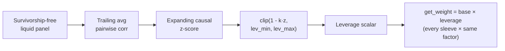

# 21. The Allocator & the correlation dial

You have a handful of strategies that each pass their own gates. Now a harder question: how much capital does each one get, and does that split survive a day when *everything* moves together? Most books answer the first question and ignore the second; the second is the one that ends accounts.

Equal weight feels fair and is almost always wrong: it silently concentrates *risk* in whichever sleeves happen to be loudest and most correlated. This chapter is about turning a pile of strategies into a *book*, splitting capital by risk, not by headcount, and then putting one dial on top that pulls the whole book's gross exposure down when the market's correlation regime turns brittle. The dial is the part people skip. It is also the part that decides whether a correlated crash is a drawdown or a death.


## The principle: weight by risk, not by name

The naive default, "I have N strategies, give each `1/N`", quietly makes a bet you never intended. A sleeve that runs at 20% annualised volatility and one at 5% get the same dollars, so the loud one contributes roughly four times the portfolio's risk. Your "diversified, equal-weight book" is, in risk terms, mostly one strategy.

The first fix is **inverse-volatility weighting**: scale each sleeve's capital by the reciprocal of its volatility, so each contributes roughly equal *risk*, not equal *dollars*.

$$ w_i = \frac{1/\sigma_i}{\sum_j 1/\sigma_j} $$

Inverse-vol is the right starting point because it is cheap, transparent, and hard to break. It needs only a volatility estimate per sleeve: no covariance inversion, no optimiser, nothing that can blow up when you have three strategies and forty noisy observations. But it has one blind spot you must respect: **it ignores correlation.** Two sleeves at identical vol get identical weight even if they are the *same trade* wearing two tickers. Inverse-vol equalises *standalone* risk contribution; it does nothing about the joint risk that two correlated bets stack on top of each other. That gap is exactly what the rest of this chapter closes: first with a crude penalty, then with the correlation dial, and (as alternatives) with allocators that model the covariance directly.

!!! note "Two different 'weights': don't conflate them"
    Systems usually carry two weight layers that look alike and mean nothing alike. One is a **seed split**: a one-time division of account equity into each strategy's starting balance (a registry knob, "this sleeve starts with 3× the seed of that one"). The other is the **allocator weight**: the live, periodically-recomputed fraction of the book each sleeve sizes against. The seed split decides where each equity curve *begins*; the allocator decides how much each gets *now*. Mixing them up double-counts a conviction you only meant to express once.

## How Titan does it: inverse-vol on the equity-curve grid

Titan's `PortfolioAllocator` is deliberately the simplest thing that is correct. It computes each sleeve's volatility from that sleeve's **own equity curve**, not from the instruments it trades. That distinction matters: the allocator is splitting capital across *strategies*, so the unit of risk is "how much does this strategy's P&L wobble," which is the equity curve's volatility, already net of the strategy's internal sizing, hedges, and flat periods.

```python
# σ_i from the EWMA variance of a strategy's daily equity returns, annualized.
sigma_i = sqrt(EWMA(lambda=0.94).var(daily_returns_i)) * sqrt(252)
w_i     = (1 / sigma_i) / sum(1 / sigma_j)
```

A few design choices are load-bearing, and each one was bought by a bug:

- **EWMA volatility, not a flat window.** An exponentially-weighted estimate (decay `λ` around 0.94) leans on recent behaviour without overreacting to a single bar. A sleeve whose vol just doubled should get cut *soon*, not after it ages out of a 60-day window.
- **One aligned daily grid for vol *and* correlation.** Every sleeve's equity is resampled to a shared business-day index before any math runs. Vol, correlation, and the penalty all read off the same `DataFrame`. Misaligned timestamps are how an H1 strategy and a daily strategy end up "correlated" with a number that means nothing.
- **Floor and ceiling, via water-fill.** A `min_weight` (every live sleeve gets at least a small floor, e.g. ~5%) and a `max_weight` (no sleeve exceeds a cap, e.g. ~60%) keep the book from degenerating into one bet or from starving a real diversifier to zero. Clamping naively breaks the sum-to-one invariant, so Titan **water-fills**: clamp the violators to their bound, redistribute the residual among the unsaturated sleeves, repeat until it converges (at most a handful of passes). Immature strategies (too little history to estimate vol) are pinned at the floor rather than guessed at.
- **A crude correlation penalty.** On the same aligned grid, any pair whose absolute correlation exceeds a threshold (≈0.70, illustrative) has *both* weights nudged down by a fixed factor (10%) before renormalisation. This is not risk parity; it is a blunt "you two look like the same trade, take a haircut each" rule that catches the worst concentration without an optimiser.

!!! warning "Rebalance on the wall clock, not the tick counter"
    The first version rebalanced every *N ticks*. With a once-a-day strategy in the book that's roughly monthly; add an H1 strategy streaming 24 bars a day and the same "monthly" counter fires every ~1 day. The book churned, paid spread on every rebalance, and the vol estimates never settled. The fix: gate the rebalance on **calendar distance** (`(today - last_rebalance).days >= interval`) so `tick()` is safe to call from every bar of every strategy and the rebalance only actually fires on the wall-clock cadence (≈21 calendar days, illustrative). The lesson generalises: **any "periodic" action in a multi-timeframe system must be gated by wall-clock time, never by an event count, because event rates differ per strategy.**

## A worked weighting example (generic)

Four sleeves, illustrative volatilities. Inverse-vol turns vol into weight; lower vol earns more capital because it takes more of it to contribute the same risk.

!!! example "Inverse-vol, step by step (illustrative numbers)"
    | Sleeve | Ann. vol σ | 1/σ | raw `w = (1/σ) / Σ` |
    |---|---:|---:|---:|
    | A (credit→equity) | 12% | 8.33 | 0.207 |
    | B (credit→equity, USD) | 10% | 10.00 | 0.249 |
    | C (credit→EM equity) | 16% | 6.25 | 0.156 |
    | D (multi-signal stack) | 8% | 12.50 | 0.311 |
    | **Σ** | | **37.08** | **1.000** |

    The lowest-vol sleeve (D, 8%) lands the largest weight (~31%); the highest-vol (C, 16%) the smallest (~16%). Now suppose A and B trip the correlation penalty (both are credit→equity, so their daily |r| exceeds the threshold): each is multiplied by 0.90, and the four weights renormalise within the floor/ceiling budget. Then, and only then, the correlation dial (next section) multiplies *every* weight by a single leverage scalar. If the dial reads 1.5 in a calm regime, D's deployed weight becomes `0.311 × 1.5 ≈ 0.466`, and the weights now sum to **1.5**, not 1.0, by design. The relative mix is untouched; the gross exposure changed.

These numbers are illustrative; the real vols, the real threshold, and the real cadence are sleeve-specific edge and are not published. The *mechanism* is the point: vol sets the split, the penalty trims correlated pairs, and a single scalar sets the gross.

## The correlation dial: one scalar for the whole book

Inverse-vol decides the *mix*. It says nothing about the *gross*: how much total exposure the book carries. And the gross is what kills you, because risk is not stationary. In calm markets, strategies diversify; in a crisis, cross-asset correlations spike toward one and your "diversified" book becomes a single levered bet at the worst possible moment. The vol-control and risk-parity funds that dominate modern flow all deleverage into the same correlation spike, which is *why* crashes cluster: the de-grossing is itself the crash.

So Titan watches the market's correlation regime directly and uses it as a leverage governor. The signal is the **trailing average pairwise correlation** of a broad, survivorship-free liquid universe. When that average rises, the market's risk-budgeting machine is about to force everyone smaller, and forward realised volatility rises with it. (In a pre-registration study the correlation z-score's rank correlation with forward index vol was positive and significant across sub-periods, and as a *sizer* it materially cut both max-drawdown and the joint kill probability. It is a measured, plausible governor, **not** a return forecaster, and was validated under an earlier methodology, so it's treated as unconfirmed-but-defensive rather than as edge.)

The map from regime to leverage is one clipped line:

```python
def dial_leverage(corr_z: float, cfg) -> float:
    """High correlation z (brittle) -> low leverage. Calm -> re-gross."""
    if not np.isfinite(corr_z):
        return 1.0  # fail-safe
    return float(np.clip(1.0 - cfg.k * corr_z, cfg.lev_min, cfg.lev_max))
```

When correlation is unusually high (`corr_z` large and positive), leverage drops toward a floor (de-gross). When correlation is unusually low (calm, dispersed market), it rises toward a ceiling (re-gross). The strength `k` and the clip bounds are configurable; the exact deployed values are risk-tuning and stay generic here (e.g. floor ~0.3×, ceiling ~1.5×, illustrative).



Three properties make this safe enough to put on top of live sizing:

- **Causal.** The correlation uses only trailing data, and the z-score is *expanding*: the latest reading is standardised against history that already happened, never against the future. A non-causal normalisation here would be the same look-ahead lie that corrupts [a backtest you can trust](../part2-research/backtest-you-can-trust.md), except it would corrupt live sizing.
- **Lazy-cached, refreshed at rebalance.** Building the panel-wide correlation series is expensive, so it is computed once and cached, then refreshed only when the allocator rebalances. The cost: the dial is *stale between rebalances*; a mid-cycle correlation spike isn't acted on until the next rebalance. That is a deliberate, documented trade-off; if you want intra-cycle response you shorten the rebalance interval or refresh the dial on its own faster clock, and you pay for it in churn.
- **Fail-safe to exactly 1.0.** This is the property that earns the dial its place in the stack.

!!! danger "Fail-safe means byte-identical, not approximately identical"
    A leverage governor sits on the critical path of every order's size. If it can throw, return `NaN`, or read a half-written data file, it can zero out the book or double it, silently, in production. Titan's rule: **disabled config, missing or stale data, a build error, a non-finite z-score, or an as-of date before the series starts all return exactly `1.0`.** Not "close to 1.0": `1.0`. With the dial off, `get_weight()` is *byte-identical* to plain inverse-vol; the dial cannot perturb sizing by a rounding error. The whole feature is designed so that the failure mode is "the safety governor quietly does nothing," never "the safety governor does something wrong." When you add any multiplicative governor to live sizing, this is the bar: its broken state must be the identity element.

```python
def leverage_scalar(self, asof=None) -> float:
    if not self._cfg.enabled:
        return 1.0
    self._ensure()                       # lazy build; on any error -> empty series
    if self._z is None or self._z.empty:
        return 1.0
    z = self._z[self._z.index <= pd.Timestamp(asof)] if asof else self._z
    if z.empty:
        return 1.0                       # asof before history -> identity
    return dial_leverage(float(z.iloc[-1]), self._cfg)
```

The dial is **off by default.** An operator enables it deliberately, in config, and a one-line log records every leverage change at rebalance. A risk governor you can't see changing is one you can't trust; a risk governor that defaults to *on* is one that surprises you the day you forgot it existed.

## Alternatives: when inverse-vol's blind spot bites

Inverse-vol's one weakness, that it ignores correlation in the *mix* (the penalty is a patch, not a model), has two principled fixes, both implemented as drop-in alternatives. Neither is the live default: at a handful of strategies the simple thing is robust and the fancy thing is fragile. But both are the right answer at larger scale or under a hard drawdown mandate.

**Equal Risk Contribution (ERC / risk parity).** Instead of equalising *standalone* risk, ERC chooses weights so each sleeve contributes equally to the *portfolio's* variance, which means it accounts for correlation through the full covariance matrix. Two highly-correlated sleeves get *less* combined weight than inverse-vol would give them, because ERC sees that their risks stack.

```python
def objective(w):                 # minimize dispersion of risk contributions
    rc = _risk_contributions(w, cov)   # each = w_i · (Σw)_i / (wᵀΣw)
    return np.sum((rc - 1.0 / n) ** 2)
```

The catch is the covariance estimate. At small N and short windows the sample covariance is noisy and can be ill-conditioned, and inverting a bad covariance produces confidently wrong weights, concentrating where the estimate happens to be smallest by luck. Titan's ERC therefore (a) **shrinks** the covariance (Ledoit-Wolf) toward a stable target, and (b) **falls back to inverse-vol** when the matrix is degenerate. The fallback is the same philosophy as the dial: when the sophisticated estimate can't be trusted, degrade to the robust one rather than act on noise.

**CDaR (Conditional Drawdown-at-Risk).** ERC equalises risk; CDaR attacks the metric that actually gets a book killed: the *tail of the drawdown distribution*. It chooses weights that **minimise the average of the worst drawdowns** subject to a return floor, solved exactly as a linear program. This is the most direct encoding of a "max-drawdown ≤ X, risk-of-ruin ≈ 0" mandate, because it optimises drawdown geometry directly instead of hoping a vol-based objective produces a shallow trough. Drawdown, not volatility, is what gets a strategy switched off at the bottom (see [Beyond Sharpe: the metric suite](../part2-research/metric-suite.md) and [Tail risk & risk of ruin](../part2-research/tail-risk-and-ruin.md)). If the LP is infeasible (the return floor can't be met), it falls back to inverse-vol and flags `success=False` so the caller reacts rather than trusting a degenerate answer.

| Allocator | Models correlation? | Optimises for | Cost / fragility | Use when |
|---|---|---|---|---|
| Inverse-vol (+ penalty) | No (crude patch) | Equal *standalone* risk | Cheapest, robust | Few sleeves; live default |
| ERC / risk parity | Yes (covariance) | Equal *portfolio* risk contribution | Needs a trustworthy covariance | 10+ sleeves, real clusters |
| CDaR | Yes (path-level) | Minimum tail drawdown | Solves an LP; floor can be infeasible | Hard MaxDD / ruin mandate |

The recipe Titan follows: warm-start your intuition from ERC or [Kelly & vol-targeting](position-sizing-kelly.md), then **verify** the chosen weights with a joint-ruin assessment ([Tail risk & risk of ruin](../part2-research/tail-risk-and-ruin.md)); never deploy an optimiser's output unchecked. An allocator is a hypothesis about future co-movement; the verification is the experiment.

## War-story: the equal-weight book that was secretly one bet

!!! warning "The 'diversified' sleeve that was 80% one cluster"
    An early book ran several sleeves at equal weight and reported a tidy aggregate Sharpe. It looked diversified: different tickers, different signals, a clean-looking correlation table at a glance. Then we computed each sleeve's *risk contribution* on the aligned daily grid instead of its dollar weight. Three of the sleeves were variations on the same credit-to-equity idea; on the days that mattered their returns moved together, and they collectively supplied the large majority of the portfolio's variance. The "diversifiers", the genuinely uncorrelated sleeves, were contributing almost nothing to risk *and* almost nothing to return, because equal *dollars* had under-funded the low-vol diversifier and over-funded the correlated cluster. The book's real exposure was one trade at high gross, dressed as five. When that cluster's regime turned, the drawdown was three times what the headline vol implied. The fix was the entire machinery of this chapter: weight by *risk* (inverse-vol), haircut correlated pairs, cap any single sleeve, and put a correlation dial on the gross so the book de-grosses precisely when the cluster is about to move as one. **Equal weight is a risk concentration bet you didn't know you were making; the table that exposes it is risk contribution, not dollar weight.**

## Takeaways

- **Weight by risk, not by name.** Equal weight silently concentrates risk in the loudest, most correlated sleeves. Inverse-vol equalises standalone risk contribution and is the robust default.
- **Inverse-vol's blind spot is correlation.** Patch it crudely with a pairwise penalty and a per-sleeve cap; model it properly with ERC (equal portfolio risk contribution) or CDaR (minimum tail drawdown) when scale or mandate demands.
- **Rebalance on the wall clock.** In a multi-timeframe book, any "periodic" action gated by an event count fires at wildly different real-world rates per strategy. Use calendar distance.
- **The gross is the thing that kills you.** A single causal correlation dial pulls total exposure down when the market's correlation regime turns brittle and back up when it's calm, sizing the book against the regime that makes diversification evaporate.
- **A live governor's broken state must be the identity element.** Fail-safe to *exactly* 1.0: byte-identical to no-dial when off, disabled, or data-starved. Off by default; every change logged. The failure mode is "does nothing," never "does the wrong thing."
- **Verify, don't trust.** An allocator is a hypothesis about future co-movement. Warm-start from an optimiser, then confirm the weights with a joint-ruin check before they touch capital.

---

This chapter set the *capital split* and the *gross dial*. The next layer is the catch-all that runs underneath every sleeve: [**Layered safety: the graded de-risk ladder**](layered-safety.md) covers the portfolio-wide kill switch, drawdown circuit breakers, and the graded scale-factor that the allocator's weights are multiplied through on the way to a final order. For how a single sleeve turns a weight into units, including the FX unit-conversion trap, see [**Per-strategy equity & deterministic currency**](per-strategy-equity-fx.md); for the standalone-sizing layer beneath the allocator, [**Position sizing: Kelly, fractional Kelly & vol-targeting**](position-sizing-kelly.md).
