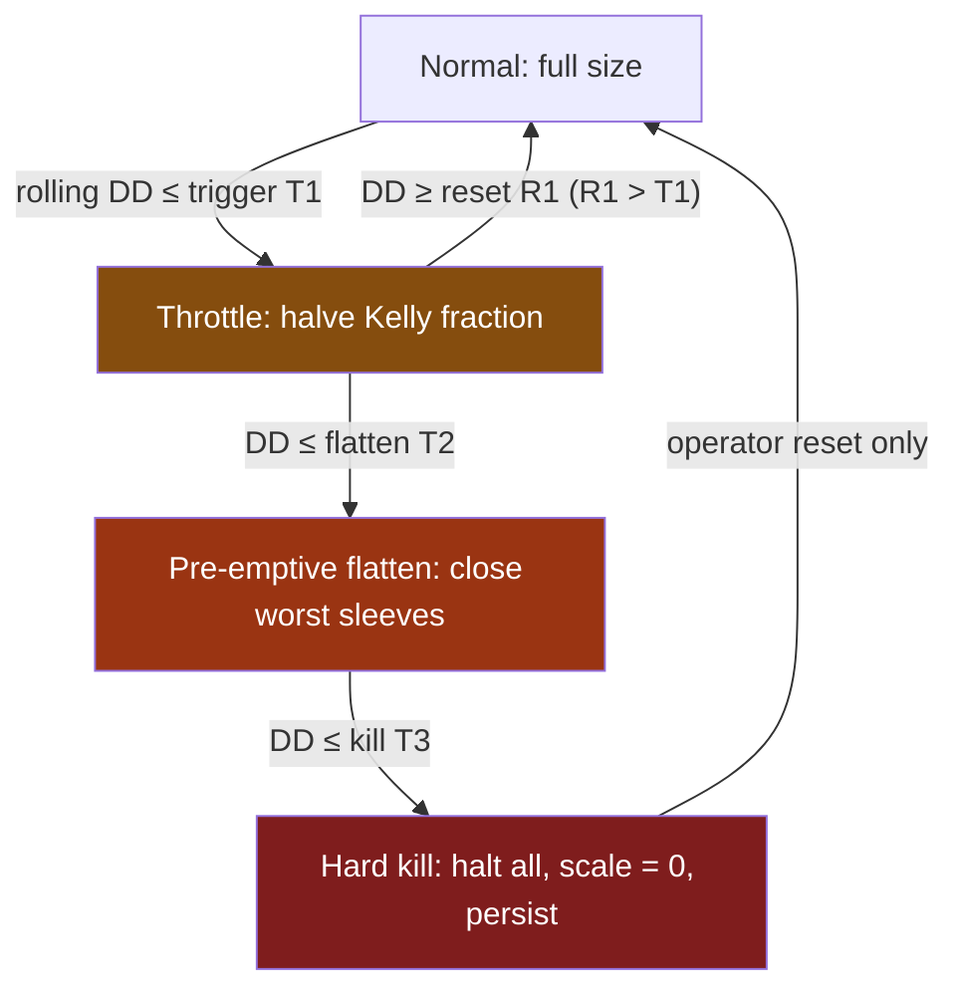
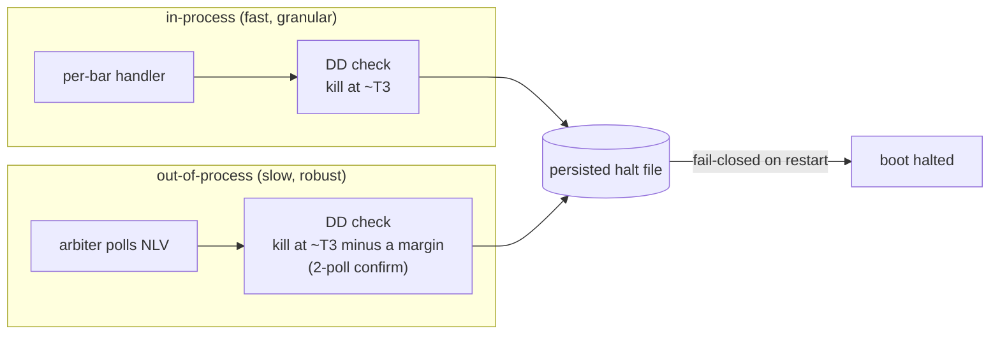

# 22. Layered safety: the graded de-risk ladder

A drawdown breaker is the cheapest insurance in trading and the easiest to get wrong. The naive version is a single line: *if drawdown exceeds X%, flatten everything.* It feels safe. It is not. A single threshold reacts only after the loss has already happened, it acts all-or-nothing, and, the failure that hurts most, it can switch itself on and off so fast it actively *undoes its own protection*. The breaker becomes the thing that costs you money.

This chapter is about replacing that one brittle line with a **graded ladder** of controls (throttle, then pre-emptive flatten, then hard kill) where each rung is a failsafe sitting behind the one above it, and the deepest rungs are deliberately calibrated to fire *well inside* the worst drawdown you could tolerate. We'll cover why hysteresis (different trigger and reset thresholds) is non-negotiable, why a drawdown breaker is structurally a *lagging* indicator and what you put in front of it, how to detect when the live book is drawing down worse than research predicted, and how per-strategy enable/shadow/live envelopes plus verdict governance keep a degrading strategy from quietly bleeding the account.

## The principle: a ladder, not a switch

Two facts about drawdown breakers are always true, on any stack:

1. **A drawdown number is lagging.** By the time portfolio drawdown reads −12% (illustrative), the −12% has *already been realised*. A breaker keyed on drawdown can only ever close the barn door after the horse is several fields away. So the threshold you pick is not "the worst loss I'll tolerate"; it's "the worst loss I'll tolerate, *minus* the loss that accrues between the trigger firing and the positions actually closing." Drawdown is the right control variable here: it is what gets a strategy *killed mid-trough*, so the ladder is calibrated against the drawdown tail (max-DD geometry and **CDaR**, see [the metric suite](../part2-research/metric-suite.md)), not against Sharpe, which smooths exactly the path you're trying to survive.
2. **All-or-nothing is the wrong response to a continuous risk.** Drawdown is a continuum; sequence risk builds gradually. Flattening the whole book the instant you cross a line throws away diversification and locks in the trough; but doing *nothing* until you cross it lets the sequence compound. The fix is to respond *proportionally*: shave risk early and gently, harder as it deepens, and reserve the full stop for genuine tail events.

Put those together and you get a **graded de-risk ladder**. Each rung does less damage than the one below it and fires earlier; each lower rung exists only to catch what the rung above missed.



The numbers in that diagram are placeholders. The *ordering and spacing* are the lesson: `T1 > T2 > T3` (each deeper), `R1 > T1` (reset is shallower than trigger: that's the hysteresis), and `T3` sits comfortably *inside* the worst-tolerable drawdown so the kill completes before you breach the mandate.

!!! tip "Calibrate the kill inward, not at the cliff edge"
    Say your mandate is "max drawdown under M%" (use an illustrative `M = 20`). Do **not** set the hard kill at −M%. The kill is lagging *and* it takes time to flatten (slippage, partial fills, an exchange that's busy precisely when you need it). Titan caps its in-process hard kill several points *inside* the worst-tolerable line, so the realised stop, after execution lag, still lands inside −M%. An out-of-process backstop sits a few points deeper again as a fail-safe (see below). The actual two thresholds are a deployment parameter we don't publish; the transferable rule is the **gap**: the distance between "where I trigger" and "where I'd actually stop" is the budget you're spending on lag and slippage. Size it on purpose, and put the backstop below the primary so they can't both be wrong in the same direction.

## Rung 1: the throttle (halve risk, keep trading)

The first rung does not flatten anything. It scales position size down: Titan halves the Kelly fraction (so a quarter-Kelly book runs at one-eighth Kelly) once rolling drawdown crosses a single-digit-percent trigger, and restores full size only after a clear recovery.

The rationale is pure sequence-risk arithmetic. A run of correlated losses compounds: a long enough streak at a modest per-trade loss can dig a double-digit hole on its own. Throttling part-way down that streak caps the tail of the *consecutive-loss* distribution without giving up the diversification you'd lose by flattening. You stay in the market; you just bet less while the market is telling you it's hostile.

Two design choices matter more than the exact threshold.

**Rolling peak, not all-time peak.** Titan measures drawdown from a *rolling* recent peak (a trailing window of roughly a few trading months), not from the all-time high-water mark. A strategy that took a deep drawdown years ago and then made fresh highs should not be permanently throttled by ancient history. The rolling-peak design reacts to *recent* losses and forgets old ones once enough recovery bars have passed.

```python
def compute_rolling_dd_from_peak(equity, *, peak_window_bars: int) -> pd.Series:
    # Drawdown from a ROLLING N-bar peak, not the all-time HWM.
    # Old peaks fall out of the window, so a 2020 crash doesn't
    # throttle the book forever once recovery has passed.
    s = pd.Series(equity)
    rolling_peak = s.rolling(peak_window_bars, min_periods=1).max()
    return (s - rolling_peak) / rolling_peak
```

(The all-time-HWM drawdown is *also* tracked; it feeds the deeper rungs and the hard kill. The two coexist: rolling for the throttle's "are we in a recent slump?", all-time for the kill's "have we breached the mandate?")

**Hysteresis: the trigger and reset thresholds are deliberately different.** This is the single most important idea in the chapter, and it's where the war-story lives.

## Hysteresis: why one threshold flaps, and why flapping is worse than nothing

A throttle with a *single* threshold engages and releases at the same drawdown level. Picture drawdown oscillating right around that level, which is exactly what happens when you're sitting at the threshold, because the throttle's own action moves the equity curve. It crosses, the throttle engages, size halves; equity ticks back up over the line, the throttle releases, size doubles; the next down-bar crosses again, engage; up-bar, release. **Flapping.**

Flapping is not merely noisy. It is *actively harmful* for two compounding reasons:

- **Churn cost.** Every transition re-sizes every sleeve and triggers a rebalance. You pay spread and commission on each flip. The protection mechanism becomes a fee generator.
- **The protection is destroyed.** Halving risk only helps if it *stays* halved through the bad sequence. A throttle that's only engaged for a bar or two at a time delivers none of the sequence-risk reduction it exists to provide. You pay all the churn cost and get none of the benefit.

The fix is **hysteresis**: separate the engage threshold from the release threshold, with a band between them. Titan engages the throttle at a deeper drawdown and only releases it once equity has recovered to a *much shallower* drawdown: a several-percentage-point gap. Once throttled, the book has to climb materially out of the hole before it goes back to full size. The state is *sticky in the safe direction*.

```python
@dataclass(frozen=True)
class DdThrottleState:
    multiplier: float          # 1.0 normal, 0.5 throttled
    current_dd: float
    triggered: bool

def update_throttle(prev, current_dd, *, trigger_dd, reset_dd, throttle_multiplier):
    # ENGAGE deep, RELEASE shallow.  reset_dd is CLOSER to zero than trigger_dd,
    # so the band between them suppresses flapping.
    if not prev.triggered and current_dd <= trigger_dd:        # rising edge in
        return DdThrottleState(throttle_multiplier, current_dd, True)
    if prev.triggered and current_dd >= reset_dd:             # falling edge out
        return DdThrottleState(1.0, current_dd, False)
    return DdThrottleState(prev.multiplier, current_dd, prev.triggered)  # hold
```

The whole trick is in the asymmetry of the two `if`s. The transition *into* the throttle and the transition *out* of it test different thresholds, and the "hold" branch at the bottom is what makes the state persist through the chop. A stateless version, `return throttle if current_dd <= trigger else normal`, is one line shorter and is the bug.

!!! warning "War-story: the single-threshold breaker that undid its own protection"
    An early portfolio breaker used one drawdown level for both engage and release: cross −X%, cut size; recover above −X%, restore it. In a *backtest* it looked fine, because backtests step bar-to-bar and the equity rarely sat exactly on the line. In a choppy live-like simulation the equity curve oscillated for days within a fraction of a percent of the threshold. The breaker toggled **dozens of times in a single drawdown**, re-sizing and rebalancing on nearly every flip. Two things happened. First, the churn cost (spread + commission on each re-size) added up to a meaningful drag *on top of* the drawdown it was supposed to soften. Second, and worse: because the de-risk was engaged for only a bar or two at a stretch, the consecutive-loss tail it was meant to cap was barely affected; the book spent most of the drawdown at *full* size. The "protection" delivered all of the cost and almost none of the benefit. The fix was a hysteresis band: engage deep, release shallow, hold in between. The rule it bought: **any threshold a control reacts to must have separate trigger and reset levels, and the state must be sticky in the protective direction.** A breaker that can change its mind every bar is not a breaker.

## Rung 2: the pre-emptive flatten

The throttle keeps you trading at half size. If the drawdown keeps deepening past it, the next rung stops being gentle: at a deeper threshold Titan *recommends a flatten* of the most exposed sleeves, well before the hard kill is in range. This is "pre-emptive" precisely because it fires *above* the kill line: its job is to bleed off risk so the kill, the rung of last resort, rarely has to fire at all.

In Titan this surfaces as a `flatten_recommended` list on the once-per-bar risk evaluation, a tuple of strategy ids whose pre-emptive flatten is advised once portfolio drawdown crosses the rung-2 threshold. The separation of *recommend* (rung 2) from *enforce/halt* (rung 3) is deliberate: the flatten is graded and targeted (the worst sleeves), the kill is total and blunt.

```python
@dataclass(frozen=True)
class OnBarDecisions:
    dd_throttle_multiplier: float        # rung 1: {1.0, 0.5}
    dd_throttle_triggered: bool
    portfolio_dd_from_rolling_peak: float  # window is a deployment parameter
    flatten_recommended: tuple[str, ...]   # rung 2: sleeves to pre-emptively flatten
```

## Rung 3: the hard kill, and why it lives outside the trading loop

The bottom rung is the one most systems *only* have. It is total: halt the whole book, set the composite size-scale to zero, cancel and flatten, and **persist the halt** so a process restart comes back halted, not blindly re-armed. (Halt persistence and fail-closed loading are covered in [The Portfolio Risk Manager](portfolio-risk-manager.md); the point here is that the kill is the *last* rung, not the first.)

Two properties make the kill trustworthy:

**It fires inside the mandate, not at it.** As above: the kill triggers several points shallower than the worst-tolerable drawdown, leaving budget for execution lag.

**It is backstopped out-of-process.** The in-process kill only re-evaluates when a strategy's bar handler runs. If the data feed stalls, or a handler throws before the check, the in-process kill never gets a turn, exactly when you need it most. So Titan runs a *second*, independent arbiter in its own process: it polls account net liquidation value directly from the broker and trips the *same persisted halt file* at a slightly deeper threshold, confirmed over two polls to avoid acting on a single bad tick. The in-process check is fast and granular; the out-of-process arbiter is slow but unkillable by a wedged event loop. Defence in depth means the controls don't share a single point of failure.



!!! danger "War-story: the kill that only ran when the feed did"
    On one occasion the bar pipeline silently died: the process was alive, the event loop was spinning, but no new bars arrived. Every drawdown control in the system was wired to fire inside the per-bar handler. No bars, no handler, no risk check. The book sat fully exposed with *every* safety rung dormant, and nothing in the trading process knew. The realised loss stayed bounded only because positions happened to be small that day. The lesson bought two rules: (1) a heartbeat watchdog that force-restarts the process when the bar pipeline goes stale (a live process is not the same as a *working* one), and (2) a kill backstop that lives in a **separate process** and polls the broker directly, so a wedged trading loop can't disarm the last line of defence. Never let your only kill switch depend on the same code path that can break.

## The breaker is lagging, so gate it with something predictive

Every rung above is keyed on *realised* drawdown, which is structurally late. The graded ladder mitigates the lateness (you start shaving risk early and gently), but it can't eliminate it. The complementary move is to put a *predictive* signal in front of the reactive ladder, so risk comes down *before* the drawdown rather than only in response to it.

Two predictive gates sit in front of Titan's ladder, and both feed the same composite size-scale the ladder feeds:

- **A regime gate.** When forward-looking stress indicators light up (a volatility index spiking, realised vol crossing a high rolling percentile), the regime scale cuts size *ahead* of the losses those conditions tend to produce. It's not a forecast of return; it's a forecast of *risk*, which is a much easier thing to predict.
- **A correlation-dial leverage governor.** When cross-asset correlations rise, the regime where diversification quietly evaporates and a portfolio's true risk balloons even though each leg looks calm, a market-wide leverage scalar dials gross exposure down. This is the subject of [The allocator & correlation dial](allocator-correlation-dial.md); here it matters as the *predictive* counterpart to the *reactive* drawdown ladder.

How do all these controls combine into one number? **Take the minimum, never the product.** Every control (drawdown throttle, vol scale, regime scale, drift de-risk) is reacting to facets of the *same* portfolio stress. Multiplying them would de-risk several times over for a single event (a 0.5 throttle × a 0.5 regime scale = 0.25, hammering the book twice for one storm). The minimum says: *honour the single most conservative control right now*, and let it dominate until it relaxes.

```python
scale_factor = min(dd_scale, vol_scale, regime_scale, dd_throttle, drift_scale)
# MIN, not product: each control reacts to the same portfolio stress.
# Multiplying would penalize one event many times over.
```

## Live-vs-research drift: is the book worse than we promised?

A risk mandate like "keep max drawdown under M%" (the same illustrative `M` from the kill-calibration tip) is only meaningful if you *measure* whether the live book is honouring it. The honest question is not "is drawdown bad?" but "is drawdown **worse than the distribution our research predicted** at this size?" That requires comparing realised drawdown to a *band*, not a fixed line.

Titan builds the band by **block-bootstrapping** the strategy's historical returns over the deployment horizon and reading the p95 / p99 worst-drawdown tail, the same serially-aware resampling discipline that [A backtest you can trust](../part2-research/backtest-you-can-trust.md) insists on, because IID resampling would destroy the autocorrelation that drawdowns feed on and quote a tail that's far too shallow. The band says: *only 5% (or 1%) of plausible histories drew down worse than this.*

```python
def predicted_maxdd_band(returns, *, horizon_bars, block_size, n_paths, seed=42):
    # Block-bootstrap so serial dependence survives the resample.
    # band[95] = the MaxDD only 5% of paths are WORSE than (a non-positive float).
    ...
    return {p: float(np.percentile(maxdds, 100 - p)) for p in (95, 99)}
```

Then a hysteresis-gated decision compares the live realised drawdown to that band; and note that this control, too, uses different engage and release conditions:

```python
def drift_band_decision(realised_maxdd, band_p95, band_p99, *, currently_derisked):
    if realised_maxdd <= band_p99:                 # past the 1-in-100 tail
        return DriftDecision(alert=True, derisk=True,  drift_scale=0.5, ...)
    if currently_derisked and realised_maxdd <= band_p95:  # HOLD (hysteresis)
        return DriftDecision(alert=True, derisk=True,  drift_scale=0.5, ...)
    if realised_maxdd <= band_p95:                 # past the 1-in-20 tail
        return DriftDecision(alert=True, derisk=False, drift_scale=1.0, ...)
    return DriftDecision(alert=False, derisk=False, drift_scale=1.0, ...)  # in band
```

Breach the p95 band and it **alerts**: a human should look, but nothing automated changes. Breach the deeper p99 band and it **auto-de-risks**, halving the contribution to the composite scale. Crucially, once de-risked it *holds* the de-risk until realised drawdown recovers back **inside the p95 band**, the same engage-deep / release-shallow hysteresis as the throttle, so a book hovering near the p99 tail doesn't flap the de-risk on and off. This is the system noticing, on its own, that the live experience has diverged from what research promised, and pulling risk before a human has to.

!!! warning "Drift detection is only armed if its band is fresh"
    The drift de-risk is dormant unless the predicted-drawdown band is actually being recomputed and written where the live risk manager reads it. In Titan the heavy bootstrap runs in a sidecar process on a schedule and drops the band into a shared file; the live manager reads it daily and folds in the de-risk. If that sidecar isn't running, the band file goes stale and the fold is silently skipped; the control *looks* present in the code but is inert in production. The operational rule: **a safety control that depends on a freshly-computed input is only as armed as its freshest input.** Verify the band file's timestamp as part of preflight, the same way you'd verify the kill switch.

## Per-strategy envelopes: enable / shadow / live

The ladder so far is portfolio-wide. But you also want per-strategy governance; and you want to roll new risk controls out *gradually*, the same way you'd roll out a new strategy. Titan gives every strategy a small envelope config with two axes:

```python
@dataclass(frozen=True)
class StrategyEnvelopeConfig:
    enabled: bool = False                       # is the envelope active at all?
    mode: Literal["shadow", "live"] = "shadow"  # observe-only vs enforce
```

The `mode` axis is the important one. In **shadow** mode the envelope evaluates every pre-trade check and increments a `would_have_rejected` counter; but it does *not* block the trade. In **live** mode the same check *rejects*. This lets you deploy a new control in observe-only mode, watch its telemetry for weeks ("how often would this have fired, and on which trades?"), and only flip it to enforcing once you trust it. The decision object even carries an `enforced` flag so the strategy can tell "the envelope is watching" from "the envelope is acting":

```python
@dataclass(frozen=True)
class PreTradeDecision:
    accepted: bool
    reason: PreTradeRejectionReason | None = None
    enforced: bool = True   # False ⇒ shadow: telemetry only, trade allowed
```

This is the risk-control analogue of paper-trading a strategy before funding it (see [Paper to live](../part6-deploy-ops/paper-to-live.md)). You don't trust a new breaker with live capital on day one; you let it shadow first. And there's an escape hatch: a single environment flag short-circuits the whole envelope back to an inert all-pass, restoring prior behaviour with no code rollback, while leaving the deepest ruin gate (the hard kill) untouched, because that one you never want to be able to disable by accident.

## Verdict governance: don't let a stale strategy hold capital

The last layer is the slowest-moving and the most often missing: governance over *which strategies are even allowed to hold live capital.* A strategy that passed validation a year ago is not automatically still valid. Edges decay; market regimes turn over; a re-audit deadline passes. Without a guardrail, a strategy can drift past its re-audit date, or get quietly downgraded by a fresh audit, and keep trading the whole time.

Titan encodes this as a pure function over each live strategy's *verdict* (its standing under the validation framework), its intended weight, its re-audit deadline, and its envelope status. The cascade is **most-restrictive-wins**:

| Condition | Governance action |
|---|---|
| Re-audit deadline passed | Demote to paper (weight → 0) |
| Verdict is non-deployable (suspect / retire) | Demote to paper (weight → 0) |
| Envelope below the required integration level | Demote to paper (weight → 0) |
| Verdict is conditional / unconfirmed | Hard-cap weight (e.g. a few percent each) |
| Otherwise | OK: keep intended weight |

```python
def evaluate_verdict_governance(records, *, as_of, unconfirmed_cap, require_envelope):
    # Any demotion reason wins (-> paper). A conditional verdict is capped.
    # Returns governed weights + an alert line per non-OK action.
    ...
```

The point is that *deployment authority is itself a control, not a one-time decision.* The same suspicion-over-celebration posture that governs research (gate on the lower bound, treat any un-audited number as inflated, see [A backtest you can trust](../part2-research/backtest-you-can-trust.md)) applies to *capital allocation over time*. A strategy that misses its re-audit isn't "fine until proven otherwise"; it's demoted to paper until re-proven. Like a stale drift band, an overdue verdict is treated as a failure, not a benign default.

!!! note "Built isn't the same as wired"
    Several of these controls can exist in code and still be inert in production: the verdict governance can be a pure function that nothing feeds yet, the per-strategy envelope can sit at its default disabled/shadow posture because the live runner never registers the configs. That's a perfectly reasonable *staging* posture, but it must be **explicit and audited**, never assumed. The failure mode is believing you're protected by a control that's present in the repo but unwired in the running process. Every chapter in this part comes back to the same discipline: verify the control is *armed*, not merely *written*.

## Takeaways

- **Replace the single-threshold breaker with a graded ladder:** throttle (halve risk, keep trading) → pre-emptive flatten (close the worst sleeves) → hard kill (halt all, persist). Each lower rung catches what the rung above missed; each fires earlier and does less damage.
- **A drawdown breaker is lagging.** Cap the kill *inside* the worst-tolerable drawdown, leaving budget for execution lag and slippage; and put a *predictive* gate (regime, correlation) in front of the reactive ladder so risk falls before the loss, not only after it.
- **Hysteresis is mandatory.** Engage deep, release shallow, hold in between. A control whose trigger and reset are the same threshold will flap, paying all the churn cost and delivering none of the protection. This applies to *every* threshold control: throttle, drift de-risk, all of them.
- **Combine controls with `min`, not product.** They all react to the same portfolio stress; multiplying double-counts one event.
- **Don't share a single point of failure.** Back the in-process kill with an out-of-process arbiter that polls the broker directly, and a heartbeat watchdog that restarts a wedged feed. A kill switch that only runs when the feed does isn't a kill switch.
- **Measure drift against a band, not a line.** Block-bootstrap the predicted-drawdown tail; alert at p95, auto-de-risk at p99, hold with hysteresis. And verify the band is *fresh*: a control is only as armed as its freshest input.
- **Govern deployment continuously.** Shadow new controls before enforcing them; demote strategies that miss a re-audit or fail a fresh verdict. Authority to hold capital is a control, not a one-time grant.

All numbers here are illustrative placeholders: the exact thresholds, windows, and tier boundaries are deployment-specific and deliberately omitted; the *spacing and ordering* are the transferable part.

---

This chapter closed Part V by hardening the *book-level* safety net. Part VI takes the whole stack into production: [Containerising the stack](../part6-deploy-ops/containerizing.md) puts the sidecars and watchdogs that arm these controls into their own processes, [The live runbook](../part6-deploy-ops/live-runbook.md) is how an operator inspects and clears a halt, and [Paper to live](../part6-deploy-ops/paper-to-live.md) is the same shadow-then-enforce discipline applied to capital itself.
