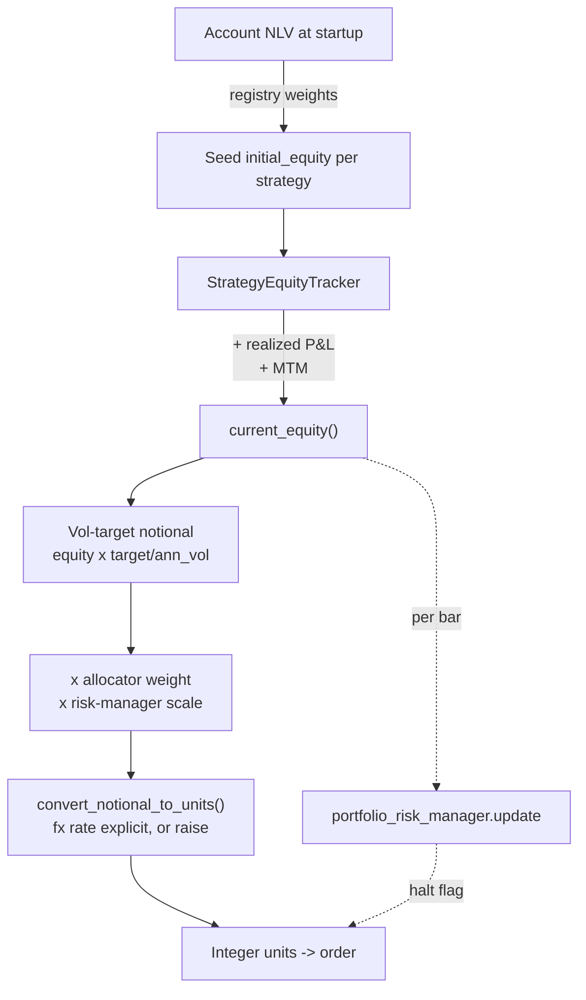

# 18. Per-strategy equity & deterministic currency

Position sizing is the moment a backtest becomes a wire transfer. Up to here the strategy has produced a *signal*; sizing turns that signal into a number of shares or lots, and that number is computed from two inputs the strategy almost never owns correctly out of the box: **how much capital is this strategy allowed to risk**, and **what does one unit of this instrument cost in my accounting currency**. Get either wrong and the signal can be flawless while the trade is sized like a typo.

This chapter is about the plumbing under those two inputs. It looks like boring bookkeeping. It is not. The two defects we'll dissect, feeding every strategy the *whole account's* net liquidation value, and assuming a foreign-quoted instrument is priced 1:1 in your base currency, are silent, they survive code review, and they corrupt the risk machinery downstream of them rather than the strategy itself. The strategy looks fine in isolation. The portfolio quietly stops working.

## The principle: equity and currency must be *owned*, never *guessed*

Two rules, both generalisable to any multi-strategy, multi-currency book on any broker:

1. **Each strategy owns its own equity ledger.** A strategy's position size should scale to *its* capital, its seed allocation plus its own realised and unrealised P&L, not to the size of the whole account. If two strategies both size off whole-account NLV, they see an identical equity stream, which means anything downstream that compares strategies by their equity curves (an inverse-vol allocator, a correlation gate) is fed two copies of the same series and has nothing to discriminate on.

2. **The accounting currency is a decision, not a discovery.** Never let the code *find* a currency by reaching into a dictionary and taking whatever happens to be first. State the base currency explicitly, ask for the balance *in that currency*, and have a defined behaviour when it's absent. A multi-currency broker account holds balances in several currencies at once; the order they iterate in is not a contract.

Both rules share a deeper theme that runs through this whole book: **the unsafe default must be impossible to reach by accident.** A function that silently picks a currency, or silently assumes an FX rate of 1.0, is a function that will eventually be called in the one context where that assumption is wrong, and it will not tell you.

## Defect 1: whole-account NLV fed to every strategy

The tempting one-liner, and the one that shipped in Titan's pre-V2 live wiring:

```python
# WRONG: returns the whole account's NLV, in a non-deterministic currency
balances = account.balances()
equity = account.balance_total(list(balances.keys())[0]).as_double()
```

This is two bugs in one expression. The equity bug: every strategy that runs this gets the *same* number, the entire account's net liquidation value, and sizes against it as if it owned all of it. Three strategies sharing one account each think they own the whole thing; collectively they try to deploy three accounts' worth of risk-budgeted notional, and worse, they feed the portfolio risk manager three identical equity curves.

That second consequence is the subtle one. Titan's inverse-vol allocator (covered in [The Allocator & the correlation dial](allocator-correlation-dial.md)) sizes each sleeve inversely to the volatility of *its own equity curve*, and the correlation gate de-grosses when sleeves move together. Feed it three copies of the account curve and the volatilities are identical, the pairwise correlations are exactly 1.0, and both mechanisms collapse into doing nothing useful. The diversification machinery is structurally blind because its inputs are degenerate.

The fix is a per-strategy ledger. Each strategy instantiates one tracker in `on_start` and owns it for the life of the run:

```python
@dataclass
class StrategyEquityTracker:
    prm_id: str
    initial_equity: float          # seed capital, in base ccy (e.g. USD)
    base_ccy: str = "USD"
    realized_pnl_base: float = 0.0
    mtm_base: float = 0.0          # mark-to-market of open positions, base ccy

    def on_position_closed(self, realized_pnl: float, fx_to_base: float = 1.0):
        # realized_pnl is in the instrument's QUOTE ccy; convert to base.
        self.realized_pnl_base += realized_pnl * fx_to_base

    def current_equity(self) -> float:
        return self.initial_equity + self.realized_pnl_base + self.mtm_base
```

`current_equity()` is what the strategy passes to the risk manager every bar, and it is what the sizing formula scales against. Now each sleeve has its *own* curve, seed plus realised P&L plus (optionally) live MTM, and the allocator finally has distinct series to weight and correlate.

!!! note "Seed capital is a one-time split, not the allocator"
    There are two distinct dials here, easily confused. The **seed** `initial_equity` is a one-off division of the account at startup: registry weights divide the account NLV into each sleeve's starting capital exactly once. The **allocator weight** is a per-rebalance inverse-vol fraction applied *on top* during sizing. The tracker owns the first; the allocator owns the second. (Illustrative, **not** the live config: with registry weights `w₁…w₄` summing to `Σw`, a sleeve seeds at `NLV × wᵢ / Σw`. One sleeve may carry a deliberately heavier weight than the others (e.g. to keep its per-trade notional above a broker's minimum-commission floor) but the real weights and balances are redacted.)

## Defect 2: non-deterministic base currency

The `list(balances.keys())[0]` half of that one-liner is its own hazard. On a single-currency account it's harmless. On a multi-currency account, which is most live brokerage accounts, `balances` holds entries for USD, EUR, JPY, GBP simultaneously, and dict iteration order is not something you want your risk math to depend on. Across a restart, a library upgrade, or a deposit in a new currency, "the first key" can change, and your equity figure silently jumps by an FX ratio.

The replacement asks for what it actually wants and refuses to improvise:

```python
def get_base_balance(account, base_ccy: str = "USD") -> float | None:
    if account is None:
        return None
    try:
        balances = account.balances()
    except Exception:
        return None
    for ccy, _ in balances.items():
        if str(ccy) == base_ccy:                      # match by ISO code
            try:
                return float(account.balance_total(ccy).as_double())
            except Exception:
                return None
    return None                                       # (1)!
```

The load-bearing line is the last one. When the account has no balance in the requested currency, `get_base_balance` returns **`None`**, not a fallback, not "the first one anyway." `None` is a signal to the caller: *I could not determine your equity deterministically; do not guess.* In Titan the caller responds by falling back to its own tracker's `current_equity()`, which is always denominated in the strategy's declared base currency. The contract is: a deterministic answer or an honest refusal. Never an arbitrary one.

This resolution order lives in one shared per-bar helper so no strategy reimplements it:

```python
def report_equity_and_check(strategy, prm_id, bar, *, tracker=None,
                            fallback_account_ccy="USD") -> tuple[float, bool]:
    equity = tracker.current_equity() if tracker is not None else None
    if equity is None or equity <= 0:                 # deterministic fallback
        accounts = strategy.cache.accounts()
        if accounts:
            equity = get_base_balance(accounts[0], fallback_account_ccy)
    equity_val = float(equity) if equity is not None else 0.0
    if equity_val > 0:
        portfolio_risk_manager.update(prm_id, equity_val, ts=bar.ts_event)
    return equity_val, portfolio_risk_manager.halt_all
```

Two things to notice. First, the same call that reports equity also returns the portfolio **halt** flag; sizing and the kill switch are checked together, every bar, so a strategy cannot report equity and then forget to ask whether it's allowed to trade. (That kill switch is [the portfolio risk manager](portfolio-risk-manager.md)'s job.) Second, an audit grep for the literal `balance_total(list(balances.keys())[0])` anywhere in the codebase is now a one-line CI check: the anti-pattern is named, so it's findable.

## Defect 3: the FX unit-conversion trap

Now the second sizing input: turning a base-currency notional into a unit count. For a USD-quoted instrument in a USD-base book it's trivial:

```python
units = int(notional_usd / price)
```

The trap springs when `price` is quoted in a currency that *isn't* your base. Consider a strategy with `base_ccy="USD"` that wants to trade a pair quoted in JPY. `price` is in yen-per-unit; `notional_usd` is in dollars. Dividing one by the other gives a number with no meaning: it's off by the entire USD/JPY exchange rate, roughly two orders of magnitude. The trade isn't slightly mis-sized; it's nonsense.

The correct conversion makes the currency of every quantity explicit and the formula is two steps:

```python
def convert_notional_to_units(
    notional_base: float,
    price: float,
    *,
    quote_ccy: str = "USD",
    base_ccy: str = "USD",
    fx_rate_quote_to_base: float | None = None,
) -> int:
    if price <= 0 or notional_base <= 0:
        return 0

    if quote_ccy == base_ccy:
        return int(notional_base / price)                 # same-ccy fast path

    if fx_rate_quote_to_base is None or fx_rate_quote_to_base <= 0:
        raise ValueError(                                  # (1)!
            f"quote_ccy={quote_ccy!r} != base_ccy={base_ccy!r} so "
            f"fx_rate_quote_to_base is required. Never assume 1.0."
        )

    notional_quote = notional_base / fx_rate_quote_to_base  # base -> quote ccy
    return int(notional_quote / price)                      # quote -> units
```

The cross-currency branch first restates the notional in the *quote* currency (`notional_base / fx_rate`, where the rate is "how many base units one quote unit is worth"), then divides by the quote-currency price. Units come out correct.

The non-negotiable design choice is the `raise`. When the quote currency differs from the base currency and no rate was supplied, the function **must** throw: it must not fall back to 1.0, must not return zero, must not log-and-continue. A missing FX rate is a programming error, and the only safe response to "I was asked to size a foreign instrument but given no exchange rate" is to stop loudly before any order leaves the building.

!!! danger "War-story: the leg that would have been mis-sized by a third"
    While extending a USD-base strategy we considered a Treasury-tracker leg, and the obvious instrument was a GBP-quoted UCITS line on the London exchange. Plumbed naively, the sizing would have computed `units = notional_usd / price_in_gbp`, and because one pound was worth roughly **1.33 dollars** at the time, every position in that leg would have been sized about **a third too large**, silently, with no error and no warning. The signal would have been perfect; the size would have been wrong by the FX ratio on every single trade. We chose a **USD-quoted line of the same underlying** instead, which makes `quote_ccy == base_ccy`, sends `convert_notional_to_units` down the same-currency fast path, and lets the FX rate be a legitimate **1.0** rather than an assumed one. The rule it bought: *when a USD-quoted substitute for the same exposure exists, prefer it; not for the spread, but to keep the FX term honestly equal to one.*

## The silent-1.0 trap the function *cannot* catch

Here is the uncomfortable part, and the reason a single guard is never enough. `convert_notional_to_units` raises when the rate is `None`. It does **not** raise when a caller passes a *literal* `fx_rate_quote_to_base=1.0` for a genuinely cross-currency instrument. From inside the function, `1.0` is a perfectly valid rate; it has no way to know that USD/JPY is not actually 1.0. The arithmetic runs, the units come out wrong by the FX ratio, and nothing complains.

This is the deepest lesson of the chapter: **a function can refuse a missing argument, but it cannot refuse a wrong one that has the right type.** A defensive function catches the *absent* case; it is blind to the *plausible-but-false* case. You need a second line of defence at a different layer, where the *configuration* is visible.

Titan's second line is a startup assertion. Each strategy, in `on_start`, fail-fasts if any leg's quote currency differs from the base currency *while* its configured FX rate is still the default 1.0:

```python
# on_start guard - refuses the plausible-but-false 1.0
for leg in self.legs:
    if leg.quote_ccy != self.config.base_ccy and leg.fx_to_base == 1.0:
        raise ValueError(
            f"{leg.symbol}: quote {leg.quote_ccy} != base "
            f"{self.config.base_ccy} but fx is still 1.0 - set a real rate"
        )
```

This catches the case the arithmetic can't: a foreign-quoted instrument wired up with an unexamined default. When a USD bond-tracker substitute was chosen for one of Titan's live stacks, this guard is exactly what *would have fired* had a GBP line slipped in, and stayed silent, correctly, once the USD line made `fx=1.0` legitimate. The guard isn't redundant with the `raise`; they cover disjoint failure modes.

!!! warning "War-story: the allocator that couldn't tell its strategies apart"
    Before per-strategy equity existed, every Titan strategy reported the whole-account NLV. The inverse-vol allocator and the correlation gate were *running* (code present, tests passing, telemetry green) but they were being fed three identical equity curves. Their measured pairwise correlation was a perfect 1.0 and their relative volatilities were identical, so the inverse-vol weights came out uniform and the correlation de-gross never engaged. The risk-diversification layer was, in effect, a no-op that *looked* live. No exception, no alert; just a portfolio that wasn't being diversified by a system everyone believed was diversifying it. The fix was structural, give each strategy its own equity ledger, and the lesson generalises: **a control loop fed degenerate inputs fails silently and confidently.** Check that your risk inputs are actually *distinct* before you trust the risk math built on them.

## Where this sits in the sizing pipeline



Equity flows in at the top from the per-strategy tracker (never the whole account); it scales the vol-target notional; that notional is trimmed by the allocator and the risk-manager scale factor; and only at the very end does `convert_notional_to_units` turn a *correctly-denominated base-currency notional* into integer units, with the FX rate explicit or an exception. The volatility-targeting and Kelly-style sizing that produces the notional in the middle of that chain is the subject of the next chapter.

## Takeaways

- **Each strategy owns its equity.** Size against *this strategy's* capital (seed + realised + MTM), never the whole account. Feeding identical equity curves to an inverse-vol allocator or correlation gate silently disables them: the worst kind of failure, because the machinery still *looks* alive.
- **Base currency is declared, not discovered.** `list(balances.keys())[0]` is a non-deterministic landmine on any multi-currency account. Ask for the balance in an *explicit* currency and return `None` (forcing a defined fallback) when it's absent, never an arbitrary one.
- **FX conversion is two explicit steps, and a missing rate must `raise`.** Restate the notional in the quote currency, then divide by the quote-currency price. Refusing a `None` rate is non-negotiable; falling back to 1.0 is a sizing bug waiting to happen.
- **The silent-1.0 trap needs a second guard.** A function can reject a *missing* rate but not a *wrong-but-valid* `1.0`. Add a config-layer `on_start` assertion (quote-ccy ≠ base-ccy while fx == 1.0) to catch the plausible-but-false case the arithmetic can't see.
- **Prefer a same-currency substitute when one exists.** A USD-quoted line of the same exposure keeps the FX term an *honest* 1.0 instead of an *assumed* one, and sends sizing down the trivially-correct fast path. Sizing correctness, not the spread, is the reason.

---

This chapter fixed *what* equity and *which* currency feed the sizing formula. The next chapter, [Position sizing: Kelly & vol-targeting](position-sizing-kelly.md), builds the formula itself, turning that equity into a risk-budgeted notional via volatility targeting and fractional-Kelly scaling. And because the FX and quote-convention traps here are really facts about your venue, [Broker realities](../part4-research-to-prod/broker-realities.md) covers the instrument-routing, currency-line, and tradability quirks (PRIIPs/KID blocks, USD vs GBP-pence lines, account-base vs strategy-base currency) that determine which substitute you actually *can* pick.
