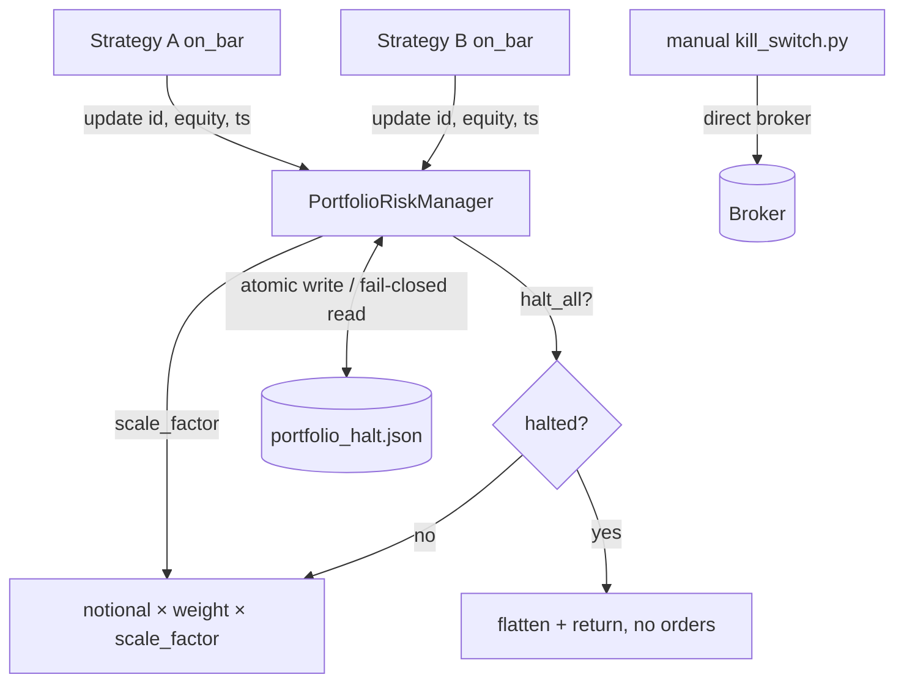

# 20. The Portfolio Risk Manager

Every strategy in the book thinks it is the only thing trading. It sizes its own position, manages its own stops, tracks its own equity. None of them can see the others, and none of them knows what the *book* is doing. That is by design: a strategy that reasons about the whole portfolio is a strategy you can't reason about. But it leaves a gap: someone has to watch the aggregate, because the aggregate is what blows up.

That someone is the Portfolio Risk Manager (PRM): one process-wide object that every strategy reports its equity to, and that hands back a single number, a `scale_factor`, and a single boolean, `halt_all`. The strategies multiply their intended size by the scale factor and check the boolean before they submit. The PRM is the only component that sees the whole book, and it is the only component allowed to turn the whole book off.

This chapter is about building that object so it is *trustworthy under failure*: it survives a restart without forgetting it was halted, it fails closed when its own state file is corrupt, and it composes its throttles so one drawdown can't de-risk you three times by accident. The throttle *math* (vol targeting, regime tiers) is shared with [position sizing](position-sizing-kelly.md); this chapter is about the manager that owns it and the operational discipline around the kill switch.

## The principle: one aggregator, sticky halt, fail-closed state

A portfolio risk manager has exactly three jobs, and they are easy to get subtly wrong:

1. **Aggregate honestly.** Sum per-strategy equity into a portfolio NAV, track its drawdown from the all-time high-water mark (HWM), and measure realised volatility, all on a *consistent time grid*. Mixing an hourly strategy's samples with a daily strategy's samples and then annualising with one factor is the same units lie from [the backtest chapter](../part2-research/backtest-you-can-trust.md), now live.
2. **Throttle gradually, then halt hard.** Below a soft drawdown threshold, scale exposure down smoothly. Below a hard threshold, stop everything. Gradual-then-cliff, never one or the other.
3. **Remember its decisions.** A halt is a *safety* decision. Safety decisions that evaporate when the process restarts are not safety decisions; they are suggestions. The halt must outlive the process, and an unreadable record of "are we halted?" must be read as **yes**.

The third point is the one most systems miss, and it's the one that touches live capital. We'll spend the most time there.

## Equity as a timestamped series, not a deque

The naive implementation stores each strategy's equity as a ring buffer of floats: a `deque(maxlen=N)`. It's tempting because it's O(1) and bounded. It's also wrong, because a float has no timestamp, and without timestamps you cannot align two strategies that tick at different frequencies.

Titan stores each strategy's equity as a **timestamped `pd.Series`**:

```python
@dataclass
class _StrategyState:
    strategy_id: str
    initial_equity: float
    current_equity: float
    equity_hwm: float
    samples: pd.Series = field(default_factory=lambda: pd.Series(dtype=float))

    def append(self, ts: pd.Timestamp, equity: float, max_rows: int) -> None:
        self.samples.loc[ts] = equity            # dedupe re-emitted bars by ts
        if len(self.samples) > max_rows * 24:    # cap intraday sample count
            self.samples = self.samples.iloc[-(max_rows * 24):]

    def daily_equity(self, max_days: int) -> pd.Series:
        s = self.samples.copy()
        s.index = pd.DatetimeIndex(s.index).tz_convert("UTC").tz_localize(None)
        return s.resample("B").last().dropna().iloc[-max_days:]   # business-day grid
```

Everything downstream, variance, correlation, the allocator's inverse-vol weights, runs off `daily_equity()`, a business-day, last-observation-carried series. The raw intraday samples stay around so per-tick drawdown is still exact, but **all the cross-strategy math happens after resampling onto a shared daily grid.** An H1 strategy that fires 24 bars a day and a D1 strategy that fires once both contribute exactly one point per business day. The `sqrt(252)` annualisation is then dimensionally correct, because the series it's applied to really is daily.

!!! warning "War-story: the strategy that 'jumped' the day it was born"
    When a new strategy registers, its first equity sample is its seed capital. A naive `pct_change()` over the combined NAV treats that as a return: yesterday the strategy contributed zero, today it contributes its full seed, so the portfolio "returned" the seed amount in one day: a gigantic spurious spike that poisons the EWMA variance for weeks. The fix is two-fold: compute the daily portfolio return as the *previous-day capital-weighted* average of per-strategy returns (a strategy with no equity yesterday has weight zero today), and call `pct_change(fill_method=None)`, because the deprecated default *pads* NaNs before differencing, which silently turns the seed debut into exactly the fake return you were trying to avoid. The lesson: **capital additions are not returns**, and pandas will help you confuse them unless you tell it not to.

## EWMA variance, rebuilt once per calendar day

The vol-targeting overlay needs the portfolio's realised volatility. The trap is *when* you recompute it. If you rebuild on every tick, an H1 book recomputes 24× more often than a D1 book for no benefit, and you invite off-by-one bugs where intraday samples leak into a "daily" variance. Titan gates the expensive work on the **calendar date changing**, read from the incoming bar's timestamp, not wall-clock time:

```python
today = now_ts.date()
if self._last_daily_date != today:
    self._last_daily_date = today
    self._recompute_daily_vol()        # capital-weighted daily port returns, EWMA
```

The EWMA recursion itself is the standard `var = λ·var + (1 − λ)·r²` with a decay `λ` in the high-0.9s (the RiskMetrics convention; the exact value is configuration, not code). Annualised vol is then `sqrt(var) × sqrt(252)`, and the comment at that line earns its keep, because it states *why* 252 is the right factor: the NAV was resampled to business-day before the variance was computed. State the timeframe at the call site; it's the cheapest correctness gate you have.

## The composite scale factor: compose by MIN, never by product

The PRM exposes one number that multiplies every strategy's intended size. It is the *minimum* of several independent throttles:

```python
scale_factor = min(dd_scale, vol_scale, regime_scale, dd_throttle, drift_scale)
```

| Component | Range (illustrative) | What it reacts to |
|---|---|---|
| `dd_scale` | `[0.25, 1.0]` | Drawdown heat from the all-time HWM |
| `vol_scale` | `[0.25, 2.0]` | `target_vol / realised_vol`, clipped |
| `regime_scale` | `[0.25, 1.25]` | `min(vix_scale, atr_scale)`, volatility-regime tiers |
| `dd_throttle` | `{1.0, 0.5}` | A rolling-window drawdown step with hysteresis |
| `drift_scale` | `{1.0, 0.5}` | Realised drawdown breaching the Monte-Carlo-predicted band |

The clamp ranges above are illustrative round numbers. The deployed thresholds and tier boundaries live in a risk config file, not in code, and we don't publish them, not because any single one is alpha, but because the *combination* of soft/hard drawdown limits and regime tiers would sketch the live book's risk envelope.

Why `min` and not a product? **Because every component is responding to the same underlying event.** A nasty week shows up as deeper drawdown (`dd_scale` drops), higher realised vol (`vol_scale` drops), a regime flip (`regime_scale` drops), *and* a rolling-DD step (`dd_throttle` drops). Multiply them and you de-risk the book four times for one storm: `0.5 × 0.5 × 0.5 × 0.5 = 0.0625`, a 94% cut when each layer only meant to cut by half. The book goes flat exactly when you wanted it merely cautious, and you miss the recovery. `min` selects the single most-conservative throttle and lets it govern. The same drawdown drives several signals; let it speak once.

!!! warning "War-story: the double-counted de-risk"
    An earlier composition multiplied a new rolling-drawdown throttle into the existing drawdown-heat scale. Both are functions of portfolio drawdown. In a moderate dip, the kind you want to *trade through* at reduced size, the two stacked: heat cut to ~0.6, the rolling step cut to 0.5, product 0.30. The book was running at a third of intended size during an ordinary pullback, then sat in cash through the bounce. The audit fix folded the new throttle in by `min` so it "shares the drawdown dimension without de-risking the book twice." Rule: **throttles that react to the same variable compose by MIN; only genuinely orthogonal risks compose by product.**

## The kill switch: gradual heat, then a hard cliff

Below a *soft* drawdown threshold, `dd_scale` ramps down linearly: the heat. Below a *hard* threshold, the whole book halts. Both are checked on **every** `update()`, before any of the once-per-day work:

```python
def _check_portfolio_health(self, now_ts: pd.Timestamp) -> None:
    port_dd = self._portfolio_drawdown()          # (total − HWM) / HWM, ≤ 0

    if port_dd < -max_dd:                          # hard cliff - max_dd is config
        self._halt_all = True
        self._halt_reason = f"portfolio_dd={port_dd*100:.2f}% exceeds {max_dd*100:.1f}%"
        self._scale_factor = 0.0
        self._dd_scale = 0.0
        self._persist_halt_state(operator="auto-kill", cleared=False)
        logger.critical("[PortfolioRM] KILL SWITCH - portfolio DD %.2f%%.", port_dd*100)
        return                                     # nothing else runs once halted

    if port_dd < -heat:                            # soft heat - heat < max_dd, config
        self._dd_scale = max(0.25, 1.0 - abs(port_dd) / max_dd)
    else:
        self._dd_scale = 1.0
```

Note the `return`: once halted, the function stops. There is no path that halts *and then* keeps computing scale factors, because a halted book has nothing to scale. And the very first thing `update()` does is short-circuit if `_halt_all` is already set: a halted PRM ignores incoming equity entirely. The halt is **sticky**: nothing in the normal tick path can clear it. The only way out is an operator.

This in-process kill switch has one structural weakness worth naming: it only re-evaluates when a strategy actually calls `update()`. If the market feed stalls, or a strategy's bar handler throws before it reports equity, the kill switch simply doesn't run; it can't halt on a drawdown it never gets told about. That gap is why a serious stack has *more than one* kill switch at different altitudes; that layering is the subject of [Layered safety](layered-safety.md). The PRM is the in-process layer, not the whole defence.

## Halt persistence: the decision must outlive the process

Here is the part that earns the chapter. The halt is written to a small JSON file, and re-read on construction:

```python
def _load_halt_state(self) -> None:
    if not _HALT_STATE_PATH.exists():
        return                                     # no file → clean first run
    try:
        data = json.loads(_HALT_STATE_PATH.read_text())
    except Exception as e:
        # A halt record that won't parse is treated as HALTED, never "proceed".
        self._halt_all = True
        self._halt_reason = "halt-state-unparseable"
        logger.critical("[PortfolioRM] halt-state UNPARSEABLE - failing CLOSED.")
        return
    if data.get("halted"):
        self._halt_all = True
        self._halt_reason = data.get("reason", "persisted-halt")
        logger.critical("[PortfolioRM] Loaded persisted HALT - operator reset required.")
```

Two design choices here are non-negotiable, and both are about failure:

**It fails closed.** A halt file that exists but won't parse is read as *halted*. The reasoning is asymmetric, like every risk decision: the cost of staying halted when you didn't need to is a few hours of missed trading; the cost of resuming when you should have stayed halted is the loss the halt was meant to stop. When the safety state is ambiguous, ambiguity means stop.

**The write is atomic.** The file is serialised to a temp path and `os.replace`'d into place, so a crash *mid-write* can never leave a truncated, half-written file. Without that, the fail-closed logic could be triggered by the system's own crash: you'd halt on the corruption you caused, not the danger you detected. Atomic write + fail-closed read are a pair; ship them together.

!!! danger "War-story: the restart that would have resumed trading through a halt"
    The scenario this whole mechanism exists for: the book hit its hard drawdown limit overnight, the kill switch tripped, and `halt_all` went `True`, in memory. Then the container restarted (an OOM, a deploy, a host reboot; it does not matter which). The new process constructs a fresh PRM. Every strategy calls `register_strategy()` with its seed equity, sees a clean `halt_all == False`, and **starts submitting orders again**, straight back into the exact market move that had just blown through the limit. The halt had done its job and then been forgotten at the worst possible moment. The fix is the file above: the halt is persisted on trip and re-read on boot, so a crash-and-restart *cannot silently un-halt*. A risk decision that lives only in process memory is one `kill -9` away from being undone. **If a flag protects capital, it has to survive the process that set it.**

## Operator reset: preserve the HWM, or re-anchor it on purpose

Only an operator can clear a halt, and the *how* matters more than it looks. There are two distinct operations, and conflating them quietly weakens the kill switch:

```python
def reset_halt(self, operator: str = "unknown") -> None:
    """Clear the halt. PRESERVES the portfolio HWM."""
    old_hwm = self._portfolio_hwm                  # unchanged
    self._halt_all = False
    self._scale_factor = 1.0
    # ... reset component scales, clear EWMA so vol rebuilds cleanly ...
    self._persist_halt_state(operator=operator, cleared=True)

def reset_hwm(self, operator: str = "unknown") -> None:
    """Re-anchor the HWM to current (drawn-down) equity. SEPARATE, explicit."""
    self._portfolio_hwm = self._total_equity()
```

The subtlety: an earlier `reset_halt` *also* re-anchored the high-water mark to the current, drawn-down equity. That feels harmless, even helpful, "start fresh from here." It is not. The kill switch measures drawdown *from the HWM*. Re-anchor the HWM to the bottom of the hole and you've silently moved the kill-switch trigger down with it: a second drawdown of the same magnitude no longer trips, because you've already conceded the first one's losses as the new baseline. The operator who clears a halt to investigate has accidentally widened the next kill-switch's distance.

So the two are split. `reset_halt` **preserves** the HWM: clear the halt to resume, and the switch still measures from the original peak, ready to trip again at the same absolute level. `reset_hwm` is a *separate, deliberate* call for the operator who genuinely wants to re-baseline (e.g., after a capital injection). Make the dangerous re-anchor an explicit verb, never a side effect of resuming.

Both reset paths write back to the same halt file with an operator name and a timestamp, so the audit trail records *who* cleared the switch and *when*, which is the first question anyone asks after a halt.

## The hard manual kill switch

Everything above lives inside the trading process. When that process is itself the problem (wedged, looping, mis-reconciled), you need a kill switch that doesn't depend on it. Titan's is a standalone script that connects directly to the broker on its own dedicated client ID, lists open positions, demands a typed confirmation, and then cancels every working order and market-closes every position:

```python
confirm = input("\nType  KILL  to confirm, or anything else to abort: ").strip()
if confirm != "KILL":
    sys.exit(0)
app.reqGlobalCancel()                              # cancel ALL working orders
for _, contract, pos, _ in app.positions:          # then flatten every position
    action = "SELL" if pos > 0 else "BUY"
    app.placeOrder(oid, _stock_contract(contract.symbol), _market_order(action, abs(pos)))
    oid += 1
```

Three deliberate properties. It uses a **fixed, reserved client ID** that no other component uses, so it can always get a connection even when the main runner holds its own. It requires a **typed `KILL`**, not a `y/n`, because flattening a live book by fat-finger is exactly the accident you're guarding against. And it talks **straight to the broker**, bypassing the strategy layer entirely, so it works even if every strategy in the process is broken. This is the bluntest instrument in the stack; it is also the one you most want to be certain works. Test it on paper before you need it in anger.

## How it fits together



Each strategy reports equity with an explicit timestamp; the PRM aggregates, throttles, and persists; the strategy reads back one scale factor and one boolean. The halt file is the bridge across restarts. The manual kill switch sits entirely outside the loop, talking to the broker directly, for when the loop itself is the failure.

## Takeaways

- **One aggregator owns the book-level view.** Strategies stay myopic by design; the PRM is the only component that sees and can stop the whole portfolio.
- **Equity is a timestamped series on a shared daily grid**, never a deque of floats. Resample before any cross-strategy variance or correlation, so `sqrt(252)` is honest. And capital additions are *not* returns.
- **Compose throttles by `min`, not by product.** Layers that all react to drawdown will multiply into an unintended near-flatten; `min` lets one drawdown speak once.
- **The halt must outlive the process.** Persist on trip, re-read on boot, write atomically, and **fail closed** when the state is unreadable: a forgotten halt is one restart away from resuming straight into the loss it stopped.
- **Split "clear the halt" from "move the high-water mark."** Re-anchoring the HWM silently lowers the next kill-switch trigger; make it a separate, deliberate operator action.
- **Keep a broker-direct manual kill switch** on a reserved client ID with a typed confirmation: the instrument that still works when the trading process doesn't.
- Reach past the single number: the PRM gates on drawdown geometry and realised vol, but a full risk read also wants [tail loss and risk of ruin](../part2-research/tail-risk-and-ruin.md) at deployed size and the [Calmar/Sortino battery](../part2-research/metric-suite.md).

---

The PRM is the *in-process* layer of risk control, powerful, but blind whenever the process itself stalls or throws. The next chapter, [**Layered safety**](layered-safety.md), builds the layers above and below it: an out-of-process drawdown arbiter that watches the broker directly, heartbeat and process watchdogs that restart a wedged runner, and the manual kill switch as the floor, all writing to the same halt file, so every layer agrees on the one fact that matters: *are we trading, or not?*
