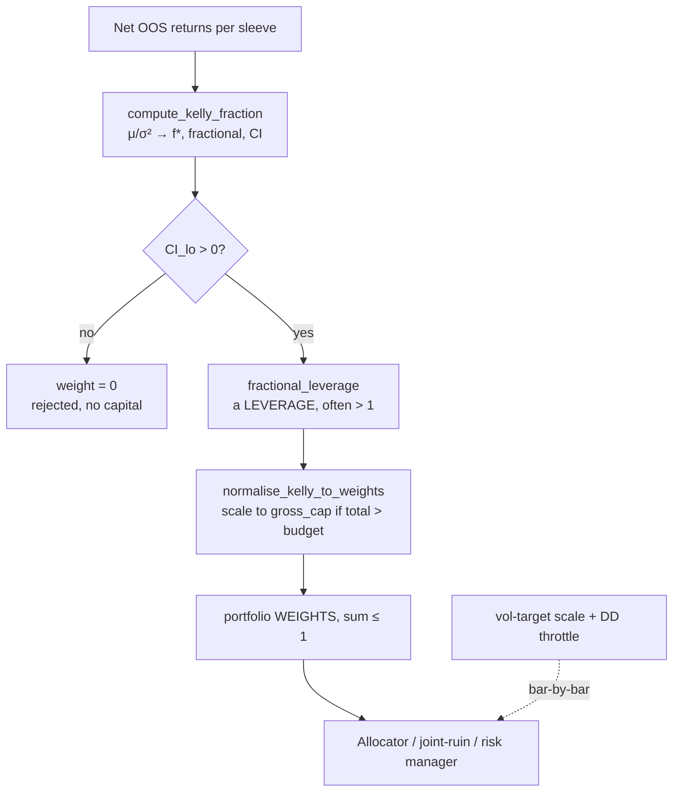

# 19. Position sizing: Kelly, fractional Kelly & vol-targeting

You have a strategy that passed the gauntlet: walk-forward, deflation, a tail simulation, a positive lower bound on its Sharpe. The research question is settled: it has an edge. Now comes the question that decides whether the edge ever reaches your equity curve intact: *how much of it do you put on?* Sizing is where a good strategy gets quietly destroyed. Size too small and the edge is real but immaterial. Size too large and the same edge, unchanged, still positive in expectation, hands you a drawdown deep enough that you (or your risk committee) switch it off at the bottom and lock in the loss.

The mathematically "optimal" answer to *how much* is the Kelly criterion. The practically survivable answer is *a fraction of Kelly*, and understanding the gap between those two is the whole chapter. We'll cover what Kelly actually computes (a leverage, not a weight, and routinely far above 1), why full Kelly is a trap that no serious operator runs, how to gate a sizing decision on the *uncertainty* in the edge rather than its point estimate, why the Gaussian formula lies under fat tails, and how vol-targeting keeps the risk you sized for from drifting as markets calm down and blow up. Finally, because none of this matters until it sums to a portfolio, how a per-strategy *leverage* becomes a capital *weight* that fits a budget.

## The principle: Kelly is a leverage, and it is usually bigger than 1

The Kelly criterion answers a clean question: what fraction `f` of capital, bet repeatedly, maximises the long-run *geometric* growth rate of wealth? For a continuous return stream with mean `μ` and variance `σ²` (per period), the growth-optimal fraction is

```
f* = μ / σ²
```

Read that carefully, because the single most expensive misconception about Kelly is hiding in the units. `f*` is **not** a capital weight between 0 and 1. It is a **leverage multiple**, gross exposure per unit of capital for this strategy *in isolation*, and for a real edge it is routinely *greater* than 1.

The intuition is straightforward once you see it. A low-volatility edge, small, steady, consistent, has a small `σ²` in the denominator, so `f*` blows up. A strategy that earns a 12% annual return at 4% annual volatility has a Sharpe of 3 and a Kelly leverage of `0.12 / 0.04² = 75`. Kelly is telling you, correctly under its own assumptions, to run that edge at **75× gross leverage** to maximise compounded growth. That is not a typo and it is not a weight; it is the leverage at which a perfectly-known, perfectly-Gaussian edge of that shape grows fastest.

!!! warning "War-story: the low-vol edge that asked for absurd leverage"
    A candidate sleeve in Titan reported a beautiful, low-volatility OOS return stream. Plugged into the Kelly formula, its `f*` came out around **9×** (illustrative of the scale): full Kelly wanted nine times the account in gross exposure. An early version of the code had named the field `full_kelly` and, worse, treated it as if it were a portfolio *weight*, which silently clipped a "9" into something the allocator interpreted as 900% of capital for one sleeve. An internal audit caught it, and the rename was deliberate: the field is now `kelly_leverage`, the docstring screams **LEVERAGE, NOT WEIGHT**, and a separate function (`normalise_kelly_to_weights`) is the *only* sanctioned path from a leverage into anything that sums. The lesson is mundane and it bites everyone: **the units of `f*` are leverage, and a low-vol edge makes that number enormous.** A "9" that looks like a weight is a 900%-exposure detonator.

The takeaway from the principle alone is sobering: the raw Kelly number is almost never something you would deploy. It is a *ceiling* derived under assumptions (known edge, Gaussian returns, no estimation error) that the real world violates on all three counts. Which is exactly why nobody runs full Kelly.

## Why full Kelly is a trap

Full Kelly is growth-optimal *if the edge is known exactly.* It never is. You estimated `μ` and `σ` from a finite, noisy sample, and Kelly is brutally sensitive to that estimate because `f*` scales with `μ` and inversely with `σ²`. Overestimate the edge by a third, entirely possible after the optimism biases of [a backtest you can trust](../part2-research/backtest-you-can-trust.md), and you over-lever by a third, into a strategy whose true edge is smaller than you think.

Even with the *exact* edge, full Kelly is unholdable. Its long-run drawdown distribution is famously vicious: at full Kelly you should expect to lose half your capital at some point with a probability around one-half, and spend long stretches deep underwater. The math optimises the asymptotic growth rate and is completely indifferent to the path; and the path is precisely what a human, a clearing firm, and a risk committee react to. A growth-optimal strategy that gets switched off in its (expected, normal) 50% trough never realises its growth.

The fix is old and well-attested: run a *fraction* of Kelly.

!!! tip "Fractional Kelly: a little growth for a lot less pain"
    Scaling the bet to `c · f*` with `c` around **0.25** (MacLean, Thorp & Ziemba, 2010) trades a small amount of long-run growth for a *large* reduction in drawdown. The growth rate is quadratic near the optimum, flat at the top, so backing off to a quarter-Kelly costs you only a sliver of expected growth, while drawdown scales roughly *linearly* with `c`. Quarter-Kelly is roughly a quarter of the drawdown for the great majority of the growth. The fraction also doubles as a hedge against the estimation error above: if your edge estimate is inflated, a 0.25 multiplier buys margin before the over-sizing becomes fatal. Titan defaults to `fractional = 0.25`; some sleeves run 0.5 when the edge is unusually well-measured. The default is conservative *on purpose*.

Here is the shape of it in Titan's `compute_kelly_fraction` (`titan/research/framework/kelly.py`). Note that the fractional figure is *still a leverage*, not a weight:

```python
from titan.research.framework.kelly import (
    compute_kelly_fraction,
    normalise_kelly_to_weights,
)

kelly = compute_kelly_fraction(
    returns,                  # net-of-cost, OOS, WFO-stitched returns
    periods_per_year=252,     # units discipline - required, no default
    fractional=0.25,          # quarter-Kelly: less growth, far less drawdown
)

if kelly.passes_gate():       # CI lower bound of f* > 0 (gate below)
    lev = kelly.fractional_leverage   # STILL a leverage multiple, not a weight
```

## Gate on the lower bound of the leverage, not a leverage floor

`f*` is a function of a Sharpe estimate, and a Sharpe estimate has error bars (this is the fifth lie from [a backtest you can trust](../part2-research/backtest-you-can-trust.md): never report a Sharpe as a fact). The leverage inherits that uncertainty exactly. So the question that decides whether a strategy gets *any* capital is not "is `f*` big enough?"; it's "is the edge *statistically* there at all?"

An early gate used a magnitude floor: deploy if `f* ≥ 0.05`. That is meaningless. A 5% leverage is not an economically significant threshold, and a strategy can post a respectable point-estimate `f*` while its confidence interval comfortably straddles zero: a coin flip with a good story. The right gate is the same one the rest of the stack uses: **the 95% lower bound of the leverage must be above zero.**

Titan attaches that interval analytically via the Lo (2002) standard error for a Sharpe ratio, `SE(SR) ≈ sqrt((1 + ½·SR²) / n)`, propagates it through to `f*`, and gates on `kelly_leverage_ci_lo > 0`:

```python
# Lo (2002) IID Sharpe SE, annualised, then carried into the leverage CI.
se_per = np.sqrt((1.0 + 0.5 * sr_per**2) / n)
se_ann = se_per * np.sqrt(periods_per_year)
sharpe_ci_lo = sample_sharpe - 1.96 * se_ann
kelly_leverage_ci_lo = sharpe_ci_lo / annual_vol   # f* lower bound

def passes_gate(self, *, require_ci_lo_positive=True):
    if require_ci_lo_positive:
        return self.kelly_leverage_ci_lo > 0.0      # the edge survives sampling noise
    return self.kelly_leverage >= 0.05              # legacy floor - don't use
```

!!! warning "War-story: the leverage floor that graded the wrong thing"
    The legacy `f* ≥ 5%` floor passed a strategy whose Sharpe interval ran, illustratively, from roughly `-0.3` to `+1.4`. The point estimate cleared the floor; the *edge* was statistically indistinguishable from zero. Sizing that strategy at quarter-Kelly meant levering up a coin flip. A later audit replaced the magnitude floor with the `CI_lo > 0` gate, so a strategy now has to demonstrate a *statistically positive* leverage before it earns a single unit of capital, exactly the lower-bound discipline used everywhere else in the stack. **A leverage floor tests the size of the number; the CI lower bound tests whether the number is real.** Only the second one is a deployment criterion.

There is a subtle conservatism worth noting: when a deflated Sharpe is available (from [beating your own optimiser](../part2-research/deflated-sharpe.md)), Titan uses it for the *point* `f*` (sizing on the selection-corrected edge) while the *interval* still reflects raw sample uncertainty. You size on the haircut estimate and you gate on the honest error bars.

## Gaussian Kelly vs empirical (geometric) Kelly

`f* = μ / σ²` is the *Gaussian* answer. It uses only the first two moments and implicitly assumes returns are normal. Trading returns are not normal; they are fat-tailed and often skewed, and the tail is precisely where a levered position dies. A formula that ignores the third and fourth moments will happily recommend a leverage that the actual return distribution cannot survive, because the rare large loss that the Gaussian assigns near-zero probability is the one that drives `1 + f·r` negative: ruin in one bar.

So Titan computes a second number alongside the Gaussian `f*`: the **empirical (geometric) Kelly**, the leverage that maximises the realised log-growth on the *actual* return sample:

```
f_empirical = argmax_{f ≥ 0}  mean( log(1 + f · r) )      over the real returns r
```

It is a grid search (the objective is log-concave in `f`, so a fine grid is robust and deterministic: no RNG, no solver) over the feasible range where `1 + f·r` stays positive for the worst realised loss. That feasibility ceiling is the whole point: the grid *cannot* propose a leverage that would have bankrupted you on a return the strategy genuinely produced.

!!! example "Reading the two Kellys against each other"
    The two numbers are reported side by side on purpose. When `f_empirical` is **materially below** the Gaussian `f*`, the gap is the fat tails and negative skew talking: the realised distribution punishes leverage harder than the normal approximation admits, and you should trust the smaller, empirical number. When they agree, the Gaussian assumption is roughly fine for this strategy. The Gaussian `f*` is the clean closed form; the empirical Kelly is the reality check that the closed form's assumptions hold. Treat a large divergence as a *warning about the strategy's tail*, not a rounding difference: it is the same "judge the tail, not the average" instinct from [tail risk & risk of ruin](../part2-research/tail-risk-and-ruin.md), applied to sizing.

This is the sizing analogue of using Sortino and CVaR instead of Sharpe alone: the second-moment view is necessary but blind to the asymmetry and the tail that actually determine whether a levered position survives.

## Vol-targeting: hold the risk you sized for constant

Kelly hands you a target *leverage*. But a fixed leverage does **not** mean a fixed *risk*, because volatility is not constant. A position sized to a fixed dollar or notional amount runs at low risk when the market is calm and dangerously high risk when volatility spikes, which is exactly when you least want it. The standard fix is **vol-targeting**: scale exposure inversely to a forward estimate of volatility so that *realised risk*, not notional, stays near a constant target.

```
position_scale = target_vol / forecast_vol
```

When `forecast_vol` rises (a turbulent regime), the scale falls and you carry *less* notional to hold the same risk; when it falls (a calm regime), you carry more. The relationship is the same arithmetic Kelly already uses (`f*` is itself inversely proportional to `σ²`), so vol-targeting is best understood as the *time-varying* implementation of a Kelly leverage: instead of sizing once to a static `σ` estimate, you re-size every bar to a fresh volatility forecast and keep the risk budget stationary.

!!! danger "War-story: the overlay applied to the wrong layer"
    The seductively cheap way to model vol-targeting (or a Kelly haircut, or a drawdown throttle) in a backtest is to compute the base strategy's returns *once* and then post-multiply the return series by a scale series. **It is wrong**, and it touches live capital, because scaling changes turnover, financing, and the interaction with stops: a 0.5× scale is not half the return, it is a *different trade* with different fills and different costs. Titan's failure-mode catalogue calls this out directly: an overlay must be applied at the position layer and the strategy re-run, never multiplied onto a pre-computed P&L. Sizing overlays change the trade, not just the number. (See [the failure-mode catalogue](../part2-research/failure-mode-catalogue.md) for the full entry.)

Vol-targeting and the Kelly fraction also compose with a third, *dynamic* multiplier: the drawdown throttle. Titan's `dd_throttle.py` halves every strategy's effective Kelly fraction when the portfolio's rolling drawdown from a 60-bar peak breaches a trigger (illustratively -8%), and restores it only after recovery to a shallower reset level (illustratively -4%):

```python
from titan.research.framework.dd_throttle import compute_rolling_dd_from_peak, update_throttle

dd    = compute_rolling_dd_from_peak(portfolio_equity)   # rolling, not all-time
state = update_throttle(prev_state, current_dd=dd.iloc[-1])  # hysteresis: trigger ≠ reset
effective_kelly = base_fractional_kelly * state.multiplier   # 1.0 normally, 0.5 throttled
```

Two design choices in that module generalise. First, **hysteresis**: the trigger and reset thresholds are deliberately *different* so the throttle doesn't flap on and off as drawdown oscillates around a single line; flapping churns sizing and undermines the very protection the throttle exists to provide. Second, **rolling, not cumulative, drawdown**: a sleeve that lost 20% in an old crisis and then made fresh highs should not be permanently throttled by an event it has long since recovered from. The throttle reacts to *recent* losses and forgets old ones. This is one rung of the graded de-risk ladder that [layered safety](layered-safety.md) builds out in full; the point here is that your sized leverage is not static: it is a base Kelly fraction multiplied by a vol-target scale multiplied by a survival throttle.

## From per-strategy leverage to portfolio weights

Now the units problem comes home to roost. Every sleeve produced a *leverage* (`f*`, fractional). The allocator, the joint-ruin assessment, and the risk manager all work in capital *weights* that sum to at most 1 (a gross budget). You cannot hand a raw Kelly leverage of `9` into a context that expects weights summing to one; that was the detonator from the opening war-story. The conversion is explicit and one-directional, via `normalise_kelly_to_weights`:

```python
weights = normalise_kelly_to_weights(
    {"sleeve_a": 0.8, "sleeve_b": 2.1, "sleeve_c": 0.4},  # fractional LEVERAGES
    gross_cap=1.0,                                          # the gross budget
)
# total leverage 3.3 > 1.0  ->  scale all down proportionally to sum to 1.0
```

The rules are deliberately asymmetric. Non-positive leverages map to zero (a rejected edge gets no capital). If the sleeves' total leverage already fits the budget, **the weights *are* the leverages**: the function never scales *up*, because Kelly never demands more leverage than it computed, and inventing extra exposure to "fill the budget" would be levering past the growth-optimal point. Only when the total *exceeds* the gross cap does it scale everyone down proportionally to fit. This keeps the relative sizing that Kelly wanted while respecting the one constraint Kelly is silent on: you have a finite, shared pool of capital and a gross-exposure limit.



The diagram is the contract: research produces a *gated, fractional leverage* per sleeve; a single explicit step converts the surviving leverages into weights that respect the gross budget; and a bar-by-bar overlay (vol-target × throttle) modulates those weights as volatility and drawdown move. Each arrow is a place where a units error has, historically, cost real money, which is why every one of them is a named function with a screaming docstring rather than an inline multiply.

## Takeaways

- **Kelly computes a leverage, not a weight.** `f* = μ / σ²` is gross exposure per unit capital for a sleeve in isolation, and a low-vol edge makes it large (often ≫ 1). Never feed a raw Kelly leverage into anything that sums to a budget; convert it with one explicit, one-directional step.
- **Full Kelly is a trap.** It assumes the edge is known exactly (it isn't) and is path-indifferent (you aren't). Run a fraction, Titan defaults to **0.25**, for a sliver of lost growth and a large cut in drawdown, with margin against an inflated edge estimate baked in.
- **Gate on the lower bound, not the magnitude.** A leverage *floor* tests the size of the number; the **95% CI lower bound of `f*` (Lo 2002 SE) > 0** tests whether the edge is real. Only the second is a deployment criterion. Size on a deflated point estimate; gate on honest error bars.
- **Trust the empirical Kelly over the Gaussian one when they diverge.** `argmax_f E[log(1 + f·r)]` on the actual sample sees the fat tails and skew that `μ/σ²` ignores. A large gap is a warning about the strategy's tail, not a rounding difference.
- **Vol-target to hold risk constant**, re-sizing to a fresh volatility forecast each bar, and apply sizing overlays at the *position layer*: never post-multiply a pre-computed P&L, because a scale change is a different trade. Compose the static fraction with a vol-target scale and a drawdown throttle.

---

This chapter set the *size* of each bet: a gated, fractional, vol-aware leverage, converted into a portfolio weight. The next chapter, [The Portfolio Risk Manager](portfolio-risk-manager.md), is the live component that enforces those weights and the kill switch the throttle ladder runs underneath; [The Allocator & the correlation dial](allocator-correlation-dial.md) decides how the surviving sleeves *share* the budget; and [Layered safety](layered-safety.md) assembles the full graded de-risk ladder whose first rung, the drawdown throttle, we met here. The deployment weight every one of those tools operates on is the number this chapter produced.
