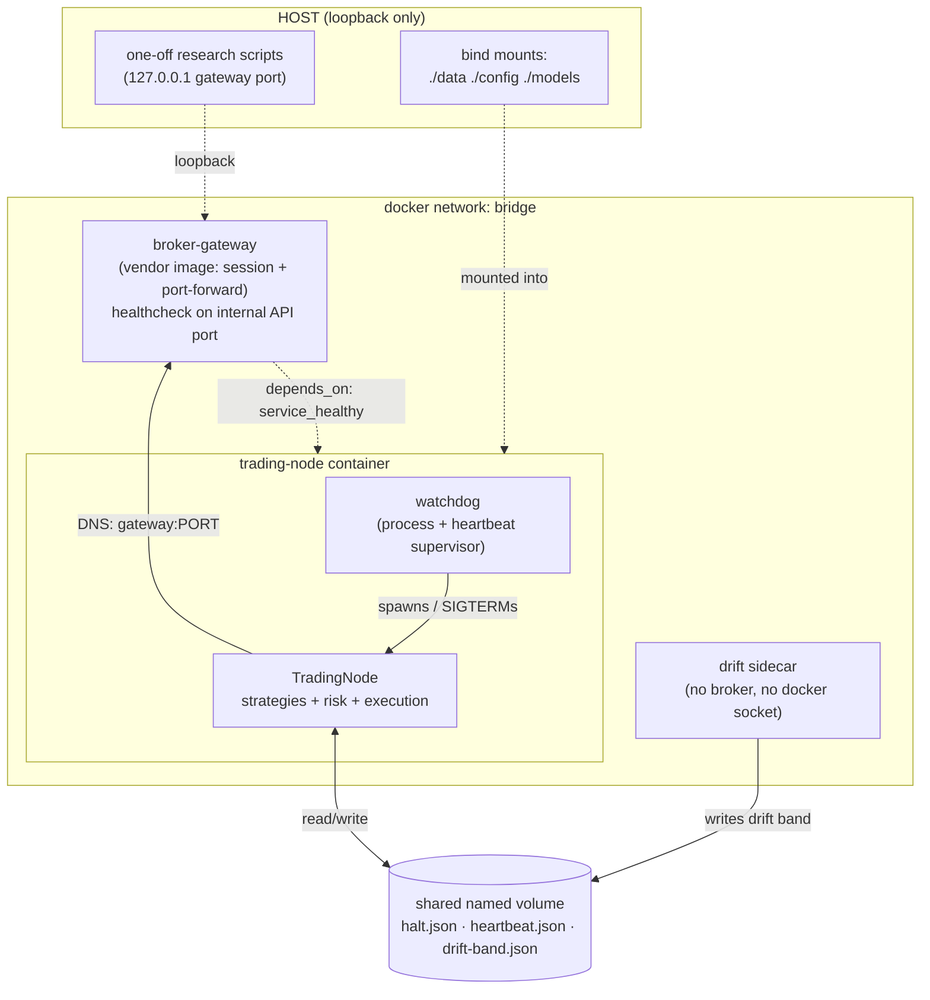

# 23. Containerising the stack

A trading node is the rare piece of software where *crashing is the safe failure*. A process that dies gets restarted, logged, and paged on. The failure that actually costs money is the one where the process stays *up*, green in every dashboard, while its data feed quietly went dark hours ago and it has been making decisions on a frozen view of the world. Containers don't fix that. But the way you compose them decides whether you catch it in forty minutes or find out from your broker statement.

This chapter is about that composition. Not "how to write a Dockerfile", of which there are a thousand, but the specific topology a live trading stack needs: a broker gateway you don't control, a trading node that must reach it, a watchdog that restarts on failures the process can't detect about itself, and sidecars that watch the watchman. Plus two configuration traps that have each, separately, taken a real stack offline: secrets clobbered by an `environment:` block, and a graceful-shutdown window too short to flatten cleanly.

## The principle: four roles, not one image

A naive deployment puts everything in one container: connect to the broker, run the strategy, restart on crash. It works in a demo and fails in production for a structural reason: **the thing that fails and the thing that detects the failure cannot be the same process.** A wedged event loop can't notice it's wedged. A node whose feed died can't tell you, because the code that would tell you is downstream of the feed.

So a production trading stack decomposes into four roles, each with a different failure model and a different blast radius:

| Role | Owns | Fails by | Who restarts it |
|---|---|---|---|
| **Broker gateway** | The authenticated session to the broker | Login timeout, daily/weekly forced restart, 2FA hang | Its own `restart:` policy + healthcheck |
| **Trading node** | Strategies, risk, order routing | Crash, disconnect, *silent blindness* | The watchdog |
| **Watchdog** | Supervising the node | Almost never (keep it tiny) | Container `restart:` policy |
| **Sidecars** | Out-of-band monitoring (drift, de-risk bands) | Independently; must not take the node with them | Container `restart:` policy |

The watchdog deserves emphasis because it is the part most people skip. A container's built-in `restart: unless-stopped` handles the *easy* failure: the process exited. It does nothing for the hard one: the process is alive and blind. That gap is the entire reason a separate supervisor exists, and we'll spend most of the chapter there.



Four containers, one bridge network, one shared volume for state files. The arrows that matter are the dotted ones: `depends_on: service_healthy` (the node won't start until the gateway's API port answers), and the shared volume (the only channel the sidecar uses to influence the node: no RPC, no socket, just an atomically-written JSON file the node reads).

## Titan's topology, sanitised

Titan runs this as a Compose stack: a vendor gateway image, the trading-node image we build, and a drift sidecar built from the *same* image with a different entrypoint. We'll walk each role.

!!! note "Everything below is illustrative"
    Container names, image tags, ports (`4xxx`/`4yyy`), bundle names, and grace windows here are placeholders or representative values, enough to show the *shape* of the topology, not the live stack. Real ports, the live strategy bundle, and account identifiers are deliberately withheld.

### The gateway: someone else's container, with a port-forwarding quirk

The broker gateway is almost always a vendor image; you do not want to be the one packaging a Java GUI app, a virtual framebuffer, and an auto-login bot. Titan uses a community image that runs the broker's gateway under an auto-login controller inside a headless X server, and forwards the API with `socat`.

That `socat` hop is the first thing to understand, because it produces a counterintuitive split between the port the healthcheck probes and the port the node connects to:

```yaml
services:
  broker-gateway:
    image: vendor/ib-gateway:stable      # (1)!
    restart: unless-stopped
    env_file:
      - .env.docker                       # (2)! secrets ONLY from here
    environment:
      TRADING_MODE: ${TRADING_MODE:-paper}   # non-secret static config only
      AUTO_RESTART_TIME: "03:00 SUN"         # weekly soft restart, off-session
      TWOFA_TIMEOUT_ACTION: restart          # (3)!
    ports:
      - "127.0.0.1:4xxx:4xxx"            # (4)! loopback ONLY - never 0.0.0.0
    healthcheck:
      # Probe the gateway's INTERNAL login port, not the socat face.
      test: ["CMD-SHELL", "(echo > /dev/tcp/127.0.0.1/4yyy) || exit 1"]
      interval: 30s
      timeout: 5s
      retries: 5
      start_period: 90s                  # (5)! cold start is ~60-80s
```

1. Vendor image; bumping the tag changes the whole login stack: pin it, test it.
2. `env_file` supplies credentials. The `environment:` block carries only non-secret config. The *why* is a war-story below.
3. If 2FA push times out, **restart** rather than sit half-logged-in; a half-login still shows the API port as open, so a naive TCP healthcheck would call it healthy.
4. Published to loopback only so host research scripts can reach it; never bound to `0.0.0.0`. A broker gateway reachable from the network is a credential-theft target.
5. The framebuffer + login bot take a real minute to come up; too short a `start_period` makes the gateway flap on every boot.

The forwarding looks like `external_port ← internal_port`, with separate pairs for paper and live. The trap: **the healthcheck probes the internal port; the node connects to the external one.** Get that backwards and either the healthcheck passes against a port nothing listens on (node never starts), or the node points at the internal port (connection refused). Worse, paper-vs-live is often *inferred from the port number*; connect to the wrong one and you can silently trade the wrong account. We treat the port mapping as load-bearing configuration, documented inline, not folklore.

!!! danger "War-story: secrets clobbered by an `environment:` block"
    A routine container recreate brought the stack up with the gateway typing **empty** credentials into the broker's login dialog. It retried for hours; the API port never opened; the node, gated on `depends_on: service_healthy`, never started. No crash, no error, just a stack that quietly didn't trade.

    Root cause: a precedence rule that is easy to forget. In Compose, an `environment:` entry **overrides** an `env_file:` entry for the same key. Someone had added a line like `SLACK_WEBHOOK_URL: ${SLACK_WEBHOOK_URL:-}` to the `environment:` block as documentation. That `${VAR:-}` substitutes from the *default* `.env` / shell (normally unset, so it expands to empty string) and then *clobbers* the real value loaded from `.env.docker`. Notifications silently vanished; the same pattern on the credential vars later left the gateway logging in blank.

    The rule it bought: **secrets and per-deploy values come from `env_file` only.** The `environment:` block carries non-secret static config and nothing else. If a key lives in the env-file, it must *not* appear in `environment:`, even "for clarity." We leave a comment where the temptation is, explaining precisely why the line is absent.

### The node: bind mounts, and a graceful stop window

The trading-node image is deliberately boring: a slim Python base, dependencies installed from a frozen lockfile, application code copied in, and a build-time import check so the image *fails to build* if a live strategy class won't import. What's interesting is the runtime composition.

```yaml
  trading-node:
    image: ${TITAN_IMAGE:-trading-node:latest}
    build: { context: ., dockerfile: Dockerfile }
    restart: unless-stopped
    depends_on:
      broker-gateway:
        condition: service_healthy        # (1)!
    env_file:
      - .env.docker
    environment:
      BROKER_HOST: broker-gateway         # (2)! docker DNS → gateway container
      BROKER_PORT: ${BROKER_PORT:-4xxx}   # (3)! must be the socat face
    command: ["python", "scripts/watchdog.py",
              "--strategies", "${STRATEGIES:-default_bundle}"]   # (4)!
    volumes:
      - shared-tmp:/app/.tmp              # (5)! halt.json, heartbeat, drift band
      - ./data:/app/data                 # warmup parquets - RW for in-container refresh
      - ./config:/app/config:ro          # TOMLs editable on host → `restart` to apply
      - ./models:/app/models:ro          # ML artefacts, read-only at runtime
    stop_grace_period: 60s               # (6)!
```

1. The node waits for the gateway to be *healthy*, not merely *started*. Without this, the node races the gateway's minute-long cold start, dies on connection-refused, and the watchdog burns restart cycles until the gateway happens to be up.
2. The node reaches the gateway by **container name** over the bridge network's DNS: no IPs, no host networking.
3. The same `${VAR:-default}` substitution trap as the secrets case: a value here overrides the env-file. It must be the *external* forwarded port. Point it at the broker's desktop-client port or the internal gateway port and you get a connect failure that looks like the gateway is down.
4. The watchdog is the entrypoint; the strategy bundle is parameterised. (A subtle trap worth naming: when the bundle name can be set in the Dockerfile `CMD`, the Compose `command:` default, *and* the env-file, the env-file wins, so reading only the Dockerfile can mislead you about what's actually live. Pick one source of truth and document it.)
5. The named volume is the **shared-state channel** between node and sidecar. The bind mounts split by mutability: `data/` is read-write so an in-container refresh job can update warmup parquets; `config/` and `models/` are read-only because a running node has no business editing its own config: you edit on the host and `restart` to apply.
6. `stop_grace_period` is the graceful-shutdown budget, covered next.

**Bind mounts vs. baked-in.** Code goes *into* the image: reproducible, versioned, immutable. Data, config, and model artefacts are *mounted* at runtime so you can update them without a rebuild, and so the same image runs paper and live with only the mount and the env-file changing. The discipline: anything that constitutes the *edge* (config files, parameters) is mounted read-only and changed deliberately; anything the node legitimately writes (state, logs) goes to the named volume so it survives `docker compose down`.

!!! danger "War-story: a 60-second stop window, and why it's not 10"
    `docker compose down` sends `SIGTERM`, waits `stop_grace_period`, then sends `SIGKILL`. The default is **10 seconds.** A trading node needs more than that to shut down *cleanly*: forward the signal to its child, let the runner persist halt state, and let the broker session see an orderly `eDisconnect` so it releases the client id. `SIGKILL` mid-shutdown can leave the client id "already in use" on the broker side, so the *next* startup can't connect: a self-inflicted outage on every redeploy.

    The fix is two-sided. Set `stop_grace_period: 60s` on the node so SIGKILL doesn't fire prematurely, **and** make the watchdog *forward* SIGTERM to its child rather than dying on it; otherwise the supervisor exits instantly, the child is orphaned and killed hard, and the 60-second budget you bought goes unused. The sidecar, which holds no broker session, gets a short window (10 s) because it has nothing to flatten. Match the grace period to what each container actually has to clean up.

### The watchdog: restarting on failures the node can't see

Here is the heart of the chapter. The watchdog runs the node in a subprocess and restarts it; but the interesting part is *what it restarts on.* A bare supervisor only ever wakes on process **exit**:

```python
proc = subprocess.Popen(cmd)
proc.wait()          # returns ONLY when the child exits
# ... restart ...
```

That catches crashes and disconnects. It does **not** catch the failure mode that defines a trading node: the process is alive, the event loop is turning, and the bar feed has been dead for hours. `proc.wait()` will block forever on a node that is up and blind. So the supervisor must poll a **heartbeat** the node writes, and decide, from outside the node, whether the node has gone silent.

```python
def supervise(proc, child_started_epoch):
    """Return when the child exits OR when the heartbeat says it's wedged."""
    while True:
        try:
            proc.wait(timeout=HEARTBEAT_POLL_SECS)
            return                       # (1)! child exited on its own
        except subprocess.TimeoutExpired:
            pass                         # still running - check the heartbeat
        reason = heartbeat_restart_reason(
            read_heartbeat(),            # (2)! a JSON file the node updates
            now_epoch=time.time(),
            child_started_epoch=child_started_epoch,
            grace_secs=BOOT_GRACE,       # (3)! don't judge a booting child
            heartbeat_max_age_secs=HB_MAX_AGE,
            bar_restart_secs=BAR_STALE_RESTART,
            market_open=fx_market_likely_open(now_utc()),  # (4)!
        )
        if reason:
            log.error(f"{reason}. Terminating child to force restart.")
            notify("Bar pipeline wedged - auto-restarting", severity="critical")
            proc.terminate(); proc.wait(timeout=30)
            return
```

1. The easy path: the child exited; the outer loop restarts it after a cooldown.
2. The node writes a tiny heartbeat file on every staleness check: `{written_at, bar_age_secs}`. It lands on the shared volume so the supervisor (a different process) can read it.
3. **Boot grace.** A freshly restarted node needs time to connect, qualify contracts, replay history, and write its first heartbeat. Judge it too early and you get a restart loop. The grace must exceed the heartbeat write interval so a healthy child has written at least once.
4. **Market-hours gate**, the subtlety that keeps this from being a footgun.

The restart decision is a *pure function* of the heartbeat and the clock, which is exactly why it's safe to unit-test exhaustively. It has two distinct triggers with different scopes:

- **Stale heartbeat → restart, any time.** If the file the node updates on a wall-clock timer stops advancing, the node's *event loop itself* is wedged. That's a problem regardless of whether the market is open, so this trigger ignores market hours. The threshold is a comfortable multiple of the write interval so one delayed timer fire doesn't false-trip.
- **Stale bars → restart, only during market hours.** If the heartbeat is fresh but `bar_age_secs` is large, the loop is fine but the *feed* is dead. Here market hours matter enormously: a quiet feed at 03:00 on a Sunday is the market being closed, not a fault. Restart on that and you get a restart loop every weekend. So this trigger is gated by a conservative "market likely open" check that *over-covers* the weekend close, erring toward **not** killing a node when the market is plausibly shut.

!!! warning "War-story: the node that lived but went blind"
    A gateway wedged in a way that left the API socket open but the data stream stopped. The node stayed `Up` for over two days. Its bars were stale by roughly thirteen hours. The nightly summary that would have screamed never fired, because the code that builds it was downstream of the dead feed. Every coarse signal said healthy. The position book was being managed against a thirteen-hour-old view of the market.

    The bare `proc.wait()` supervisor never noticed, *by construction*: the process never exited. The fix was the heartbeat path above: a file the node refreshes on a wall-clock timer, polled from outside, with a market-hours-aware staleness rule. Two complementary rules came out of it. First, **liveness is not health**: "the process is up" and "the process is doing its job" are different questions and need different probes. Second, **the detector must live outside the thing it watches**; a self-report from a wedged node is worth nothing. There's also a belt-and-braces twin inside the node: a wall-clock fallback timer so a dead bar path can't swallow the scheduled summary either.

The outer loop wraps `supervise()` with cooldowns tuned to the gateway's behaviour: a longer wait (a few minutes) on a normal exit, enough to ride through the broker's weekly auto-restart, and a *shorter* but still-backed-off wait when the child dies within seconds of starting, because a near-instant death is almost always a config error (gateway unreachable, bad credentials) that hammering restart won't fix. Every transition pages a notification with a severity, so a human learns about the auto-restart even though the stack healed itself.

### Sidecars: watching out-of-band, influencing through a file

The last role is the monitoring sidecar. Titan's example is a drift / de-risk monitor: a daemon that periodically block-bootstraps a research baseline into a drawdown band (the p95/p99 of expected max-drawdown) and writes it atomically to the shared volume. The live risk manager *reads* that band and uses it to throttle leverage when realised drawdown drifts past the model's expectation.

Two design choices make this a clean sidecar rather than a liability:

```yaml
  drift-monitor:
    image: ${TITAN_IMAGE:-trading-node:latest}   # same image, different CMD
    restart: unless-stopped
    depends_on: [trading-node]
    command: ["python", "scripts/drift_daemon.py"]
    volumes:
      - shared-tmp:/app/.tmp              # writes the drift band here
      - ./data:/app/data:ro              # research baseline parquets, read-only
      - ./config:/app/config:ro
    stop_grace_period: 10s               # no broker session to flatten
```

First, **it has no broker session and no privileged access.** It needs the research data and the shared volume, nothing else. In particular it does *not* mount the Docker socket; a daemon that can talk to the Docker API can control every container on the host, and you do not want your *monitor* to be your largest attack surface. (One half of this monitor would benefit from reading the node's logs, which on this image means a socket mount; we deliberately let that half *gracefully skip* rather than grant the privilege. The valuable half, writing the drift band, needs none of it.)

Second, **it influences the node only through an atomically-written file.** No RPC, no shared memory, no killing the node directly. The node reads the band on its own schedule; if the sidecar is down, the band simply goes stale and the de-risk feature stays at its last value (or dormant): a sidecar outage degrades a feature, it never takes down trading. That asymmetry is the whole point of a sidecar: maximum observability, minimum blast radius. The deeper treatment of *what* the drift band does to sizing lives in [layered safety](../part5-portfolio-risk/layered-safety.md); here it's an example of the *topology*: out-of-band, least-privilege, file-coupled.

!!! tip "Sidecars couple through state files, not sockets"
    A monitor that restarts the node, or holds the node's lifecycle in its hands, has inverted the dependency: now the watched controls the watcher's blast radius. Keep sidecars *advisory*. They observe, they compute, they drop a file. The node decides what to do with it. The contract between them is a versioned JSON schema on a shared volume: testable, inspectable, and impossible to turn into a cascading failure.

## A note on what *not* to containerise

Not every periodic job belongs in a container. The drift daemon above can equally be a host `cron` line that runs the one-shot script and appends to a log, and on a host that *has* cron, that's the simpler choice: no idle container, no socket questions, fewer moving parts. We reach for a Compose sidecar only when the host lacks a reliable scheduler (a NAS appliance, a Windows-only box) or when the job needs the image's exact dependency set. The reflex "make it a service" is worth resisting. The principle generalises: containerise the things that must run *continuously and be supervised*; schedule the things that run *occasionally and idempotently*.

## Takeaways

- **Decompose by failure model, not by convenience.** Gateway, node, watchdog, sidecars: each fails differently and needs a different recovery owner. The detector must never be the thing it detects.
- **`restart:` handles exit; only a heartbeat handles blindness.** A live-but-blind node is the failure that costs money. Poll a heartbeat from outside the node, with two triggers: stale heartbeat (any time, the loop is wedged) and stale bars (market-hours-gated, the feed is dead).
- **Secrets from `env_file` only.** An `environment:` entry overrides the env-file for the same key; a stray `${VAR:-}` expands to empty and clobbers the real value. Keep the two blocks disjoint, and comment the absence.
- **Match `stop_grace_period` to cleanup work,** and forward `SIGTERM` through the watchdog to the child; otherwise the grace window is wasted and you orphan the broker session, blocking the next startup on a stuck client id.
- **Bind read-only what is edge or config; write to a named volume what must survive.** Code in the image, data and config mounted, state on a volume.
- **Sidecars are advisory and least-privilege:** no broker session, no Docker socket, influence through an atomically-written file. A sidecar outage degrades a feature; it never halts trading.

---

The containers are the chassis; the next two chapters drive it. [The live runbook](live-runbook.md) covers operating this stack day to day (reading the logs, the redeploy sequence that avoids the stuck-client-id trap, and what each alert means), and [Paper to live](paper-to-live.md) covers the cutover, where the only things that change are the env-file, the mount, and the port the topology infers the account from. For the safety layers the watchdog and sidecar feed into, see [layered safety](../part5-portfolio-risk/layered-safety.md); for the broker-side realities that shape the gateway container, see [broker realities](../part4-research-to-prod/broker-realities.md).
