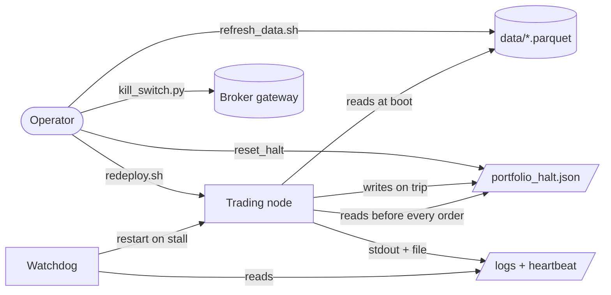

# 24. The live runbook

The strategy is researched. The portfolio is risk-managed. The containers are built. And now, at 14:55 on a Tuesday, you need to push a one-line config change without flattening the book, and you have ninety seconds before the next bar fires. This is the chapter nobody writes and everybody needs: the boring, repeatable, *do-this-not-that* operations that keep a live node alive between the heroics.

A live trading system is not a program you run. It is a process you operate. The difference is that an operation has a *runbook*: a small set of named tasks, each with a single blessed action, written down before the incident so that nobody has to improvise with capital on the line. The failure mode this chapter prevents is the most ordinary one in production trading: an operator who knows the system well, under mild time pressure, reaches for the obvious command, and the obvious command is the wrong one.

## The principle: every routine task has exactly one blessed action

The point of a runbook is not documentation. It is *removing choices.* When you redeploy a live node, there are five ways to do it and one of them is safe; the runbook's job is to make the safe one the only one anybody runs. Three properties make a task runbook-able:

- **It is named.** "Redeploy", "Refresh data", "Clear a halt": a verb a tired operator can find in ten seconds.
- **It has one action**, scripted, idempotent, and safe to run twice. If clearing a halt has a CLI flag *and* a JSON file you can delete *and* a Python call, the operator under stress will pick wrong.
- **It fails closed.** When the action can't complete, the system stays in the *safe* state, flat, halted, or refusing to trade, not the *available* state.

The reason these tasks need scripts and not wiki paragraphs is that the dangerous version and the safe version look almost identical. The dangerous redeploy is one flag away from the safe one. The dangerous data refresh is one date away from the safe one. A human reading prose will not reliably pick the right side of a one-character difference at 03:00. A script will.

Here is the task table the rest of the chapter unpacks. This is the whole runbook on one screen; everything below is the *why*.

| Task | Blessed action | The trap it avoids |
|---|---|---|
| **Redeploy** (config change) | `redeploy_portfolio.sh`: graceful stop, wait, up | `up --force-recreate` ⇒ client-id collision flap |
| **Redeploy** (code change) | `redeploy_portfolio.sh --build` | same flap, plus a stale image |
| **Refresh data** | in-container `refresh_market_data.sh`, **full history** | a shallow window shrinks a parquet ⇒ data-gate halt |
| **Rebuild manifest** | `build_data_manifest.py` after a *vetted* change | next boot `SystemExit`s on a phantom contraction |
| **Check halt** | read `portfolio_halt.json` | guessing from the equity curve |
| **Clear halt** | operator `reset_halt()` / remove a vetted file | clearing a halt that's still warranted |
| **Manual flatten** | `kill_switch.py` (typed confirmation) | a fat-fingered flatten with no confirm step |
| **Read logs** | container stdout **and** the persisted log file | watching only one and missing the other |

## Safe redeploy: the client-id flap

Most brokers identify each API session by a numeric **client id**. Two live sessions cannot share one. That single fact is behind the most common self-inflicted outage in containerised trading.

When you redeploy with the naive one-shot, `docker compose up --force-recreate`, Docker tears down the old container and stands up the new one in the same breath. The new node reconnects to the broker gateway *within seconds*. But the gateway has not yet noticed the old session died; it still holds the old client id open. The new node asks for the same id, the gateway says "already in use", and you get a **flap**: the node retries, fails, retries, fails, a connection storm that, at best, delays your reconnection past the bar you were trying to catch and, at worst, leaves the node wedged with no broker session at all while positions sit unmanaged.

The fix is a deploy *sequence*, not a deploy command. Stop gracefully, wait for the gateway to release the id, then bring the node back:

```bash
# redeploy_portfolio.sh (sanitised shape)
SVC=trading-node          # the live node's compose service
GW=broker-gateway         # the broker gateway service
ENV_FILE=.env.live        # pins client id + account - see callout (3)

# 1. Stop GRACEFULLY. A long stop_grace_period lets the node send the
#    broker's disconnect call, which is what actually frees the client id.
docker compose stop "$SVC"

# 2. WAIT for the gateway to release it. The wait is the whole point.
sleep "${WAIT_RELEASE:-25}"      # (1)!

# 3. Bring it back - ALWAYS with the same env-file, so the client id
#    and account resolve identically to last time.
docker compose --env-file "$ENV_FILE" up -d "$SVC"   # (2)!

# 4. Watch for a flap; if the id is still stuck, restart the gateway
#    (clears the ghost session) and recreate into a clean gateway.
sleep 20
if docker compose logs --since 25s "$SVC" | grep -q "already in use"; then
    docker compose restart "$GW"        # (3)!
    # ...wait for gateway healthy, then up -d --force-recreate --no-deps
fi
```

1. The wait is *not* a magic number you can drop. It is the gateway's release window. Too short and you race the very condition the script exists to avoid.
2. The env-file pins the client id *and* the account (see the tip below). Skipping it is how "restart" silently becomes "reconfigure".
3. Restarting the gateway is the escalation, not the default. It clears a *ghost* session: an id the gateway is holding for a connection that no longer exists. Reach for it only after the graceful path flaps.

Two defences, belt and braces. The script is the **operational** one: it sequences the deploy so the collision usually never happens. But a hard crash skips the graceful stop entirely, so there's also an **in-node** defence, the startup free-id probe that advances past a held id before connecting. That probe is [broker-realities](../part4-research-to-prod/broker-realities.md)' story; here it matters only as the safety net under the script. The probe lets a node recover *itself* from a ghost session; the script means it rarely has to.

!!! danger "War-story: the one-shot force-recreate that ate the session"
    A config-only change needed pushing during the session. The obvious command, `docker compose up -d --force-recreate`, tore the node down and stood it back up in seconds. The new container grabbed for its client id before the gateway had released the old one, hit "client id already in use", and entered a reconnect flap. For several minutes the node had **no broker session** while open positions sat with no live risk management on them. Nothing flattened, nothing halted; it simply wasn't *watching*. The fix bought a rule: **there is no manual `up --force-recreate` for the live node; redeploys go through the stop-wait-up script, every time.** `--force-recreate` survives only *inside* the script, as the post-flap escalation after the gateway has been restarted into a known-clean state.

!!! tip "Always pass the env-file on the way up"
    A subtle variant of the same bug: bring the node up *without* the explicit `--env-file` and Compose may resolve a *different* client id, or a different *account*, than the one that just stopped. So you collide with yourself, or worse, connect somewhere you didn't mean to. The blessed `up` line always carries the env-file: id and account must resolve identically across a restart, or "restart" silently became "reconfigure".

## Refresh data without tripping the gate

Live strategies warm up from local history files (Titan uses one Parquet per instrument/timeframe). Those files have to be refreshed, new bars arrive daily, and the refresh is where a careless operator quietly corrupts the warmup that every position size depends on.

The danger is not bad data. It is *less* data. [The data-quality gate](../part3-data/data-quality-gate.md) runs at startup and **blocks trading on any contraction** versus the last known-good manifest: fewer rows, a shorter span, a flipped source, a missing or unreadable file. Growth is always fine; shrinkage is always suspect, because the only innocent reason a history file gets *shorter* is a refresh that fetched a smaller window than what was already on disk.

And that is exactly the trap. Many data APIs default to "the last N years." Run a refresh with a shallow start date against a file holding a decade of deep history, and you don't *append*; you *overwrite* with a truncated series. The file is now shorter. On the next boot the gate sees the row-count drop, fires a critical alert, and `SystemExit`s the container. You meant to update the data; you halted the node.

The rule is blunt and it lives in a comment at the top of the refresh script: **pull full history from inception, never a rolling window.**

```bash
# refresh_market_data.sh (sanitised) - runs INSIDE the node container so it
# can reach the broker gateway by its compose DNS name.

# Bars from the broker: merge-safe, all timeframes, deep lookback.
CLIENT_ID_DOWNLOAD="${CLIENT_ID_DOWNLOAD:-<HIGH_UNUSED_ID>}" \  # (1)!
  uv run python scripts/download_data_mtf.py --pair <FX_PAIR> --years <DEEP>

# ETF/index dailies from a vendor: an EARLY --start = full history.
uv run python scripts/download_data_yfinance.py \
  --symbols <SYM>=<TICKER.L> ... \
  --interval D \
  --start 2000-01-01      # (2)!  full history from inception, NOT a window
```

1. The downloader uses a *high, dedicated* client id, a value well clear of the trading node's, precisely so a data pull can't collide with the live session. A refresh that knocks the live node off its session is a refresh that caused an outage. (Pick the number to suit your own id layout.)
2. An early start date is safe even for instruments that didn't exist in 2000: a well-behaved vendor returns each ticker from *its own* inception, so an early date never fabricates pre-listing bars. It just guarantees you never *truncate*.

After a *vetted* change (you added an instrument, switched a source on purpose, accept that the shape changed), you re-bless the baseline by rebuilding the manifest:

```bash
python scripts/build_data_manifest.py            # write the new known-good baseline
python scripts/build_data_manifest.py --check    # dry-run: gate without writing
python scripts/build_data_manifest.py --force    # write despite a regression (deliberate)
```

The escape hatch (`DATA_GATE_DISABLE=1`) exists for emergencies. Treat reaching for it as an incident, not a workaround: you are deploying with the trip-wire cut.

!!! warning "War-story: the refresh that halted the node it was feeding"
    A routine data refresh used a downloader whose default lookback was a rolling multi-year window. It ran clean and reported success. But for an instrument with much deeper history on disk, the "successful" refresh *overwrote* the deep file with the shallow window: same data quality, fewer rows. Nothing complained, because the refresh script's job was done. On the next restart the [data-quality gate](../part3-data/data-quality-gate.md) saw the contraction and `SystemExit`ed (its diffing mechanism is the gate chapter's story), and the supervisor's restart policy turned one bad file into a **crash-loop**: boot, fail the gate, exit, restart, fail again. The node never traded. Two operator rules came out of it: **refresh full history from inception, always**, and **rebuild the manifest only after a change you've actually vetted**, never reflexively, or you'll re-bless a corruption and lose the trip-wire that would have caught it.

## Check, and clear, a halt

A halt is a one-way door by design: easy to trip, deliberately awkward to clear. Several independent layers can write the same halt (an in-process drawdown kill switch, an out-of-process risk arbiter, a reconciliation orphan trip, a manual operator action), and they all converge on **one persisted file** (`portfolio_halt.json`) with a single schema. The full taxonomy of who can halt and why is [the portfolio risk manager](../part5-portfolio-risk/portfolio-risk-manager.md) and [the layered safety net](../part5-portfolio-risk/layered-safety.md); here we only operate it.

**Checking** is a file read. The halt state is not hidden in logs or inferred from the equity curve; it is an explicit JSON record:

```json
{ "halted": true, "reason": "portfolio_dd_kill", "operator": "auto-kill",
  "at": "2026-06-06T13:22:09Z", "cleared": false }
```

The daily-summary rollup surfaces this file's presence in its health section, so a glance at the morning report tells you whether you're halted before you go looking.

**Clearing** is deliberately *not* a one-click CLI. There is no `reset_halt.py` and that absence is the design: a halt that's trivial to clear is a halt that gets cleared reflexively, mid-trough, locking in the loss it was protecting you from. Clearing requires an operator decision through one of two named paths:

- `reset_halt(operator)`: lift the halt but **preserve the high-water mark**, so the drawdown clock keeps running from the prior peak. This is the usual choice: you've decided the halt was a transient (a stale feed, a one-off reconciliation blip), not a real ruin event.
- `reset_hwm(operator)`: **re-anchor** the high-water mark to current equity. This says "the old peak is no longer the reference"; use it only when you've genuinely accepted the loss and are restarting the risk accounting from here. It is the more dangerous of the two and should be the rarer one.

Or, equivalently, remove a *vetted* `portfolio_halt.json` by hand. The critical safety property: a **corrupt or unparseable halt file fails closed**; the node treats an unreadable file as *halted*, never as *clear*. The one thing you must never do is delete the file to "fix" a parse error; an unreadable halt is the system telling you to investigate, not to override.

!!! danger "Clearing a halt is a capital decision, not an ops chore"
    Every halt-clear is a statement: *"I believe the condition that tripped this is gone."* If you're wrong, you've just re-armed a strategy into the exact regime that was sinking it. Before any `reset_halt`, answer in writing: what tripped it, has that condition actually passed, and which reset preserves the right risk baseline. If you can't answer all three, stay halted. A halted system loses nothing it hasn't already lost; a wrongly-cleared one finds new ways to lose.

### The manual flatten

When you need to be flat *now* (a news event, a suspected bug, a broker anomaly), the kill switch is a separate, standalone script with its own dedicated client id (so it never fights the live node for a session) and a **typed confirmation**:

```text
⚠  KILL SWITCH will:
   1. Cancel ALL open orders  (global cancel)
   2. Close ALL N position(s) at market
Type  KILL  to confirm, or anything else to abort:
```

It cancels every working order, then submits a market order to flatten each open position. The typed `KILL` is not theatre; it is the difference between an intentional flatten and a fat-fingered Enter. Note that the kill switch makes you *flat*, but it does **not** write the halt file: after a manual flatten you must still decide whether to trip a halt so the strategies don't immediately re-enter on the next bar.

## What to watch in the logs

Two streams, always both. Container stdout (`docker logs <node>`) is the live tail. A *persisted* log file on a bind-mounted volume is the durable record that survives a container recreate, and a redeploy throws away stdout history, so the file is where you reconstruct an incident after the fact. Watch only one and you will eventually debug an outage with half the evidence.

You are not reading every line. You are grepping for the events that change posture:

| Log signal | What it means | What to do |
|---|---|---|
| `KILL SWITCH` / drawdown halt | the ruin gate tripped; node is flat + halted | check `portfolio_halt.json`, then the halt-clear decision above |
| data-gate `CRITICAL` | a refresh contracted a file; boot is blocked | re-pull full history; rebuild the manifest only if the change was vetted |
| `already in use` (client id) | reconnect flap | you redeployed wrong; go through the script |
| correlation-dial leverage `… → …x` | the allocator re-grossed/de-grossed at rebalance | informational; confirm it's the scheduled rebalance, not a thrash |
| `[Allocator]` rebalance lines | per-strategy weights updated | sanity-check no single sleeve dominates |
| heartbeat / bars stale | the feed stalled past threshold | the watchdog should restart the child; confirm it did |

The deployment topology (node, gateway, watchdog, sidecars, and the shared-state volume that carries the halt file, the heartbeat, and the logs between them) is [the containerizing chapter](containerizing.md). Here is just the operator's-eye view of who writes what:



The shape to internalise: the operator and the system write to the *same* small set of shared-state files, and the node reads the halt file **before every order**. That is why the runbook works: there is no hidden channel. Everything an operator does is a file the node will see, and everything the node decides is a file the operator can read.

## Takeaways

- A live system is **operated, not run**. Reduce every routine action to a named task with one blessed, idempotent, fail-closed command, because the dangerous version is always one flag or one date away from the safe one.
- **Redeploy through the stop-wait-up script.** A one-shot `--force-recreate` races the broker's client-id release and flaps. Sequence the deploy; back it with an in-node free-id probe; always pass the env-file.
- **Refresh data full-history, from inception.** A rolling-window pull truncates deep files, contracts the manifest, and the [data-quality gate](../part3-data/data-quality-gate.md) crash-loops the node. Rebuild the manifest only after a change you've vetted.
- **A halt is easy to trip, hard to clear, on purpose.** Read it from one JSON file; clear it only with a written answer to *what tripped, has it passed, which reset.* Corrupt halt file ⇒ fails closed.
- **Watch two log streams** (live stdout + durable file) and grep for posture-changing events, not lines. The flatten path is standalone, dedicated-id, and demands a typed confirmation.

---

The runbook assumes the system is already live. Getting it there safely (proving paper behaviour matches research before a single real fill, and the graduated checklist that gates the switch) is [**From paper to live**](paper-to-live.md). And every halt threshold and risk layer this chapter *operates* is defined back in [**The portfolio risk manager**](../part5-portfolio-risk/portfolio-risk-manager.md).
