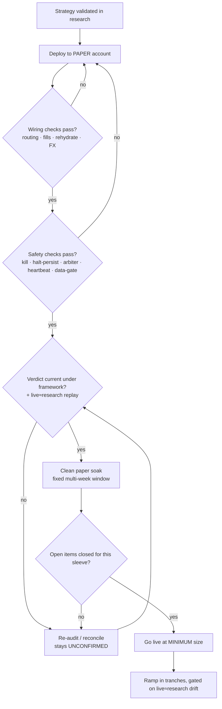

# 25. Paper to live

A paper account is the last gate before real capital, and it is the one most likely to lie to you. Not because the broker is dishonest, but because a paper environment is a *simulation wearing a live account's clothes*. It quotes you the same screens, accepts the same order types, and reports fills that look exactly like the real thing. What it does not do is reproduce the two things that actually decide whether a strategy survives: the *data* you trade on and the *fills* you get. Both are systematically more forgiving on paper, and forgiving in the one direction you can least afford: optimistic.

This chapter is about closing the gap between "it worked on paper" and "it's safe with money." We treat paper trading not as a rehearsal that proves the strategy, but as a *failure detector* for the plumbing (order routing, currency conversion, position rehydration, the kill switch), with a clear-eyed list of what it can and cannot tell you, a pre-live checklist, the open questions that must be answered before sizing up, and a gradual ramp so the first real loss is survivable.

## The principle: paper proves the wiring, not the edge

Here is the distinction the whole chapter turns on.

- **Paper *can* validate the wiring.** Does an order actually route to the venue? Does a bracket get accepted? Does the position rehydrate correctly after a restart? Does the kill switch flatten everything when it trips? Does FX conversion size the leg in the right currency? These are deterministic, code-level facts. If they're wrong on paper, they're wrong live, and paper is where you find out for free.
- **Paper *cannot* validate the edge.** The P&L on a paper account is generated against simulated fills on (often) delayed or frozen data. It tells you almost nothing about your real Sharpe, slippage, or drawdown geometry, because the most adverse conditions, the gap, the thin book, the fast market, are exactly the ones the simulator handles least faithfully.

So the rule we deploy by: **trust paper for the boolean questions (did it route, did it halt, did it size), distrust paper for the continuous ones (what's the Sharpe, what's the slippage).** Any number off a paper account is a wiring receipt, never a track record.

This matters because the failure mode is asymmetric, exactly as it was for backtests in [A backtest you can trust](../part2-research/backtest-you-can-trust.md). A paper account flatters you: better fills than you'll get, no real market impact, no funding-cost surprises. Let a clean paper P&L stand in for live validation and you repeat the optimism bias one rung lower, this time with the broker's authority behind the lie.

## What paper gets wrong: data and fills

Two mechanisms produce the gap. Know them both, because they fail differently.

### Delayed / frozen market data

A paper account is usually not entitled to the same real-time feed as a funded one. In Titan's case the broker serves the paper node a delayed/frozen data class: quotes delayed by minutes that *freeze* at the last value when the feed idles, rather than streaming continuously. The consequences are subtle and all point the same way:

- **Signals compute on stale prices.** A momentum or z-score signal evaluated on a frozen close is evaluated on a price that no longer exists. The decision is *correct given the input*, but the input is wrong.
- **Subscriptions established mid-session may never stream.** On a delayed feed, a bar subscription created after the session opens can silently produce nothing: the strategy logs `RUNNING` and receives no bars. This is the **silent-blind** failure: the process is alive, the feed is dead, and nothing complains.
- **Quote-tick paths can fail outright** where the delayed feed doesn't support them, so anything that depends on a live quote (rather than a completed bar) behaves differently than it will live.

The lesson Titan paid for here is wired into the [live runbook](live-runbook.md) as a heartbeat watchdog: a supervisor that restarts the node if bars go stale beyond a threshold while the market is open, plus a startup subscription-health check that asserts every expected instrument is actually in the engine cache shortly after boot. Both exist because paper data *looks* live until it quietly isn't.

### Fills that don't simulate naturally

The bigger trap is the fill model. A paper simulator fills your orders against its own internal model of the book, and that model is generous.

- **Resting orders may not fill the way live ones do.** Good-till-cancelled take-profit and stop legs, in particular, often *don't simulate fills naturally* mid-session, because the simulator isn't matching them against a real, moving book. A bracket that "works" on paper because nothing ever hit the stop has told you nothing about your stop discipline.
- **No real market impact, spread, or slippage.** Your paper market order fills at or near the mid; your live one walks the book. For a thin instrument or a large clip this difference dwarfs the edge.
- **Limit-order rejections differ.** A post-only or limit leg the live venue would reject (or partially fill, or fill worse) the simulator may accept cleanly, masking a routing bug until real money is on the line.

The honest reading: a paper P&L curve is a *best case* fill model applied to *delayed* prices. Both errors flatter. Treat the curve as evidence the orders were *accepted*, never as evidence they were *filled well*.

!!! danger "War-story: the bracket that 'passed' on paper and would have crashed every live trade"
    Titan's bracket call carried two latent bugs, a mis-named time-in-force keyword and a post-only take-profit leg, that the live venue rejects but the generous paper simulator accepted, so plausible "fills" hid a defect that would have failed *every single live trade*. The mechanics and the fix are the canonical broker war-story in [Broker realities](../part4-research-to-prod/broker-realities.md); the paper-to-live lesson is the meta-rule: **a paper account's tolerant order acceptance can hide a routing bug that rejects 100% of live orders, so exercise the exact bracket path against the broker with a deterministic harness rather than trusting that "it showed up in the blotter."**

!!! warning "War-story: the strategy that logged RUNNING and traded blind"
    A live equity sleeve was deployed with the venue mis-specified in the registry: the broker had qualified the contract on one exchange, but the config named another. The strategy started cleanly, logged `RUNNING`, and *received no bars for two days*. No error, no crash; the subscription simply matched nothing. Because the kill switch and equity tracking only re-evaluate when a strategy's `on_bar` fires, a blind strategy is also a strategy with **no live risk checks running**; the safety net was as silent as the feed. The fix was the venue correction plus a dedicated subscription-health watchdog that, shortly after the node starts, asserts every expected instrument id is in the engine cache and pages on any miss. The rule it bought: **"the process is up" is not "the strategy is trading"; assert the feed, don't assume it.** A delayed/paper feed makes this far easier to miss, because stale-but-present data and absent data look similar from the outside.

## The pre-live checklist

Before any real capital, every line below must be green. This is the gate; treat a single red as a blocker, not a discussion. The full operator version lives in the [pre-flight checklist](../appendix/preflight-checklist.md); what follows is the paper-to-live subset with the *why* attached.

### Wiring (paper proves these, and only these)

- [ ] **Order routing round-trips.** A real order to the venue, accepted and acknowledged, for every order type the strategy uses (market, bracket, limit). Exercise the bracket path explicitly with a deterministic harness; do not infer it from a blotter entry.
- [ ] **Fills are handled, not just submitted.** Confirm `on_order_filled` / `on_position_closed` fire and update state. The paper simulator's *acceptance* of an order proves nothing about your *fill handling*.
- [ ] **Restart rehydration is correct.** Kill the node mid-position and restart it. The strategy must adopt the existing broker position rather than open a second one; Titan rehydrates EXTERNAL broker positions on `on_start` precisely to kill the restart-double-entry bug. Verify it on paper, where a double-entry costs nothing.
- [ ] **FX sizing matches the quote currency.** For any leg whose quote currency differs from the strategy's base currency, confirm the unit count uses the conversion, not a silent `1.0`. See [Per-strategy equity & FX](../part5-portfolio-risk/per-strategy-equity-fx.md): the silent-`1.0` bug mis-sizes by the whole FX ratio with *no exception*.
- [ ] **Instrument substitution is correct end-to-end.** If live constraints force a substitute instrument (e.g. a UCITS line instead of a US-listed ETF under regional rules), confirm the *traded* line resolves, qualifies, and sizes, and that any *data-only* signal instrument is wired as data-only, not accidentally traded.

### Safety (test the failure paths, not just the happy path)

- [ ] **Kill switch trips and flattens.** Force the portfolio drawdown trigger (or call the trip directly) and confirm it sets the halt, zeroes the scale factor, and flattens. A halt that doesn't flatten is theatre. See [Layered safety](../part5-portfolio-risk/layered-safety.md).
- [ ] **Halt persists and fails closed.** Confirm the halt state survives a restart (persisted to disk, atomically) and that a *corrupt* halt file is treated as **halted**, never as clear. Fail-closed is the only safe default for a kill switch.
- [ ] **The out-of-process backstop is armed.** The in-process kill switch only re-evaluates on a live bar; if the feed stalls, it can't fire. Confirm the independent arbiter (separate client connection, polling NLV) is launched in *arming* mode, not monitor-only; otherwise the deeper drawdown backstop is dormant.
- [ ] **The heartbeat watchdog restarts on a stale feed.** Verify the supervisor force-restarts the node when bars go stale beyond threshold during market hours. This is the antidote to silent-blind.
- [ ] **The data-quality gate blocks on contraction.** Confirm a deliberately-truncated input parquet causes the blocking startup gate to refuse to boot. See [The data-quality gate](../part3-data/data-quality-gate.md).

### Sizing & accounting

- [ ] **Position size is risk-driven, not capital-driven.** Sizing should run through vol-targeting and the risk layer's scale factor, not a fixed share count. See [Position sizing: Kelly & vol-targeting](../part5-portfolio-risk/position-sizing-kelly.md).
- [ ] **Per-strategy equity is real, not whole-account NLV.** Each strategy must see its own equity curve, or the inverse-vol allocator and correlation gates collapse into nonsense.
- [ ] **Min-notional and min-commission won't starve a sleeve.** Confirm the smallest intended leg clears the broker's minimum commission; a sleeve that can never afford a single unit is a silent zero-weight.

### Governance

- [ ] **Live ≈ research is replayed.** A live (paper) day's signals and orders reconcile against what the research code would have produced on the same bars. See [Live equals research](../part4-research-to-prod/live-equals-research.md).
- [ ] **The verdict is current under the framework.** No strategy goes live on a *pre-framework* validation number. If the Sharpe/CI/drawdown figures predate your current methodology, they are **unconfirmed** until re-run; see [Caveats & open problems](../part7-reflections/caveats-open-problems.md).

## Known open items: the questions paper can't answer for you

Some gaps are not bugs to fix but *honest unknowns* to track. Publishing them is the point: an open-items list is how a system stays trustworthy. Titan's, generalised:

- **Account-base vs strategy-base currency mismatch.** The account's net-liquidation value may be denominated in one currency while strategies account in another (e.g. account NLV in GBP, strategies based in USD, illustrative). Per-leg sizing can be made correct by choosing same-currency instruments, but the *account-level* reconciliation between the two bases remains open. Same-currency instrument selection resolves the quote-vs-strategy-base match; it does **not** resolve account-base-vs-strategy-base. Until it does, treat NLV-derived numbers with care.
- **Validation verdicts not re-confirmed under the current framework.** Many strategies carry Sharpe/CI/drawdown figures inherited from earlier methodology eras. These are explicitly **unconfirmed**: sourced from old comments and directives, not re-run backtests. A pre-framework "Sharpe near 1.5" (illustrative) is a *claim*, not a verdict, and must not size capital until reproduced. (Recall the [backtest chapter](../part2-research/backtest-you-can-trust.md): the same five lies apply to every inherited number.)
- **Risk envelopes wired in shadow, not enforced.** A per-strategy pre-trade envelope (per-trade R cap, portfolio heat, leverage limits) may run in *shadow*, logging what it *would have* rejected, without enforcing. Shadow mode is the right way to earn confidence in a new gate, but you must know whether a given layer is enforcing or merely watching. In Titan's current bundle, only the drawdown ruin gate and the graded scale factor enforce; the finer envelope ticks in shadow.
- **Governance built but not auto-fed.** A verdict-staleness governor can exist as code (demote stale verdicts to paper, cap unconfirmed weights) yet still be fed by *prose* rather than structured records. Until the config→records wiring lands, governance is advisory, not automatic.
- **No-stop downside on some sleeves.** A long-only momentum sleeve with no per-trade stop has its downside bounded only by its decay-exit and the portfolio kill switch. That's a deliberate design choice, but it's one the kill switch, not a stop, has to honour, so the kill switch had better be real.

!!! warning "An open item is a feature, not an embarrassment"
    The temptation is to hide unknowns until they're solved. Resist it. A documented open item is a *managed* risk; an undocumented one is *latent*. The currency-base mismatch above is benign only *because* it's tracked and worked around with same-currency instruments; the day someone deploys a cross-currency leg without checking the list, it stops being benign. The list is the safeguard.

## Sizing up gradually

Even after every gate is green, the first deployment is at the *minimum survivable size*, and the ramp is gradual and reversible. The reasoning is pure tail risk, not timidity: the metrics that decide whether you can *hold* a strategy, max drawdown geometry (Calmar), downside deviation (Sortino), the worst-slice tail (CVaR/CDaR), and the formal risk of ruin at deployed size, are precisely the ones a paper account cannot measure. You only learn your real slippage, your real fill quality, and your real drawdown path by trading real size. So you buy that information in the smallest increments that still teach you something.

A workable ramp:

1. **Minimum size soak.** Deploy at the smallest size that clears min-commission and produces real fills. Run a *fixed* multi-week clean window (Titan's promotion convention is a documented multi-week clean trial), reconciling live fills against research expectations throughout. The goal is not P&L; it's the *slippage and fill-quality measurement* paper couldn't give you.
2. **First tranche.** If live fills track research within tolerance and no safety layer misbehaved, step size up by a fixed fraction. Re-check the [live≈research](../part4-research-to-prod/live-equals-research.md) drift at the new size; market impact is size-dependent, so a clean small-size replay does not guarantee a clean larger-size one.
3. **Subsequent tranches.** Continue in fixed fractions, each gated on the same drift check and on the [risk of ruin](../part2-research/tail-risk-and-ruin.md) recomputed at the *new* deployed size. Size up only into evidence; never into hope.
4. **Stop or shrink on any divergence.** If live fills diverge from research, if a drawdown exceeds the Monte-Carlo band (Titan folds exactly this into an auto-de-risk), or if a safety layer fires, you halt or shrink; you do *not* push through to "give it time."

!!! tip "Ramp on the lower bound, never the point estimate"
    Promote on the *honest* number. As in the research chapters, the figure that decides capital is the bootstrap **lower bound** of the live-confirmed Sharpe, weighed against the Calmar and the ruin probability at deployed size, not the seductive point estimate. The point estimate from a few clean live weeks is one noisy draw. The ramp exists to turn that one draw into many, at a size where being wrong is cheap.

!!! danger "The first real loss must be one you planned to survive"
    Size the initial deployment so that the strategy hitting its *modelled* worst drawdown, and then some, does not threaten the book. The kill switch is the floor, but the kill switch fires *after* the loss; the size is what makes the loss survivable in the first place. If the smallest viable size already implies an unsurvivable worst case, the strategy does not go live; it goes back to research.

## Takeaways

- **Paper proves the wiring, not the edge.** Trust it for boolean questions (did it route, did it halt, did it size); distrust it for continuous ones (Sharpe, slippage, drawdown). Both of paper's errors, delayed data and generous fills, flatter you.
- **Test the failure paths.** Force the kill switch, restart mid-position, truncate a data file, mis-specify a venue *on purpose*. A safety net you've never seen catch anything is a decoration.
- **A clean paper P&L is a wiring receipt, never a track record.** The most adverse conditions are exactly the ones paper simulates worst.
- **Publish the open items.** Currency-base mismatches, shadow-vs-enforced envelopes, and verdicts not yet re-confirmed under the framework are *managed* risks only while they're written down.
- **Ramp into evidence on the lower bound.** Start at the minimum survivable size; size up in fixed tranches, each gated on live≈research drift and risk of ruin at the new size. The first real loss must be one you planned to survive.

---

This chapter closed the last gate before capital. The day-to-day mechanics of keeping the live system healthy, safe redeploys, refreshing data without tripping the gate, halting and clearing, are the subject of [The live runbook](live-runbook.md), and the container topology that all of this runs in is built in [Containerizing the stack](containerizing.md). For the unknowns we're still carrying, see [Caveats & open problems](../part7-reflections/caveats-open-problems.md).
