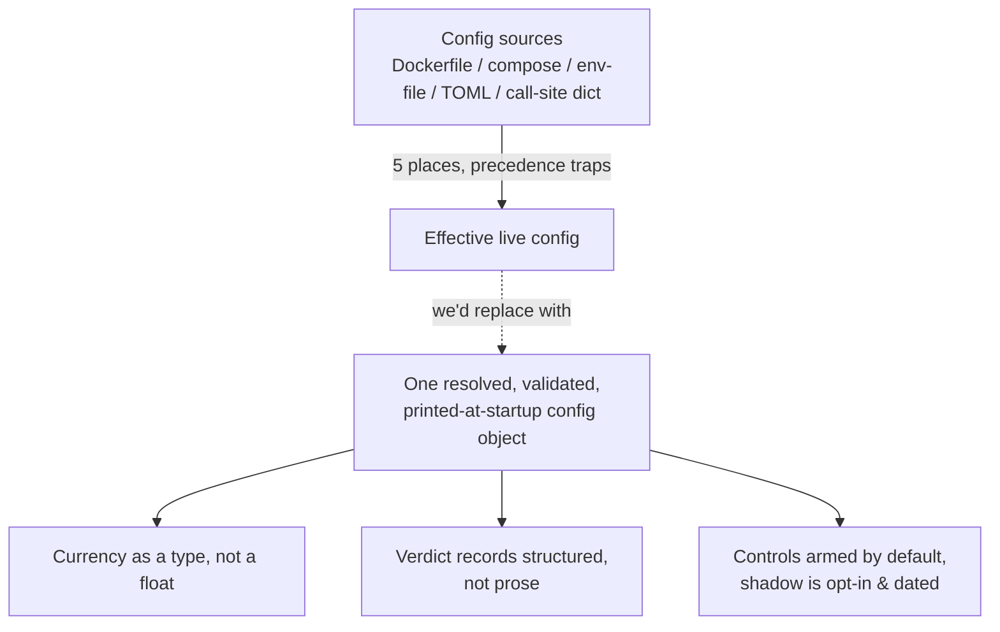

# 26. Caveats, open problems & what we'd do differently

A book that ends with a victory lap is lying to you. Every production system carries a tail of things that are unfinished, unproven under its own rules, or built in a way the authors now regret. The honest move, the one that actually earns trust, is to inventory that tail in public, in the same suspicious register we applied to every backtest in Part II.

So this chapter is the ledger of what we don't know and what we'd change. It is deliberately the least flattering chapter in the book. If you read only one section to calibrate how much to believe the rest, read this one: a system author who can name their own open problems precisely is far more trustworthy than one who can't, because naming them is the same skill as not shipping them by accident.

We group the debt into four buckets: **verdicts still unconfirmed** under our own framework, the **currency seam** between account and strategy, **where the methodology is still evolving**, and the **architecture we'd rebuild from scratch.** Each comes with the specific consequence we're carrying.

## The principle: a verdict has a half-life

Here is the generalisable idea, and it's the spine of the whole chapter. **A passing audit is not a permanent property of a strategy; it is a measurement with a timestamp and a method-version.** Two things erode it:

1. **The world drifts.** The data window that produced the verdict recedes into the past; the regime that produced the edge may not be the regime you're trading in.
2. **Your framework drifts, usually upward.** As you find new failure modes (Part II's [failure-mode catalogue](../part2-research/failure-mode-catalogue.md) is exactly this), your bar rises. Numbers that cleared the old bar were never re-run against the new one.

The dangerous consequence is **doctrine-code drift**: the methodology document describes gates that the deployed code doesn't actually enforce, or the deployed numbers were blessed by a framework version that no longer exists. The instant you write down a methodology version (we call ours by major number; a "V2-era" gate is stricter than a "V1-era" one), you have created a class of legacy verdicts that predate it. Most teams never label these. We do, and the label is a confession: **V1-era, unconfirmed under the framework.** Both war-stories below are the open-problems framing of what the [failure-mode catalogue](../part2-research/failure-mode-catalogue.md) records as Family 4, deployment parity (A8/A9/A11), read through the lens of *verdict half-life* rather than mechanism.

!!! warning "War-story: the registry that quoted a Sharpe it could no longer reproduce"
    Several live sleeves in Titan carry validation comments inline in the strategy registry: a Sharpe, a confidence-interval lower bound, a fraction of positive walk-forward folds. They look authoritative because they're code-adjacent and specific to two decimal places. They are also **stale**: every one of them was produced by an earlier framework version, before we adopted the serially-aware bootstrap, the deflation-for-N-trials correction, and portfolio-level (not single-strategy) promotion gates. One emblematic cross-asset sleeve quotes a strong full-history figure that, when re-run under the current rules, *does not reproduce*: the original used an expanding-window normalisation that drifted, and a benchmark that flattered the thesis. The rule this bought: **a number's framework-version is part of the number.** A Sharpe without a method-version tag is an undated cheque. We now treat any un-retagged figure as `unconfirmed` until it survives a re-run, and we say so out loud, including in this book, where every performance figure is illustrative or method-described, never quoted as current live edge.

## Verdicts still unconfirmed under the framework

Concretely, what's carrying a stale tag right now. (All figures here are described as *mechanism*, never quoted; that's the redaction discipline from [the style guide](../meta/style-and-redaction.md), and it happens to be the same discipline as the verdict-half-life rule above.)

- **Cross-asset momentum sleeves.** A small family of credit-spread → equity-ETF momentum sleeves runs live on paper. Their walk-forward verdicts are V1-era. They have not been re-run under the current bootstrap and deflation regime. We believe the *direction* of the edge is robust (a signal-layer property is more stable than a Sharpe magnitude, see [walk-forward](../part2-research/walk-forward.md)), but we will not call the magnitude confirmed.
- **The regime-gated leveraged-equity stack.** This one is doubly unconfirmed. Its documented validation describes a *different variant* than the one deployed: a futures-based, gilt-ballasted, lower-leverage configuration with a capitulation overlay that exists in research but **was never wired into the live class.** The live config (an ETF equity sleeve, a USD-Treasury ballast, a different weight split) inherits none of those numbers. The validation and the deployment have diverged into two different objects that happen to share a class name.
- **The correlation-dial leverage governor.** Freshly engaged in live sizing. Its evidence is a *forecasting-skill study of the signal* (does a market-wide correlation z-score predict forward volatility, and does using it as a sizer cut simulated drawdown), not a study of its live P&L contribution. It is promising and fail-safe by construction, but "the signal forecasts" and "the deployed sizer helped the live book" are different claims, and only the first is evidenced.

!!! danger "War-story: a validated strategy and a deployed strategy that share a name but nothing else"
    The most insidious form of unconfirmed verdict is not a stale number; it's a **name collision between research and production.** Our regime stack's config file and its docstring describe the variant that *passed* the audit. The live bundle overrides that config almost entirely at the call site, falling back to dataclass defaults for tier thresholds, drawdown limits, and hysteresis the audit never tested. Anyone reading the config to understand live risk would model the wrong instrument, the wrong leverage cap, and the wrong ballast. The capital is real; the validation is for a sibling. The lesson, which we hard-learned: **the source of truth for live behaviour is the runtime config object, never the TOML or the docstring** and a strategy whose live parameters differ from its audited parameters is, by definition, `unconfirmed`, no matter how good the audit was. We would rather a strategy refuse to start than silently run defaults its audit never saw.

The honest portfolio-wide statement: a meaningful slice of our deployed risk is in `paper` mode precisely *because* it is unconfirmed, and the promotion path to live capital runs through a clean re-trial under the current framework, not through the strength of the legacy comment.

## The currency seam: account-base vs strategy-base

This is the single open problem we'd most like to wave away and can't, so it gets its own section.

**The principle.** Money has a unit. The moment a strategy's accounting currency differs from the brokerage account's net-liquidation currency, or from an instrument's quote currency, every notional, every P&L, every volatility-target sizing step is a unit conversion waiting to be skipped. And a skipped FX conversion does not crash. It silently mis-sizes by the exchange ratio, which is exactly the kind of error Part II warned about: invisible, and biased toward whatever makes the position wrong.

**How Titan sits today (sanitised).** Our strategies do per-strategy accounting in **USD** (`base_ccy = USD`). The brokerage account itself reports net liquidation value in a *different* base, call it the account currency. We've closed the easy half of the seam: every traded instrument was deliberately chosen to be USD-quoted, so an instrument's quote currency equals the strategy base, the conversion factor is legitimately `1.0`, and the per-strategy equity tracker books realised P&L with `fx_to_base = 1.0` truthfully.

What's *not* closed is the seam between strategy-USD and account-base. The account NLV is converted to USD once at startup to seed each sleeve's equity, using a live rate; but there is no continuous reconciliation between the USD book the strategies think they're running and the account-currency NLV the broker actually holds. Drift between those two (rate moves, financing, fees in the account currency) is currently unmodeled.

!!! danger "War-story: the conversion that returns the wrong number without raising"
    The conversion helper *raises* when an instrument's quote currency differs from base and no rate is supplied; but it cannot catch a literal `fx=1.0` passed for a non-base instrument, which mis-sizes by the whole exchange ratio silently. We chose to make the path unreachable (USD-quoted instruments + an `on_start` guard) rather than correct-if-remembered; the mechanism is dissected in [Per-strategy equity & FX](../part5-portfolio-risk/per-strategy-equity-fx.md).

!!! tip "If we were starting clean: currency is a type, not a float"
    The whole class of FX bugs comes from money being represented as a bare number. We'd make a `Money(amount, ccy)` value type the only currency-carrying object in the system, make arithmetic across mismatched currencies a *type error*, and make conversion an explicit, rate-stamped operation. You cannot forget to convert what you cannot add. The per-strategy/account-base reconciliation would then be a continuous invariant check (`Σ strategy NLV in account-ccy ≈ broker NLV`, alert on divergence) rather than a one-time startup seeding. The sizing math is covered in [position sizing](../part5-portfolio-risk/position-sizing-kelly.md) and the per-strategy plumbing in [per-strategy equity & FX](../part5-portfolio-risk/per-strategy-equity-fx.md); the open item is that the *cross-currency* invariant isn't yet enforced at runtime.

## Where the methodology is still evolving

The framework is not finished, and pretending it is would be its own failure mode. The active gaps, each with why it's hard:

| Open methodology item | What's missing | Why it's hard |
|---|---|---|
| **Verdict governance, automated** | A pure function exists to demote stale/suspect verdicts (cap weight, force to paper). It is **built but not auto-fed**: the verdict records are still prose in config files. | Turning prose verdicts into structured, machine-read records is a migration nobody wants to do until it bites; until then the governance is advisory. |
| **Per-strategy risk envelope, enforced** | A per-trade-R / portfolio-heat / leverage / DD-throttle envelope exists and ticks in **shadow** (it records what it *would* have rejected) but does not yet *enforce* on the live bundle. | Flipping shadow→enforce on live capital needs a clean parity trial first ([live == research](../part4-research-to-prod/live-equals-research.md)); a throttle that fires wrongly is its own incident. |
| **Tail-risk parity & HRP/NCO allocation** | We use inverse-vol with a correlation penalty, deferring hierarchical-risk-parity and tail-risk-parity allocators. | These want 5+ years of OOS per sleeve and 10+ sleeves to be meaningful; we have neither yet. Premature sophistication is overfitting in a costume. |
| **Exceedance correlation in joint ruin** | Our joint risk-of-ruin Monte Carlo uses *unconditional* correlation between sleeves. | Correlations spike toward 1 in crises, exactly when ruin happens. Unconditional correlation **understates** joint tail risk. This one we consider a real, named weakness. |
| **Tax-aware returns** | Backtests are pre-tax. Jurisdiction (CGT vs. mark-to-market regimes) materially changes net Calmar. | Needs an operator decision on jurisdiction before it's even specifiable. |
| **Live-PnL drift wiring** | The CUSUM structural-break detector runs against a research baseline, not yet against a live-PnL tracker end-to-end. | The live PnL tracker exists; connecting it cleanly without double-counting is fiddly. |

The one on that list we'd flag hardest is **exceedance correlation.** Naming the right metric matters here: our survival gate is a *risk of ruin* and a *CDaR* (conditional drawdown-at-risk) computed from joint Monte Carlo paths; and feeding that gate unconditional correlations makes it optimistic in precisely the regime it exists to survive. We know the direction of the error (it flatters us), which per Part II means we must treat the current ruin numbers as a *ceiling on safety*, not a floor. See [tail risk & risk of ruin](../part2-research/tail-risk-and-ruin.md).

!!! warning "War-story: the gate that grades itself in shadow"
    Running the risk envelope in shadow was the right call; but shadow mode has a trap. A shadow gate logs `would_have_rejected` and feels like progress, so the temptation is to leave it there indefinitely and call the risk "managed." It isn't. A control you haven't armed is documentation, not a control. We caught ourselves treating the shadow tick as if it were enforcement; the corrective rule is to **put a date on every shadow→enforce promotion** and treat an over-age shadow control as an open incident, not a feature. The same applies to the out-of-process kill-switch backstop: it ships defaulting to *monitor-only*, and "we have a deep-drawdown arbiter" (ours trips at a double-digit DD set a notch *below* the in-process kill, so it's a true backstop) is only true once someone has actually launched it armed. Verify the arm, don't assume it. ([Layered safety](../part5-portfolio-risk/layered-safety.md) covers the ladder; this is the meta-lesson about *trusting* it.)

## What we'd architect differently from scratch

With the benefit of every bug, here's what we'd build differently. These are design regrets, not bugs. The system works; we'd just pay less ongoing tax with these choices.

- **One config source, resolved and printed at startup.** Today the *effective* live strategy bundle is determined by a precedence dance across an image default, a compose default, and an env-file override: three different names, only one of which wins, and the winner is invisible unless you read the right file. We've been bitten by reading the Dockerfile and confidently naming the wrong live strategy set. From scratch: **one resolver, one validated config object, dumped to the log at boot.** If the running config isn't printed, it isn't knowable.
- **Currency as a type** (above). The single highest-leverage change.
- **Structured verdicts from day one.** Prose validation comments in code are unparseable, drift silently, and can't be governed automatically. A verdict should be a typed record with a method-version, a date, and the gate results, so the staleness governor can act without a human migration.
- **Controls armed by default, shadow as the explicit exception.** We built several safety layers in shadow/monitor-only as the *default* and arming as the opt-in. That ordering optimises for not-breaking-things over being-safe. We'd invert it: a risk control is armed unless an operator explicitly, datedly, disarms it.
- **Separate the audited object from the deployed object, or forbid the gap.** The name-collision war-story above is structural. We'd make a strategy's *audited parameter set* a sealed artifact and have the live runner refuse to deploy a parameter set that doesn't match a sealed, passing audit. No silent dataclass-default fallback on live capital.

!!! note "What we got right and would keep"
    For balance: the things that paid off and we'd rebuild identically. A **single shared metrics module** so the five backtest lies can't recur ([backtest you can trust](../part2-research/backtest-you-can-trust.md)). A **process-wide risk singleton** whose `scale_factor` composes by `min(...)` not product: one event de-risks once. **Fail-closed** persistence: an unparseable halt file is treated as halted. And **fail-safe** sizing: a missing correlation-dial input returns a leverage of `1.0`, never a guess. The pattern under all of these, *make the unsafe state unreachable, and the unknown state conservative*, is the part of the architecture we trust most.

## Takeaways

- **A verdict has a half-life.** Tag every performance number with its framework-version and date; treat any un-retagged figure as `unconfirmed`. A Sharpe without a method-version is an undated cheque.
- **The source of truth for live risk is the runtime config object**, not the TOML, not the docstring, not the inline comment. A strategy running parameters its audit never saw is unconfirmed by definition.
- **Currency is the seam most likely to mis-size you silently.** A literal `fx = 1.0` on a non-base instrument is the bug no exception catches. Prefer making the dangerous path unreachable (USD-quoted instruments, `on_start` guards) over making it correct-if-remembered.
- **Unconditional correlation flatters joint ruin.** Our survival gate (risk of ruin, CDaR) is currently optimistic in exactly the crisis regime it exists to survive: a named, directional weakness, not a vague one.
- **A control in shadow is documentation, not a control.** Date every shadow→enforce promotion; verify the backstop is *armed*, don't assume it.
- **The architecture we'd keep:** centralised metrics, a `min`-composed risk singleton, fail-closed persistence, fail-safe sizing: *make the unsafe state unreachable and the unknown state conservative.*

---

The point of this ledger is not self-flagellation; it's that a system you can trust is one whose authors can show you the edges of what they trust. The remaining chapter, [**Reading list & references**](reading-list.md), points to the books and papers behind every method named here (Carver on systematic trading, Bailey & López de Prado on backtest overfitting and the deflated Sharpe, the fractional-Kelly literature, and Politis & Romano's stationary bootstrap) so you can take these ideas further than we have, and find the next open problem before it finds you.
